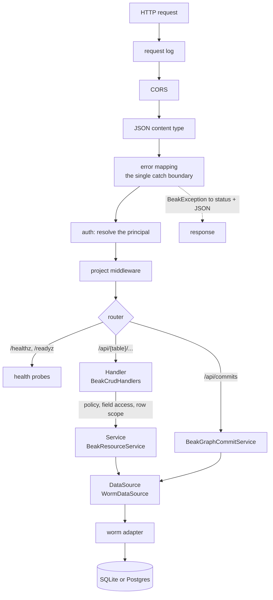

# Backend flow

The server is three layers, `Handler (Shelf) -> Service -> DataSource`, inside a middleware stack whose job is to turn typed exceptions into JSON. After this page you can trace a request from the socket to the database and back, name the layer that owns each decision, and say where an exception becomes a status code. No endpoint in the surface is hand-written: registering a model generates its routes.

## The idea in one picture



Each layer has one job and refuses the others. The handler decides who may do a thing, the service decides whether the thing is valid, the data source does the I/O. Everything below the error-mapping middleware throws, and nothing below it formats an error.

## How it works

### Where the server comes from

Before the first request there is a host. `bin/serve.dart` asks for it, binds it, and closes it on SIGINT or SIGTERM. It is generated and names no resource:

```dart title="examples/quickstart/bin/serve.dart"
/// Serves the API until SIGINT or SIGTERM, then shuts down and exits.
Future<void> main() async {
  // Watching first: a signal that arrives while the server boots, or right
  // after it says it is listening, must stop it cleanly rather than kill it.
  final Future<ProcessSignal> stopped = Future.any([
    ProcessSignal.sigint.watch().first,
    if (!Platform.isWindows) ProcessSignal.sigterm.watch().first,
  ]);
  final HttpServer server;
  try {
    server = await beakHost().serve();
  } on BeakConfigurationException catch (error) {
    stderr.writeln('error: ${error.message}');
    exit(78);
  }
  stderr.writeln('listening on http://${server.address.host}:${server.port}');
  await stopped;
  stderr.writeln('shutting down');
  await server.close();
  exit(0);
}
```

A bad setting (`PORT`, `DATABASE_URL`, a storage variable) or a port that is already taken ends the process with one `error:` line and exit code `78`, and a server that listens beyond loopback with the default allow-all policy prints one `warning:` line first.

`beakHost()` lives in `lib/beak/server.g.dart`. `beak prepare` fills it with what it found on disk: the registry, the migrations under `lib/migrations/`, the seeders under `lib/seeders/`, and `lib/server.dart` as `configure` when the project has one.

```dart title="examples/quickstart/lib/beak/server.g.dart"
BeakServeHost beakHost({Map<String, String>? environment}) => BeakServeHost(
  environment: environment,
  registry: buildBeakRegistry(),
  migrations: const [
    BeakCommitReceiptsMigration(),
    BeakOutboxMigration(),
    CreateNotesTable(),
  ],
  seeders: const [],
);
```

`BeakServeHost` owns the lifecycle. It resolves the environment (`.env` overlaid by the process environment) into a `BeakBackendConfig`, opens the adapter the `DATABASE_URL` scheme names, resolves the upload driver, builds the server and binds the port. With nothing configured that is a SQLite file `beak.db` beside the project, port `8080`, host `0.0.0.0` and local-disk uploads, so a first run needs no Docker and no `.env`.

`BeakCommitReceiptsMigration` and `BeakOutboxMigration` at the top of the list are Beak's own framework tables. Yours follow, ordered by their declared `name` with a create-table migration moved behind the tables its foreign keys point at.

`serve()` and `runCli()` are the two ways in, and both use the same registry and migration list, so the schema and the API cannot come from different sources. `bin/migrate.dart` is one line: `exit(await beakHost().runCli(args))`.

Migrations are never applied on boot, with one exception: a `sqlite::memory:` database dies with the process, so `serve()` migrates and seeds it itself. Every other database is migrated by `beak migrate`.

Uploads land on local disk under `storage/uploads`, served by the same server at `/uploads`, until `BEAK_STORAGE_DRIVER` says otherwise. [Storage internals](storage-internals.md) covers the selection.

A project that needs more than the defaults writes `lib/server.dart` with a top-level `beakServer(BeakServerDefaults defaults)`. It receives everything the host resolved (`config`, `registry`, `dataSource`, `storage`, `environment`) and returns `defaults.build(...)`. That is where a policy, extra middleware, extra routes, a graph preparer, `graphOnly` and an outbox schedule are installed.

### The middleware stack

`BeakServer` composes one Shelf `Handler`. The order is the design:

```dart title="packages/beak_backend/lib/src/server/beak_server.dart"
--8<-- "packages/beak_backend/lib/src/server/beak_server.dart:BeakServerHandler"
```

- The request log wraps everything, so a request is recorded whatever happens inside. It honours an incoming `x-request-id` or mints one, and by default writes `[id] METHOD /path -> status (ms)` to stderr.
- CORS answers `OPTIONS` preflights with a `204` and adds its headers to every other response, error responses included. The default origin is `*`.
- The JSON middleware sets `content-type: application/json` on responses that named none.
- Error mapping sits just outside auth and the router, so anything thrown by authorization, a handler, a service or the data source is caught in one place.
- Auth resolves a `BeakPrincipal` from the request and stores it in the request context. With no guard every request is anonymous.
- Your `middleware:` runs after auth and inside error mapping. It sees the principal, and the typed exceptions it throws become JSON.

Project `routes:` go in front of the generated API through a `Cascade`. A route of yours wins on the same path, and a `404` or `405` from it falls through to the generated one.

### The error-mapping middleware

This is the one place the backend turns a thrown value into a response.

```dart title="packages/beak_backend/lib/src/server/middleware/error_mapping_middleware.dart"
--8<-- "packages/beak_backend/lib/src/server/middleware/error_mapping_middleware.dart:beakErrorMappingMiddleware"
```

A `BeakException` maps to its status through an exhaustive switch over the sealed family, so a new exception type cannot ship without a status:

```dart title="packages/beak_backend/lib/src/server/middleware/error_mapping_middleware.dart"
--8<-- "packages/beak_backend/lib/src/server/middleware/error_mapping_middleware.dart:exceptionStatus"
```

The body is `{code, message, fieldErrors?, requestId?}`. Validation failures carry `fieldErrors` keyed by column, which is what a form needs to mark the offending inputs. Anything that is not a `BeakException` becomes an opaque `500` with `code: internal`, is reported to `onUnexpectedError` (stderr by default), and reveals nothing else.

| Exception | Status | Meaning |
| --- | --- | --- |
| `BeakValidationException` | 422 | a rule failed, a body or spec was malformed, an unknown field was named |
| `BeakNotFoundException` | 404 | no such record, table, relation or route |
| `BeakAuthenticationException` | 401 | not signed in, or the token is invalid |
| `BeakAuthorizationException` | 403 | signed in, not permitted |
| `BeakConflictException` | 409 | a stale revision, a reused save id, a uniqueness clash |
| `BeakConfigurationException` | 500 | the server or a request is misconfigured, with its message |
| `BeakStorageException` | 500 | a storage driver failed; the caller gets `File storage failed.` |
| `BeakInternalException` | 500 | a broken invariant; the caller gets `Internal server error.` and `onUnexpectedError` gets the original |
| `BeakPayloadTooLargeException` | 413 | a JSON request body is larger than 16 MiB (`beakMaxJsonBodyInBytes`) |
| `BeakTransportException` | 502 | an unexpected response or a failed tunnel; mainly raised on the client, but the switch is exhaustive |
| anything else | 500 | opaque, sent to `onUnexpectedError` |

Untyped failures are opaque, and so are a `BeakStorageException`, whose message quotes the system behind the driver (the caller gets `File storage failed.`), and a `BeakInternalException` (the caller gets `Internal server error.`). `onUnexpectedError` gets the original in each case. A `BeakConfigurationException` is the one typed `500` whose message goes to the client as written, which is convenient when a request is misconfigured. [Exceptions](../reference/exceptions.md) has the full family, and [Results and errors](../concepts/results-and-errors.md) shows how the client turns the envelope back into a typed exception.

### The Handler: authorize, parse, delegate

`BeakCrudHandlers` are the authorization layer, not just a router. For each request a handler consults the `BeakPolicy`, the field policy and the row scope, decodes the body into typed `beak_core` values, calls the service, and encodes the result with the fields the principal may read.

```dart title="packages/beak_backend/lib/src/endpoints/crud_handlers.dart"
--8<-- "packages/beak_backend/lib/src/endpoints/crud_handlers.dart:create"
```

Read the order. The policy check comes first, then the body is parsed into a `BeakRecord` (a malformed value is a `BeakValidationException`, so a `422` and never a `500`), then the write is checked against the field policy, then every foreign key is checked for visibility to this principal, and only then does the service run. The response goes through `redact` on the way out.

The row scope is worth its own sentence. `_scope(request)` reads the scope once per handler and hands it to the service, which enforces it. A handler cannot forget to apply it, because no handler decides whether to. A record outside the scope answers `404`, not `403`: telling an unauthorized caller that a row exists is itself a leak. A write is also judged on the row it leaves behind (`beakScopeAdmits` in `beak_scope_match.dart`), so a create or an update that would put a record outside the scope is a `403`: the caller already knows the values they sent, so nothing is revealed.

### The Service: validate, default, throw

`BeakResourceService` holds the write logic. On create it fills declared defaults, mints a uuid for string-keyed models, stamps `created_at` and `updated_at` when the model has them, and validates the whole candidate before the data source is touched.

```dart title="packages/beak_backend/lib/src/service/beak_resource_service.dart"
--8<-- "packages/beak_backend/lib/src/service/beak_resource_service.dart:create"
```

On update it runs the same validation with partial-update semantics, advances `updated_at` by at least one millisecond even when the clock has not moved, and checks an `If-Unmodified-Since` header when the caller sent one. A stale value is a `BeakConflictException`, a `409`. The header is opt-in: a script that sends none updates unconditionally.

The service also refuses a spec aimed at another table than its own (a `422`), and it never imports a Shelf type. It throws.

The same service class also runs inside graph commits, once per table a commit writes, so a form save and a plain `POST` share one set of defaults. That path is in [Graph commits](graph-commits.md).

### The DataSource: raw I/O

`WormDataSource` implements `BeakDataSource` over the worm ORM, translates a `BeakQuerySpec` with `WormQueryTranslator`, and lets exceptions propagate. It is the only layer that knows worm exists. [The query contract](query-contract.md) covers the translation and [The data source seam](data-source-seam.md) the interface.

The adapter under it is injected, and the `DATABASE_URL` scheme picks it: `sqlite:` gets SQLite, anything else Postgres, and a test hands the host `sqlite::memory:` or worm's `InMemoryAdapter`. Nothing above the data source can tell which.

### The generated surface

There are no per-model endpoint files. `beakApiRouter` walks the registry and mounts one resource router per model under `/api/{table}`:

```dart title="packages/beak_backend/lib/src/endpoints/beak_resource_router.dart"
--8<-- "packages/beak_backend/lib/src/endpoints/beak_resource_router.dart:beakResourceRouter"
```

Beside the per-model routers it mounts, where they apply:

- `POST /api/auth/login`, `POST /api/auth/logout` and `GET /api/auth/me`, when sessions are configured.
- `POST /api/commits` and `GET /api/commits/{saveId}` for graph saves.
- `POST /api/{table}/export` for CSV, and `POST`, `GET` and `DELETE /api/{table}/{columnKey}/upload` when storage is set.
- A public `GET` route for the files of the local-disk driver, under the path of its public base URL (`/uploads` by default). It consults no policy, and the storage keys are unguessable uuids.

A model that is listed in `graphOnly`, declares behavior, is an owned child of a model with `editableWhen`, or is loaded by another model's shared rules has its direct `POST`, `PATCH`, `DELETE`, restore and attach/detach routes closed. They answer `422` and say to save through a graph commit. Reads stay open. There is no global search route: search is a field of the query spec.

[The generated API](../reference/rest-api.md) lists every route with its payloads.

Two routes sit outside `/api`:

```dart title="packages/beak_backend/lib/src/endpoints/health_router.dart"
--8<-- "packages/beak_backend/lib/src/endpoints/health_router.dart:beakHealthRouter"
```

`/healthz` returns `200` while the process serves and never touches the database, so a database outage cannot start a restart loop. `/readyz` counts rows of the first registered model and answers `200`, or `503` with `{"status": "unavailable", "detail": "the data source did not answer"}`. The real error goes to `onUnexpectedError`, since the probe is unauthenticated. Neither route consults a policy, and the auth middleware skips both paths (`beakProbePaths`), so a probe carrying an invalid Bearer token still gets its `200` or `503`.

## Why it is shaped this way

- One catch boundary. Services and data sources throw and never format. Adding a layer of `try/catch` in a handler would create a second place that decides status codes, and the two would drift.
- Typed exceptions, exhaustive switch. The status table is a `switch` over a sealed class. A new failure kind is a compile error until someone decides its status.
- Authorization before logic. A request that may not happen is refused before anything is parsed further, validated or queried.
- Generated routes. A hand-written endpoint is a place the row scope, the field policy or the `graphOnly` rule can be skipped. There are none to skip.

## What it means for you

- The default policy is `BeakAllowAllPolicy`. A server you build with `defaults.build()` and no `policy:` is open, which suits the first hour and nothing after it. Pass a `BeakPolicies` rule set, which denies everything it does not list. [Auth and policies](../backend/auth-and-policies.md) has the details.
- Throw a typed exception from your own middleware or rules and you get the right status for free. Throw anything else and you get a `500` with a log line.
- Put invariants in the service or a graph preparer, not in a handler. A handler you add is a new way around them.
- `CORS` allows any origin until you pass `corsOrigin`. Set it in production.
- `GET /readyz` answers for the first registered model only. A broken table elsewhere does not fail readiness.

## Continue reading

- [Frontend flow](frontend-flow.md) the mirror image on the panel, where the repository plays the role the middleware plays here.
- [Graph commits](graph-commits.md) how a form save is planned, validated and written in one transaction.
- [Running the server](../backend/running-the-server.md) `BeakServeHost` from a project's point of view, including `lib/server.dart`.
- [The generated API](../reference/rest-api.md) the routes this flow serves, with request and response shapes.
