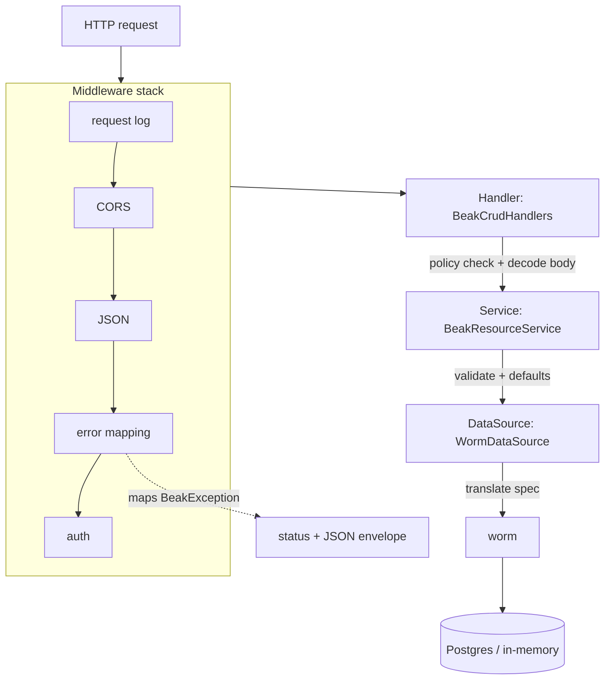

# Backend flow

After this page you will be able to trace a request from the socket to Postgres and back, name which layer owns which job, and know exactly where an exception becomes an HTTP status code. This is the server side of Beak's [four layers](../concepts/the-four-layers.md).

The backend flow is `Handler (Shelf) -> Service -> DataSource`, wrapped in a middleware stack whose outermost concern is turning typed exceptions into JSON. No endpoint in the whole surface is hand-written: registering a model generates its routes.

## The path of a request



Each layer has one job and refuses the others.

## The middleware stack

`BeakServer` composes the whole pipeline as a single Shelf `Handler`, outermost first.

```dart title="packages/beak_backend/lib/src/server/beak_server.dart"
Handler get handler => const Pipeline()
    .addMiddleware(beakRequestLogMiddleware(onRequest: _onRequest))
    .addMiddleware(beakCorsMiddleware())
    .addMiddleware(beakJsonMiddleware())
    .addMiddleware(
      beakErrorMappingMiddleware(onUnexpectedError: _onUnexpectedError),
    )
    .addMiddleware(beakAuthMiddleware(guard: _authGuard))
    .addHandler(_router);
```

The order matters. The request log wraps everything so every request is recorded whatever happens inside. CORS and JSON prepare the request. The error-mapping middleware sits just outside auth and the router, so any exception thrown by authorization, handlers, services, or the data source is caught in one place.

## The error-mapping middleware: the single catch boundary

This is the one place the backend turns a thrown value into a response. Everything below it throws; nothing below it formats an error.

```dart title="packages/beak_backend/lib/src/server/middleware/error_mapping_middleware.dart"
(Handler inner) => (Request request) async {
  try {
    return await inner(request);
  } on BeakException catch (exception) {
    return _exceptionResponse(exception, request);
  } catch (error, stackTrace) {
    onUnexpectedError?.call(error, stackTrace);
    return _jsonResponse(500, {
      'code': 'internal',
      'message': 'Internal server error.',
      ..._requestIdEntry(request),
    });
  }
};
```

A recognized `BeakException` maps to its status code; anything else becomes an opaque `500` whose body reveals nothing internal. The mapping is a single exhaustive switch over the sealed family:

```dart title="packages/beak_backend/lib/src/server/middleware/error_mapping_middleware.dart"
final int statusCode = switch (exception) {
  BeakValidationException() => 422,
  BeakNotFoundException() => 404,
  BeakAuthenticationException() => 401,
  BeakAuthorizationException() => 403,
  BeakConflictException() => 409,
  BeakConfigurationException() => 500,
  BeakStorageException() => 500,
};
```

The response body is a small envelope: `{code, message, fieldErrors?, requestId?}`. Validation failures carry their per-column `fieldErrors`, which is exactly what a form needs to light up the offending inputs. See [Exceptions](../reference/exceptions.md) for the full family and [Results and errors](../concepts/results-and-errors.md) for how the client consumes this envelope.

| Exception | Status | Meaning |
| --- | --- | --- |
| `BeakValidationException` | 422 | a rule failed, or the body was malformed |
| `BeakNotFoundException` | 404 | no such record, table, or relation |
| `BeakAuthenticationException` | 401 | not signed in |
| `BeakAuthorizationException` | 403 | signed in, not permitted |
| `BeakConflictException` | 409 | a uniqueness or state conflict |
| `BeakConfigurationException` / `BeakStorageException` | 500 | a server-side misconfiguration |
| anything else | 500 | opaque, reported to `onUnexpectedError` |

## The Handler: parse, authorize, route

`BeakCrudHandlers` are thin. Each handler consults the policy, decodes the request into typed `beak_core` values, calls the service, and encodes the result. No business logic lives here, and malformed input is a user error, never a `500`.

```dart title="packages/beak_backend/lib/src/endpoints/crud_handlers.dart"
Future<Response> create(Request request) async {
  _require(
    request,
    policy.canCreate(beakPrincipal(request), service.model.table),
    'create',
  );
  final record = await _readRecord(request);
  final created = await service.create(record);
  return _json(201, created.toJson());
}
```

Notice `_readRecord`: it parses a flat `{column: value}` body into a typed `BeakRecord`, and when a value is malformed it re-throws as a `BeakValidationException` so the client sees a `422`, not a `500`.

```dart title="packages/beak_backend/lib/src/endpoints/crud_handlers.dart"
try {
  return BeakRecord(values: {
    for (final MapEntry(:key, :value) in body.entries)
      key: BeakValue.fromJson(value),
  });
} on BeakConfigurationException catch (exception) {
  throw BeakValidationException('Malformed record body: ${exception.message}');
}
```

## The Service: logic and typed exceptions

`BeakResourceService` is where the rules live. On create it mints a uuid for string-keyed models, stamps `created_at` and `updated_at` when the model declares them, and runs validation before anything touches the data source.

```dart title="packages/beak_backend/lib/src/service/beak_resource_service.dart"
Future<BeakRecord> create(BeakRecord input) {
  final prepared = _withCreateDefaults(input);
  validation.validate(model, prepared, isCreate: true);
  return dataSource.create(model.table, prepared);
}
```

It also guards that a posted spec targets its own model, so a query aimed at the wrong table is a `422` rather than a leak across resources:

```dart title="packages/beak_backend/lib/src/service/beak_resource_service.dart"
void _requireSpecTargets(String table, String specKind) {
  if (table != model.table) {
    throw BeakValidationException(
      '$specKind spec targets "$table" but this endpoint serves '
      '"${model.table}".',
    );
  }
}
```

Validation itself is a stateless boundary, `ValidationService`, that runs each column's declared `BeakRule` list, rejects unknown keys, enforces `BeakRequired` on create, and aggregates every violation under its column key into the `fieldErrors` map the middleware later serializes. The service never imports a Shelf type, and it never formats an error response; it throws.

## The DataSource: raw I/O, exceptions propagate

`WormDataSource` implements the `BeakDataSource` interface over the worm ORM. It does raw reads and writes and lets exceptions propagate up to the catch boundary. The one translation step here is `WormQueryTranslator`, which turns a `BeakQuerySpec` into a worm predicate tree. This is the only layer that knows worm exists, and worm types never travel above it. The full contract lives in [The data source seam](data-source-seam.md).

## The whole surface is generated

There are no per-model endpoint files. `beakApiRouter` walks the `BeakModelRegistry` and mounts one resource router per model under `/api/{table}`, each backed by its own service.

```dart title="packages/beak_backend/lib/src/endpoints/beak_resource_router.dart"
Router beakResourceRouter(
  BeakResourceService service, {
  BeakPolicy policy = const BeakAllowAllPolicy(),
}) {
  final handlers = BeakCrudHandlers(service, policy: policy);
  return Router()
    ..post('/query', handlers.query)
    ..post('/aggregate', handlers.aggregate)
    ..post('/batch', handlers.batch)
    ..post('/', handlers.create)
    ..get('/<id>', handlers.getOne)
    ..patch('/<id>', handlers.update)
    ..delete('/<id>', handlers.delete)
    ..post('/<id>/relations/<relationKey>/attach', handlers.attach)
    ..post('/<id>/relations/<relationKey>/detach', handlers.detach);
}
```

On top of these, `beakApiRouter` adds the global search endpoint (`GET /api/search`), the auth surface (mounted at `/api/auth` when auth is configured), CSV export routes, and per-column upload routes when storage is wired. Registering a model is all it takes to get its whole REST surface. See [The generated API](../backend/the-generated-api.md) for the endpoint list and payloads.

## Continue reading

- [Frontend flow](frontend-flow.md) the mirror image on the client, where the repository plays the role the middleware plays here.
- [The data source seam](data-source-seam.md) the `BeakDataSource` contract the service writes through.
- [The generated API](../backend/the-generated-api.md) the routes this flow produces, with request and response shapes.
