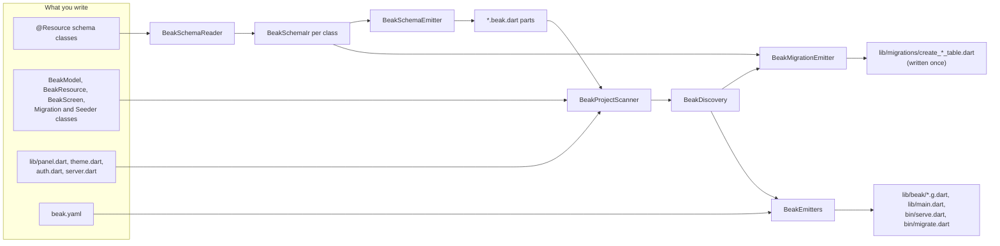

# Code generation

After this page you can say which declaration produces which generated file, why a second `beak prepare` changes nothing, and which files Beak stops touching once you own them.

You write schema classes, resource classes, screens and migrations. `beak prepare` writes what sits between them: typed columns, the model, the registry, the panel config, the server host and the entrypoints. It is a command you run and a set of files you commit. There is no `build_runner`, no watcher and no code that runs at build time. The price is that the generator reads syntax, not types, so everything it needs has to be written literally where it can see it.

## The idea in one picture



Two orderings give the pipeline its shape. The parts are written before the scan, so the scanner sees the `NoteModel` the emitter wrote. Migrations are written before the wiring, so the server host can list them.

| File | Made from | In git | Overwritten by `prepare` |
| --- | --- | --- | --- |
| `lib/**/<schema>.beak.dart` | one `@Resource` class, plus the inverse side of every relationship that points at it | yes | when its text changes |
| `lib/beak/registry.g.dart` | every `BeakModel` found under `lib/` | yes | when its text changes |
| `lib/beak/panel.g.dart` | `beak.yaml`, the models, resource classes, screens and override files | yes | when its text changes |
| `lib/beak/app.g.dart` | the panel title in `beak.yaml` | yes | when its text changes |
| `lib/beak/server.g.dart` | models, migrations, seeders, `lib/server.dart`, the `server:` block of `beak.yaml` | yes | when its text changes |
| `lib/main.dart`, `bin/serve.dart`, `bin/migrate.dart` | fixed templates | no, the scaffold's `.gitignore` lists them | only while the file still starts with the generated header |
| `lib/migrations/create_<table>_table.dart` | a model whose table no migration creates | yes, and yours | never, it is written once |

## How it works

### Read: schema classes become an IR

`BeakSchemaReader` walks every `.dart` file under `lib/` (skipping `*.beak.dart`, `*.g.dart`, `*.freezed.dart` and files whose name starts with an underscore). It parses each one with the analyzer's `parseString` and turns every class annotated `@Resource` into a `BeakSchemaIr`: a list of `BeakColumnIr`, a list of `BeakRelationIr`, and the table, display column and flags around them.

The parse is unresolved. The reader sees the token `String`, not the resolved type, which is why a run takes milliseconds and works before `flutter pub get`. It also means a `typedef` for `String` is an unknown type to it.

The field's Dart type picks the column kind, and nobody writes a discriminator:

```dart title="packages/beak_cli/lib/src/schema/beak_schema_ir.dart"
--8<-- "packages/beak_cli/lib/src/schema/beak_schema_ir.dart:beakColumnKindOfType"
```

Around that switch: a `List` of `String`, `int`, `double` or `bool` becomes a JSON column, an `enum` declared anywhere under `lib/` becomes an enum column, and `@Image()`, `@FileField()` and `@Custom()` pick their kind by annotation. A type that is none of these is an issue, not a guess.

The reader also adds what you never write: a `String` primary key `id`, a `<field>_id` foreign key behind each `@BelongsTo`, `created_at` and `updated_at` for `timestamps: true`, and `deleted_at` for `softDeletes: true`. The table name is the pluralised, snake-cased class name unless `@Resource(table:)` says otherwise.

Annotation arguments are not evaluated. The reader keeps their source text and the emitter writes it back, so a rule list, an enum constant or a nested transform works as long as it is valid in a `const` context. Here is one field of the quickstart's `Note`:

```dart title="examples/quickstart/lib/resources/notes/models/note.dart"
@Resource(timestamps: true)
final class Note extends BeakSchema {
  // ...
  @Display()
  @Column(searchable: true, sortable: true, rules: [BeakMaxLength(255)])
  late final String title;
```

And the column it becomes:

```dart title="examples/quickstart/lib/resources/notes/models/note.beak.dart"
static const BeakStringColumn title = BeakStringColumn(
  key: 'title',
  label: 'Title',
  rules: [BeakRequired(), BeakMaxLength(255)],
  searchable: true,
  sortable: true,
  maxLength: 255,
);
```

Three things were derived. `String` is non-nullable, so `BeakRequired()` joined the rules. The label is the title-cased field name. `BeakMaxLength(255)` also sized the stored column, because a bound is written once, as a rule, and means the same thing in every layer.

The reader collects every problem instead of stopping at the first, and `prepare` prints them all:

```console
$ beak prepare
Cannot generate: fix these first:
  lib/resources/notes/models/note.dart: Note.link is a Uri, which Beak cannot map to a column. Use a supported type, annotate it with @BelongsTo / @HasMany for a relationship, or @Custom for an opaque value.
```

The exit code is 1 and no wiring file is written.

### Emit: one part file per schema class

`BeakSchemaEmitter.emit` writes the part file in six passes, then formats the result:

```dart title="packages/beak_cli/lib/src/schema/beak_schema_emitter.dart"
--8<-- "packages/beak_cli/lib/src/schema/beak_schema_emitter.dart:emitSchemaPart"
```

| Generated | What it is |
| --- | --- |
| `NoteColumns` | one `const` column per field, plus a `values` list in declaration order |
| `NoteRelations` | one `const` relationship per relation, on both sides (only when there is one) |
| `NoteFields`, `NoteToOneField` | the typed references (`NoteModel.title` is a `BeakScalarField<String>`) that queries, tables, forms and filters are configured with |
| `NoteModel` | the `BeakModel`: table, display column, columns, relationships, `softDeletes`, and the schema class's static `validationRules`, `behavior`, `permissions` and `capabilities` getters when it declares them |
| `NoteDraft` | a nullable, live view of an unfinished form, reached through `draft.asNote` |
| `NoteRecord` | a zero-cost extension type over `BeakRecord`, reached through `record.asNote` |

The model is the part the rest of Beak sees:

```dart title="examples/quickstart/lib/resources/notes/models/note.beak.dart"
final class NoteModel extends BeakModel {
  /// Creates the notes model.
  const NoteModel();

  /// Typed field and relation references, including reserved names.
  static const NoteFields fields = NoteFields();

  // ...
  /// Typed reference to [title] in this model.
  static final title = fields.title;
  // ...
  @override
  String get table => 'notes';

  @override
  String get displayColumnKey => 'title';

  @override
  List<BeakColumn> get columns => NoteColumns.values;
```

`emit` receives every schema in the project, its own included, because relationships are two-sided. Declare `@BelongsTo() late final Category? category` on `Product` and `category.beak.dart` gains the inverse `products` relationship too, in its `CategoryRelations` and in its model's `relationships`. `@BelongsTo(inverse: false)` turns that off for a lookup table that should not know who points at it. So one edit can rewrite two files.

### Scan: what discovery finds

The parts exist now, so `BeakProjectScanner` can look at everything else. It is an unresolved parse as well: it reads class names, supertypes and declared types.

| It finds | Where | Recognized by | Limits |
| --- | --- | --- | --- |
| Models | anywhere under `lib/` | `extends BeakModel`, directly or through one base class in the project | needs a zero-argument `const` constructor, else it is an issue; duplicate class names are an issue |
| Resource classes | anywhere under `lib/` (not `*.beak.dart`) | `extends BeakResource`, same one-base rule | public, not `abstract` or `sealed`, unnamed constructor without required arguments; others are skipped without a message |
| Screens | `lib/screens/` | a top-level variable with the declared type `BeakScreen`, or a zero-argument function returning one | an untyped `final s = BeakScreen(...)` is skipped without a message; a function with required parameters is an issue |
| Migrations | `lib/migrations/` | `extends Migration` or `BeakBaselineMigration`, `const` constructor | ordered by the declared `name`, not by file name, with a create-table migration moved behind the tables its foreign keys point at |
| Seeders | `lib/seeders/` | `extends Seeder`, `const` constructor | |
| Overrides | four files in `lib/` | a top-level function of the expected name | see below |

The override files are the presence-based extension points:

```dart title="packages/beak_cli/lib/src/project/beak_discovery.dart"
--8<-- "packages/beak_cli/lib/src/project/beak_discovery.dart:beakOverrideKind"
```

`lib/server.dart` may additionally declare `beakStorageRegistry()`, which the generated host picks up on its own, so registering an upload driver does not force you to take over the whole server. Files starting with an underscore or ending in `.g.dart` are skipped everywhere.

Discovery also reads which tables your migrations already create. It collects the string argument of every `schema.create(...)` and `schema.alter(...)`, the relation constant every `BeakBlueprint.createPivot` names, and the models a `BeakBaselineMigration` lists. It reads the syntax tree instead of guessing from file names because one migration can create several tables, and a name-based guess would write duplicates.

Every run prints what the scan found, so a miss is visible:

```console
  1 model · 0 resource classes · 0 screens · 0 overrides
```

### Migrations: written once

For every model whose table no migration covers, `prepare` writes a create-table migration. Then it scans again, so the host lists the new file.

```dart title="packages/beak_cli/lib/src/commands/prepare_command.dart"
--8<-- "packages/beak_cli/lib/src/commands/prepare_command.dart:prepareMigrations"
```

`BeakMigrationEmitter.missing` decides which files to write. Schemas come first, in dependency order (a belongs-to target before the table that references it), then hand-written models whose `table` getter is a string literal, then one pivot table per `belongsToMany`. Each file gets the current time as its `name` prefix, advanced one second per file, because worm runs migrations in registration order. A schema with `managesSchema: false` gets none.

The migration does not list columns. It asks the model at run time:

```dart title="examples/quickstart/lib/migrations/create_notes_table.dart"
final class CreateNotesTable extends Migration {
  // ...
  @override
  Future<void> upSchema(Schema schema) async {
    // ...
    await schema.create('notes', (table) {
      BeakBlueprint.defineColumns(table, const NoteModel());
      BeakBlueprint.defineForeignKeys(table, const NoteModel());
    });
  }
```

A field added to the schema class therefore reaches a fresh database with no second edit. A database that already ran the migration is a different problem, and the generator does not pretend otherwise: `beak doctor` compares the schema classes with the live database and warns, and `beak make:migration <Name> --from-drift` writes an `alter` migration for the columns your fields declare. `beak prepare` never connects to a database and never applies a migration. `beak migrate` does that, when you say so.

### Wiring: registry, panel, app, server, entrypoints

`BeakEmitters` turns the discovery and `beak.yaml` into the seven wiring files. The output is deliberately dull: declarations and one-line delegations into the framework packages, never logic. That keeps it passing `--fatal-infos` on its own merits and keeps the emitters testable as string comparisons.

- `registry.g.dart` lists every model in `beakModels` and builds a `BeakModelRegistry` from it.
- `panel.g.dart` builds a `BeakPanelConfig` with a default `BeakResource` for every model that `beak.yaml` does not hide. A discovered resource class replaces the default of the model it configures, and the match is made when the panel starts, by `resource.model.table`, so the scan never has to evaluate a constructor.
- `app.g.dart` wraps that config in the `BeakApp` widget, with the `dataSource:` seam widget tests use.
- `server.g.dart` wraps the registry, the migrations and the seeders in a `BeakServeHost`, and passes `lib/server.dart` through as `configure` when it exists.
- `lib/main.dart` boots `BeakApp`, `bin/serve.dart` serves `beakHost()` until SIGINT or SIGTERM, and `bin/migrate.dart` hands its arguments to `beakHost().runCli`. They sit at the paths Flutter and Dart expect, and each is a handful of lines.

The host is the file to read when you wonder what runs at boot:

```dart title="examples/quickstart/lib/beak/server.g.dart"
BeakServeHost beakHost({Map<String, String>? environment}) => BeakServeHost(
  environment: environment,
  registry: buildBeakRegistry(),
  migrations: const [
    BeakCommitReceiptsMigration(),
    BeakOutboxMigration(),
    CreateNotesTable(),
  ],
  seeders: const [],
);
```

The two framework migrations come first, then yours, ordered by their declared `name`. Sorting by file name would put `create_order_items_table.dart` before `create_orders_table.dart` and the foreign key would point at a table that does not exist yet. Name order alone is not enough either: a create migration reads the model as it is now, so a table made in week one can point at a table made in week three. `prepare` moves the migration that creates the target ahead of the first create migration whose keys point at it (`BeakMigrationOrder`), and `doctor` compares the host with the same order. See [Graph commits](graph-commits.md) for what the receipts and outbox tables are for.

With a discovered resource class, the panel merges it into the defaults. This is generated output from a scratch copy of the quickstart after `beak eject resource notes`:

```dart title="lib/beak/panel.g.dart (scratch project)"
  final authored = <String, BeakResource>{
    for (final resource in <BeakResource>[const NoteResource()])
      resource.model.table: resource,
  };
  final config = BeakPanelConfig(
    // ...
    resources: [
      for (final resource in <BeakResource>[
        BeakResource(
          model: const NoteModel(),
          icon: BeakIconToken(OiIcons.fileText),
          navigationGroup: 'Content',
        ),
      ])
        authored.remove(resource.model.table) ?? resource,
      ...authored.values,
    ],
  );
```

A resource class whose model is hidden in `beak.yaml`, or is not a discovered model at all, still lands in `authored.values`: writing the class is taken as the wish to show it.

The pipeline itself sits in one function. The first half reads, writes parts, scans and refuses when anything is wrong:

```dart title="packages/beak_cli/lib/src/commands/prepare_command.dart"
--8<-- "packages/beak_cli/lib/src/commands/prepare_command.dart:preparePartsAndScan"
```

After a successful run, `prepare` also refreshes the files a coding agent reads (the managed block in `AGENTS.md` and the docs bundle), as the `agents:` section of `beak.yaml` allows. A problem there is a line of output, never a failed `prepare`.

### Write only what changed

Every write goes through one helper:

```dart title="packages/beak_cli/lib/src/commands/prepare_command.dart"
--8<-- "packages/beak_cli/lib/src/commands/prepare_command.dart:prepareWriteIfChanged"
```

That only works when the output is a pure function of the inputs. The lists are sorted (files by path, imports and symbols by path and name), the generated files carry no timestamp, and the formatter is pinned to a language version instead of the installed SDK's:

```dart title="packages/beak_cli/lib/src/project/beak_emitters.dart"
--8<-- "packages/beak_cli/lib/src/project/beak_emitters.dart:beakEmitterFormat"
```

A formatter that disagreed with the SDK's would produce a diff nobody wrote, which is the classic way generated code breaks a `dart format --set-exit-if-changed` gate. The same run twice prints this:

```console
$ beak prepare
  1 model · 0 resource classes · 0 screens · 0 overrides
  generated  9 of 9 files
$ beak prepare
  1 model · 0 resource classes · 0 screens · 0 overrides
  generated  up to date (8 files)
```

The first run wrote the part, the migration and the seven wiring files. The second one lists the part and the seven wiring files as up to date; the migration is written once and is not one of the files it compares. An unchanged file is not touched, which keeps Flutter's file watcher quiet.

### Who owns which file

Whether `prepare` may overwrite a file is decided by the file itself. Every file it owns starts with `// GENERATED BY` and the words `DO NOT EDIT`. A wiring file continues with a reminder of when to regenerate it:

```dart title="examples/quickstart/lib/beak/registry.g.dart"
// GENERATED BY `beak prepare` — DO NOT EDIT.
// Run `beak prepare` after changing a schema class, a resource class, a screen or beak.yaml.
```

The loop that writes the wiring reads that first line:

```dart title="packages/beak_cli/lib/src/commands/prepare_command.dart"
--8<-- "packages/beak_cli/lib/src/commands/prepare_command.dart:prepareWiring"
```

The committed files (`lib/beak/*.g.dart`, the parts) are always Beak's: a hand edit is overwritten by the next run, and `beak doctor` calls it stale. The three entrypoints are Beak's only while they carry the header. Delete the header, or run `beak eject main`, and the file is yours. `eject main` regenerates first so the list of resources matches what the panel showed, writes `lib/main.dart` as a `BeakPanel(resources: [...])`, and removes it from `.gitignore`. Beak grows the feathers it can regrow and leaves yours alone.

Four more rules follow from the same idea:

- `panel.entrypoint` in `beak.yaml` names a different file that boots the panel, as `beak init` sets up for an app that embeds Beak. Then `prepare` neither writes nor compares `lib/main.dart`, and `beak dev` adds `-t <that file>` to the `flutter run` line it prints.
- After `eject main`, or with `panel.entrypoint` set, `panel.g.dart` and `app.g.dart` are still written and still checked, although your entrypoint does not import them. Deleting them is pointless: the next `prepare` writes them back.
- Migrations are yours from the moment they exist. An edited one is never touched. A deleted one is written again, with a new timestamp, because its table is uncovered.
- The schema can be somebody else's. `@Resource(managesSchema: false)` writes no migration and switches off the doctor's undeclared-column and pivot checks for that table. `beak introspect <database-url> --ownership external` writes the classes that way and no migration; `--ownership adopt` writes a baseline migration that changes nothing on this database and builds the tables on an empty one.

A package that depends on `beak_core` alone (no `beak`, `beak_frontend`, `beak_backend` or `beak_serverpod_flutter`) holds schema classes for a server and an admin that live elsewhere. There `prepare` writes the parts and `lib/beak/registry.g.dart`, reads no `beak.yaml`, and writes nothing else.

### Keep the output honest

`beak doctor` recomputes what `prepare` would write, in memory, and compares it byte for byte with the disk. The comparison covers the wiring files and the parts. After a hand edit to a generated file:

```console
$ echo '// hand edit' >> lib/beak/registry.g.dart
$ beak doctor
  ...
  FAIL generated files out of date (0 missing, 1 stale)
       → beak prepare
  ...
Some checks failed.
```

Doctor exits with 1 on any FAIL and takes `--json` for CI. Three checks concern generation: stale or missing generated files (FAIL), a model whose table no migration creates (FAIL, named by table, computed by the same `BeakMigrationEmitter.missing` that `prepare` uses) and a live database that disagrees with the schema classes (WARN, one line per difference, because drift is a fact about a database and the fix is a migration somebody reviews).

Three things keep the generator itself from rotting:

- `melos run check-examples` runs the real `beak doctor --json` in every project under `examples/` and fails the analyze gate on any FAIL, so an emitter change that leaves an example stale turns the gate red.
- `packages/beak_cli/test/src/commands/prepare_command_test.dart` pins idempotence (a second run rewrites nothing, and adding a model rewrites only what changed), that every written file is already formatted, and the header rule.
- `generated_code_compiles_test.dart`, `generated_fields_compile_test.dart` and `generated_models_only_compile_test.dart` in `packages/beak_cli/test/src/` build real projects and run `dart analyze` with the repository's strict options on the output. The first also migrates and serves the API, the second checks the generated helpers at Dart 3.11 and 3.12, the third covers a package of schema classes on `beak_core` alone. `quickstart_parity_test.dart` keeps the scaffold files of `examples/quickstart` identical to what `beak create` writes.

## Why it is shaped this way

### An unresolved parse instead of a build step

Resolving a project needs a package config, which needs `flutter pub get` to have run. `beak create` runs `prepare` before that, and a parse without resolution finishes in milliseconds on a large project. The cost is the list of limits under "What it means for you": the generator can only act on what is written literally at the declaration.

Where it can catch a mistake early, it does, at the declaration: an option a column kind does not take, a `searchOn` symbol that names no field, a removed `@Column(maxLength:)`. The alternative is a compile error inside a file you were told never to edit.

### Dull output

Generated code that contains logic has to be tested like logic. This one is declarations and delegations, so a test can compare strings and the analyzer can hold it to the strictest lints.

### Some generated files are committed, some are not

`lib/beak/*.g.dart` and the parts are in git so a fresh clone analyzes before any `beak` command runs. The entrypoints sit at canonical paths that must exist and nothing about them deserves a review, so the scaffold ignores them. Committing costs diff noise in pull requests. A stale file is caught by `beak doctor` instead of by a confusing compile error.

### Migrations sit outside the emitter list

`beak doctor` byte-compares every entry of `BeakEmitters.all`. A migration is written once and then edited by people, so listing it there would turn every edit into a stale file.

### The header is the ownership flag

A setting in `beak.yaml` could say which files are yours, and it would drift from the files. The header cannot drift: the file states its own owner, and moving or copying it moves the answer along. The downside is that deleting one line hands a file over silently, which is why `beak eject main` exists.

### The pipeline is not transactional

Parts are written before the scan can complain about anything else, so a run that ends in `Cannot generate` may still have refreshed a part file. That is harmless, since a part is a pure function of its schema class, and the message says which parts it wrote (`Schema parts written before these were found: ...`) rather than claiming nothing was written. A part is never written for a schema that itself has issues.

## What it means for you

- Run `beak prepare` after you change a schema class, add or remove a resource class, screen, migration, seeder or override file, or edit `beak.yaml`. `beak dev`, `beak migrate`, `beak seed`, `beak make:resource`, `beak eject main` and `beak create` run it first on their own.
- Commit `*.beak.dart`, `lib/beak/*.g.dart` and everything under `lib/migrations/`. Never edit the first two: change the schema class and run `prepare`.
- Run `beak doctor` in CI. `prepare` has no `--check` flag, and doctor is that check.
- Adding a field to a table that already exists takes four steps: edit the schema class, run `beak prepare`, run `beak make:migration AddViewsToNotes --from-drift` against a database that has the table, then `beak migrate`. The [migrations page](../backend/migrations.md) has the details.
- If you change an emitter, run `beak prepare` in each example, commit what it rewrites, and run `melos run check-examples`. The test files above show which output is pinned.

The generator cannot see some things, and most of them fail quietly. Read the summary line after a `prepare`:

| If you write | Then |
| --- | --- |
| a model whose base class lives in another package | it is not found |
| a model with a constructor that is not a zero-argument `const` | an issue naming the file |
| a resource class that is abstract, private, or needs constructor arguments | skipped; the generated panel keeps the default resource for its model |
| `final aScreen = BeakScreen(...)` in `lib/screens/` | found: the initializer names the type. A variable initialised by anything else, `final aScreen = build()`, needs the annotation `final BeakScreen aScreen = ...` |
| a field type that is a `typedef`, or an enum declared in another package | an issue: the type cannot be mapped |
| a `var` or an untyped field on a `@Resource` class | an issue: every field needs a declared type |
| a schema file without `part '<file>.beak.dart';` | an issue naming the file, and no part is written for it |
| a field named `record` on a `@Resource` class | an issue: the typed record view already owns that name. Rename the field and keep the column with `@Column(columnName: 'record')` |
| `@Image()` or `@FileField()` without a `storagePath` | an issue: the annotation requires one. Write `@Image(storagePath: 'covers')`, or drop the annotation for the table name |
| two fields marked `@Display` on one class | an issue naming both |

## Continue reading

- [Generated files and symbols](../reference/generated-files.md) every file `prepare` writes and every symbol it generates, looked up rather than explained.
- [Two ways to boot a panel](../start-here/generated-or-authored.md) the generated `BeakApp` against an authored `BeakPanel`, and `beak eject main` as the switch.
- [Migrations](../backend/migrations.md) what to do with the migrations `prepare` writes, and how a live database catches up.
- [Graph commits](graph-commits.md) the receipts and outbox tables the generated host registers before your own migrations.
- [CLI commands](../reference/cli-commands.md) every command and flag around `prepare`.
