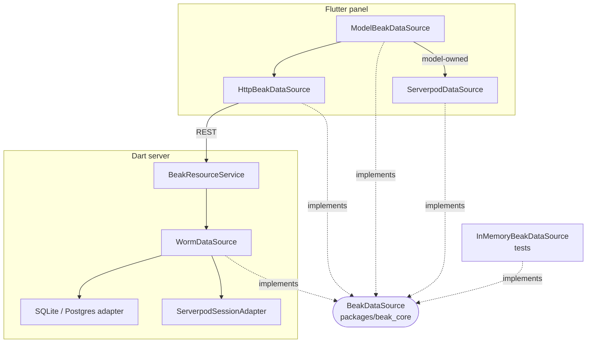

# The data source seam

Beak has one data boundary, and it is an interface. `BeakDataSource` lives in `beak_core`, speaks only `beak_core` types, and every part of Beak that reads or writes rows goes through it. After this page you can name the implementations, explain why the worm-backed server and the HTTP-backed panel are interchangeable, and say what each of the two Serverpod integrations plugs into.

## The idea in one picture



Everything above the line of dotted arrows is written against the interface. Nothing on the panel side knows worm, and nothing on the server side knows HTTP.

## How it works

### The interface

Ten methods, all in `beak_core` vocabulary: `BeakQuerySpec`, `BeakRecord`, `BeakPage`, `BeakAggregateSpec` and primitive ids. No `Model`, no `Request`, no `http.Client`.

```dart title="packages/beak_core/lib/src/data/beak_data_source.dart"
--8<-- "packages/beak_core/lib/src/data/beak_data_source.dart:BeakDataSource"
```

Implementations throw the typed `BeakException` family and never leak ORM types. The edges are sharp, and the executable contract in `beak_test` pins them:

| Method | Contract |
| --- | --- |
| `query` | Returns an accurate `total`, resolves every relation load in the spec, and treats a page past the end as an empty page. |
| `getOne` | Returns `null` for a missing id. It never throws. |
| `update` | Applies a partial patch and leaves other fields alone. A patch with nothing in it answers the record as it is. A missing id is a `BeakNotFoundException`. |
| `delete` | Soft when the model soft-deletes, unless `force`. A missing id is a `BeakNotFoundException`. |
| `restore` | Reaches past the soft-delete scope, because the row it wants is outside it. A model that never soft-deletes gets a `BeakValidationException`, since reporting success for a hard-deleted row would be a lie. |
| `batchGet` | One query. Unknown ids are absent from the result, a record is returned once however often its id is listed, and an empty list returns nothing. |
| `aggregate` | Returns `0` over an empty set, never `null`. |
| an unknown table | A `BeakConfigurationException`. |

Two more edges hold for a source that writes. A value the store refuses is the caller's mistake, so `WormDataSource` answers a foreign key, a CHECK or NOT NULL rule and a value too long or out of range for its column with a `BeakValidationException` (with a field error when the driver names the column), and a row that other records still reference with a `BeakConflictException` on a force delete. The text operators `contains`, `startsWith` and `endsWith` ignore case, as the `ILIKE` they become does.

The relation groups of the contract cover `attach`, `detach` and relation loads for the models you name in `relationModels`, including that attaching to an owner that does not exist is a `BeakNotFoundException`.

### Optional capabilities

The interface is deliberately the smallest thing every source can do. What a transport can add is a separate interface, so a source declares what it supports and the panel checks for it instead of assuming.

| Interface | Adds | Implemented by |
| --- | --- | --- |
| `BeakCommitDataSource` | `commit(plan)`, `recover(saveId)`, `commitCapabilities` | `HttpBeakDataSource`, `ModelBeakDataSource`, `BeakStagedCommitDataSource` |
| `BeakSummaryDataSource` | `summary(spec)` for full-population totals | `WormDataSource`, `HttpBeakDataSource`, `ModelBeakDataSource` |
| `BeakCapabilityDataSource` | `capabilities(table, {id})`, what this principal may read or write | `HttpBeakDataSource`, `ModelBeakDataSource` |
| `BeakValidationDataSource` | `validateRecord(request)`, trusted asynchronous checks without a write | `HttpBeakDataSource`, `ModelBeakDataSource` |
| `BeakExportDataSource` | `export(spec, ...)`, a CSV string | `HttpBeakDataSource`, `ModelBeakDataSource` |
| `BeakEditDataSource` | `loadEditValues(table, id)`, edit prefill in the shape of the update command | `ServerpodDataSource`, `ModelBeakDataSource` |
| `BeakUploadClient`, `BeakManagedUploadClient`, `BeakUploadUrlClient` | upload, discard and resolve stored files | `HttpBeakDataSource`, `ModelBeakDataSource` |
| `BeakMutationSource` (`beak_frontend`) | a `changes` stream of written tables | `ModelBeakDataSource` |

Read that column as the panel's view of a server. On the server the same capabilities are routes backed by services (`/capabilities`, `/validate`, `/summary`, `/export`, `/api/commits`, the upload routes), not interfaces on `WormDataSource`. `WormDataSource` implements the base interface and `BeakSummaryDataSource`, and nothing else.

### The server side: WormDataSource

`WormDataSource` is the default implementation. It translates every operation to worm against an injected `DatabaseAdapter` and honours model metadata (primary keys, soft deletes, relationships) with no per-model code. One instance serves every registered model, because the registry resolves each table name to its `BeakModel`.

```dart title="packages/beak_backend/lib/src/data/worm/worm_data_source.dart"
--8<-- "packages/beak_backend/lib/src/data/worm/worm_data_source.dart:query"
```

`query` is the shape of the whole class: hand the spec to the translator, run the builder, wrap the rows back into `BeakRecord`s. A worm `WormRecordModel` appears inside the method and is gone when it returns. [The query contract](query-contract.md) has the translator.

Because the adapter is injected, the same class runs on SQLite, on Postgres, on worm's `InMemoryAdapter` in a test, and on a Serverpod session.

### The panel side

`HttpBeakDataSource` implements the same interface over the typed REST client, and `ModelBeakDataSource` routes each table to the source its model names, falling back to HTTP. [Frontend flow](frontend-flow.md) covers both. The point for this page is symmetry: one `query` builds a worm query and counts rows, the other posts a JSON body to `/api/{table}/query`, and everything upstream is written against the interface.

### The test side

`package:beak/testing.dart` carries three tools for the seam.

- `InMemoryBeakDataSource` is a complete implementation over maps. It honours filters, sorts, search, relation loads, pagination and soft deletes, so a widget test that pumps a real `BeakDataTable` over it proves that paging and filtering work. It implements no commit interface, which sends form saves down the staged path.
- `BeakRecordingDataSource` wraps any source and records every call, for tests that assert how many round trips a screen costs.
- `runBeakDataSourceContract` is the suite behind the table above. `WormDataSource` is held to it, so the contract cannot rot into a document:

```dart title="packages/beak_backend/test/src/data/worm/worm_data_source_contract_test.dart"
--8<-- "packages/beak_backend/test/src/data/worm/worm_data_source_contract_test.dart:contract"
```

Where two implementations disagree, one of them is wrong, and the suite says which.

### Serverpod, path one: the admin app in your workspace

In a Serverpod 4 workspace Beak's API runs inside the Serverpod server. The admin app is an ordinary Beak panel. Only two things are new: how a request reaches the server, and what database adapter the server uses.

#### The tunnel

Serverpod exposes typed endpoint methods, not a REST router. The admin app therefore carries every Beak HTTP exchange as one string through one endpoint method. `BeakTunnelHttpClient` is an `http.Client` that wraps a request into an envelope (`BeakWireRequest`, version `1`: method, path, query, headers, body) and unwraps the response, so `BeakClient` and `HttpBeakDataSource` run unchanged on top of it:

```dart title="packages/beak_serverpod_flutter/lib/src/serverpod_beak_data_source.dart"
--8<-- "packages/beak_serverpod_flutter/lib/src/serverpod_beak_data_source.dart:serverpodBeakDataSource"
```

The panel side of the seam is still `HttpBeakDataSource`. Only the transport under `BeakClient` changed. No bearer token is sent: the Serverpod client authenticates the `dispatch` call itself.

Only four request headers cross the tunnel, and credentials are not among them:

```dart title="packages/beak_serverpod/lib/src/wire.dart"
--8<-- "packages/beak_serverpod/lib/src/wire.dart:beakWireRequestHeaders"
```

#### The gate

One endpoint method carries the whole API, and a mixin puts a login requirement and the `beak.admin` scope in front of it. Serverpod answers `401` or `403` before any Beak code runs. The scope is deliberately not `Scope.admin`: an app's own admins do not get the panel by accident.

```dart title="packages/beak_serverpod_server/lib/src/beak_admin_gate.dart"
--8<-- "packages/beak_serverpod_server/lib/src/beak_admin_gate.dart:BeakAdminGate"
```

```dart title="examples/serverpod/bookshop_server/lib/src/beak/beak_admin_endpoint.dart"
class BeakAdminEndpoint extends Endpoint with BeakAdminGate {
  /// Runs one Beak request (envelope v1) and returns the response envelope.
  Future<String> dispatch(Session session, String request) =>
      bookshopBeak.dispatch(session, request);
}
```

#### The engine

`BeakServerpodEngine` builds Beak's stock pipeline once and runs it in memory for each envelope. It is the same request log, JSON, error-mapping and auth middleware, around the same `beakApiRouter` over a `WormDataSource`. It takes a required `policy`: there is no allow-all default. There is no CORS, because there is no socket. The engine passes no `auth:` and no `storage:`, so there are no login or upload routes, and the tunnel refuses the health and file paths that the router still holds.

```dart title="packages/beak_serverpod_server/lib/src/beak_serverpod_engine.dart"
--8<-- "packages/beak_serverpod_server/lib/src/beak_serverpod_engine.dart:dispatch"
```

Per request the engine refuses any path outside `/api/**` and anything under `/api/auth`, drops every header but the four, and takes identity from the Serverpod session alone. The principal reaches Beak's auth middleware through a context value only that library can construct, so no header can forge one:

```dart title="packages/beak_serverpod_server/lib/src/beak_tunnel_path.dart"
--8<-- "packages/beak_serverpod_server/lib/src/beak_tunnel_path.dart:apiOnly"
```

```dart title="packages/beak_serverpod_server/lib/src/beak_serverpod_engine.dart"
--8<-- "packages/beak_serverpod_server/lib/src/beak_serverpod_engine.dart:TrustedGuard"
```

The default `BeakServerpodPrincipal.fromScopes` turns the user id into the principal id and every scope name into a role. Pass `principal:` to map differently, or to refuse a request with a `403`.

#### The adapter

`ServerpodSessionAdapter` is a worm `DatabaseAdapter` over the request's own Serverpod session. Statements are compiled by `worm_postgres` and run through `session.db.unsafeQuery` and `unsafeExecute`, so they share Serverpod's pool, logging and transactions, and nothing extra is deployed. The session is not a constructor argument, because one adapter serves every request. The engine puts the session in a zone and the adapter reads it per statement:

```dart title="packages/beak_serverpod_server/lib/src/beak_serverpod.dart"
--8<-- "packages/beak_serverpod_server/lib/src/beak_serverpod.dart:runInSession"
```

```dart title="packages/beak_serverpod_server/lib/src/beak_serverpod.dart"
--8<-- "packages/beak_serverpod_server/lib/src/beak_serverpod.dart:currentSession"
```

Outside `runInSession` the adapter throws a `StateError`. Silently falling back to some other session would run Beak's statements outside the request's transaction and authentication.

A graph commit is one Serverpod transaction. The outermost `transaction` opens it, and a nested one becomes a savepoint on it:

```dart title="packages/beak_serverpod_server/lib/src/serverpod_session_adapter.dart"
--8<-- "packages/beak_serverpod_server/lib/src/serverpod_session_adapter.dart:transaction"
```

Typed Serverpod ORM code can join that transaction through `BeakServerpod.sessionOf(tx)` and `BeakServerpod.transactionOf(tx)`. Without the `transaction:` argument such a call runs on another pooled connection and neither sees nor joins Beak's uncommitted writes.

Serverpod owns the schema, so `executeSchema` and `introspectSchema` throw with a message that points at `serverpod create-migration`. The commit receipts (and the effect outbox, when a project uses one) live in Serverpod-owned models instead of Beak's own migrations. The engine passes the receipts mapping to `beakApiRouter(commitReceipts: ...)`:

```dart title="packages/beak_serverpod_server/lib/src/beak_serverpod_framework_tables.dart"
const BeakFrameworkTables beakServerpodFrameworkTables = BeakFrameworkTables(
  receipts: BeakCommitReceiptTable(
    table: 'beak_commit_receipt',
    keyColumn: 'receiptKey',
    requestHashColumn: 'requestHash',
    requestJsonColumn: 'requestJson',
    resultJsonColumn: 'resultJson',
    createdAtColumn: 'createdAt',
  ),
  outbox: BeakOutboxTable(
    table: 'beak_outbox',
    idColumn: 'effectKey',
    kindColumn: 'effectKind',
    payloadColumn: 'payloadJson',
    statusColumn: 'deliveryStatus',
    attemptColumn: 'attemptCount',
    availableAtColumn: 'availableAt',
    leaseColumn: 'leaseToken',
    lastErrorColumn: 'lastError',
  ),
);
```

Serverpod's database exceptions become worm exceptions per statement and around the whole transaction, keyed on the SQLSTATE, so a unique violation reads as a `UniqueConstraintException` whether it happens mid-transaction or at `COMMIT`. Every instant is sent as UTC, because Postgres drops the offset of an untyped timestamp parameter and Serverpod stores UTC.

Because the tunnel carries text bodies and the engine mounts no storage, the admin app has no uploads. The engine has no `outbox` parameter and starts no delivery loop, so durable effects are not delivered on this path, although `beakServerpodFrameworkTables.outbox` maps the table for a host that composes its own. [Limits and next steps](../serverpod/admin-app/limits-and-next-steps.md) keeps the current list.

### Serverpod, path two: the frontend-only bridge

The other path leaves your Serverpod server alone. `beak_serverpod` implements `BeakDataSource` over typed calls on your generated Serverpod client, with no database access and no Beak code on the server.

A `ServerpodResource` wraps a `BeakModel` and binds the operations you give it (`query`, `get`, and optionally create, update, archive, force delete, restore, batch get and aggregate) to client methods. It is itself a `BeakModel`, and its `dataSource` is a `ServerpodDataSource` over that one resource. The panel registers resources once, and `ModelBeakDataSource` finds each model's source without any widget knowing:

```dart title="packages/beak_serverpod/lib/src/data_source.dart"
/// Dispatches Beak operations to typed, authenticated Serverpod client bindings.
final class ServerpodDataSource implements BeakDataSource, BeakEditDataSource {
```

Three properties make this a different seam from path one:

- Capabilities narrow. A model's `capabilities` list only the operations that have a binding. Anything else fails explicitly (`unsupportedServerpodOperation`), and `attach` and `detach` are never inferred from model fields.
- Commits are staged. `ServerpodDataSource` implements no `BeakCommitDataSource`, so a form save runs through the panel's staged path: ordinary calls in dependency order, no atomicity, receipts in memory.
- Serverpod stays the authority. Authentication, authorization, transactions and cleanup are the endpoints' business. Panel permissions only hide UI.

`beak_serverpod_generator` writes the resource classes from your generated client, and `beak_serverpod_flutter` adds the auth adapter that reuses the Serverpod session instead of opening a second one. See [Bridge resources](../serverpod/bridge/resources.md) and [Choosing an integration](../serverpod/choosing-an-integration.md).

### Keeping types from leaking

The seam holds because the graph enforces it.

- worm is imported on the data path by `beak_backend` alone. `WormRecordModel` and `QueryBuilder` appear inside `WormDataSource` and never in a return type or a `beak_core` symbol. `beak_serverpod_server` names worm to write an adapter, which sits below the interface.
- obers_ui lives on the other side, in `beak_frontend`, which never sees `dart:io` or Shelf.
- Everything that crosses the seam is a `BeakQuerySpec`, `BeakRecord`, `BeakPage` or `BeakAggregateSpec`, all pure Dart in `beak_core`.

[Package graph](package-graph.md) shows the edges and the guards.

## Why it is shaped this way

- A test seam. A frontend test injects an `InMemoryBeakDataSource` and starts no server. A backend test injects a `WormDataSource` over an in-memory adapter. Neither mocks a transport.
- Transport blindness. A table queries through the interface, and a form saves through the optional commit capability. Both ask what the source can do before assuming.
- A small base, optional extras. Ten methods are cheap to implement honestly. Commits, summaries and exports are separate interfaces because plenty of useful sources cannot provide them.
- One place for a new backend. Adding a data backend means writing one class, not editing the panel. Serverpod is the proof: two integrations, and `beak_core` and the widgets are unchanged.

## What it means for you

- To put Beak over a data store of your own, implement `BeakDataSource`, run `runBeakDataSourceContract` against it, and bind it as a model's `dataSource`. [Custom data sources](../extending/custom-data-sources.md) walks through it.
- Do not widen the base interface. Add an optional interface and check for it, the way commits and summaries do.
- Choose the Serverpod path by where the database lives. If Beak should read and write your Serverpod tables with full graph commits, take path one. If your endpoints must stay the only door, take path two.
- The same rule that keeps worm out of the panel applies to your code: a screen that imports `package:worm` is a bug in the screen.

## Continue reading

- [The query contract](query-contract.md) the `BeakQuerySpec` this interface consumes, and how it becomes a worm query.
- [Graph commits](graph-commits.md) what `BeakCommitDataSource` promises and how the server keeps it.
- [Custom data sources](../extending/custom-data-sources.md) writing your own implementation of the interface.
- [Model transports](../extending/model-transports.md) binding a source to a model.
- [The Serverpod admin app](../serverpod/admin-app/how-it-works.md) the user-facing story of path one.
