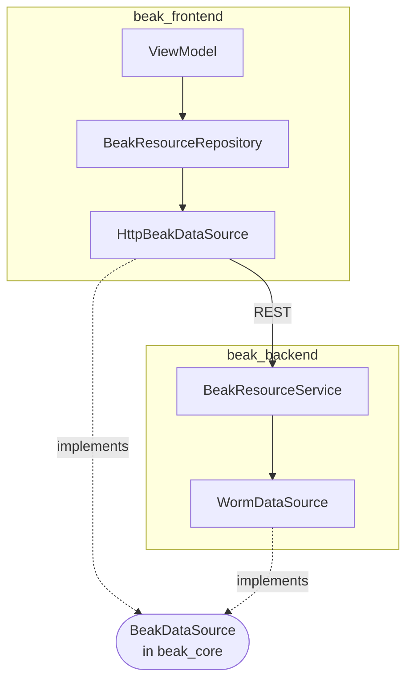

# The data source seam

After this page you can name the single interface every Beak data operation goes through, explain why the worm-backed server and the HTTP-backed panel are interchangeable, and describe how model-owned Serverpod transports preserve that boundary.

Beak has one data boundary, and it is an interface, not a class. `BeakDataSource` lives in `beak_core`, speaks only `beak_core` types, and both sides of Beak implement it: the server over the Worm ORM, the panel over REST or typed Serverpod RPCs. That symmetry is the reason worm never leaks into the frontend and HTTP never leaks into a service, and it is the reason a new transport can slot in without editing the code that uses it.

The interface is `packages/beak_core/lib/src/data/beak_data_source.dart`; runtime implementations include `packages/beak_backend/lib/src/data/worm/worm_data_source.dart`, `packages/beak_frontend/lib/src/data/http_beak_data_source.dart` and `packages/beak_serverpod/lib/src/data_source.dart`.

## The interface

`BeakDataSource` is ten methods, all phrased in `beak_core` vocabulary: `BeakQuerySpec`, `BeakRecord`, `BeakPage`, `BeakAggregateSpec`, and primitive ids. No `Model`, no `Request`, no `http.Client`.

| Method | Returns | Job |
| --- | --- | --- |
| `query(spec)` | `Future<BeakPage<BeakRecord>>` | Run a spec, eager-loading every relation it declares. |
| `getOne(table, id)` | `Future<BeakRecord?>` | One record by primary key, or `null`. |
| `create(table, data)` | `Future<BeakRecord>` | Insert and return the stored record. |
| `update(table, id, data)` | `Future<BeakRecord>` | Update by id; throws `BeakNotFoundException` if absent. |
| `delete(table, id, {force})` | `Future<void>` | Soft-delete when the model opts in, else hard-delete. |
| `restore(table, id)` | `Future<BeakRecord>` | Clear a soft-delete marker and return the row as it now reads. |
| `batchGet(table, ids)` | `Future<List<BeakRecord>>` | Fetch many ids in one query (the dedup path). |
| `attach(table, id, relationKey, relatedIds)` | `Future<void>` | Link to-many relations. |
| `detach(table, id, relationKey, relatedIds)` | `Future<void>` | Unlink to-many relations. |
| `aggregate(spec)` | `Future<num>` | Compute a count/sum/avg over matching rows. |

The table describes the full vocabulary and default Worm behavior. Adapters may
support a narrower operation set, advertise that through model capabilities, and
reject unsupported calls explicitly. Serverpod archive and cleanup semantics stay
inside the bound domain operation.

For Worm, `restore` is the one operation that deliberately reaches past the soft-delete scope, because the row it wants is by definition already outside it. It throws `BeakValidationException` when the model does not soft-delete at all: reporting success for a row that was hard-deleted would be a lie.

The interface's own doc comment states the contract implementations sign up to:

```dart title="packages/beak_core/lib/src/data/beak_data_source.dart"
/// Backend handlers and services speak only this interface (`WormDataSource`
/// is the default implementation, `beak_frontend`'s HTTP client another,
/// and `beak_serverpod` supplies typed RPC bindings without database access).
/// Implementations
/// throw typed `BeakException`s (`BeakNotFoundException` for missing
/// records, `BeakConfigurationException` for unknown tables/relations) and
/// never leak ORM types.
abstract interface class BeakDataSource {
```

Two rules carry across every implementation: failures are the typed `BeakException` family, and ORM/transport types stay behind the boundary.

## The server side: `WormDataSource`

`WormDataSource` is the default implementation Beak ships. It translates every operation to worm against an injected `DatabaseAdapter`, honoring model metadata (primary keys, soft deletes, relationships) with no per-model code. One instance serves every registered model because the `BeakModelRegistry` resolves each table name to its `BeakModel`.

```dart title="packages/beak_backend/lib/src/data/worm/worm_data_source.dart"
final class WormDataSource implements BeakDataSource, BeakSummaryDataSource {
  WormDataSource(
    this.registry, {
    required DatabaseAdapter adapter,
    DateTime Function()? now,
  }) : _adapter = adapter,
       _now = now ?? DateTime.now,
       _translator = WormQueryTranslator(registry);
```

`query` is the shape of the whole class: hand the spec to the translator, run the builder, wrap the rows back into `BeakRecord`s. Worm's `WormRecordModel` appears inside the method and is gone by the time it returns.

```dart title="packages/beak_backend/lib/src/data/worm/worm_data_source.dart"
@override
Future<BeakPage<BeakRecord>> query(BeakQuerySpec spec) async {
  final BeakModel beakModel = registry.byTableOrThrow(spec.table);
  final builder = _translator.builderFor(spec, _adapter);
  final int total = await builder.count();
  final rows = await builder.get();
  return BeakPage(
    items: [
      for (final row in rows)
        row.toBeakRecord(
          loads: spec.relationLoads,
          model: beakModel,
          registry: registry,
        ),
    ],
    total: total,
    page: spec.pagination.page,
    perPage: spec.pagination.perPage,
  );
}
```

Because the adapter is injected, the same class runs against SQLite (the default, a file beside the process), Postgres, or an `InMemoryAdapter` in a test. The URL scheme picks it once, at boot. Nothing above the data source knows which.

## The client side: `HttpBeakDataSource`

The panel implements the exact same interface over the typed REST client. Every method forwards to `BeakClient`, so widgets and view models stay transport-blind.

```dart title="packages/beak_frontend/lib/src/data/http_beak_data_source.dart"
final class HttpBeakDataSource
    implements
        BeakDataSource,
        BeakCapabilityDataSource,
        BeakSummaryDataSource,
        BeakExportDataSource,
        BeakValidationDataSource,
        BeakManagedUploadClient,
        BeakUploadUrlClient,
        BeakCommitDataSource {
  /// Creates a data source over [client].
  const HttpBeakDataSource(this.client);

  /// The transport the source delegates to.
  final BeakClient client;

  // ... validation and remaining CRUD forwarding ...

  @override
  BeakCommitCapabilities get commitCapabilities =>
      const BeakCommitCapabilities(durableReceipts: true);

  @override
  Future<BeakSaveResult> commit(BeakSavePlan plan) => client.commit(plan);

  @override
  Future<BeakSaveResult> recover(String saveId) => client.recoverCommit(saveId);

  // ...
}
```

The class delegates data operations, uploads, and graph commit/recovery through the same client. `BeakCommitDataSource` advertises durable receipt support; the backend determines whether a graph can commit atomically.

## The test implementation: `InMemoryBeakDataSource`

`package:beak/testing.dart` ships a complete implementation over plain maps. Complete is the operative word. It honours filters, sorts, search, relation loads, pagination and soft deletes, so a widget test that pumps a real `BeakDataTable` over it proves the table's paging and filtering actually work.

```dart
final source = InMemoryBeakDataSource(registry: buildBeakRegistry())
  ..seed(const ProductModel(), [beakFakeRecord(const ProductModel())]);
```

The same library exports `BeakRecordingDataSource`, which wraps any source and counts calls, for tests that assert how many round trips a screen costs. And it exports `runBeakDataSourceContract`, an executable definition of done: a suite of groups and expectations any implementation can be run against. `WormDataSource` is run against it, so the contract is not a document that can rot.

## The symmetry, and why it pays

Read the two `query` methods side by side. One builds a worm query and counts rows; the other posts a JSON body to `/api/{table}/query`. They have identical signatures because they satisfy the same interface, and everything upstream, on both sides, is written against that interface rather than against either implementation.



The seam buys three things:

- **A test seam.** Frontend tests inject an `InMemoryBeakDataSource` and never spin up a server; backend tests inject a `WormDataSource` over an `InMemoryAdapter` or `sqlite::memory:`. Neither has to mock a transport.
- **Transport blindness.** A data table queries through `BeakDataSource`; a configured form saves through the optional commit capability. Both use declared source capabilities rather than assuming a particular database or HTTP transport.
- **A clean extension point.** Adding a data backend means writing one class, not editing the panel.

## Serverpod model transports

The existing `beak_serverpod` package implements this seam over typed Serverpod
client operations. Its companion generator resolves the application's generated
Dart model **and endpoint** signatures, emitting a `<Model>Resource` that is itself
a `BeakModel` with a stable data source. It does not extend a generated Serverpod
entity or create a second persistence schema.

A normal panel registers resources once. The panel discovers their model-owned sources and evaluates live presentation
permissions and bound operation capabilities. Its shared dispatcher keeps command
edit-prefill inside the same mapped error boundary as other data operations.
Separate generated create/edit metadata supports command DTOs whose shape differs
from a read projection. Models without an owned source keep using the panel's
default HTTP/Worm source.

Generated Serverpod calls preserve named/positional arguments, typed IDs, query
pagination defaults and the endpoint's returned total. Compatible create/update
commands use generated forms; domain commands returning different results retain
custom workflows. Ordinary delete uses the bound archive/delete method. Unsupported
predicates, ambiguous contracts and unbound operations fail explicitly. Relation
writes, restore and force-delete are not inferred from model fields.

Serverpod owns authentication, server authorization, transactions and cleanup.
The framework's auth provider/screens are a separate frontend boundary configured
once by the host. `beak_serverpod_flutter` adapts the existing Serverpod client and
Flutter session manager to `BeakAuthAdapter`; it does not discover auth endpoints
or introduce a second session. Resource generation never creates accounts, grants
permissions or opens a database connection. Client permissions govern UI behavior only and
cannot replace endpoint checks.

The low-level `ServerpodResource` constructor remains available for a contract
outside the generator's documented conventions. Its typed callbacks and generated
codecs still use the same dispatcher, so a custom integration does not require
new widget or view-model implementations.

See [model-owned transports](../extending/model-transports.md), the
[Serverpod runtime guide](https://github.com/SimonErich/beak/blob/main/packages/beak_serverpod/README.md), and the
[generator conventions](https://github.com/SimonErich/beak/blob/main/packages/beak_serverpod_generator/README.md).
The bridge's tests compile and execute generated calls against typed fixture
endpoints; the generic data-source contract suite remains available to adapters
that implement its complete operation vocabulary.

## Keeping types from leaking

The seam only works if the boundary holds, and Beak enforces that structurally.

- **worm is imported by exactly one runtime package.** `beak_backend` is the only one that depends on the ORM. `WormRecordModel` and `QueryBuilder` appear inside `WormDataSource`; they never appear in a return type or a `beak_core` symbol. (`package:beak/migrations.dart` re-exports worm's `Migration` and `Schema`, because a migration is worm's, but that library is on the server side of the wall.)
- **obers_ui lives on the other side.** `beak_frontend` owns the visual components, and its widgets never see `dart:io` or Shelf. The separate `beak_serverpod_flutter` auth adapter imports the Serverpod Flutter session client without pulling it into `beak_core`.
- **The interface is the vocabulary.** Everything crossing the seam is a `BeakQuerySpec`, `BeakRecord`, `BeakPage`, or `BeakAggregateSpec`, all defined in `beak_core`, the pure-Dart package both sides share.

Hold those three lines and the framework stays layered: a change to the ORM cannot ripple into the panel, and a change to the panel cannot reach the database.

## Continue reading

- [The data source seam (backend view)](../backend/the-data-source-seam.md) how the server wires a `WormDataSource` over an adapter.
- [Custom data sources](../extending/custom-data-sources.md) writing your own implementation of the interface.
- [The query contract](query-contract.md) the `BeakQuerySpec` the seam consumes.
- [Testing](../guides/testing.md) `InMemoryBeakDataSource`, the recording source, and the contract suite in practice.
- [The four layers](../concepts/the-four-layers.md) where the data source sits in each flow.
