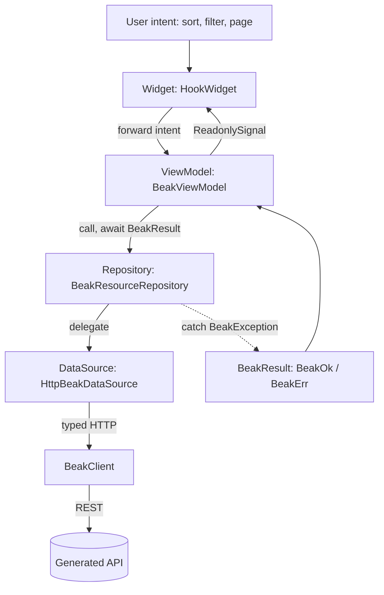
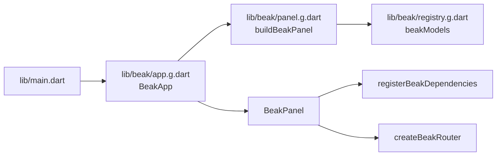

# Frontend flow

After this page you will be able to follow a user tap from a widget to the network and back, name which layer holds state and which holds the `try/catch`, and know why the panel never throws an exception at a widget. This is the client side of Beak's [four layers](../concepts/the-four-layers.md).

The frontend flow is `Widget -> ViewModel -> Repository -> DataSource`, four layers and no fifth. State lives in Signals, failures are caught once at the repository and returned as values, and the whole thing is wired through a GetIt container scoped to Beak so it never collides with your app's own registrations.

## The path of an interaction



State flows up as Signals; intent flows down as method calls. The only layer that ever runs a `try/catch` is the repository.

## The generated wiring above the widgets

Nothing above hands itself a config. Before the first widget builds, four generated files decide what the panel *is*.



`beak prepare` writes all four. `registry.g.dart` lists every model it found under `lib/models/`. `panel.g.dart` turns `beak.yaml` plus those models plus anything in `lib/screens/` and `lib/resources/` into one `BeakPanelConfig`. `app.g.dart` holds the root widget.

```dart title="examples/store/lib/beak/app.g.dart"
/// The Beak Store panel's configuration.
///
/// Built once, at startup: the config holds closures and block trees, so a
/// fresh one every frame would rebuild the router with it.
final BeakPanelConfig beakPanelConfig = buildBeakPanel();

/// The Beak Store panel.
final class BeakApp extends StatelessWidget {
  /// Creates the app; [dataSource] injects a fake in widget tests.
  const BeakApp({this.dataSource, super.key});

  /// Test seam replacing the HTTP-backed data source.
  final BeakDataSource? dataSource;

  @override
  Widget build(BuildContext context) =>
      BeakPanel(config: beakPanelConfig, dataSource: dataSource);
}
```

Two details are worth reading twice. The config is a top-level `final`, built once, because it holds closures and block trees and a fresh one each frame would rebuild the router underneath the user. And `dataSource` is threaded straight through from the root widget, which is what lets a widget test pump the entire real panel over an `InMemoryBeakDataSource` with no socket anywhere.

A generated resource entry is a plain `BeakResource`, and the one hand-written hook is a function that takes Beak's own default and returns a modified copy:

```dart title="examples/store/lib/beak/panel.g.dart"
      resource_products.beakResource(
        BeakResource(
          model: const ProductModel(),
          icon: BeakIconToken(OiIcons.package),
          section: 'Catalog',
        ),
      ),
```

So `lib/resources/products.dart` adjusts the products resource and nothing else. Delete the file and the plain `BeakResource` is what remains. Everything from here down is framework code that has never heard of your project.

## The Widget: render Signals, forward intent

Panel widgets are `HookWidget`s (Beak forbids `StatefulWidget`). A widget watches a `ReadonlySignal` and rebuilds when it changes, and it forwards user intent to its view model. It holds no business logic and no `try/catch`.

`BeakDataTable` is the generated list view. It renders a model's table-context columns as an `OiTable`, and every sort, filter, or page change is forwarded to an internal `TableViewModel`.

```dart title="packages/beak_frontend/lib/src/table/beak_data_table.dart"
class BeakDataTable extends HookWidget {
```

Its own doc comment sums up the deal: table-context columns rendered as an `OiTable` with server-side sort, filter, and pagination through `BeakQuerySpec`, per-row and bulk actions, optimistic delete with undo, and inline edit, all with zero per-resource table code.

Because the widget only reads Signals and forwards intent, there is nothing in it to unit-test beyond rendering: the interesting behavior sits one layer down.

## The ViewModel: owns Signals, never catches

Every view model extends `BeakViewModel`, which owns its Signals, exposes them as `ReadonlySignal`s, and disposes them together. Its doc comment states the rule plainly: a view model never runs a `try/catch`, because the repository is the catch boundary. State is created with `ownedSignal` so it is released on `dispose`, and exposed upward as a `ReadonlySignal` so widgets read but never write it.

```dart title="packages/beak_frontend/lib/src/state/beak_view_model.dart"
abstract base class BeakViewModel {
  // ...

  @protected
  Signal<T> ownedSignal<T>(T value) {
    final owned = signal<T>(value);
    _cleanups.add(owned.dispose);
    return owned;
  }
```

`TableViewModel` is the concrete example. It owns the query spec, the current page, a loading flag, and the last error, each as a `ReadonlySignal`. A sort or filter intent rewrites the `BeakQuerySpec` and refetches through the repository. Note that it switches on a `BeakResult`; it does not catch.

```dart title="packages/beak_frontend/lib/src/table/table_view_model.dart"
Future<void> refresh() async {
  final int requestId = ++_latestRequestId;
  _loading.value = true;
  _error.value = null;
  final result = await _repository.query(_spec.value);
  if (requestId != _latestRequestId) {
    return;
  }
  switch (result) {
    case BeakOk(:final value):
      _page.value = value;
    case BeakErr(:final error):
      _error.value = error;
  }
  _loading.value = false;
}
```

That `requestId` guard is latest-wins concurrency: a slow response from a superseded request is dropped so it can never overwrite newer state. The view model turns an outcome into signal updates, and the widget rebuilds. No exception was ever thrown at a widget.

## The Repository: the single catch boundary

`BeakResourceRepository` is a thin, stateless wrapper over a `BeakDataSource`. Every method mirrors a source operation but returns `BeakResult<T>` instead of throwing. A thrown `BeakException` becomes a `BeakErr`; any other error still propagates (a bug should not be swallowed as a value).

```dart title="packages/beak_frontend/lib/src/data/beak_resource_repository.dart"
Future<BeakResult<BeakPage<BeakRecord>>> query(BeakQuerySpec spec) =>
    _guard(() => dataSource.query(spec));

// ...

Future<BeakResult<T>> _guard<T>(Future<T> Function() run) async {
  try {
    return BeakOk(await run());
  } on BeakException catch (exception) {
    return BeakErr(exception);
  }
}
```

This is the mirror of the backend's error-mapping middleware: on the server, exceptions become HTTP status codes at one boundary; on the client, they become `BeakResult` values at one boundary. Everything above the repository deals in `BeakOk` and `BeakErr`, never in `try`. See [Results and errors](../concepts/results-and-errors.md) for the result type in full.

## The DataSource: transport-blind delegation

`HttpBeakDataSource` implements the same `BeakDataSource` interface the backend implements, delegating every call to a typed `BeakClient` that speaks REST to the generated API. Widgets and view models stay transport-blind: they never see a URL, a header, or a JSON map.

```dart title="packages/beak_frontend/lib/src/data/http_beak_data_source.dart"
final class HttpBeakDataSource implements BeakDataSource, BeakUploadClient {
  const HttpBeakDataSource(this.client);

  final BeakClient client;

  @override
  Future<BeakPage<BeakRecord>> query(BeakQuerySpec spec) =>
      client.query(spec.table, spec);
```

Because the source is behind an interface, a test injects an `InMemoryBeakDataSource` from `package:beak/testing.dart` and the entire stack above it runs without a socket, and a future transport such as Serverpod could replace it without touching a single widget. That is the same seam described in [The data source seam](data-source-seam.md).

## Wiring: package-scoped GetIt

Beak resolves its dependencies from `beakLocator`, a GetIt container created with `GetIt.asNewInstance()` so it never collides with your app's own `GetIt.instance` registrations.

```dart title="packages/beak_frontend/lib/src/di/beak_locator.dart"
final GetIt beakLocator = GetIt.asNewInstance();
```

`registerBeakDependencies` populates it from a `BeakPanelConfig`: the model registry, the `BeakClient` pointed at `apiBaseUrl`, the session store, the `BeakDataSource`, a reference cache, and the theme controller. Registration is synchronous, because the router built right after reads the locator on its first frame, and it allows reassignment so hot restarts and tests can call it repeatedly.

```dart title="packages/beak_frontend/lib/src/di/beak_locator.dart"
final source = dataSource ?? HttpBeakDataSource(client);
container
  ..registerSingleton<BeakPanelConfig>(config)
  ..registerSingleton<BeakModelRegistry>(registry)
  ..registerSingleton<BeakClient>(client)
  ..registerSingleton<BeakSessionStore>(sessions)
  ..registerSingleton<BeakDataSource>(source)
  ..registerSingleton<ReferenceCache>(ReferenceCache(source, registry))
  ..registerSingleton<BeakThemeController>(
    BeakThemeController(config.initialThemeMode),
  );
```

The client and the session store are built in that order for a reason: the client reads the store's token on every request, and the store mints one through the client when you sign in. Two halves of one session, so signing in is all it takes for the rest of the panel to be authenticated.

The `dataSource` parameter is the test seam: pass a fake and the panel talks to it instead of the network. `BeakPanel` calls this for you, so app authors set `api.baseUrl` in `beak.yaml` and never touch the locator directly. UI is obers_ui throughout, routing is go_router, and state is Signals, exactly as the [principles](principles.md) require.

`apiBaseUrl` itself is a compile-time value. The panel is a Flutter web app with no environment to read at runtime, so `beak.yaml`'s `api.baseUrl` becomes a `String.fromEnvironment` default in `panel.g.dart`, overridable at build time with `--dart-define=BEAK_API_BASE_URL=...`. Set `baseUrl: auto` and the generated expression resolves to the origin the panel was served from instead.

## Continue reading

- [Backend flow](backend-flow.md) the server side, where the middleware plays the role the repository plays here.
- [Results and errors](../concepts/results-and-errors.md) the `BeakResult` type the repository returns and the view model switches on.
- [The panel](../panel/index.md) the widgets this flow drives, from tables to forms to dashboards.
- [Project structure](../start-here/project-structure.md) the generated files at the top of this flow, and which ones you commit.
