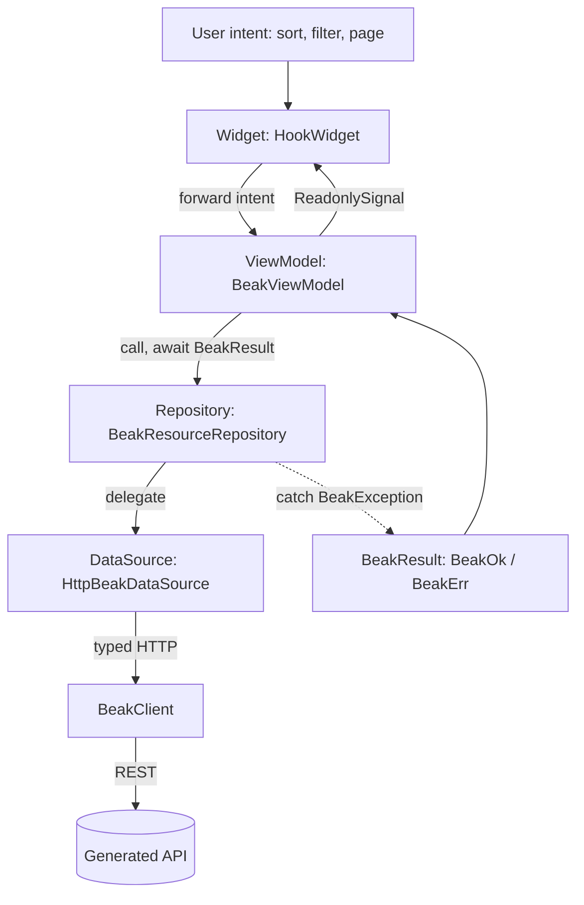

# Frontend flow

After this page you will be able to follow a user tap from a widget to the network and back, name which layer holds state and which holds the `try/catch`, and know why the panel never throws an exception at a widget. This is the client side of Beak's [four layers](../concepts/the-four-layers.md).

The frontend flow is `Widget -> ViewModel -> Repository -> DataSource`, four layers and no fifth. State lives in Signals, failures are caught once at the repository and returned as values, and the whole thing is wired through a GetIt container scoped to Beak so it never collides with your app's own registrations.

## The path of an interaction



State flows up as Signals; intent flows down as method calls. The only layer that ever runs a `try/catch` is the repository.

## Configuration above the widgets

The canonical shop's authored `lib/main.dart` registers resources and custom pages
on `BeakPanel`. Each resource owns its model, navigation, search and presentations.
`beak prepare` discovers schemas throughout `lib/` and generates their typed
helpers and shared server registry. Generated app/panel hosts remain available for
projects using automatic host conventions.

`BeakPanel` installs a dependency container scoped to its own widget tree, then
creates the router. Passing `dataSource:` replaces the default transport in tests
or an embedded host. `beakDependencies(context)` finds this scoped source, so two
panels do not need to share credentials, references or caches.

The same `BeakFormSections` can render as tabs, stacked content or wizard steps.
`BeakFormSession` owns the graph; model rules and behavior supply validation,
relationship eligibility, suggestions and actions. UI closures remain explicit
presentation extensions rather than implicitly translated server rules.

## The Widget: render Signals, forward intent

Panel widgets are `HookWidget`s (Beak forbids `StatefulWidget`). A widget watches a `ReadonlySignal` and rebuilds when it changes, and it forwards user intent to its view model. It holds no business logic and no `try/catch`.

`BeakDataTable` is the generated list view. It renders a model's table-context columns as an `OiTable`, and every sort, filter, or page change is forwarded to an internal `TableViewModel`.

```dart title="packages/beak_frontend/lib/src/table/beak_data_table.dart"
class BeakDataTable extends HookWidget {
```

Its own doc comment sums up the deal: table-context columns rendered as an `OiTable` with server-side sort, filter, and pagination through `BeakQuerySpec`, per-row and bulk actions, optimistic delete with undo, and inline edit, all with zero per-resource table code.

Because the widget only reads Signals and forwards intent, there is nothing in it to unit-test beyond rendering: the interesting behavior sits one layer down.

## The ViewModel: owns Signals, never catches

Every view model extends `BeakViewModel`, which owns its Signals, exposes them as `ReadonlySignal`s, and disposes them together. Its doc comment states the rule plainly: a view model never runs a `try/catch`, because the repository is the catch boundary. State is created with `ownedSignal` so it is released on `dispose`, and exposed upward as a `ReadonlySignal` so widgets read but never write it.

```dart title="packages/beak_frontend/lib/src/state/beak_view_model.dart"
abstract base class BeakViewModel {
  // ...

  @protected
  Signal<T> ownedSignal<T>(T value) {
    final owned = signal<T>(value);
    _cleanups.add(owned.dispose);
    return owned;
  }
```

`TableViewModel` is the concrete example. It owns the query spec, the current page, a loading flag, and the last error, each as a `ReadonlySignal`. A changed sort or filter intent rewrites the `BeakQuerySpec` and refetches through the repository. Repeating an unchanged intent sends no request; explicit refreshes and mutation refreshes always fetch fresh data. Note that it switches on a `BeakResult`; it does not catch.

```dart title="packages/beak_frontend/lib/src/table/table_view_model.dart"
Future<void> refresh() async {
  if (isDisposed) return;
  final int requestId = ++_latestRequestId;
  _loading.value = true;
  _error.value = null;
  final result = await _repository.query(_spec.value);
  if (isDisposed || requestId != _latestRequestId) {
    return;
  }
  switch (result) {
    case BeakOk(:final value):
      _page.value = value;
    case BeakErr(:final error):
      _error.value = error;
  }
  _loading.value = false;
}
```

The guard drops results after disposal or after a newer request starts, so a slow response cannot overwrite newer state or write to released signals. The view model turns an outcome into signal updates, and the widget rebuilds. No exception was ever thrown at a widget.

## The Repository: the single catch boundary

`BeakResourceRepository` wraps a `BeakDataSource`. Every method mirrors a source operation but returns `BeakResult<T>` instead of throwing. The default remains uncached; its opt-in coalescing scope shares identical pending queries and removes them after completion. Mutations invalidate pending join eligibility, and record-specific permissions remain fresh. A thrown `BeakException` becomes a `BeakErr`; any other error still propagates (a bug should not be swallowed as a value).

```dart title="packages/beak_frontend/lib/src/data/beak_resource_repository.dart"
Future<BeakResult<BeakPage<BeakRecord>>> query(BeakQuerySpec spec) {
  final queries = _queries;
  if (queries == null) return beakRun(() => dataSource.query(spec));
  return queries.putIfAbsent(spec, () {
    late final Future<BeakResult<BeakPage<BeakRecord>>> request;
    request = (() async {
      try {
        return await beakRun(() => dataSource.query(spec));
      } finally {
        queries.removeWhere(
          (key, pending) => key == spec && identical(pending, request),
        );
      }
    })();
    return request;
  });
}

```

The shared result boundary is also available to typed custom workflows:

```dart title="packages/beak_frontend/lib/src/data/beak_run.dart"
Future<BeakResult<T>> beakRun<T>(
  Future<T> Function() operation, {
  BeakException? Function(Exception exception, StackTrace stack)? mapException,
}) async {
  try {
    return BeakOk(await operation());
  } on BeakException catch (exception) {
    return BeakErr(exception);
  } on Exception catch (exception, stack) {
    final mapped = mapException?.call(exception, stack);
    if (mapped != null) return BeakErr(mapped);
    rethrow;
  }
}
```

This is the mirror of the backend's error-mapping middleware: on the server, exceptions become HTTP status codes at one boundary; on the client, they become `BeakResult` values at one boundary. Everything above the repository deals in `BeakOk` and `BeakErr`, never in `try`. See [Results and errors](../concepts/results-and-errors.md) for the result type in full.

## The DataSource: transport-blind delegation

`HttpBeakDataSource` implements the same `BeakDataSource` interface the backend implements, delegating every call to a typed `BeakClient` that speaks REST to the generated API. Widgets and view models stay transport-blind: they never see a URL, a header, or a JSON map.

```dart title="packages/beak_frontend/lib/src/data/http_beak_data_source.dart"
final class HttpBeakDataSource
    implements
        BeakDataSource,
        BeakCapabilityDataSource,
        BeakSummaryDataSource,
        BeakExportDataSource,
        BeakValidationDataSource,
        BeakManagedUploadClient,
        BeakUploadUrlClient,
        BeakCommitDataSource {
  /// Creates a data source over [client].
  const HttpBeakDataSource(this.client);

  /// The transport the source delegates to.
  final BeakClient client;

  // ... validation and remaining CRUD forwarding ...

  @override
  BeakCommitCapabilities get commitCapabilities =>
      const BeakCommitCapabilities(durableReceipts: true);

  @override
  Future<BeakSaveResult> commit(BeakSavePlan plan) => client.commit(plan);

  @override
  Future<BeakSaveResult> recover(String saveId) => client.recoverCommit(saveId);

  // ...
}
```

Because the source is behind an interface, a test injects an `InMemoryBeakDataSource` from `package:beak/testing.dart` and the entire stack above it runs without a socket, and the `ServerpodDataSource` from `beak_serverpod` can replace it without changing the widgets. That is the same seam described in [The data source seam](data-source-seam.md).

## Wiring: one dependency scope per panel

Each mounted panel owns a `GetIt.asNewInstance()` container. Its source, cache,
registry, theme and authentication state are scoped through `BeakDependencyScope`.
Custom widgets resolve that scope with `beakDependencies(context)`. Standalone
legacy integrations may explicitly register the package fallback:

```dart title="packages/beak_frontend/lib/src/di/beak_locator.dart"
final GetIt beakLocator = GetIt.asNewInstance();
```

`registerBeakDependencies` populates the chosen container from a `BeakPanelConfig`: the model registry, the `BeakClient` pointed at `apiBaseUrl`, the session store, the `BeakDataSource`, a reference cache, and the theme controller. Registration is synchronous, because the router built right after reads the locator on its first frame, and it allows reassignment so hot restarts and tests can call it repeatedly.

```dart title="packages/beak_frontend/lib/src/di/beak_locator.dart"
  final source = ModelBeakDataSource(
    registry: registry,
    fallback: fallback,
    overrideBindings: dataSource != null,
    mapException: config.mapException,
    refreshPolicy: config.refreshPolicy,
  );
  container
    ..registerSingleton<BeakModelActionRunner>(
      BeakModelActionRunner(),
      dispose: (runner) => runner.dispose(),
    )
    ..registerSingleton<BeakPanelConfig>(config)
    ..registerSingleton<BeakModelRegistry>(registry)
    ..registerSingleton<BeakDataSource>(
      source,
      dispose: (_) => source.dispose(),
    )
    ..registerSingleton<ReferenceCache>(
      ReferenceCache(
        source,
        registry,
        auth:
            config.auth?.adapter ??
            (container.isRegistered<BeakSessionStore>()
                ? container<BeakSessionStore>()
                : null),
      ),
      dispose: (cache) => cache.dispose(),
    )
    ..registerSingleton<BeakThemeController>(
      BeakThemeController(config.initialThemeMode),
    );
```

The client and the session store are built in that order for a reason: the client reads the store's token on every request, and the store mints one through the client when you sign in. Two halves of one session, so signing in is all it takes for the rest of the panel to be authenticated.

Models can bind their own `dataSource`; the dispatcher resolves them automatically. The explicit panel `dataSource` parameter replaces all bindings for tests. An external `BeakAuthConfig.adapter` skips the Beak REST client and session store. Embedded hosts can instead use `externalAuthentication: true`, supply bound models or an explicit source, and mount `beakPanelRoutes(config)` inside their authenticated router. See [Model-owned transports](../extending/model-transports.md).

For the standalone REST panel, `BeakPanel` registers dependencies and builds its router for you. App authors set `api.baseUrl` in `beak.yaml`. UI is obers_ui throughout, routing is go_router, and state is Signals, exactly as the [principles](principles.md) require.

`apiBaseUrl` itself is a compile-time value. The panel is a Flutter web app with no environment to read at runtime, so `beak.yaml`'s `api.baseUrl` becomes a `String.fromEnvironment` default in `panel.g.dart`, overridable at build time with `--dart-define=BEAK_API_BASE_URL=...`. Set `baseUrl: auto` and the generated expression resolves to the origin the panel was served from instead.

## Continue reading

- [Backend flow](backend-flow.md) the server side, where the middleware plays the role the repository plays here.
- [Results and errors](../concepts/results-and-errors.md) the `BeakResult` type the repository returns and the view model switches on.
- [The panel](../panel/index.md) the widgets this flow drives, from tables to forms to dashboards.
- [Project structure](../start-here/project-structure.md) the generated files at the top of this flow, and which ones you commit.
