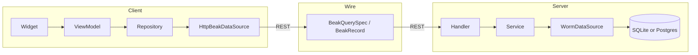

# Architecture deep dive

This section is for the reader who wants to know why Beak is shaped the way it is: where a change belongs, which package owns which idea, and how a request travels from a table cell to the database and back. If you only want to ship a panel, the [Core concepts](../concepts/index.md) section is enough. Stay here if you want to extend Beak, review it, or trust it.

Beak turns one annotated schema class into a running admin panel. `beak prepare` reads the class and writes the typed columns, the model, both sides of every relationship, the registry, the panel config and the server host. From there the same typed columns drive the table cell, the form input (with client-side validation that mirrors the server), the detail row, the filter, the REST validation, and the CSV export column. Everything below is in service of that one promise, and of keeping the seams clean enough that a second data backend could slot in without a rewrite.

## Read it in order, or jump

The pages build on each other, but each stands alone.

### The ideas

- [Principles](principles.md) the invariants every part of Beak obeys: define-once, no `dynamic`, source-agnostic data, no Material, exactly four layers per side, no lazy loading, and where the escape hatches live.
- [Package graph](package-graph.md) who depends on whom. You depend on one package, `beak`, and behind it sit the small ones: `beak_core` at the base as pure Dart, `beak_backend` as the only package that imports the worm ORM, and a guard in CI keeping the Flutter half walled off from the server half.

### The two flows

- [Backend flow](backend-flow.md) the `Handler -> Service -> DataSource` path, the error-mapping middleware that is the single catch boundary, and how the whole REST surface is generated from a registry.
- [Frontend flow](frontend-flow.md) the `Widget -> ViewModel -> Repository -> DataSource` path, why view models expose Signals and never `try/catch`, and how the repository turns thrown exceptions into `BeakResult` values.

### The seams

- [The query contract](query-contract.md) `BeakQuerySpec`, the serializable description of a query that the panel builds and the server executes.
- [The data source seam](data-source-seam.md) the `BeakDataSource` interface both sides implement, and how `beak_serverpod` plugs in without touching `beak_core`.
- [Block system internals](block-system-internals.md) how block rendering, grid placement and record scopes work alongside configured forms.
- [Storage internals](storage-internals.md) the pluggable driver registry, the shared upload validator, and the image transform pipeline.

## The shape in one picture

A Beak project is **one package with two entrypoints**. `lib/main.dart` boots the panel, `bin/serve.dart` boots the server, and both reach the same `lib/models/`. The two halves never share a process. They share the model definitions and a serializable vocabulary in between.

The client half never imports Shelf or worm. The server half never imports obers_ui or Flutter. The box in the middle, the serializable spec, is the only thing that crosses the wire, and it is pure `beak_core`, which you import as `package:beak/beak.dart`.

That split is why the libraries are split. A model file imports `beak.dart` and `schema.dart` and nothing else, because `bin/serve.dart` reaches it through the generated registry, and a `dart:ui` import anywhere on that path would stop the server compiling ahead of time. See [Libraries](../reference/libraries.md) for the eight import points and what each one is allowed to reach.

## Continue reading

- [Principles](principles.md) start with the invariants; everything else is a consequence of them.
- [The four layers](../concepts/the-four-layers.md) the same layering, told as a concept rather than an internals tour.
- [Libraries](../reference/libraries.md) the eight libraries of `package:beak`, and which one a file is allowed to import.
