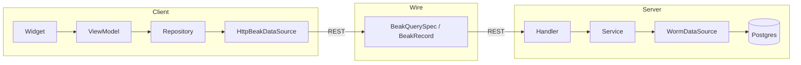

# Architecture deep dive

This section is for the reader who wants to know why Beak is shaped the way it is: where a change belongs, which package owns which idea, and how a request travels from a table cell to Postgres and back. If you only want to ship a panel, the [Core concepts](../concepts/index.md) section is enough. Stay here if you want to extend Beak, review it, or trust it.

Beak turns one model definition into a running admin panel. The same typed columns drive the table cell, the form input (with client-side validation that mirrors the server), the detail row, the filter, the REST validation, and the CSV export column. Everything below is in service of that one promise, and of keeping the seams clean enough that a second data backend could slot in without a rewrite.

## Read it in order, or jump

The pages build on each other, but each stands alone.

### The ideas

- [Principles](principles.md) the invariants every part of Beak obeys: define-once, no `dynamic`, source-agnostic data, no Material, exactly four layers per side, no lazy loading, and where the escape hatches live.
- [Package graph](package-graph.md) who depends on whom. `beak_core` sits at the base as pure Dart; only `beak_backend` imports the worm ORM; only `beak_frontend` imports obers_ui.

### The two flows

- [Backend flow](backend-flow.md) the `Handler -> Service -> DataSource` path, the error-mapping middleware that is the single catch boundary, and how the whole REST surface is generated from a registry.
- [Frontend flow](frontend-flow.md) the `Widget -> ViewModel -> Repository -> DataSource` path, why view models expose Signals and never `try/catch`, and how the repository turns thrown exceptions into `BeakResult` values.

### The seams

- [The query contract](query-contract.md) `BeakQuerySpec`, the serializable description of a query that the panel builds and the server executes.
- [The data source seam](data-source-seam.md) the `BeakDataSource` interface both sides implement, and why a future `beak_serverpod` can plug in without touching `beak_core`.
- [Block system internals](block-system-internals.md) how one block tree renders read-only in a record scope and editable in a form scope.
- [Storage internals](storage-internals.md) the pluggable driver registry, the shared upload validator, and the image transform pipeline.

### The history

- [How Beak was built](how-beak-was-built.md) the phased, test-first build and the ledger that tracked it.

## The shape in one picture

Two apps sit on top of Beak's packages. Both share a set of model definitions. One side renders them, the other serves them, and they speak a single serializable vocabulary in between.

The client half never imports Shelf or worm. The server half never imports obers_ui or Flutter. The box in the middle, the serializable spec, is the only thing that crosses the wire, and it is pure `beak_core`.

## Continue reading

- [Principles](principles.md) start with the invariants; everything else is a consequence of them.
- [The four layers](../concepts/the-four-layers.md) the same layering, told as a concept rather than an internals tour.
