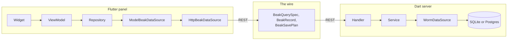

# Architecture

This section is for the reader who wants to know why Beak is shaped the way it is: where a change belongs, which package owns which idea, and how a request travels from a table cell to the database and back. If you only want to ship a panel, the [Core concepts](../concepts/index.md) section is enough. Stay here to extend Beak, review it, or decide whether to trust it.

Beak turns one annotated schema class into a running admin panel. `beak prepare` reads the class and writes the typed columns, the model, both sides of every relationship, the registry, the panel config and the server host. The same typed columns then drive the table cell, the form input with client validation that mirrors the server, the detail row, the filter, the REST validation, the migration and the CSV column. Everything below serves that one promise, and keeps the seams clean enough that a different data backend can plug in without a rewrite.

The pages are internals, so they are exact and a little dry, and each one stands alone. They do build on each other in the order below.

## The shape in one picture

A Beak project is one package with two entrypoints. `lib/main.dart` boots the panel, `bin/serve.dart` boots the server, and both reach the same models. The two halves never share a process. They share the model definitions and a serializable vocabulary in between.

The panel never imports Shelf or worm. The server never imports obers_ui or Flutter. What crosses the wire is a serializable spec and record, and both are pure `beak_core`, which you reach through `package:beak/beak.dart`.

That split is the reason the umbrella package has eight libraries. A model file imports `beak.dart` and `schema.dart` and nothing else, because `bin/serve.dart` reaches it through the generated registry, and a `dart:ui` import anywhere on that path would stop the server compiling. See [Libraries](../reference/libraries.md) for the eight import points.

## Which page to read

| You want to... | Read | For that |
| --- | --- | --- |
| Read the eight rules every part of Beak obeys, and what enforces each | [Principles](principles.md) | Concept for contributors and experts |
| See which package depends on which, and where worm, obers_ui and `dart:io` may appear | [Package graph](package-graph.md) | Concept for contributors and experts |
| Follow a request through Handler, Service and DataSource, and find the single error catch boundary | [Backend flow](backend-flow.md) | Concept for contributors and experts |
| Follow the Widget, ViewModel, Repository and DataSource path, and see where state lives | [Frontend flow](frontend-flow.md) | Concept for contributors and experts |
| See how a query spec is built, serialized, authorized and turned into a worm query | [The query contract](query-contract.md) | Concept for contributors and experts |
| See how a form save is planned, committed in one transaction and receipted, and how effects leave through the outbox | [Graph commits](graph-commits.md) | Concept for contributors and experts |
| See how `BeakDataSource` lets the panel, the server, tests and both Serverpod paths run the same operations | [The data source seam](data-source-seam.md) | Concept for contributors and experts |
| See how `beak prepare` reads schemas and writes parts, wiring and migrations, and which files stay yours | [Code generation](code-generation.md) | Concept for contributors |
| See how one sealed block union and one host render screens, list headers and overlays | [Block system internals](block-system-internals.md) | Concept for contributors and experts |
| See how a storage config resolves to a driver and how an upload is validated, transformed and stored | [Storage internals](storage-internals.md) | Concept for contributors and experts |

## Continue reading

- [Principles](principles.md) start with the rules. The other pages are consequences of them.
- [The four layers](../concepts/the-four-layers.md) the same layering, told as a concept and not as an internals tour.
- [Code guardrails](../contributing/code-guardrails.md) the checks that hold these rules in CI.
