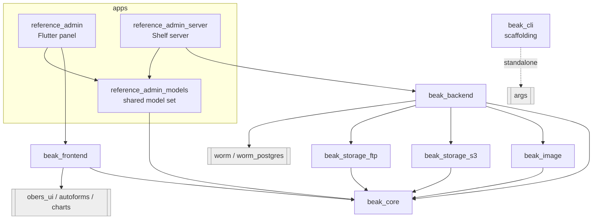

# Package graph

After this page you will know what each package is allowed to import, and therefore where a given piece of code has to live. The dependency edges are not incidental: they are how Beak keeps the ORM out of the frontend and the UI toolkit out of the backend.

Beak is a Melos monorepo. The framework is a handful of small packages under `packages/`, and the two demo apps under `apps/` sit on top of them. The whole design rests on one package at the base.

## The graph

Read it top to bottom: apps depend on framework packages, framework packages depend on `beak_core`, and only `beak_core` depends on nothing Beak-specific.

## What each package is

| Package | Runtime | Depends on (Beak) | Third-party of note |
| --- | --- | --- | --- |
| `beak_core` | pure Dart | nothing | `http`, `http_parser`, `meta` |
| `beak_backend` | Shelf server | `beak_core`, `beak_image`, `beak_storage_s3`, `beak_storage_ftp` | `worm`, `worm_postgres`, `shelf` |
| `beak_frontend` | Flutter | `beak_core` | `obers_ui`, `obers_ui_autoforms`, `obers_ui_charts`, `signals`, `get_it`, `go_router`, `flutter_hooks` |
| `beak_image` | pure Dart | `beak_core` | `image` |
| `beak_storage_s3` | pure Dart | `beak_core` | `minio` |
| `beak_storage_ftp` | pure Dart | `beak_core` | (sockets only) |
| `beak_cli` | Dart CLI | none | `args` |

## The three rules the graph enforces

### beak_core is pure Dart at the base

`beak_core` is the shared vocabulary both sides speak: columns, rules, relationships, the `BeakQuerySpec` query contract, the `BeakValue` family, the storage abstraction, `BeakDataSource`, and `BeakClient`. It depends on `http` (for the client) and `meta`, and on nothing else in Beak. It imports neither Flutter nor Shelf nor any database driver. Everything else in the graph points down at it.

Because it is pure and central, `beak_core` is the package with the strictest review bar. A type that leaks Flutter or worm into `beak_core` would poison every dependent, so it does not happen.

### Only beak_backend imports worm

The worm ORM (and its `worm_postgres` driver) appears in exactly one place: `beak_backend`. That is where `WormDataSource` translates a `BeakQuerySpec` into a worm predicate tree and runs it. No other package, and no app widget, ever sees a worm type. This is what lets a future data backend, for example a `beak_serverpod`, implement the same `BeakDataSource` interface without disturbing anything above or below.

### Only beak_frontend imports obers_ui

`beak_frontend` is the sole Flutter package in the framework, and the only one that imports `obers_ui`, `obers_ui_autoforms`, and `obers_ui_charts` (all path dependencies from the sibling `obers_ui` repo). It never imports `dart:io` or Shelf. The panel, table, form, detail view, actions, and dashboard all live here, built entirely on obers_ui widgets.

!!! note "beak_cli stands apart"
    The scaffolding CLI depends only on `args`. It emits models, columns, and migrations as generated text, so it has no need to link `beak_core` at all. That is why it hangs off the graph on its own.

## Where the apps fit

The two demo apps share one thing and split on everything else.

- `reference_admin` (the Flutter panel) depends on `beak_frontend` and on the shared `reference_admin_models`. It runs against a server on port 8080.
- `reference_admin_server` (the Shelf server) depends on `beak_backend` and on the same `reference_admin_models`. It serves that port.
- `reference_admin_models` depends only on `beak_core`, so the identical model definitions compile into both the client and the server.

That shared model package is the concrete payoff of the graph: one set of typed columns, imported unchanged by a Flutter app and a Dart server, because both sides bottom out at the same pure-Dart `beak_core`.

## Continue reading

- [The data source seam](data-source-seam.md) the interface that keeps worm on one side and obers_ui on the other.
- [Backend flow](backend-flow.md) what `beak_backend` does with `beak_core` types once a request lands.
- [Packages](../reference/packages.md) the public barrel of every package, member by member.
