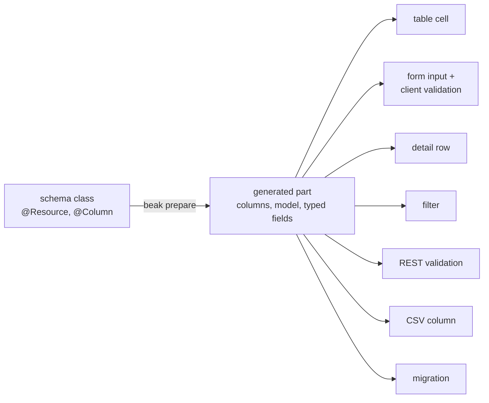

# Principles

Eight rules shape every API in Beak. They are not style preferences. Each one holds something else up, so a pull request is read against them before it is read for taste. After this page you know what the rules are, what enforces each, and which one to cite when a change feels wrong.

Beak is a configuration-driven admin-panel framework: you declare a resource once and get the panel, the API and the schema from it. The rules below are what keep that sentence true as the codebase grows.

## The idea in one picture

The first rule is the one the others serve. A schema class is written once, `beak prepare` turns it into typed references, and every surface reads those:



Change a label or a bound in the class and seven places move together, because there is one place.

## How it works

### 1. Define once, render everywhere

A resource is an annotated class. The field's Dart type picks the column kind, its nullability decides whether it is required, and `@Column` carries only what the type cannot say:

```dart title="examples/quickstart/lib/resources/notes/models/note.dart"
  @Display()
  @Column(searchable: true, sortable: true, rules: [BeakMaxLength(255)])
  late final String title;
```

`beak prepare` writes a part file beside it. Nobody wrote `BeakRequired()` below. `String` is non-nullable, so the form validator, the API's validation and the column's `NOT NULL` all follow from that fact, stated once.

```dart title="examples/quickstart/lib/resources/notes/models/note.beak.dart"
  static const BeakStringColumn title = BeakStringColumn(
    key: 'title',
    label: 'Title',
    rules: [BeakRequired(), BeakMaxLength(255)],
    searchable: true,
    sortable: true,
    maxLength: 255,
  );
```

The client validator and the server validator are the same `BeakRule` list, so a form never accepts what the API rejects. The part file is committed and starts with `DO NOT EDIT`. `beak doctor` fails when it has drifted from its class. [Code generation](code-generation.md) walks through how it is made.

### 2. No escape hatches in the type system

Users never write a string field reference and never touch `dynamic`. The code base holds the same line:

- No `dynamic`, except at an interop edge behind a `// interop:` comment.
- No `as` casts. Pattern matching and typed APIs do that job.
- No `Map<String, dynamic>` as a domain, presentation or public API type. Typed DTOs, sealed classes, generics and enums do.
- Known value sets are enums or sealed classes. A size carries its unit in the name (`maxSizeInBytes`, `widthInPixels`), and a duration is a `Duration`.

Values on the wire travel as the sealed `BeakValue` family, so an operand has a type on both ends. The analyzer runs with `strict-casts`, `strict-inference` and `strict-raw-types`, and `avoid_dynamic_calls` is on. The no-cast rule has no lint. It is held by review, and it is currently true: a search for casts and `dynamic` in `beak_core`, `beak_backend` and `beak_frontend` finds none outside comments.

If an API you add would force a user to write a field name as a string or to reach for `dynamic`, redesign the API. The hatches that exist are few and named: `BeakCustomColumn`, `BeakWidgetBlock`, `BeakFormWidget` and the raw `BeakClient`. They are for the last part Beak cannot express, not the front door.

### 3. Source-agnostic data

Every data operation goes through `BeakDataSource`, and that interface speaks only `beak_core` types. `WormDataSource` (server), `HttpBeakDataSource` (panel), `InMemoryBeakDataSource` (tests) and `ServerpodDataSource` (the Serverpod bridge) all implement it. The rule that makes it hold is an import rule: worm types stay in `beak_backend`, obers_ui types stay in `beak_frontend`. [The data source seam](data-source-seam.md) has the contract, and [Package graph](package-graph.md) has the edges.

### 4. UI is obers_ui, state is Signals

Beak's UI is `obers_ui`, `obers_ui_autoforms` and `obers_ui_charts`, and nothing else.

- `package:flutter/material.dart` and `cupertino.dart` are forbidden. `widgets.dart` and `foundation.dart` are allowed for core types only (`BuildContext`, `Widget`, `Key`, `EdgeInsets`).
- Widgets are `HookWidget`. `StatefulWidget` is forbidden.
- State is Signals, dependency injection is GetIt, routing is go_router.

App authors rarely touch any of this. They write a schema class and a `beak.yaml`, and Beak wires the widgets. Three guards make the rules more than a request, and all run inside `melos run analyze`:

```console
$ dart run tool/check_no_material.dart
Material-import guard passed (1250 Dart files scanned).
$ dart run tool/check_hook_widgets.dart
Hook-widget guard passed (no StatefulWidget or State).
$ dart run tool/check_web_safe.dart
Web-safety guard passed (12 panel entrypoints walked).
```

The first bans Material and Cupertino imports and the second bans `StatefulWidget`. The web guard exists because `dart:io` compiles on the web and throws at runtime, so nothing else would catch a server import in the panel. See [Package graph](package-graph.md).

### 5. Four layers, no fifth

| Side | Flow | Catch boundary |
| --- | --- | --- |
| Backend | `Handler (Shelf) -> Service -> DataSource` | the error-mapping middleware |
| Frontend | `Widget -> ViewModel -> Repository -> DataSource` | the repository |

On the backend, handlers authorize and parse, services hold logic and throw typed exceptions, data sources do raw I/O and let exceptions propagate, and one middleware maps the sealed `BeakException` family to HTTP. On the frontend, widgets render Signals and forward intent, view models expose `ReadonlySignal`s and never `try/catch`, and the repository returns `BeakResult<T>`, so a failure reaches a view model as a value.

There is no use-case layer between these. If you reach for one, the logic belongs in a service (backend) or the coordination in a view model (frontend). The generated files under `lib/beak/` are not a layer either. They hold declarations and delegations, no logic. [Backend flow](backend-flow.md) and [Frontend flow](frontend-flow.md) go layer by layer.

### 6. Authority lives on the server

The panel is a courtesy. `BeakPermissions` on a model hides buttons and inputs, and nothing more. What decides is on the server: a `BeakPolicy` per resource (`BeakPolicies` is the typed rule set, and denies whatever it does not list), row scopes, field policies and action policies, enforced in the handlers and the commit service, with row scopes folded into every query by the authorizer.

The same holds for logic. Model behavior and record rules run in the panel to give quick feedback and run again on the server, over the stored state plus the proposed writes. A form save is a graph commit, so it is atomic, idempotent and recoverable, and a rule that spans several records cannot be side-stepped by a script that calls the per-record routes, because those routes are closed for the tables that have rules. See [Graph commits](graph-commits.md) and [Where authority lives](../concepts/where-authority-lives.md).

### 7. No lazy loading

Beak never fetches behind your back. A field reference reads what the record already carries, and a relation you did not load reads as `null`. What a surface needs is declared on the query spec (`relationLoads`), and the data source resolves every load before it returns. That keeps request counts predictable and stops a table render from becoming an N+1 storm.

The generated pages do this on your behalf: a list table asks for every to-one relation of the model, in the same query as the page. One query for the page, not one per row. [The query contract](query-contract.md) covers the loads.

### 8. Reuse first, and overrides are presence-based

Search the repo before adding a widget, util, mapper or type, and extend it. `const` and `final` by default, small single-purpose units, a doc comment on every public symbol, no `print`.

The same shape governs a project's own overrides. Each is a file that exists or does not. Create `lib/panel.dart`, `lib/theme.dart`, `lib/auth.dart` or `lib/server.dart` with the expected top-level function and Beak uses it. Delete it and the default is back. The panel and server overrides receive Beak's default as an argument, so taking one part over does not mean restating the rest. Ownership of the entrypoints follows the same idea: a file with the generated header is Beak's, and one without it is yours.

## Why it is shaped this way

- The rules are cheap to check. Most of them are an import or a type. A reviewer, an analyzer or a script can see a violation without reading the whole change.
- They stack. Typed references (2) are what let one definition (1) feed every surface. A small, source-agnostic interface (3) is what lets the layers (5) be tested apart. Server authority (6) is affordable because the panel needs no logic of its own to be correct.
- Each removes a class of bug. A string field name cannot be misspelled, a Material widget cannot creep in, a lazy load cannot become a hidden query.

## What it means for you

- If you write a model, everything on the list above is done for you. Stay inside typed references and you get it for free.
- If you extend Beak, cite the rule a change bends. A change that needs a `dynamic`, a cast or a second definition is usually a change to the wrong layer.
- If you find a place where a rule is only a convention, tell someone. The no-cast rule is one, and it is honest to say so.

## Continue reading

- [Package graph](package-graph.md) how these rules show up as dependency edges between packages.
- [The one-definition promise](../concepts/the-one-definition-promise.md) the first rule, told at concept altitude with a worked example.
- [The type-safety promise](../concepts/the-type-safety-promise.md) the second rule from a user's point of view.
- [Libraries](../reference/libraries.md) rule four as an import table: which library a file may reach for.
