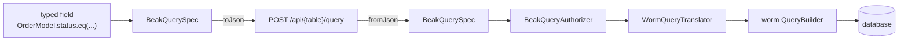

# The query contract

The panel and the server never share a process, so everything one asks the other about a list has to fit into one JSON object. That object is a `BeakQuerySpec`. After this page you can read one off the wire, say why a timestamp travels tagged while a string travels raw, and know which file to touch when a new operator or filter node is needed.

## The idea in one picture



The spec names tables and columns by key and nothing else, which is why it needs no ORM and no Flutter. It lives in `packages/beak_core/lib/src/query/`, so both halves decode it with the same code. The server-side steps are `packages/beak_backend/lib/src/auth/beak_query_authorizer.dart` and `packages/beak_backend/lib/src/data/worm/query_translator.dart`.

## How it works

### What a spec carries

A spec is an immutable value with seven fields. Application code never fills them by hand.

| Field | Type | Wire key | Meaning |
| --- | --- | --- | --- |
| `table` | `String` | `table` | Stored name of the queried model. The only key `fromJson` insists on. |
| `filter` | `BeakFilter?` | `filter` | The predicate a record has to satisfy. |
| `sorts` | `List<BeakSort>` | `sorts` | Ordering, applied in order. |
| `search` | `BeakSearch?` | `search` | A term and the column keys to look for it in. |
| `relationLoads` | `List<BeakRelationLoad>` | `relations` | Relations to load with the page. Beak never lazy-loads. |
| `pagination` | `BeakPagination` | `pagination` | 1-based `page` and `perPage`, defaults `1` and `25`. |
| `withTrashed` | `bool` | `withTrashed` | Whether soft-deleted rows are included. |

### Building one

A spec starts at its model (`const OrderModel().query(...)`) and grows through the copy-builders `withFilter`, `orderBy`, `withRelation`, `searching` and `paginate`. Each returns a new spec. The keys come from the generated field references, so a renamed column is a compile error and not a filter that quietly matches nothing.

A field reference reached through a relationship carries the relationship in its key. The test below reads a customer's name off an eagerly loaded order record, then shows what the same field turns into as a filter: a dotted key, `customer.name`.

```dart title="packages/beak_core/test/src/model/beak_field_ref_test.dart"
--8<-- "packages/beak_core/test/src/model/beak_field_ref_test.dart:nestedFieldWire"
```

`withFilter` does not nest. The first filter is taken as it is, and every later one joins one flat conjunction:

```dart title="packages/beak_core/lib/src/query/beak_query_spec.dart"
--8<-- "packages/beak_core/lib/src/query/beak_query_spec.dart:withFilter"
```

A status filter, a date filter and a search box therefore produce one `BeakAndFilter` with three children, not a right-leaning tower of them.

### On the wire

`toJson` writes every key, always. `fromJson` requires `table` and falls back to the constructor defaults for the rest, so `{"table": "products"}` is a valid request body for someone poking at the API with curl, while a spec that made the round trip is exactly the spec that left. The fixture below is the one Beak's golden test pins byte for byte:

```dart title="packages/beak_core/test/src/query/beak_query_spec_test.dart"
--8<-- "packages/beak_core/test/src/query/beak_query_spec_test.dart:richSpec"
```

It serializes to the body of a `POST /api/posts/query`:

```json title="packages/beak_core/test/golden/rich_query_spec.json"
--8<-- "packages/beak_core/test/golden/rich_query_spec.json"
```

The two `withFilter` calls became one `type: "and"` node. The string operand went out as a bare JSON string, the `DateTime` as a tagged object. That tag is the whole trick of the value layer.

### The value layer

An operand is a `BeakValue`, a sealed family, so both sides know its type without a `dynamic` anywhere. `BeakValue.of` wraps plain Dart into the matching variant and throws on anything else instead of serializing an untyped blob.

```dart title="packages/beak_core/lib/src/query/beak_value.dart"
--8<-- "packages/beak_core/lib/src/query/beak_value.dart:of"
```

| Variant | Dart `raw` | Wire JSON |
| --- | --- | --- |
| `BeakStringValue` | `String` | the string |
| `BeakIntValue` | `int` | the number |
| `BeakDoubleValue` | `double` | the number |
| `BeakBoolValue` | `bool` | the boolean |
| `BeakDateTimeValue` | `DateTime` | `{"type": "dateTime", "value": "<ISO-8601>"}` |
| `BeakNullValue` | `null` | `null` |
| `BeakListValue` | `List` | an array, elements encoded recursively |

Decoding reads the table backwards:

```dart title="packages/beak_core/lib/src/query/beak_value.dart"
--8<-- "packages/beak_core/lib/src/query/beak_value.dart:fromJson"
```

The `dateTime` tag is the only map-shaped value, so a string is never guessed to be a timestamp. `raw` unwraps a `BeakDateTimeValue` to a real `DateTime`, `toJson` produces the tagged object, and the translator reads `raw` while the wire carries `toJson`.

Money, calendar dates and durations have no variant of their own. A field with a semantic codec encodes them into these same primitives before they reach a filter (exact decimals become integer units), so the contract does not grow when a column kind is added.

### The filter tree

Predicates form a sealed tree. Each node tags itself with a `type` on the wire and `fromJson` switches on it:

```dart title="packages/beak_core/lib/src/query/beak_filter.dart"
--8<-- "packages/beak_core/lib/src/query/beak_filter.dart:fromJson"
```

| Node | `type` | Holds | Matches |
| --- | --- | --- | --- |
| `BeakFieldFilter` | `field` | a column key, a `BeakOperator`, a `BeakValue` | one column compared with one operand |
| `BeakAndFilter` | `and` | `filters` | every child |
| `BeakOrFilter` | `or` | `filters` | at least one child |
| `BeakRelationFilter` | `relation` | a relationship key and a child filter | one related record that satisfies the whole child |

`BeakRelationFilter` exists for a reason that is easy to miss. "An order with an item that is expensive and an item that is red" and "an order with one item that is expensive and red" are different questions. Grouping the child conditions makes the second one expressible, and the typed `matches` and `any` on relationship fields build it for you.

`BeakFieldFilter` has two constructors. The default one takes a `BeakColumn` and reads its key, so code never types a string. `.forKey` takes the raw key and exists for decoding and for the typed field references. Both are `const`, because a screen's base filter, a dashboard metric and a resource scope are all constant expressions.

```dart title="packages/beak_core/lib/src/query/beak_filter.dart"
--8<-- "packages/beak_core/lib/src/query/beak_filter.dart:fieldFilterConstructors"
```

### Operators

`BeakOperator` is Beak's own vocabulary and travels by `name`. Most operators map to the worm operator of the same name. The three substring operators have no worm counterpart and become `ilike` with a pattern built from the operand:

```dart title="packages/beak_backend/lib/src/data/worm/query_translator.dart"
--8<-- "packages/beak_backend/lib/src/data/worm/query_translator.dart:substringOperators"
```

| Operator | Operand | Becomes |
| --- | --- | --- |
| `eq`, `neq`, `gt`, `gte`, `lt`, `lte` | any scalar | the comparison of the same name |
| `like`, `ilike` | string | the raw pattern |
| `contains`, `startsWith`, `endsWith` | string | `ilike` with `%v%`, `v%`, `%v` |
| `isNull`, `isNotNull` | none | `IS NULL`, `IS NOT NULL` |
| `inList`, `notInList` | `BeakListValue` | list membership |
| `between`, `notBetween` | `BeakListValue` of exactly two | an inclusive range |

An operand of the wrong shape is a `BeakConfigurationException` from the translator. The translator's `switch` over `BeakOperator` is exhaustive, so an operator without a translation does not compile.

### On the server

Two steps sit between the decoded spec and the database.

The authorizer rewrites the spec before anything runs. It checks that the principal may view the table, that every sort, filter and search path names a real, readable field, and that every relationship it traverses is readable. It ANDs in the row scope of the model and of each related model, and it folds a search into the filter, so the spec the translator sees has no `search` left. A dotted key such as `customer.name` becomes a nested `BeakRelationFilter` with the related model's row scope inside it. An unknown field is a `BeakValidationException`, which is a 422.

```dart title="packages/beak_backend/lib/src/data/worm/query_translator.dart"
--8<-- "packages/beak_backend/lib/src/data/worm/query_translator.dart:builderFor"
```

`WormQueryTranslator.builderFor` is generic. It works from `BeakModel` metadata and the registry, so one code path serves every model and nothing per model exists. It starts from a projected select of the declared columns and foreign keys, never `SELECT *`, and applies the soft-delete scope unless `withTrashed` lifts it. Filters translate through an exhaustive switch over the sealed tree:

```dart title="packages/beak_backend/lib/src/data/worm/query_translator.dart"
--8<-- "packages/beak_backend/lib/src/data/worm/query_translator.dart:predicateFor"
```

Predicates on related records become correlated `EXISTS` subqueries, not joins. That is why an order with three matching items counts once, and why the total and the page agree. Relation loads become batched eager loads. `WormDataSource.query` then runs `count()` for the total and `get()` for the page.

```dart title="packages/beak_backend/lib/src/data/worm/worm_data_source.dart"
--8<-- "packages/beak_backend/lib/src/data/worm/worm_data_source.dart:query"
```

Search is typed by the field, not by the database. Text columns match with a case-insensitive contains. Numbers, booleans and timestamps match by typed equality, so a term that is not a number cannot match a number column and a `SQLite` implicit cast cannot make it match. A term that fits none of the chosen columns matches no rows.

## Why it is shaped this way

- Lossless. Every `toJson` writes every key, `fromJson` restores what the constructor would have defaulted, and the `dateTime` tag removes the one real ambiguity. A golden test pins the bytes.
- No `dynamic`. `BeakValue` is the place an untyped operand would have sneaked in. Operands are typed on both ends, so a filter cannot carry one past the type system.
- ORM-neutral. The spec speaks keys. `WormQueryTranslator` is the only code that knows worm, so a data source over something else consumes the same spec without touching it. See [The data source seam](data-source-seam.md).
- Authorization lives in one rewrite. Because the authorizer returns a spec, the translator and the data source stay ignorant of who is asking. A row policy cannot be forgotten by a new endpoint that already goes through `authorizeQuery`.

## What it means for you

- Build specs from the model and its generated fields. `BeakFieldFilter.forKey` is for decoders and adapters.
- Load what you render. A relation you did not put in `relationLoads` is not on the record, and reading it gives `null`.
- Sort on the model's own columns. `orderBy` throws for a field reached through a relationship. A hand-written spec that sorts on a dotted key passes the authorizer and then fails in the translator with a `BeakConfigurationException`, which the error middleware answers with a 500.
- Send timestamps as UTC. `BeakDateTimeValue.toJson` writes `toIso8601String()`, which gives a local `DateTime` no offset, and the server reads an offset-less value in its own zone.
- Expect the server to run what you ask for. `perPage` has no ceiling in the contract, so a page size of a million is a million rows.
- `contains`, `startsWith` and `endsWith` do not escape `%` and `_` in the operand. A user who searches for `50%` gets a wildcard.
- Relationship filters stop at 16 levels in the translator and at 64 in the authorizer. Nothing in a real screen comes close.

## Continue reading

- [The data source seam](data-source-seam.md) the interface that takes a spec on either side of the wire.
- [Backend flow](backend-flow.md) where the authorizer sits in a request and what the handler does before it.
- [How data flows](../concepts/how-data-flows.md) the same contract from the panel's point of view.
- [Queries](../reference/queries.md) the spec, filters and operators as a lookup table.
