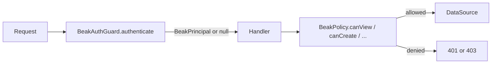

# Auth and policies

By the end of this page you can put a login endpoint in front of the generated
API, resolve the caller's identity on every request, and gate each model by
role. Auth in Beak comes in two halves that you wire independently:
**authentication** (who is this request) and **authorization** (may they do
this).

Beak ships open. With nothing configured, every request is anonymous and the
default [`BeakAllowAllPolicy`](#the-default-allow-everything) waves it through.
That is fine behind your own gateway or for a local demo. When you want Beak to
do the gating, you turn on the two halves below.

## The shape of it

Every request flows through the auth middleware first. The middleware asks a
`BeakAuthGuard` for the identity behind the request, stashes the resolved
`BeakPrincipal` in the request context, and then the handler consults a
`BeakPolicy` before it touches the data source.



The guard and the policy are separate seams on purpose. A guard that returns a
principal has said nothing about what that principal may do. That is the
policy's job.

## Authentication: the `/api/auth` surface

`BeakAuthSessions` describes a login surface: where sessions live, which
accounts may log in, and the secret their passwords were hashed under. Pass one
to `BeakServer`'s `authSessions` parameter and the generated API mounts
`POST /api/auth/login`, `POST /api/auth/logout`, and `GET /api/auth/me`.

```dart title="packages/beak_backend/lib/src/auth/auth_router.dart"
final class BeakAuthSessions {
  /// Creates the auth-surface configuration.
  const BeakAuthSessions({
    required this.store,
    required this.users,
    required this.secret,
  });

  /// Where sessions live.
  final TokenSessionStore store;

  /// The accounts that may log in.
  final List<BeakUserAccount> users;

  /// The secret behind [hashBeakPassword].
  final String secret;
}
```

Each account is a `BeakUserAccount`: a username, the hash of its password, and
the `BeakPrincipal` a successful login mints sessions for. Beak never stores a
plaintext password. You hash it once with `hashBeakPassword`, which is HMAC-SHA256
under your secret:

```dart title="packages/beak_backend/lib/src/auth/auth_router.dart"
String hashBeakPassword(String password, {required String secret}) =>
    Hmac(sha256, utf8.encode(secret)).convert(utf8.encode(password)).toString();
```

The same `secret` you gave `BeakAuthSessions` must have hashed every account's
password, because login recomputes the hash and compares. Keep it out of source
and load it from the environment. Putting the pieces together:

```dart
final auth = BeakAuthSessions(
  store: InMemoryTokenSessionStore(),
  secret: authSecret,
  users: [
    BeakUserAccount(
      username: 'admin',
      passwordHash: hashBeakPassword('s3cret', secret: authSecret),
      principal: const BeakPrincipal(id: 'admin', roles: {'admin'}),
    ),
  ],
);
```

!!! note "What just happened"
    - `authSecret` came from the environment, never the codebase.
    - The account stores an HMAC hash, so a database leak never yields the
      password.
    - The `principal` (id `admin`, role `admin`) is what a successful login
      hands back and what policies later decide on.

### The three routes

`login` verifies the credentials, mints an opaque token into the store, and
returns the token plus the principal. `logout` revokes the presented Bearer
token. `me` echoes the authenticated principal, or 401 when the request is
anonymous.

```dart title="packages/beak_backend/lib/src/auth/auth_router.dart"
Router beakAuthRouter(BeakAuthSessions sessions) {
  final handlers = BeakAuthHandlers(sessions);
  return Router()
    ..post('/login', handlers.login)
    ..post('/logout', handlers.logout)
    ..get('/me', handlers.me);
}
```

| Method and path | Body | Success | Does |
| --- | --- | --- | --- |
| `POST /api/auth/login` | `{"username": ..., "password": ...}` | `200 {"token", "principal"}` | mints a session token |
| `POST /api/auth/logout` | (`Authorization: Bearer <token>`) | `204` | revokes the presented token |
| `GET /api/auth/me` | (`Authorization: Bearer <token>`) | `200` principal | the authenticated principal |

A round trip against the reference store on port 8080, whose `lib/server.dart`
declares two accounts of its own:

```bash
curl -sX POST http://localhost:8080/api/auth/login \
  -H 'content-type: application/json' \
  -d '{"username":"ada@example.com","password":"espresso"}'
# {"token":"a1b2...","principal":{"id":"0000...0301","roles":["staff"]}}
```

The panel drives exactly these routes from its login screen. See
[Auth and idle-lock](../panel/auth-and-idle-lock.md) for the frontend half.

## Sessions: the token store

A login mints an opaque token into a `TokenSessionStore` and the guard reads it
back on every later request. The interface is three methods:

```dart title="packages/beak_backend/lib/src/auth/token_session_store.dart"
abstract interface class TokenSessionStore {
  /// Mints a new opaque token for [principal] and stores the session.
  Future<String> createSession(BeakPrincipal principal);

  /// The principal behind [token], or `null` when the token is unknown or
  /// the session expired.
  Future<BeakPrincipal?> sessionFor(String token);

  /// Invalidates [token]; unknown tokens are a no-op.
  Future<void> revoke(String token);
}
```

The default `InMemoryTokenSessionStore` keeps sessions in process memory with a
fixed time-to-live (12 hours by default). Each token is 256 bits of secure
randomness, and an expired session is evicted the next time it is looked up.

```dart
final store = InMemoryTokenSessionStore(sessionTtl: Duration(hours: 8));
```

!!! warning "In-memory means single-process"
    In-memory sessions vanish on restart and are not shared across instances.
    Fine for local development and tests. A production deployment behind more
    than one instance wants a shared, persistent `TokenSessionStore` (a table,
    Redis, whatever you already run). Implement the three-method interface and
    hand it to `BeakAuthSessions`.

## Resolving identity: the guard

A `BeakAuthGuard` turns a raw request into a `BeakPrincipal` (or `null`). Beak's
default guard is `TokenSessionAuthGuard`, which reads a `Bearer` token and looks
it up in the same store your sessions live in.

```dart title="packages/beak_backend/lib/src/auth/beak_auth_guard.dart"
@override
Future<BeakPrincipal?> authenticate(Request request) async {
  final String? header = request.headers['authorization'];
  if (header == null) {
    return null;
  }
  if (!header.startsWith(_bearerPrefix)) {
    throw const BeakAuthenticationException(
      'The authorization header must carry a Bearer token.',
    );
  }
  final principal = await store.sessionFor(
    header.substring(_bearerPrefix.length),
  );
  return principal ??
      (throw const BeakAuthenticationException(
        'The session token is invalid or expired.',
      ));
}
```

Notice the three outcomes. No header at all is anonymous (`null`). A malformed
header, or a token the store does not recognise, throws
`BeakAuthenticationException`. A forged or expired token never demotes quietly to
anonymous, it becomes a 401. That distinction is the whole point of the guard.

The guard runs inside `beakAuthMiddleware`, which the server installs for you.
Handlers and policies read the resolved principal back with `beakPrincipal`:

```dart title="packages/beak_backend/lib/src/server/middleware/auth_middleware.dart"
Middleware beakAuthMiddleware({BeakAuthGuard? guard}) =>
    (Handler inner) => (Request request) async {
      if (guard == null) {
        return inner(request);
      }
      final principal = await guard.authenticate(request);
      if (principal == null) {
        return inner(request);
      }
      return inner(request.change(context: {_principalContextKey: principal}));
    };
```

With no guard installed, every request stays anonymous. To plug in a different
scheme (a JWT, an API-gateway header), implement `BeakAuthGuard` yourself and
pass it to `BeakServer`'s `authGuard` parameter.

### The principal

`BeakPrincipal` is a stable id and a set of roles. It is the only thing a policy
sees.

```dart title="packages/beak_backend/lib/src/auth/beak_auth_guard.dart"
const BeakPrincipal({required this.id, this.roles = const {}});
```

```dart title="packages/beak_backend/lib/src/auth/beak_auth_guard.dart"
/// Whether the principal carries [role].
bool hasRole(String role) => roles.contains(role);
```

## Authorization: the policy

A `BeakPolicy` answers five yes-or-no questions, one per kind of action. Every
generated handler asks the relevant one before it acts, passing the resolved
principal (which may be `null`) and the target table.

```dart title="packages/beak_backend/lib/src/auth/beak_policy.dart"
abstract interface class BeakPolicy {
  /// Whether [principal] may read records of [table].
  bool canView(BeakPrincipal? principal, String table);

  /// Whether [principal] may create records of [table].
  bool canCreate(BeakPrincipal? principal, String table);

  /// Whether [principal] may update the record of [table] with [id].
  bool canUpdate(BeakPrincipal? principal, String table, Object id);

  /// Whether [principal] may delete the record of [table] with [id].
  bool canDelete(BeakPrincipal? principal, String table, Object id);

  /// Whether [principal] may delete the stored upload under [storageKey]
  /// held by [table]'s file column [columnKey].
  bool canDeleteUpload(
    BeakPrincipal? principal,
    String table,
    String columnKey,
    String storageKey,
  );
}
```

| Method | Fires on |
| --- | --- |
| `canView` | `POST /query`, `GET /<id>`, `GET /api/search`, `POST /export` |
| `canCreate` | `POST /` (create), `POST /<columnKey>/upload` |
| `canUpdate` | `PATCH /<id>`, relation `attach` and `detach` |
| `canDelete` | `DELETE /<id>` |
| `canDeleteUpload` | `DELETE /<columnKey>/upload` |

`canDeleteUpload` is its own hook for a reason: an upload is identified by its
storage key, not by a record id, so it must never flow through `canDelete`'s
record-id parameter. Deleting a file and deleting a row are different questions.

### The default: allow everything

Until you configure a real policy, Beak uses `BeakAllowAllPolicy`. Every method
returns `true`. It is a `base class`, not a `final` one, so your own policy can
extend it and override only the methods it restricts.

```dart title="packages/beak_backend/lib/src/auth/beak_policy.dart"
base class BeakAllowAllPolicy implements BeakPolicy {
  /// Creates the permissive default policy.
  const BeakAllowAllPolicy();

  @override
  bool canView(BeakPrincipal? principal, String table) => true;

  @override
  bool canCreate(BeakPrincipal? principal, String table) => true;
  // ... canUpdate, canDelete, canDeleteUpload all return true
}
```

### Writing your own

Implement the interface and lean on `principal.hasRole`. This one lets anyone
signed in read, and reserves writes for admins:

```dart
final class AdminOnlyWrites implements BeakPolicy {
  const AdminOnlyWrites();

  bool _isAdmin(BeakPrincipal? p) => p?.hasRole('admin') ?? false;

  @override
  bool canView(BeakPrincipal? principal, String table) => principal != null;

  @override
  bool canCreate(BeakPrincipal? principal, String table) =>
      _isAdmin(principal);

  @override
  bool canUpdate(BeakPrincipal? principal, String table, Object id) =>
      _isAdmin(principal);

  @override
  bool canDelete(BeakPrincipal? principal, String table, Object id) =>
      _isAdmin(principal);

  @override
  bool canDeleteUpload(
    BeakPrincipal? principal,
    String table,
    String columnKey,
    String storageKey,
  ) => _isAdmin(principal);
}
```

Because you get the `table` on every call, one policy can encode rules that
differ per model: pattern-match on `table` and return different answers for
`orders` than for `products`.

### Which rows, not just which tables

`canView` answers "may this principal read orders at all". It cannot answer "may
this principal read *these* orders", and a policy that means "a customer sees
only their own" is bypassed by `POST /api/orders/query` with any filter the
caller likes, because the filter comes from the client. `BeakRowPolicy` is the
answer: one extra method returning a filter.

```dart title="packages/beak_backend/lib/src/auth/beak_policy.dart"
abstract interface class BeakRowPolicy implements BeakPolicy {
  /// The filter every read and write of [table] is additionally constrained
  /// by, or `null` when [principal] may touch every row.
  BeakFilter? scopeFor(BeakPrincipal? principal, String table);
}
```

Implement it instead of `BeakPolicy` and every read and write of that table is
intersected with `scopeFor`: query, aggregate, get-one, update, delete, export
and global search alike, so there is no endpoint left to forget. Returning a
filter that matches nothing is how a policy says "no rows": the request succeeds
with an empty page, which is a different answer from `canView` returning false,
which is a 403. The worked example is in [Security](../guides/security.md).

### From decision to HTTP status

A policy returns a `bool`. `enforcePolicyDecision` turns a denial into the
correct typed exception, which the error-mapping middleware maps to a status.

```dart title="packages/beak_backend/lib/src/auth/beak_policy.dart"
void enforcePolicyDecision({
  required bool allowed,
  required BeakPrincipal? principal,
  required String action,
  required String table,
}) {
  if (allowed) {
    return;
  }
  if (principal == null) {
    throw BeakAuthenticationException('Sign in to $action "$table".');
  }
  throw BeakAuthorizationException(
    'Principal "${principal.id}" is not allowed to $action "$table".',
  );
}
```

The split matters: a denied **anonymous** request is a
`BeakAuthenticationException` (401, "you need to sign in"), while a denied
**authenticated** request is a `BeakAuthorizationException` (403, "you are
signed in, but not allowed"). A client can tell "log in" from "you cannot do
this" without guessing. See [Results and errors](../concepts/results-and-errors.md)
for the exception family and [Middleware](middleware.md) for the status mapping.

## Wiring it all together

Everything above meets at the `BeakServer` constructor. Hand it your sessions
config, your guard, and your policy:

```dart
final store = InMemoryTokenSessionStore();
final server = BeakServer(
  config: config,
  registry: registry,
  dataSource: WormDataSource(registry, adapter: adapter),
  authSessions: BeakAuthSessions(store: store, secret: authSecret, users: users),
  authGuard: TokenSessionAuthGuard(store),
  policy: const AdminOnlyWrites(),
);
```

The one thing to line up by hand: the `TokenSessionAuthGuard` and the
`BeakAuthSessions` must share the *same* `store`, because login mints into it
and the guard reads out of it.

Auth is something you opt into, and the two demo apps show both sides of that.
`examples/superdashboard` wires none of it and runs open on
`BeakAllowAllPolicy`. `examples/store` wires all of it in `lib/server.dart`: two
accounts hashed under `AUTH_SECRET`, a `TokenSessionAuthGuard` over the same
store, and a `StorePolicy` that is a row policy. See
[Running the server](running-the-server.md) for that file in full.

## Continue reading

- [The generated API](the-generated-api.md) the routes every policy method
  guards.
- [Middleware](middleware.md) where the auth guard runs and how typed
  exceptions become HTTP statuses.
- [Running the server](running-the-server.md) the `BeakServer` constructor and
  how it composes the pipeline.
- [Security](../guides/security.md) the wider threat model: storage keys, upload
  validation, and secrets.
- [Auth and idle-lock](../panel/auth-and-idle-lock.md) the panel side of the
  login flow.
