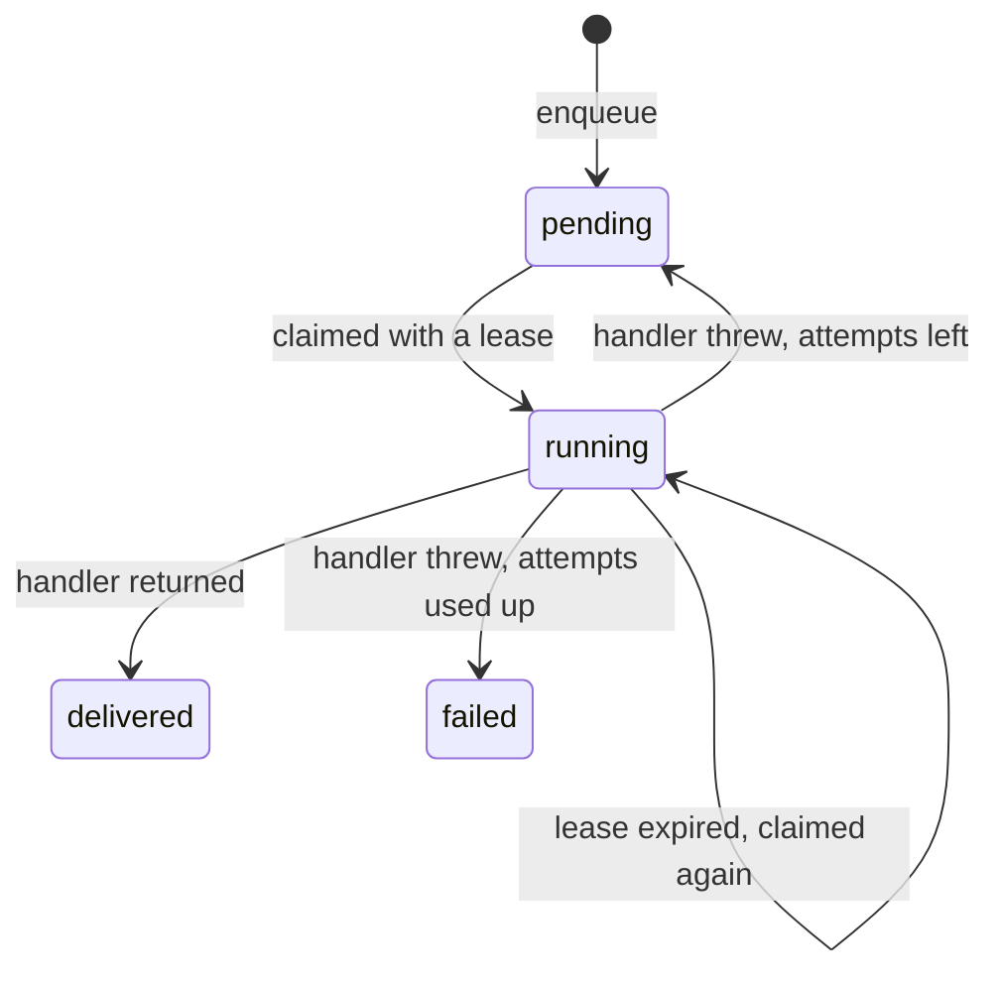

# Durable effects

A save that places an order may also have to charge a card and send a confirmation. After this page you can queue those effects inside the save's own transaction, deliver them after it commits, and write a handler that survives being called twice.

Doing the remote call inside the transaction holds a database connection on a network call and cannot be rolled back. Doing it after the response loses it when the process dies in between. Beak writes down the intention inside the transaction, as a row in `_beak_outbox`, and delivers it from a loop. The row exists if and only if the save committed. [Graph commits](../architecture/graph-commits.md#effects-the-finalizer-and-the-outbox) has the reasoning. This page is how you use it.

## At a glance

| Piece | Job | Runs |
| --- | --- | --- |
| `finalizePlan` | Reads the saved graph and calls `BeakOutbox.enqueue` | Inside the save's transaction, after validation, before the receipt |
| `BeakOutbox.enqueue` | Inserts one row: key, kind, payload | Same transaction, so a rolled-back save leaves no row |
| `BeakOutboxSchedule` | The handlers, the interval, the retry policy | In the server process, started by `serve()` |
| `BeakOutboxWorker.drain` | Claims due rows, calls the handler, records the outcome | Every `interval`, outside any transaction |
| A `BeakEffectHandler` | Makes the remote call | Once per attempt, and more than once per effect over its lifetime |

You wire the first three in `lib/server.dart`. Foodio's `beakServer` passes a preparer, a finalizer, a schedule and its `graphOnly` list:

```dart title="examples/foodio-adminpanel/lib/server.dart"
--8<-- "examples/foodio-adminpanel/lib/server.dart:foodioServer"
```

`BeakOutboxMigration` creates the table and is in every generated host's migration list. A project that upgrades to a Beak with the outbox runs `beak prepare` and then `beak migrate`.

## Enqueue inside the save

`finalizePlan` receives the prepared plan, the result (with the real ids of drafts), the transaction-bound data source and the principal. It reads what it needs from the saved records and queues. A finalizer that throws a `BeakException` rolls back the records and the queued rows together, and the receipt is a rejection.

Foodio writes every row the same way. The key is the save id plus the kind, so replaying the same save enqueues the same rows. The payload is a typed record, so no key is spelled as a string:

```dart title="examples/foodio-adminpanel/lib/domain/foodio_effects.dart"
--8<-- "examples/foodio-adminpanel/lib/domain/foodio_effects.dart:foodioQueueEffect"
```

Then the rules decide which effects a save earns. Placing an order queues a confirmation when the customer asked for one, and a payment request when payment is pending:

```dart title="examples/foodio-adminpanel/lib/domain/foodio_effects.dart"
--8<-- "examples/foodio-adminpanel/lib/domain/foodio_effects.dart:foodioQueueOnPlace"
```

What `BeakOutbox.enqueue` guarantees: a non-empty `key` and `kind`, and idempotence. Enqueueing the same key with the same content is a no-op. The same key with different content is a `BeakConflictException`, and inside a finalizer that rejects the save. Keep payloads small and put the facts the provider needs in them (an order id, an amount in cents, a recipient), never credentials and never callbacks.

A replay of a completed save returns its receipt and does not call the finalizer again. A finalizer requires transactional graph support.

## Deliver after the commit

`BeakOutboxSchedule` bundles the handlers with the retry policy, and `defaults.build(outbox: ...)` gives it to the server. `BeakServeHost.serve()` validates the schedule before it binds the port, starts the loop once the socket is bound, and stops it when the server closes, after the drain in flight finishes. Nothing else in the process needs a timer. Foodio's schedule drains every second and maps each effect kind to a provider:

```dart title="examples/foodio-adminpanel/lib/domain/foodio_effects.dart"
--8<-- "examples/foodio-adminpanel/lib/domain/foodio_effects.dart:foodioSchedule"
```

| Setting | Default | Meaning |
| --- | --- | --- |
| `interval` | 1 second | Pause between the start of one drain and the next |
| `drainLimit` | 100 (1 to 1000) | Most effects one drain attempts |
| `leaseDuration` | 2 minutes | How long a claimed row is off limits before another worker may take it |
| `retryDelay` | 10 seconds | Base delay after a failure, multiplied by the attempt number |
| `maxAttempts` | 8 | Failures before the row is marked `failed` |

Set these to the provider's real latency. A payment call that takes 30 seconds and a lease of 2 minutes is fine, one that can take 5 minutes is not.

A run against a scratch server with one healthy and one failing handler (`maxAttempts: 3`, `retryDelay: 2s`) shows the states a row passes through:

```console
$ sqlite3 beak.db "select id, status, attempt, last_error from _beak_outbox"
ok1:created|pending|0|
fail1:created|pending|0|
$ sleep 12; sqlite3 beak.db "select id, status, attempt, last_error from _beak_outbox"
ok1:created|delivered|1|
fail1:created|failed|3|providerFailure
```



The claim is a compare-and-set on the row, so two workers, or two server processes, never hold the same effect at once. The worker does not keep a database transaction open during the remote call. The stored error is a category and never the provider's message: `BeakException.code` for a typed exception, `providerFailure` for anything else, so a provider that puts a token in its error text does not put it in your table.

## Write a handler that survives a second delivery

Delivery is at least once. A process can die after the provider says yes and before the delivered mark commits, and a slow handler can outlive its lease while another worker claims the row. The effect's `key` is the same on every attempt, and the provider has to use it as its idempotency key. If the provider has none, keep your own receipt keyed by it.

Foodio's demo providers keep a receipt row per effect key, written in the same transaction as their other changes, and look it up first:

```dart title="examples/foodio-adminpanel/lib/domain/foodio_effects.dart"
--8<-- "examples/foodio-adminpanel/lib/domain/foodio_effects.dart:foodioDeliverOnce"
```

The same handlers also check that the effect is still wanted. A confirmation for an order that was cancelled before the worker got to it is recorded as `skipped` and sends nothing. Effects are queued by what was true at the save, and delivered later, so a handler that acts on stale intent is a bug waiting for a slow queue.

When a handler updates a timestamped record itself, use `beakRevisionTimestamp(now, previous: storedUpdatedAt)` for the new `updated_at`. It stays exact through a browser's millisecond view and always advances past the stored value, even under a frozen or corrected clock. Read, validate and write in one transaction, so a form that was open before the provider's result fails its revision check and reloads.

## Operate it

Nothing requeues a `failed` row, prunes a `delivered` one, or orders effects. Look at the queue with SQL:

```sql
select id, kind, status, attempt, last_error from _beak_outbox where status = 'failed';
```

To try a failed effect again after fixing the provider, put the row back into its initial state, and the next drain claims it as attempt 1:

```sql
update _beak_outbox set status = 'pending', attempt = 0, available_at = 0, lease = '', last_error = ''
where id = 'fail1:created';
```

A row that lacks a column the claim compares is corruption, because only `enqueue` writes the table. The drain marks it `failed` with `malformedRow`, delivers every other row, and then throws once, naming the rows it set aside.

## Test it

A test does not wait for a timer. It drives the worker itself: commit through the API, call `drain()`, and assert the outcome. `drain` returns the number of acknowledged deliveries, so a second call proves nothing is delivered twice:

```dart title="examples/foodio-adminpanel/test/foodio_api_test.dart"
--8<-- "examples/foodio-adminpanel/test/foodio_api_test.dart:foodioDrainOnce"
```

`FoodioEffects.worker(adapter)` is `schedule(adapter).worker(adapter, now: clock.read)`, so the test runs the same handlers as production on the demo clock. Do the same for your schedule: build the worker from it, and inject `now` to step through retries.

## Rules and limits

| Rule | Consequence |
| --- | --- |
| Delivery is at least once | The provider must treat `effect.key` as an idempotency key. A lease alone cannot make it exactly once |
| Effects have no order | Two effects of one save may run in either order, on different workers |
| Only `BeakServeHost.serve()` runs the loop | `buildServer` alone, a test, or an embedded host starts none. Call `server.outbox?.start(adapter, onError: ...)` yourself |
| The loop runs in the server's isolate | A handler that blocks the isolate slows the API. Drains never overlap on one worker |
| Nothing prunes or requeues | `delivered` and `failed` rows stay. Reset failed rows by hand, and delete old ones on your own schedule |
| A handler without a registered kind is a failure | `No outbox handler registered for "kind".` counts as an attempt, so a typo burns all attempts |
| Retry delay grows linearly | `retryDelay` times the attempt number: 10, 20, 30 seconds by default |
| The outbox table is fixed | `BeakOutbox` writes `_beak_outbox` by name. Under Serverpod only the receipts table maps onto the host, so the outbox does not work there |
| The payload is stored as JSON text | Keys are sorted first, so equal content compares equal and a re-enqueue with the same content is a no-op |
| `finalizePlan` needs a transactional `WormDataSource` | The same requirement as `preparePlan`, see [Transactional business rules](graph-business-rules.md) |

## Verify it

Commit a save that should queue an effect, look at the queue, wait one interval, and look again. The row goes from `pending` to `delivered`, and your provider's own record of the effect key exists exactly once:

```console
$ sqlite3 beak.db "select id, status, attempt from _beak_outbox"
ok1:created|pending|0
$ sleep 2; sqlite3 beak.db "select id, status, attempt from _beak_outbox"
ok1:created|delivered|1
```

Then send the same save again with the same `saveId`: the receipt comes back, no second row appears, and the provider is not called again. Kill the server between the commit and the first drain, restart it, and the row is delivered after the restart.

## Reference

- `packages/beak_backend/lib/src/service/beak_outbox.dart`: `BeakOutbox`, `BeakOutboxWorker`, `BeakOutboxSchedule`, `BeakOutboxLoop`, `BeakOutboxEffect`, `BeakOutboxMigration`.
- `packages/beak_backend/lib/src/service/beak_revision_timestamp.dart`: `beakRevisionTimestamp`.
- `packages/beak_backend/lib/src/server/beak_serve_host.dart`: where `serve()` starts and stops the loop.
- `examples/foodio-adminpanel/lib/domain/foodio_effects.dart`: the finalizer, the schedule and the demo providers in full.

## Continue reading

- [Transactional business rules](graph-business-rules.md) the preparer that decides what a save is before it queues anything.
- [Composed lists](../panel/composed-lists.md#refresh) how the panel picks up a record a provider changed, through a refresh policy.
- [Going to production](../shipping/going-to-production.md) running more than one server process against one outbox.
- [Graph commits](../architecture/graph-commits.md) receipts, replay and recovery around the finalizer.
