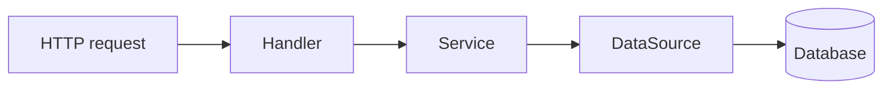

# The backend

After this page you will know what `beak_backend` does with your models: it takes a
registry, generates a REST surface for every model in it, and serves that surface
through a three-layer stack you never have to hand-wire.

The backend is the half of Beak that runs on a server. It is a Shelf app. You give it
a model registry and a data source, and it hands you back a running HTTP server with
CRUD, query, aggregate, batch, relation, search, export, and upload endpoints for
every model you registered. No controllers, no route tables, no request parsing of
your own.

## The one rule to remember

Registering a model is all it takes to get its API. There is no second step where you
declare routes. `beakApiRouter` walks the registry and mounts a full resource router
per model, so the surface is a pure function of what you registered.

```dart title="packages/beak_backend/lib/src/endpoints/beak_resource_router.dart"
for (final model in registry.all) {
  final service = BeakResourceService(
    model,
    dataSource,
    validation: validation,
    now: now,
    generateId: generateId,
  );
  final resourceRouter = beakResourceRouter(service, policy: policy);
  registerExportRoutes(
    resourceRouter,
    model: model,
    service: exportService,
    policy: policy,
  );
  if (uploads != null) {
    registerUploadRoutes(
      resourceRouter,
      model: model,
      service: uploads,
      policy: policy,
    );
  }
  router.mount('/api/${model.table}', resourceRouter.call);
}
```

!!! note "What just happened"
    - `registry.all` is every model you handed to the registry.
    - Each one gets a `BeakResourceService` (logic) and a `beakResourceRouter`
      (routes), mounted under `/api/{table}`.
    - Add a model to the registry, get `/api/{its_table}/...` for free. That is the
      whole deal.

## The three layers

Beak's backend flow is strict and one-directional: `Handler -> Service -> DataSource`.
Each layer has one job, and each one only talks to the layer directly below it.



| Layer | File | Job | Never does |
| --- | --- | --- | --- |
| Handler | `crud_handlers.dart` | Check the policy, parse the body into a typed record or spec, call the service, encode the result. | Business logic, validation, `try/catch` for its own errors. |
| Service | `beak_resource_service.dart` | Validate writes, mint uuid ids, stamp `created_at`/`updated_at`, gate relation kinds. Throws typed exceptions. | Touch HTTP, touch the database driver. |
| DataSource | `worm_data_source.dart` | Raw reads and writes. Lets exceptions propagate. | Know it is behind HTTP. |

The handlers stay parse-and-route thin on purpose. They consult the policy, turn the
request into a `BeakQuerySpec` or a `BeakRecord`, and hand it down. All the logic lives
in the service; all the error-to-HTTP mapping lives above, in the
[middleware](middleware.md).

## The catch boundary is a middleware, not a handler

You will not find a `try/catch` in a CRUD handler for its own errors. Handlers let
typed exceptions fly. The error-mapping middleware is the single place that catches
them and maps the sealed `BeakException` family to a status code and a JSON body. One
boundary, so every endpoint answers errors the same way. See
[Middleware](middleware.md) for the mapping table.

## worm stays behind the seam

The data source is an interface, `BeakDataSource`, defined over in `beak_core`. The
default backend implementation is `WormDataSource`, built on the worm ORM. Because the
handlers and services only ever see the interface, worm types never leak past
`beak_backend`. A future data source (a different ORM, a remote API) can slot in
without the handler or service layer noticing. That is
[the data source seam](the-data-source-seam.md).

## What is in this section

- [Running the server](running-the-server.md): config from the environment, connecting
  worm to Postgres, and the `main()` that boots the reference backend.
- [The generated API](the-generated-api.md): every route `beakApiRouter` and
  `beakResourceRouter` mount, per model.
- [Migrations](migrations.md): the explicit, registered schema changes worm applies.
- [Seeding](seeding.md): filling a fresh database with demo rows.
- [Auth and policies](auth-and-policies.md): the auth surface and the `BeakPolicy` gate
  every operation consults.
- [Search and export](search-and-export.md): the global search endpoint and CSV export.
- [Uploads and storage wiring](uploads-and-storage-wiring.md): file columns, the upload
  endpoints, and picking a storage driver.
- [The data source seam](the-data-source-seam.md): how `BeakDataSource` keeps worm
  isolated.
- [Middleware](middleware.md): the request pipeline and the single catch boundary.

## Continue reading

- [Running the server](running-the-server.md) boot the backend from a `main()`.
- [The generated API](the-generated-api.md) the routes you get per model.
- [The four layers](../concepts/the-four-layers.md) the same layering, from the
  concepts angle.
