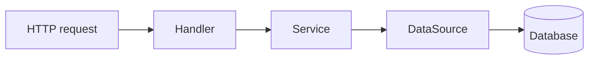

# The backend

The backend is the half of Beak that runs on a server. You give it a registry of models, and it hands back a running HTTP API for each of them: query, create, update, delete, relations, export and uploads, with validation, policies and transactions behind every route. This section covers running that server, giving it a database, and bending it to your rules.

You write no controllers, no route table and no request parsing. `beak prepare` writes the host that boots the server, and `lib/server.dart` is the one optional file where your policy, middleware and business rules go. Everything else on these pages is a decision about configuration, not code you have to author.

## The one rule

Registering a model is all it takes to get its API. In a project that means a schema class and a `beak prepare`, and there is no second step where you declare routes. `beakApiRouter` walks the registry and mounts one resource router per model under `/api/{table}`, so the surface is a pure function of what you registered:

```dart title="packages/beak_backend/lib/src/endpoints/beak_resource_router.dart"
--8<-- "packages/beak_backend/lib/src/endpoints/beak_resource_router.dart:beakResourceRouter"
```

Add a model and its routes exist. Remove it and they are gone. The same rule means there is no hand-written endpoint that can forget your row scope or your field policy, because there is no hand-written endpoint. [The generated API](../reference/rest-api.md) lists every route with its request, response and gate.

## What you get without writing anything

| Family | Routes | Where it is covered |
| --- | --- | --- |
| Records | Query, aggregate, summary, batch, get, create, update, delete, restore, attach and detach, per model | [The generated API](../reference/rest-api.md) |
| Graph saves | `POST /api/commits` and `GET /api/commits/{saveId}`: one atomic, idempotent, recoverable save for a whole form | [Transactional business rules](graph-business-rules.md) |
| Search and CSV | A `search` field on the query, and `POST /api/{table}/export` | [Search and export](search-and-export.md) |
| Uploads | `POST`, `GET` and `DELETE /api/{table}/{columnKey}/upload` for each file column | [Uploads and storage wiring](uploads-and-storage-wiring.md) |
| Sessions | `/api/auth/login`, `/logout` and `/me`, when you configure them | [Auth and policies](auth-and-policies.md) |
| Probes | `GET /healthz` and `GET /readyz`, outside `/api` | [Running the server](running-the-server.md) |

## Three layers, one catch

A request moves down one direction only: `Handler -> Service -> DataSource`. Each layer has one job and talks to the layer directly below it.



| Layer | Class | Job | Never does |
| --- | --- | --- | --- |
| Handler | `BeakCrudHandlers` | Check the policy, the field access and the row scope, parse the body into a typed record or spec, call the service, encode the result | Business logic, or a `try/catch` for its own errors |
| Service | `BeakResourceService` | Validate writes, mint ids, stamp `created_at` and `updated_at`, gate relation kinds. Throws typed exceptions | Touch HTTP or a database driver |
| DataSource | `WormDataSource` | Read and write the store, and let exceptions propagate | Know it sits behind HTTP |

The catch boundary is a middleware, not a handler. Everything below it throws, and one layer maps the sealed `BeakException` family to a status and a JSON body, so every endpoint answers errors the same way. [Middleware](middleware.md) has the pipeline and [Backend flow](../architecture/backend-flow.md) follows one request through it.

The data source is an interface, `BeakDataSource`, defined in `beak_core`. `WormDataSource` implements it over the worm ORM, and worm types never leak past `beak_backend`. That is [the data source seam](../architecture/data-source-seam.md). A different store implements the interface, with one limit: graph saves, preparers and the outbox need a `WormDataSource`, see [Transactional business rules](graph-business-rules.md).

## The defaults are open on purpose

A project that sets nothing runs on a SQLite file, keeps uploads on local disk, listens on `0.0.0.0:8080`, allows any origin, and lets every caller do everything. That is what makes the first `beak dev` show a working panel. Closing it is a short list, and each item has a page: a database that survives ([Databases](databases.md), [Migrations](migrations.md)), a policy ([Auth and policies](auth-and-policies.md)), and an origin ([Middleware](middleware.md)). [Security](../shipping/security.md) puts them in the order to do them.

## Which page to read

| You want to... | Read | For that |
| --- | --- | --- |
| Start the server, see what it resolves at boot, and change it in `lib/server.dart` | [Running the server](running-the-server.md) | The generated host, `defaults.build`, health probes, embedding the handler, testing the same host |
| Choose between a SQLite file and Postgres | [Databases](databases.md) | `DATABASE_URL`, what Beak does with the connection, the other worm drivers, adopting an existing database |
| Create tables and evolve them without losing data | [Migrations](migrations.md) | The migration Beak writes, `--from-drift`, hand-written upgrades, baselines, testing an upgrade |
| Fill a database with demo rows that survive a second run | [Seeding](seeding.md) | Seeders, `beak seed`, environments, repeat-safe patterns |
| Decide who may read, write, delete and run what | [Auth and policies](auth-and-policies.md) | Sessions and guards, `BeakPolicies`, row scopes, field rules, actions |
| Enforce a rule that spans several records | [Transactional business rules](graph-business-rules.md) | `preparePlan`, the candidate graph, rejecting with a field, closing the direct routes |
| Send a mail or charge a card because a save happened | [Durable effects](durable-effects.md) | `finalizePlan`, the outbox, handlers that survive a second delivery |
| Search across fields and relationships, or download CSV | [Search and export](search-and-export.md) | The `search` spec, what a term becomes, export formatting and its limits |
| Turn a file column into an upload endpoint and pick where the bytes go | [Uploads and storage wiring](uploads-and-storage-wiring.md) | The routes, the drivers, the variables, the failures |
| Read the pipeline around the router, or add a header, a switch or a rate limit | [Middleware](middleware.md) | The five layers, `middleware:` and `routes:`, recipes |

## Continue reading

- [Running the server](running-the-server.md) boot the backend and see what it resolved.
- [The generated API](../reference/rest-api.md) every route this section configures.
- [The four layers](../concepts/the-four-layers.md) the same layering from the concepts side.
- [Backend flow](../architecture/backend-flow.md) one request, socket to database and back.
