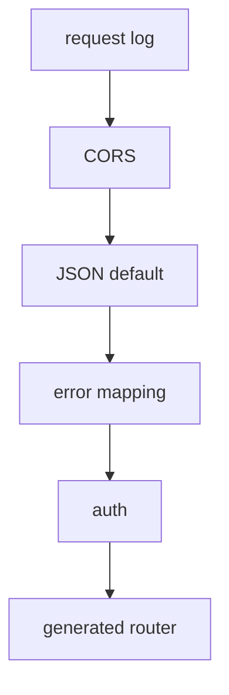

# Middleware

After this page you will know the five middlewares Beak wraps around every request, in
what order they run, and which one is the single place errors turn into HTTP responses.

`BeakServer` does not hand the router to Shelf raw. It wraps it in a fixed pipeline. Each
layer has one job, the order is deliberate, and one of them (error mapping) is the catch
boundary for the whole backend.

## The stack

The pipeline is built once, in `BeakServer.handler`. Middleware is added outermost
first, so a request falls through the list top to bottom on the way in and climbs back
out on the way to the response.

```dart title="packages/beak_backend/lib/src/server/beak_server.dart"
Handler get handler => const Pipeline()
    .addMiddleware(beakRequestLogMiddleware(onRequest: _onRequest))
    .addMiddleware(beakCorsMiddleware())
    .addMiddleware(beakJsonMiddleware())
    .addMiddleware(
      beakErrorMappingMiddleware(onUnexpectedError: _onUnexpectedError),
    )
    .addMiddleware(beakAuthMiddleware(guard: _authGuard))
    .addHandler(_router);
```



The order matters. Logging is outermost so it times and tags everything, including
errors. Error mapping sits below CORS and JSON so a mapped error response still gets a
content type and CORS headers on the way out. Auth is innermost so the router and its
policies see the resolved principal.

## Request log and request ids

The outermost middleware does two useful things at once. It tags every request with an
id (reusing an incoming `x-request-id` when present), and it reports the served request,
with timing, to a logger.

```dart title="packages/beak_backend/lib/src/server/middleware/request_log_middleware.dart"
Middleware beakRequestLogMiddleware({
  required BeakRequestLogger onRequest,
  BeakRequestIdFactory? requestIdFactory,
}) {
  final BeakRequestIdFactory nextRequestId =
      requestIdFactory ?? _randomRequestId;
  return (Handler inner) => (Request request) async {
    final stopwatch = Stopwatch()..start();
    final String requestId = request.headers['x-request-id'] ?? nextRequestId();
    final Response response = await inner(
      request.change(context: {_requestIdContextKey: requestId}),
    );
    stopwatch.stop();
    onRequest(
      BeakRequestLogEntry(/* ...requestId, method, path, statusCode, duration... */),
    );
    return response.change(headers: {'x-request-id': requestId});
  };
}
```

The id is stored in the request context (readable downstream with `beakRequestId`),
echoed back as the `x-request-id` response header, and, as you will see below, stamped
into error bodies. That gives you one string to grep for across the log line, the
response header, and the JSON error a client reports. `BeakServer` defaults the logger to
one line on stderr per request:

```text
[a3f9c1e28b04d7f6] POST /api/products/query -> 200 (12ms)
```

## CORS

`beakCorsMiddleware` adds the cross-origin headers to every response and short-circuits
`OPTIONS` preflight with `204 No Content`. It defaults to `access-control-allow-origin: *`;
pass `allowedOrigin` to pin it to your panel's origin.

```dart title="packages/beak_backend/lib/src/server/middleware/cors_middleware.dart"
Middleware beakCorsMiddleware({String allowedOrigin = '*'}) {
  final headers = <String, String>{
    'access-control-allow-origin': allowedOrigin,
    'access-control-allow-methods': 'GET, POST, PUT, PATCH, DELETE, OPTIONS',
    'access-control-allow-headers': 'authorization, content-type, x-request-id',
  };
  return (Handler inner) => (Request request) async {
    if (request.method == 'OPTIONS') {
      return Response(204, headers: headers);
    }
    final Response response = await inner(request);
    return response.change(headers: headers);
  };
}
```

## JSON defaulting

`beakJsonMiddleware` sets the response content type to JSON when a handler set none, and
leaves explicit content types alone. That is what lets CRUD handlers return
`jsonEncode(...)` without a header while the CSV export and file downloads keep their own.

```dart title="packages/beak_backend/lib/src/server/middleware/json_middleware.dart"
Middleware beakJsonMiddleware() =>
    (Handler inner) => (Request request) async {
      final Response response = await inner(request);
      if (response.headers.containsKey('content-type')) {
        return response;
      }
      return response.change(
        headers: {'content-type': 'application/json; charset=utf-8'},
      );
    };
```

The same file also carries `readJsonObject` and `readBeakSpec`, the request-side helpers
handlers use to decode a body. A body that is not valid JSON, or a spec that fails to
decode, becomes a `BeakValidationException` right there, which the next layer maps to a
`422`.

## Error mapping: the single catch boundary

This is the one that matters. It is the only place in the backend that catches. It maps
every `BeakException` to its status code and JSON body, and maps everything else to an
opaque `500` (reported to `onUnexpectedError`) so internals never leak to a client.

```dart title="packages/beak_backend/lib/src/server/middleware/error_mapping_middleware.dart"
Middleware beakErrorMappingMiddleware({
  BeakUnexpectedErrorListener? onUnexpectedError,
}) =>
    (Handler inner) => (Request request) async {
      try {
        return await inner(request);
      } on BeakException catch (exception) {
        return _exceptionResponse(exception, request);
      } catch (error, stackTrace) {
        onUnexpectedError?.call(error, stackTrace);
        return _jsonResponse(500, {
          'code': 'internal',
          'message': 'Internal server error.',
          ..._requestIdEntry(request),
        });
      }
    };
```

Because this boundary exists, handlers and services do not `try/catch` for their own
errors. They throw a typed exception and trust it to land here. The mapping is a plain
switch over the sealed exception family:

```dart title="packages/beak_backend/lib/src/server/middleware/error_mapping_middleware.dart"
final int statusCode = switch (exception) {
  BeakValidationException() => 422,
  BeakNotFoundException() => 404,
  BeakAuthenticationException() => 401,
  BeakAuthorizationException() => 403,
  BeakConflictException() => 409,
  BeakConfigurationException() => 500,
  BeakStorageException() => 500,
};
```

| Exception | Status | Typical cause |
| --- | --- | --- |
| `BeakValidationException` | `422` | Bad body, failed rule, malformed spec. Carries `fieldErrors`. |
| `BeakNotFoundException` | `404` | No record for that id or table. |
| `BeakAuthenticationException` | `401` | Missing or invalid credentials. |
| `BeakAuthorizationException` | `403` | Authenticated, but the policy said no. |
| `BeakConflictException` | `409` | Unique-constraint or state conflict. |
| `BeakConfigurationException` | `500` | Server misconfigured (an internal fault, not the client's). |
| `BeakStorageException` | `500` | Storage driver failure. |

Every error body carries `code`, `message`, the `requestId` when logging is on, and
`fieldErrors` on a validation failure. That shape is the mirror image of what the
frontend's `BeakClient` decodes back into typed exceptions, so a `422` on the server
becomes a `BeakValidationException` in the panel. The full family is in the
[Exceptions reference](../reference/exceptions.md).

## Auth: resolve the principal

The innermost middleware runs a `BeakAuthGuard` to resolve the request's identity and
stores it in the request context, where handlers and policies read it with
`beakPrincipal`. Without a guard, every request stays anonymous.

```dart title="packages/beak_backend/lib/src/server/middleware/auth_middleware.dart"
Middleware beakAuthMiddleware({BeakAuthGuard? guard}) =>
    (Handler inner) => (Request request) async {
      if (guard == null) {
        return inner(request);
      }
      final principal = await guard.authenticate(request);
      if (principal == null) {
        return inner(request);
      }
      return inner(request.change(context: {_principalContextKey: principal}));
    };
```

Invalid credentials throw inside the guard, and because this sits below error mapping,
that throw is caught and mapped to a `401`. The resolved principal is exactly what the
CRUD handlers pass to the policy on every operation. How to wire a guard and write a
policy is in [Auth and policies](auth-and-policies.md).

## Continue reading

- [The generated API](the-generated-api.md) the router this pipeline wraps.
- [Auth and policies](auth-and-policies.md) the guard and policy the auth layer feeds.
- [Exceptions reference](../reference/exceptions.md) the sealed family the error mapper
  switches on.
- [Results and errors](../concepts/results-and-errors.md) the same exceptions, on the
  frontend side.
