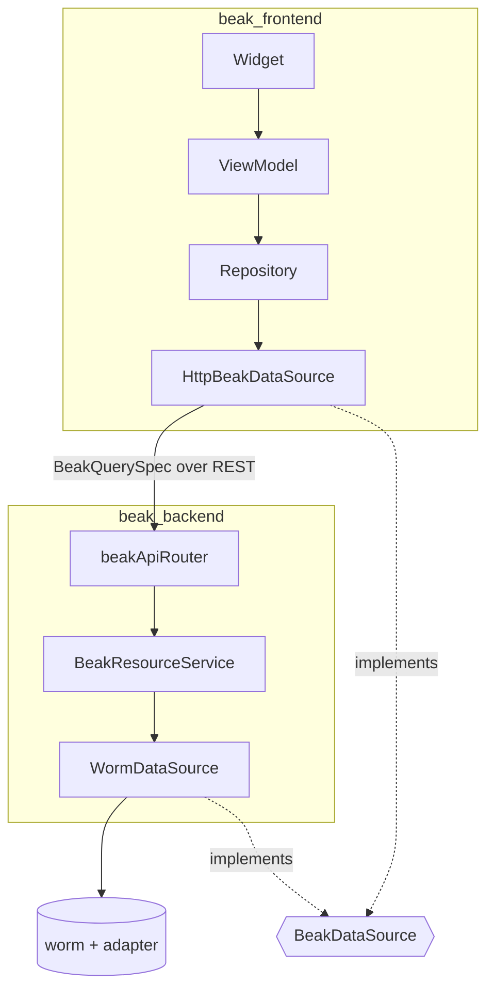

# The data source seam

Every read and write in Beak passes through one interface, `BeakDataSource`. After this page you understand the seam: the interface both sides of Beak speak, the `WormDataSource` that implements it over the worm ORM, and why a future `ServerpodDataSource` can slot in without a line changing in `beak_core` or `beak_backend`.

Beak's promise is that your schema classes, columns, and queries describe *what* you want, never *which database* answers. The seam is what makes that true. Above it, handlers and services speak a source-agnostic vocabulary of typed records. Below it, one implementation translates that vocabulary to a real store. Swap the implementation and everything above it keeps working.

## The interface

`BeakDataSource` lives in `beak_core`, the pure-Dart package with no Flutter and no worm. It is ten methods:

```dart title="packages/beak_core/lib/src/data/beak_data_source.dart"
--8<-- "packages/beak_core/lib/src/data/beak_data_source.dart:BeakDataSource"
```

Notice what the signatures speak in: `BeakQuerySpec`, `BeakRecord`, `BeakPage`, `BeakAggregateSpec`, all from `beak_core`. There is no ORM type, no SQL, no table class. A table is a `String`, an id is an `Object`, a row is a typed `BeakRecord`. That is the whole vocabulary of the seam.

| Method | Purpose |
| --- | --- |
| `query` | A filtered, sorted, paginated page with eager relation loads |
| `getOne` | A single record by primary key |
| `create` / `update` / `delete` | The write path (`delete` honors soft deletes) |
| `restore` | Clear a soft-delete marker, reaching past the soft-delete scope |
| `batchGet` | Many records by id in one query (reference de-duplication) |
| `attach` / `detach` | Wire up a to-many relation |
| `aggregate` | A `count`, `sum`, or `avg` for a KPI or chart |

Implementations throw the sealed [`BeakException`](../concepts/results-and-errors.md) family (`BeakNotFoundException` for a missing record, `BeakConfigurationException` for an unknown table or relation) and never leak the errors of whatever store sits underneath.

## The two implementations that ship

The same interface is implemented on both sides of the wire, which is why the query you build in a widget is the query the server runs.



On the panel side, `HttpBeakDataSource` implements `BeakDataSource` by delegating every call to `BeakClient`, the typed REST transport in `beak_core`. On the server side, `WormDataSource` implements it by translating each call to the worm ORM. The frontend's repository is the catch boundary; the backend's middleware is. Both stand on the same ten methods.

```dart title="packages/beak_frontend/lib/src/data/http_beak_data_source.dart"
final class HttpBeakDataSource implements BeakDataSource, BeakUploadClient {
  /// Creates a data source over [client].
  const HttpBeakDataSource(this.client);

  /// The transport the source delegates to.
  final BeakClient client;

  @override
  Future<BeakPage<BeakRecord>> query(BeakQuerySpec spec) =>
      client.query(spec.table, spec);
```

## WormDataSource: the default over worm

`WormDataSource` is the implementation Beak ships, and the one the generated `BeakServeHost` wires up for you. It is generic: it works entirely off the model registry, so one instance serves every registered table with no per-model code.

```dart title="packages/beak_backend/lib/src/data/worm/worm_data_source.dart"
final class WormDataSource implements BeakDataSource {
  WormDataSource(
    this.registry, {
    required DatabaseAdapter adapter,
    DateTime Function()? now,
  }) : _adapter = adapter,
       _now = now ?? DateTime.now,
       _translator = WormQueryTranslator(registry);

  /// The models this data source serves.
  final BeakModelRegistry registry;

  final DatabaseAdapter _adapter;
  final DateTime Function() _now;
  final WormQueryTranslator _translator;
```

You hand it any worm `DatabaseAdapter`: an `InMemoryAdapter` in tests, a SQLite or Postgres adapter in production. The `now` hook stamps soft-delete markers and is overridable for deterministic tests. A read turns a spec into a builder and hydrated rows into records:

```dart title="packages/beak_backend/lib/src/data/worm/worm_data_source.dart"
  @override
  Future<BeakPage<BeakRecord>> query(BeakQuerySpec spec) async {
    final BeakModel beakModel = registry.byTableOrThrow(spec.table);
    final builder = _translator.builderFor(spec, _adapter);
    final int total = await builder.count();
    final rows = await builder.get();
    return BeakPage(
      items: [
        for (final row in rows)
          row.toBeakRecord(
            loads: spec.relationLoads,
            model: beakModel,
            registry: registry,
          ),
      ],
      total: total,
      page: spec.pagination.page,
      perPage: spec.pagination.perPage,
    );
  }
```

The model goes into the conversion on purpose. Without it, a SQLite row arrives with `1` where the schema declares a flag and a string where it declares an instant, because the driver decides the Dart type. The registry does the same job for related records, which belong to other models. A `BeakRecord` therefore reads the same whichever database answered.

Everything below is machinery that lives inside `beak_backend`. It is the only Beak package that runs a query through worm, and none of these worm types cross back out.

### The translator

`WormQueryTranslator` turns Beak's serializable query language into worm query builders, entirely from model metadata:

```dart title="packages/beak_backend/lib/src/data/worm/query_translator.dart"
/// Translates Beak's serializable query language into worm query builders.
///
/// The translator is fully generic: it works off [BeakModel] metadata and
/// the registry alone, so a single code path serves every registered model.
/// Filters become predicate trees, searches become case-insensitive OR
/// groups, relation loads become batched eager-load paths, and soft-deleting
/// models are scoped with worm's [SoftDeleteScope] (lifted by
/// `withTrashed`).
final class WormQueryTranslator {
  /// Creates a translator resolving tables through [registry].
  const WormQueryTranslator(this.registry);
```

A [`BeakFilter`](../concepts/how-data-flows.md) becomes a worm `PredicateTree`, a `BeakSearch` becomes an `ilike` OR group, and a `BeakRelationLoad` becomes an eager-load path (Beak never lazy-loads, so a load must be asked for up front). One code path covers every model.

### The generic record model

Beak models are metadata only, so there is no generated worm class per table. Every row hydrates into one runtime-configured worm model:

```dart title="packages/beak_backend/lib/src/data/worm/worm_record_model.dart"
final class WormRecordModel extends Model {
  /// Hydrates a [row] of [table] (keyed by [primaryKeyColumn]).
  WormRecordModel.fromRow(
    this._table,
    this._primaryKeyColumn,
    Map<String, Object?> row,
  ) : _columnNames = List.unmodifiable(row.keys) {
    row.forEach(hydrateAttribute);
    markPersisted();
  }
  // ...
  @override
  String get tableName => _table;
  // ...the other Model overrides: primaryKeyColumn, id, toRow...

  /// This row as a typed [BeakRecord], converting the relations loaded for
  /// [loads] recursively (a requested-but-unloaded relation throws, honoring
  /// Beak's no-lazy-loading rule).
  BeakRecord toBeakRecord({
    List<BeakRelationLoad> loads = const [],
    BeakModel? model,
    BeakModelRegistry? registry,
  }) => BeakRecord(
    values: {
      for (final name in _columnNames)
        name: beakValueForColumn(model?.columnByKey(name), getAttribute(name)),
    },
    relations: {
      for (final load in loads)
        load.relationKey: _relatedRecords(load, model, registry),
    },
  );
  // ..._relatedRecords, which converts each eager-loaded child...
}
```

`toBeakRecord` is where worm's world ends: attributes become typed `BeakValue`s through the column that declared them, eager-loaded relations convert recursively, and a relation you did not load throws rather than firing a lazy query. What comes out is a `beak_core` `BeakRecord`, nothing worm-shaped.

### Column and connection helpers

Two more pieces round out the layer. `wormFieldForColumn` maps a `BeakColumn` to the right worm `Field` so filters and sorts are typed correctly:

```dart title="packages/beak_backend/lib/src/data/worm/column_type_mapper.dart"
--8<-- "packages/beak_backend/lib/src/data/worm/column_type_mapper.dart:wormFieldForColumn"
```

And `worm_bootstrap.dart` maps a `DATABASE_URL` to a connection. `adapterFromUrl` is the single place a URL scheme becomes a driver, so the server, the migration CLI and a test cannot disagree about what `DATABASE_URL` means:

```dart title="packages/beak_backend/lib/src/data/worm/worm_bootstrap.dart"
--8<-- "packages/beak_backend/lib/src/data/worm/worm_bootstrap.dart:adapterFromUrl"
```

`initializeWormPostgres(config)` registers the default adapter once at startup; pair it with `Worm.reset()` on shutdown. Both are covered from the boot angle in [Running the server](running-the-server.md).

## Where the seam is wired

You do not construct `WormDataSource` yourself either. `BeakServeHost.buildServer` does it, and hands the result to your `lib/server.dart` as one of the resolved defaults:

```dart title="packages/beak_backend/lib/src/server/beak_serve_host.dart"
    final defaults = BeakServerDefaults(
      config: config,
      registry: registry,
      dataSource: WormDataSource(registry, adapter: adapter, now: _now),
      environment: _environment,
      storage: storage,
    );
    return configure?.call(defaults) ?? defaults.build();
```

That is also where a different implementation would go in. `BeakServerDefaults.dataSource` is typed as `BeakDataSource`, so a project holding its own implementation can build a `BeakServer` around it directly instead of calling `defaults.build()`. See [Custom data sources](../extending/custom-data-sources.md).

## Why the seam holds

The rule is one line in the class doc, and the whole package layout enforces it:

> This is the concrete implementation Beak ships; a future `ServerpodDataSource` would satisfy the same `BeakDataSource` interface without touching `beak_core` or `beak_backend`.

`beak_core` declares the interface and the wire types (`BeakRecord`, `BeakQuerySpec`, `BeakValue`) and imports neither worm nor Flutter. `beak_backend` is the only package that reads or writes through worm, and it keeps worm behind `WormDataSource`: the translator, the record model, and the field mapper are all internal. A handler or service is typed against `BeakDataSource`, so it cannot reach a worm type even by accident.

One package does re-export worm on purpose: `package:beak/migrations.dart` hands you worm's `Migration`, `Schema` and `Seeder` so you can write the schema and the demo data (see [Seeding](seeding.md)). That is the schema DSL, not the read path. Nothing on the query side of the seam speaks worm.

That is what leaves room for another store. A `beak_serverpod` package could ship a `ServerpodDataSource implements BeakDataSource`, wire it into `BeakServer` in place of `WormDataSource`, and every column, query, filter, block, and CSV export above it would keep working unchanged. The seam is a single interface, and the whole framework is built to depend on it and nothing below.

## Continue reading

- [Custom data sources](../extending/custom-data-sources.md) implement `BeakDataSource` yourself.
- [How data flows](../concepts/how-data-flows.md) the serializable query spec that crosses the seam.
- [The generated API](the-generated-api.md) the routes that call the data source on the server.
- [Running the server](running-the-server.md) the host that wires the adapter and data source at boot.
