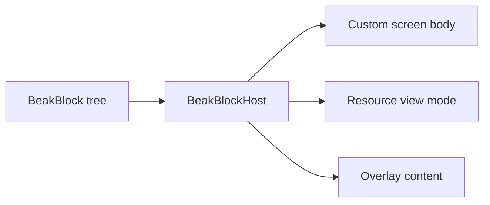

# Blocks

After this page you can read a `BeakBlock` tree, know where blocks show up in a
panel, size them on a grid with `BeakSpan`, and pick the right category page for
the block you need.

A block is a piece of screen described as data. You never write widget code for
a custom page: you compose `const BeakBlock` values, hand the tree to
`BeakBlockHost`, and Beak renders it onto obers_ui. One sealed union, one
renderer, everything type-checked.

## One block, three mouths to feed

The same block descriptors drive three surfaces. A custom screen's body, a
resource's alternate view mode, and an overlay's content are all block
trees handed to the same host.

```dart title="packages/beak_frontend/lib/src/blocks/beak_block.dart"
/// One sealed union drives three consumers with the same descriptors: a
/// custom page's body, a resource's alternate view mode, and an overlay's
/// content. `BeakBlockHost` renders the union exhaustively onto obers_ui
/// widgets, so a new block type is a compile error until every renderer
/// handles it.
```

Here is a small tree. It stacks a heading over a two-up grid of cards, and each
card claims half of a twelve-track grid with its `span`:

```dart title="packages/beak_frontend/lib/src/blocks/beak_block.dart"
const body = BeakColumnBlock(
  children: [
    BeakTextBlock('Welcome back', variant: BeakTextVariant.h1),
    BeakGridBlock(
      columns: 12,
      children: [
        BeakCardBlock(
          span: BeakSpan(columns: 6),
          child: BeakTextBlock('Half width'),
        ),
        BeakCardBlock(
          span: BeakSpan(columns: 6),
          child: BeakTextBlock('Other half'),
        ),
      ],
    ),
  ],
);
```

!!! note "What just happened"
    - `BeakColumnBlock`, `BeakTextBlock`, `BeakGridBlock`, and `BeakCardBlock`
      are all `const`. No widgets, no callbacks, no state.
    - The tree is pure configuration. Nothing has been rendered yet.
    - You would hand `body` to a [custom screen](../panel/custom-screens.md), a
      view mode, or an overlay to see it on screen.

## The renderer

`BeakBlockHost` is the one widget that turns a block tree into obers_ui widgets.
It is a plain `StatelessWidget` that switches over the sealed family.

```dart title="packages/beak_frontend/lib/src/blocks/beak_block_host.dart"
class BeakBlockHost extends StatelessWidget {
  /// Creates a host rendering [block].
  const BeakBlockHost({required this.block, super.key});

  /// The block tree to render.
  final BeakBlock block;

  @override
  Widget build(BuildContext context) => switch (block) {
    final BeakColumnBlock column => _column(context, column),
    final BeakRowBlock row => _row(context, row),
    final BeakGridBlock grid => _grid(context, grid),
    final BeakCardBlock card => _card(card),
    // ... one arm per block type, exhaustively.
  };
}
```

The switch is exhaustive. Because `BeakBlock` is `sealed`, adding a new block
type without teaching the host to render it is a compile error, not a runtime
surprise. You rarely construct `BeakBlockHost` yourself: the panel wraps your
screen body, view mode, and overlay content in one for you. You reach for it
directly only when [embedding a block in a hand-written widget](../extending/using-beak-widgets-standalone.md).

## Grid spans

Every block carries an optional `span`. It is read only when the block is a
direct child of a `BeakGridBlock`, and ignored everywhere else.

```dart title="packages/beak_frontend/lib/src/blocks/beak_block.dart"
@immutable
sealed class BeakBlock {
  /// Creates a block, optionally sized by [span] inside grid parents.
  const BeakBlock({this.span});

  /// How many grid tracks this block occupies when it is a direct child
  /// of a [BeakGridBlock]; ignored elsewhere.
  final BeakSpan? span;
}

/// Grid placement of a block inside a [BeakGridBlock].
@immutable
final class BeakSpan {
  /// Creates a span covering [columns] × [rows] grid tracks.
  const BeakSpan({this.columns = 1, this.rows = 1})
    : assert(columns >= 1, 'columns must be >= 1'),
      assert(rows >= 1, 'rows must be >= 1');

  /// Number of grid columns covered.
  final int columns;

  /// Number of grid rows covered.
  final int rows;
}
```

A `BeakSpan(columns: 6)` on a card inside a twelve-column grid takes half the
row. Grids and spans are covered in full on the [layout blocks](layout-blocks.md)
page.

## The two record scopes

Most blocks render the same way wherever you put them. Three of them do not: the
record-bound blocks (`BeakFieldBlock`, `BeakFieldGroupBlock`,
`BeakRelationBlock`) read their surrounding scope and change shape.

- Inside a **`BeakRecordScope`** (a resource's detail view) they render the
  record's values read-only.
- Inside a **`BeakFormScope`** (a resource's form) they render editable inputs
  wired to the form controller.
- Outside both scopes they render nothing.

One layout, two surfaces. That dual-mode behaviour is the whole point of
[record blocks](record-blocks.md), and it powers
[detail views](../panel/detail-and-dual-mode.md).

## The categories

Blocks fall into six families plus one escape hatch. Each has its own page.

| Category | Blocks | Page |
| --- | --- | --- |
| Layout | column, row, grid, card, section, tabs, accordion, breadcrumbs, masonry, three-pane, carousel, divider, spacer, timeline | [Layout blocks](layout-blocks.md) |
| Display | text, markdown, image, video, icon-gallery | [Display blocks](display-blocks.md) |
| UI kit | alert, badge, progress, rating, radial-slider | [UI-kit blocks](ui-kit-blocks.md) |
| Data-bound | kpi, metric, chart, table, calendar, kanban, map | [Data blocks](data-blocks.md) |
| Record-bound | field, field-group, relation | [Record blocks](record-blocks.md) |
| Module | chat, inbox, file-manager, invoice, profile, pricing, faq, wizard, gallery | [Module blocks](module-blocks.md) |
| Escape hatch | widget | [The widget escape hatch](the-widget-escape-hatch.md) |

A few blocks blur the lines. `BeakCarouselBlock` and `BeakTimelineBlock` are
data-bound (they take a `BeakQuerySpec`) but live with layout because that is how
you place them. When in doubt, the block's own page shows the exact constructor.

## Where blocks are used



- **Custom screens.** A `BeakScreen`'s `body` is a block. See
  [custom screens](../panel/custom-screens.md).
- **Dashboards.** A dashboard is a block tree of KPIs, charts, and tables. See
  [dashboards](../panel/dashboards.md).
- **Detail and form layouts.** A resource's `detail` and `formLayout` are block
  trees of record blocks. See
  [detail and dual-mode blocks](../panel/detail-and-dual-mode.md).

## Continue reading

- [Layout blocks](layout-blocks.md) columns, grids, cards, tabs, and the rest of
  the structural family.
- [Record blocks](record-blocks.md) the dual-mode field and relation blocks that
  read their scope.
- [The block system](../concepts/the-block-system.md) the design idea behind the
  sealed union and its one renderer.
- [Custom screens](../panel/custom-screens.md) where a block tree becomes a page.
