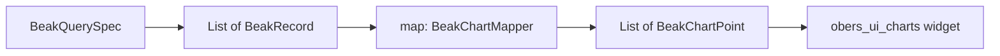

# Chart basics

After this page you can draw any of Beak's seven single-series charts (line, bar,
pie, donut, area, radar, funnel), write the typed mapper that turns query records
into chart points, and choose between a dashboard `BeakChart` and a composable
`BeakChartBlock`.

## The pipeline

Every single-series chart is three parts: a query, a mapper, and a family to
render. Beak stitches them together for you.



The mapper is the only code you write. It reads record fields through your
column constants and returns a list of `BeakChartPoint`, so the path from row to
pixel never touches `dynamic`.

## The point

A `BeakChartPoint` is a label, a value, and an optional x position.

```dart title="packages/beak_frontend/lib/src/dashboard/beak_chart.dart"
/// One typed chart data point — the shape [BeakChartMapper]s produce, so
/// mapping records to series never touches `dynamic`.
final class BeakChartPoint {
  /// Creates a point labelled [label] with [value]; [x] positions it on
  /// continuous axes (defaults to its index).
  const BeakChartPoint({required this.label, required this.value, this.x});

  /// The category/point label.
  final String label;

  /// The measured value.
  final double value;

  /// Explicit x position for line/area charts, if any.
  final double? x;
}
```

For a bar or pie chart the `label` names the category and `value` is its size.
For a line or area chart, `x` places the point on the horizontal axis; leave it
`null` and Beak uses the point's index, which is what you want for evenly spaced
buckets like months.

## The mapper

A `BeakChartMapper` is a plain function from a page of records to a list of
points.

```dart title="packages/beak_frontend/lib/src/dashboard/beak_chart.dart"
--8<-- "packages/beak_frontend/lib/src/dashboard/beak_chart.dart:BeakChartMapper"
```

Here is a real one from the tutorial store (`examples/store`, port 8080).
It turns each order row into one bar, labelled by reference and sized by total,
reading both fields through the generated `OrderColumns` constants:

```dart title="examples/store/lib/dashboard.dart"
/// One bar per order: its reference and what it was worth.
///
/// A mapper reads through the generated column constants, so renaming a
/// column in the schema class is a compile error here rather than an empty
/// chart in production.
List<BeakChartPoint> orderTotalPoints(List<BeakRecord> records) => [
  for (final record in records)
    BeakChartPoint(
      label: OrderColumns.reference.readFrom(record) ?? '—',
      value: OrderColumns.total.readFrom(record) ?? 0,
    ),
];
```

!!! note "What just happened"
    - `readFrom` is the typed read. `OrderColumns.total.readFrom(record)` is a
      `double?` at compile time, because `total` is declared `double` on the
      `Order` schema class. No key strings, no `dynamic`, no casts.
    - `OrderColumns` is generated into `lib/models/order.beak.dart` from the
      `@Resource` class beside it. Rename the field and this mapper stops
      compiling rather than drawing an empty chart.
    - `?? 0` decides what a missing value means. A row with no total gets a
      zero-height bar instead of being dropped.

!!! tip "When the column constant is not the tool"
    A mapper over an ad-hoc analytics table (one tall `series`/`label`/`value`
    table feeding a dozen charts) reads by key, because there is no single
    resource behind the rows. The showcase's mappers below do that. Over a
    resource's own rows, use the generated constant.

## The seven families

`BeakChartType` picks which `obers_ui_charts` widget draws your points.

```dart title="packages/beak_frontend/lib/src/dashboard/beak_chart.dart"
--8<-- "packages/beak_frontend/lib/src/dashboard/beak_chart.dart:BeakChartType"
```

They all consume the same `List<BeakChartPoint>`; only the drawing changes.

| `BeakChartType` | obers widget | How points read |
| --- | --- | --- |
| `line` | `OiLineChart` | `x` (or index) vs `value`, connected |
| `bar` | `OiBarChart` | one bar per point, `label` on the axis |
| `pie` | `OiPieChart` | one segment per point, sized by `value` |
| `donut` | `OiDonutChart` | a pie with a hole |
| `area` | `OiAreaChart` | line with the area below it filled |
| `radar` | `OiRadarChart` | one axis per `label`, one series of `value`s |
| `funnel` | `OiFunnelChart` | one stage per point, `value` sets the width |

The mapping from a `BeakChartType` to the actual widget is one shared `switch`
(`beakChartWidget`), so a dashboard chart and a block chart of the same type draw
identically. You never call `obers_ui_charts` yourself.

## Placing a chart: two homes

The same family and mapper power two placements.

### Anywhere in a block tree: `BeakChartBlock`

`BeakChartBlock` joins the block union, so a chart drops into any grid, card, or
page: `lib/dashboard.dart` for the screen at `/`, `lib/screens/<name>.dart` for
a page of your own. Its constructor mirrors `BeakChart` and adds a `span` for
grid layout.

```dart title="packages/beak_frontend/lib/src/blocks/beak_chart_block.dart"
final class BeakChartBlock extends BeakBlock {
  /// Creates a chart block.
  const BeakChartBlock({
    required this.title,
    required this.type,
    required this.query,
    required this.map,
    this.heightInPixels = 260,
    super.span,
  });
```

The showcase's charts screen (`examples/superdashboard`, port 8180) is a grid of
these, in `lib/screens/charts_screen.dart`. Note the shared `analyticsPage`
pagination so each chart reads the whole series, and the `sorts` that put the
buckets in order:

```dart title="examples/superdashboard/lib/screens/charts_screen.dart"
body: BeakGridBlock(
  columns: 2,
  gapInPixels: 20,
  children: [
    // ... two aggregate metrics head the grid ...
    BeakChartBlock(
      title: 'Revenue (area)',
      type: BeakChartType.area,
      query: const BeakQuerySpec(
        table: 'time_series_points',
        sorts: [BeakSort('sort_index')],
        pagination: analyticsPage,
      ),
      map: seriesPoints('sales_revenue'),
    ),
    // ... line and bar charts over the same series table ...
    const BeakChartBlock(
      title: 'Source of purchases (pie)',
      type: BeakChartType.pie,
      query: BeakQuerySpec(
        table: 'purchase_sources',
        pagination: analyticsPage,
      ),
      map: purchaseSourcePoints,
    ),
    // ...donut, radar and funnel over the same query, then the three advanced blocks...
  ],
),
```

One tall `time_series_points` table backs every line, area, and bar chart. The
`seriesPoints(...)` mapper is a factory: it keeps only the rows for one series,
orders them, and returns the points.

```dart title="examples/superdashboard/lib/services/dashboard_charts.dart"
/// A chart mapper that keeps only the `time_series_points` rows of [series]
/// and turns them into ordered points — so one tall table feeds every chart.
///
/// Every field is read through the generated record view, which returns each
/// column's declared Dart type and parses the wire shapes a source may send
/// (Postgres hands decimals over as strings).
BeakChartMapper seriesPoints(String series) => (records) {
  final points = [
    for (final point in records.map(TimeSeriesPointRecord.of))
      if (point.series == series)
        (
          index: point.sortIndex ?? 0,
          label: point.label,
          value: point.value ?? 0,
        ),
  ]..sort((a, b) => a.index.compareTo(b.index));
  return [
    for (final point in points)
      BeakChartPoint(label: point.label, value: point.value),
  ];
};
```

The `purchaseSourcePoints` mapper is simpler still, one row per channel:

```dart title="examples/superdashboard/lib/services/dashboard_charts.dart"
/// Maps `purchase_sources` rows onto donut segments sized by revenue.
List<BeakChartPoint> purchaseSourcePoints(List<BeakRecord> records) => [
  for (final source in records.map(PurchaseSourceRecord.of))
    BeakChartPoint(label: source.label, value: source.total ?? 0),
];
```

!!! tip "Values arrive as numbers or strings"
    SQLite and the in-memory source hand back numeric fields as `num`; Postgres
    decimals come over HTTP as strings. A generated column constant already
    absorbs that: `OrderColumns.total.readFrom(record)` is a `double?` against
    either backend. The showcase's `_asDouble` exists because these analytics
    mappers read an ad-hoc table by key, with no column constant to do it for
    them.

### On the dashboard: `BeakChart`

There is a second, layout-free route. `BeakStat`s and `BeakChart`s listed on the
config make Beak draw the cards for you, with no block tree at all. They live on
`BeakPanelConfig`, so the place to set them is `lib/panel.dart`:

```dart title="packages/beak_frontend/lib/src/dashboard/beak_chart.dart"
final class BeakChart {
  /// Creates a chart titled [title] rendering [query] through [map].
  const BeakChart({
    required this.title,
    required this.type,
    required this.query,
    required this.map,
    this.heightInPixels = 260,
  });
```

```dart
BeakPanelConfig beakPanel(BeakPanelConfig defaults) => defaults.copyWith(
  dashboardCharts: const [
    BeakChart(
      title: 'Order totals',
      type: BeakChartType.bar,
      query: BeakQuerySpec(table: 'orders'),
      map: orderTotalPoints,
    ),
  ],
);
```

Beak mounts that generated dashboard only when no page claims `/`. A
`lib/dashboard.dart` wins the home route outright, so you wire one or the other,
never both. See [Dashboards](../panel/dashboards.md).

## Rendered height

Charts need bounded constraints, so both `BeakChart` and `BeakChartBlock` default
`heightInPixels` to `260`. Raise it for a chart that wants room; the card sizes
itself to that height and the chart fills it.

## Continue reading

- [Advanced charts](advanced-charts.md) bubble, candlestick, and heatmap, when a label and a value are not enough.
- [Maps](maps.md) shading regions and pinning coordinates from the same query-plus-mapper shape.
- [Dashboards](../panel/dashboards.md) `lib/dashboard.dart` versus config-only `dashboardStats` and `dashboardCharts`.
- [Column types](../models/column-types.md) the column constants your mappers read fields through.
- [Data blocks](../blocks/data-blocks.md) the KPI, table, and metric blocks charts sit beside.
