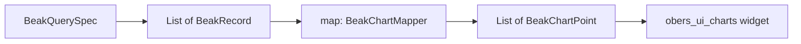

# Chart basics

After this page you can draw any of Beak's seven single-series charts (line, bar,
pie, donut, area, radar, funnel), write the typed mapper that turns query records
into chart points, and choose between a dashboard `BeakChart` and a composable
`BeakChartBlock`.

## The pipeline

Every single-series chart is three parts: a query, a mapper, and a family to
render. Beak stitches them together for you.



The mapper is the only code you write. It reads record fields through your
column constants and returns a list of `BeakChartPoint`, so the path from row to
pixel never touches `dynamic`.

## The point

A `BeakChartPoint` is a label, a value, and an optional x position.

```dart title="packages/beak_frontend/lib/src/dashboard/beak_chart.dart"
/// One typed chart data point - the shape [BeakChartMapper]s produce, so
/// mapping records to series never touches `dynamic`.
final class BeakChartPoint {
  /// Creates a point labelled [label] with [value]; [x] positions it on
  /// continuous axes (defaults to its index).
  const BeakChartPoint({required this.label, required this.value, this.x});

  /// The category/point label.
  final String label;

  /// The measured value.
  final double value;

  /// Explicit x position for line/area charts, if any.
  final double? x;
}
```

For a bar or pie chart the `label` names the category and `value` is its size.
For a line or area chart, `x` places the point on the horizontal axis; leave it
`null` and Beak uses the point's index, which is what you want for evenly spaced
buckets like months.

## The mapper

A `BeakChartMapper` is a plain function from a page of records to a list of
points.

```dart title="packages/beak_frontend/lib/src/dashboard/beak_chart.dart"
typedef BeakChartMapper =
    List<BeakChartPoint> Function(List<BeakRecord> records);
```

Here is a real one from the tutorial store (`examples/store`, port 8080).
It turns each product row into one bar, labelled by name and sized by stock,
reading both fields through the shared `ProductColumns` constants:

```dart
List<BeakChartPoint> stockPerProduct(List<BeakRecord> records) => [
  for (final record in records)
    BeakChartPoint(
      label: record[ProductColumns.name.key]?.raw?.toString() ?? '',
      value: switch (record[ProductColumns.stock.key]?.raw) {
        final num stock => stock.toDouble(),
        _ => 0,
      },
    ),
];
```

!!! note "What just happened"
    - `record[column.key]` reads a field by its column constant, not a bare
      string, so a rename in the model is a compile error here, not a silent
      empty chart.
    - `?.raw` unwraps the typed `BeakValue`; the `switch` coerces it to `double`
      and gives a missing or non-numeric stock a zero-height bar rather than
      dropping the row.

## The seven families

`BeakChartType` picks which `obers_ui_charts` widget draws your points.

```dart title="packages/beak_frontend/lib/src/dashboard/beak_chart.dart"
enum BeakChartType {
  /// A line chart over the mapped points.
  line,

  /// A vertical bar chart, one category per point.
  bar,

  /// A pie chart, one segment per point.
  pie,

  /// A donut (ring) chart, one segment per point.
  donut,

  /// An area chart over the mapped points.
  area,

  /// A radar chart - one axis per point, a single series of their values.
  radar,

  /// A funnel chart - one stage per point.
  funnel,
}
```

They all consume the same `List<BeakChartPoint>`; only the drawing changes.

| `BeakChartType` | obers widget | How points read |
| --- | --- | --- |
| `line` | `OiLineChart` | `x` (or index) vs `value`, connected |
| `bar` | `OiBarChart` | one bar per point, `label` on the axis |
| `pie` | `OiPieChart` | one segment per point, sized by `value` |
| `donut` | `OiDonutChart` | a pie with a hole |
| `area` | `OiAreaChart` | line with the area below it filled |
| `radar` | `OiRadarChart` | one axis per `label`, one series of `value`s |
| `funnel` | `OiFunnelChart` | one stage per point, `value` sets the width |

The mapping from a `BeakChartType` to the actual widget is one shared `switch`
(`beakChartWidget`), so a dashboard chart and a block chart of the same type draw
identically. You never call `obers_ui_charts` yourself.

## Placing a chart: two homes

The same family and mapper power two placements.

### On the dashboard: `BeakChart`

List `BeakChart`s on `BeakPanelConfig.dashboardCharts` and Beak lays them out on
the auto-generated dashboard alongside the stat cards. This is the config-only
route: you declare the chart, Beak builds the card.

```dart title="packages/beak_frontend/lib/src/dashboard/beak_chart.dart"
final class BeakChart {
  /// Creates a chart titled [title] rendering [query] through [map].
  const BeakChart({
    required this.title,
    required this.type,
    required this.query,
    required this.map,
    this.heightInPixels = 260,
  });
```

The tutorial store registers exactly one:

```dart
dashboardCharts: [
  const BeakChart(
    title: 'Stock per product',
    type: BeakChartType.bar,
    query: BeakQuerySpec(table: 'products'),
    map: stockPerProduct,
  ),
],
```

### Anywhere in a block tree: `BeakChartBlock`

When you build a custom screen or a hand-composed dashboard, `BeakChartBlock`
joins the block union, so a chart drops into any grid, card, or page. Its
constructor mirrors `BeakChart` and adds a `span` for grid layout.

```dart title="packages/beak_frontend/lib/src/blocks/beak_chart_block.dart"
final class BeakChartBlock extends BeakBlock {
  /// Creates a chart block.
  const BeakChartBlock({
    required this.title,
    required this.type,
    required this.query,
    required this.map,
    this.heightInPixels = 260,
    super.span,
  });
```

The showcase's charts screen (`apps/superdashboard`, port 8180) is a grid of
these. Note the shared `analyticsPage` pagination so each chart reads the whole
series, and the `sorts` that put the buckets in order:

```dart title="examples/superdashboard/lib/screens/charts_screen.dart"
body: BeakGridBlock(
  columns: 2,
  gapInPixels: 20,
  children: [
    BeakChartBlock(
      title: 'Revenue (area)',
      type: BeakChartType.area,
      query: const BeakQuerySpec(
        table: 'time_series_points',
        sorts: [BeakSort('sort_index')],
        pagination: analyticsPage,
      ),
      map: seriesPoints('sales_revenue'),
    ),
    const BeakChartBlock(
      title: 'Source of purchases (pie)',
      type: BeakChartType.pie,
      query: BeakQuerySpec(
        table: 'purchase_sources',
        pagination: analyticsPage,
      ),
      map: purchaseSourcePoints,
    ),
    // ...donut, radar, and funnel over the same query
  ],
),
```

One tall `time_series_points` table backs every line, area, and bar chart. The
`seriesPoints(...)` mapper is a factory: it keeps only the rows for one series,
orders them, and returns the points.

```dart title="examples/superdashboard/lib/services/dashboard_charts.dart"
/// A chart mapper that keeps only the `time_series_points` rows of [series]
/// and turns them into ordered points - so one tall table feeds every chart.
BeakChartMapper seriesPoints(String series) => (records) {
  final points = [
    for (final record in records)
      if (record['series']?.raw == series)
        (
          index: (record['sort_index']?.raw as num?)?.toInt() ?? 0,
          label: record['label']?.raw?.toString() ?? '',
          value: _asDouble(record['value']?.raw),
        ),
  ]..sort((a, b) => a.index.compareTo(b.index));
  return [
    for (final point in points)
      BeakChartPoint(label: point.label, value: point.value),
  ];
};
```

The `purchaseSourcePoints` mapper is simpler still, one row per channel:

```dart title="examples/superdashboard/lib/services/dashboard_charts.dart"
/// Maps `purchase_sources` rows onto donut segments sized by revenue.
List<BeakChartPoint> purchaseSourcePoints(List<BeakRecord> records) => [
  for (final record in records)
    BeakChartPoint(
      label: record['label']?.raw?.toString() ?? '',
      value: _asDouble(record['total']?.raw),
    ),
];
```

!!! tip "Values arrive as numbers or strings"
    In-memory adapters hand back numeric fields as `num`; Postgres decimals come
    over HTTP as strings. The showcase's `_asDouble` helper parses either, so the
    same mapper works against both backends. Reach for it (or your own) whenever a
    chart reads a decimal column.

## Rendered height

Charts need bounded constraints, so both `BeakChart` and `BeakChartBlock` default
`heightInPixels` to `260`. Raise it for a chart that wants room; the card sizes
itself to that height and the chart fills it.

## Continue reading

- [Advanced charts](advanced-charts.md) bubble, candlestick, and heatmap, when a label and a value are not enough.
- [Maps](maps.md) shading regions and pinning coordinates from the same query-plus-mapper shape.
- [Dashboards](../panel/dashboards.md) how `dashboardStats` and `dashboardCharts` build the flat dashboard.
- [Column types](../models/column-types.md) the column constants your mappers read fields through.
- [Data blocks](../blocks/data-blocks.md) the KPI, table, and metric blocks charts sit beside.
