# How data flows

After this page you can follow one read from a table to the database, and one save from a form to its receipt. You will know what each side sends, what the server does to it on the way, and what refreshes when it is done.

## The idea in one picture

```mermaid
flowchart LR
  subgraph reads["Read"]
    r1["ViewModel builds a BeakQuerySpec"] --> r2["POST /api/{table}/query"]
    r2 --> r3["Server rewrites the spec: row scope, field policy"]
    r3 --> r4["WormQueryTranslator builds the worm query"]
    r4 --> r5["BeakPage of BeakRecord"]
  end
  subgraph writes["Write"]
    w1["Form session builds a BeakSavePlan"] --> w2["POST /api/commits"]
    w2 --> w3["Transaction: authorize, behavior, validate, write"]
    w3 --> w4["BeakSaveResult: one receipt per operation"]
  end
  w4 --> c["BeakDataChange on the changes stream"]
  c --> r1
```



Reads and writes are different shapes on purpose. A read is one value, a `BeakQuerySpec`. A write is a plan of operations with an identity, so it can be replayed and recovered. Both are typed, both are JSON on the wire, and both are decoded back into the same Dart type on the server.

## How it works

### A read is one value

Every list, filter, search box and page in the panel is described by a `BeakQuerySpec`. Its constructor is the wire-level shape; application code starts from `model.query()`, which fills in the table.

```dart title="packages/beak_core/lib/src/query/beak_query_spec.dart"
--8<-- "packages/beak_core/lib/src/query/beak_query_spec.dart:BeakQuerySpec"
```

| Part | Type | What it carries |
| --- | --- | --- |
| `table` | `String` | the model's table |
| `filter` | `BeakFilter?` | the predicate tree a record must satisfy |
| `sorts` | `List<BeakSort>` | ordering, applied in order |
| `search` | `BeakSearch?` | a term matched across named columns, relationship paths allowed |
| `relationLoads` | `List<BeakRelationLoad>` | relations to eager-load; Beak never lazy-loads |
| `pagination` | `BeakPagination` | 1-based page and page size, 25 by default |
| `withTrashed` | `bool` | whether soft-deleted rows are included |

You build a spec with immutable copy-builders (`withFilter`, `orderBy`, `withRelation`, `searching`, `paginate`), each taking typed references. The original is never mutated, and `withFilter` AND-merges rather than replaces:

```dart title="packages/beak_core/lib/src/query/beak_query_spec.dart"
--8<-- "packages/beak_core/lib/src/query/beak_query_spec.dart:withFilter"
```

This is one built from the bookshop example's `BookModel`, with its real JSON. The expression is illustrative, the output is what `toJson()` printed:

```dart
final spec = const BookModel()
    .query(filter: BookModel.priceInCents.lte(2000))
    .withFilter(BookModel.format.eq(BookFormat.paperback))
    .withRelation(BookModel.author.relation)
    .searching('dog', [BookModel.title, BookModel.author.name])
    .orderBy(BookModel.priceInCents, descending: true)
    .paginate(page: 2, perPage: 10);
```

```json
{
  "table": "book",
  "filter": {
    "type": "and",
    "filters": [
      { "type": "field", "column": "priceInCents", "operator": "lte", "value": 2000 },
      { "type": "field", "column": "format", "operator": "eq", "value": "paperback" }
    ]
  },
  "sorts": [{ "column": "priceInCents", "descending": true }],
  "search": { "term": "dog", "columns": ["title", "author.name"] },
  "relations": [{ "relation": "author", "filter": null, "nested": [] }],
  "pagination": { "page": 2, "perPage": 10 },
  "withTrashed": false
}
```

`BeakQuerySpec.fromJson` on that body gives back a spec that is `==` to the one you built. The spec carries keys and no ORM type and no Flutter type, so both sides can speak it. Decoding is optional-on-read: `{"table": "book"}` is a valid request body.

A default list adds one thing you did not ask for. `beakWithToOneLoads` asks for every to-one relationship of the model in the same request, so a foreign key renders as the author's name and not as the uuid it stores. That is one query for the page, not one per row.

### The server rewrites it, then translates it

The panel's spec is input, not instruction. The handler decodes it and hands it to the authorizer, which adds the row scope and checks every path against the field policy (see [Where authority lives](where-authority-lives.md)). Only then does the service see it. `WormDataSource` runs it, and this is the one spot where the beak meets the worm:

```dart title="packages/beak_backend/lib/src/data/worm/worm_data_source.dart"
--8<-- "packages/beak_backend/lib/src/data/worm/worm_data_source.dart:query"
```

`builderFor` turns each part of the spec into a call on worm's query builder, in a fixed order. The translator works from `BeakModel` metadata and the registry, so one code path serves every model:

```dart title="packages/beak_backend/lib/src/data/worm/query_translator.dart"
--8<-- "packages/beak_backend/lib/src/data/worm/query_translator.dart:builderFor"
```

The operators are Beak's own set, serialized by name, and the translator maps them to worm's. Substring matches have no direct counterpart, so `contains` becomes a case-insensitive `ilike` with wildcards:

```dart title="packages/beak_backend/lib/src/data/worm/query_translator.dart"
--8<-- "packages/beak_backend/lib/src/data/worm/query_translator.dart:substringOperators"
```

The answer is a `BeakPage<BeakRecord>`: the items, the total, the page and the page size. Records are typed rows (`BeakValue`s keyed by column, plus the relations you asked for). The panel decodes the same JSON back into the same types.

### A write is a plan

A form does not `PATCH` a record. A `BeakFormSession` keeps a local copy of the root record, its nested rows and its links, and on save it freezes the changes into a `BeakSavePlan`.

```dart title="packages/beak_core/lib/src/data/beak_commit.dart"
--8<-- "packages/beak_core/lib/src/data/beak_commit.dart:BeakSavePlanFields"
```

Each `BeakSaveOperation` is one write: create, update, delete, attach or detach. A record that doesn't exist yet is addressed by a draft id, and other operations refer to it by that id, so a new order with three new lines and a new customer is one plan:

```dart title="packages/beak_core/lib/src/data/beak_commit.dart"
--8<-- "packages/beak_core/lib/src/data/beak_commit.dart:BeakSaveOperationFields"
```

This is the smallest real plan, one create against the quickstart, and the request `POST /api/commits` carries:

```json
{
  "saveId": "demo-1",
  "root": { "table": "notes", "draftId": "n1" },
  "operations": [
    {
      "id": "n1:create",
      "kind": "create",
      "target": { "table": "notes", "draftId": "n1" },
      "values": { "values": { "title": "Water the ferns", "pinned": true }, "relations": {} },
      "references": {},
      "dependsOn": []
    }
  ]
}
```

The panel sends it through `ModelBeakDataSource.commit`. That method checks that the save id is not being reused with different content, orders the operations, and picks the transport:

```dart title="packages/beak_frontend/lib/src/data/model_beak_data_source.dart"
--8<-- "packages/beak_frontend/lib/src/data/model_beak_data_source.dart:commit"
```

If every model in the plan uses one source and that source can commit, the plan goes to it whole. If the plan spans sources (a model bound to its own transport next to one on the default), the panel stages it: operations run one by one, with no shared transaction. The receipt says which happened.

On the server the plan reaches `BeakGraphCommitService` through two routes, one to save and one to look a save up:

```dart title="packages/beak_backend/lib/src/endpoints/commit_router.dart"
--8<-- "packages/beak_backend/lib/src/endpoints/commit_router.dart:registerBeakCommitRoutes"
```

The transaction itself, in order, is on [Where authority lives](where-authority-lives.md): receipt, authorization, behavior, your preparer, execution, final validation, your finalizer, receipt. What matters here is what comes back.

### A receipt says what happened

Every operation gets a status, and a save is never reported as done on a guess.

```dart title="packages/beak_core/lib/src/data/beak_commit.dart"
--8<-- "packages/beak_core/lib/src/data/beak_commit.dart:BeakSaveOutcomes"
```

The receipt for the plan above, with the record trimmed:

```json
{
  "saveId": "demo-1",
  "mode": "atomic",
  "outcomes": [
    {
      "id": "n1:create",
      "status": "applied",
      "draftId": "n1",
      "resolvedId": "d214ae64-f7f8-4ded-b80d-ef1806a3d224",
      "table": "notes",
      "record": { "values": { "id": "d214ae64-...", "title": "Water the ferns", "pinned": true, "...": "..." }, "relations": {} }
    }
  ],
  "rootOperationId": "n1:create"
}
```

`resolvedId` maps the draft id to the primary key the server minted, and the session uses it to turn its local drafts into saved records. `complete` on a `BeakSaveResult` is true only when every operation is `applied`. `hasUnknown` is true when any is `unknown`, which blocks a replay until the save is looked up.

The save id is the handle for everything that follows. Sending the same plan again returns the stored receipt and writes nothing. Sending the same id with different content is refused. Asking after a save the panel lost the answer to reads the receipt without touching the data:

```console
$ curl -s -XPOST localhost:8080/api/commits -d "$PLAN"      # the same plan again
{"saveId":"demo-1","mode":"atomic","outcomes":[{"id":"n1:create","status":"applied", ...same receipt...
$ curl -s localhost:8080/api/commits/demo-1                  # recovery, no write
{"saveId":"demo-1","mode":"atomic","outcomes":[{"id":"n1:create","status":"applied", ...same receipt...
$ curl -s -XPOST localhost:8080/api/commits -d "${PLAN/ferns/roses}"
{"code":"conflict","message":"Save identity was reused with different content.","requestId":"fe40fbccd3435d09"}
```

The replay and the lookup return the same `resolvedId`, which is the point: nothing was inserted twice.

What a source promises is a `BeakCommitCapabilities` value, and the receipt's `mode` is the truth about this save:

```dart title="packages/beak_core/lib/src/data/beak_commit.dart"
--8<-- "packages/beak_core/lib/src/data/beak_commit.dart:BeakCommitDataSource"
```

| Source | `mode` | Atomic | Receipts survive a restart | Replay is safe |
| --- | --- | --- | --- | --- |
| Beak backend over a transactional adapter (SQLite, Postgres, MySQL, Serverpod's database) | `atomic` | yes | yes | yes |
| Beak backend over an adapter without transactions (MongoDB) | `staged` | no | yes | no |
| Any other `BeakDataSource`, staged by the panel (`BeakStagedCommitDataSource`) | `staged` | no | no, per session | no |

### The panel refreshes itself

A confirmed write announces itself. `ModelBeakDataSource` collects the tables an applied operation touched, including the owner and the related table of a nested row, and emits one `BeakDataChange`:

```dart title="packages/beak_frontend/lib/src/data/model_beak_data_source.dart"
--8<-- "packages/beak_frontend/lib/src/data/model_beak_data_source.dart:committed"
```

```dart title="packages/beak_frontend/lib/src/data/model_beak_data_source.dart"
--8<-- "packages/beak_frontend/lib/src/data/model_beak_data_source.dart:changed"
```

The loop widens the set: any model with a relationship pointing at a changed table is invalidated too, and so is anything pointing at that. A save to an order line refreshes the order list, because the list shows the order's total.

Listeners subscribe to the stream. `BeakTableViewModel` refetches when the change touches its table, and any widget can do the same with a hook:

```dart title="packages/beak_frontend/lib/src/data/beak_data_changes.dart"
--8<-- "packages/beak_frontend/lib/src/data/beak_data_changes.dart:useBeakDataRevision"
```

Metric blocks, summaries, filter option lists, the command bar and open forms use it, so a dashboard number changes when you save the form next to it. Changes made by other users do not arrive on their own. `BeakRefreshPolicy(interval:, onResume:)`, passed to the panel as `refreshPolicy`, makes every mounted surface invalidate on a timer and when the app returns to the foreground. It is opt-in and off by default.

## Why it is shaped this way

One spec, three jobs. A single serializable value is the wire contract, the thing the server can inspect and rewrite (row scope, field policy), and something a test can compare with `==`. If the panel sent SQL or a callback, the server could do none of that.

A plan, because a form edits a graph. A per-row `PATCH` saves a form as several requests, and a failure in the third leaves the first two behind. A plan is one request with one identity, applied in one transaction where the source allows it, and recoverable by that identity where the answer gets lost. The cost is two shapes for the same failure. A direct `POST /api/notes` with an empty title answers 422 with `fieldErrors`. The same rejection inside a commit answers 200, with the operation marked `unapplied` and the same `fieldErrors` inside the receipt:

```json
{
  "saveId": "demo-2",
  "mode": "atomic",
  "outcomes": [
    {
      "id": "n1:create",
      "status": "unapplied",
      "error": {
        "code": "validation",
        "message": "Validation failed for \"notes\".",
        "fieldErrors": { "title": ["This field is required."] }
      },
      "reason": "rejected"
    }
  ],
  "rootOperationId": "n1:create"
}
```

The receipt has to be able to describe partial outcomes, so an HTTP status can't be its only channel. If you call the API by hand, look for both.

Refresh is by table, not by row. It costs an extra query where a row-level patch could have avoided one. It also can't miss a derived value or a joined name, which a row-level patch could.

## What it means for you

- Start every query from the model: `const BookModel().query(...)`, then the copy-builders with typed references. You never write a table or column string.
- Anything with `behavior`, or whose rules read related rows, is saved through a commit only. The per-record routes answer "This resource must be saved through a graph commit."
- A page of results is 25 rows unless the spec says otherwise, the server always applies the limit, and it serves at most 200 rows a page. A data block over a table that can grow past that needs an explicit `perPage` of 200 or less and a sort.
- If you write a `BeakDataSource`, implement `BeakCommitDataSource` too, or accept staged saves. The receipt's `mode` says which one you got.
- A widget that reads data itself should call `useBeakDataRevision`, or it will show stale numbers after a save.

## Continue reading

- [The query contract](../architecture/query-contract.md) the spec, its JSON and the translator in contributor detail.
- [Graph commits](../architecture/graph-commits.md) operations, ordering, receipts and recovery.
- [REST API](../reference/rest-api.md) every route a registered model gets.
- [Drafts, review and conflicts](../forms/drafts-and-review.md) how the form session holds a plan before it is sent.
