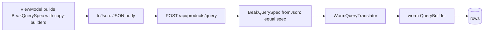

# How data flows

After this page you can build a query in the panel with typed columns, read
the JSON it turns into, and follow that JSON to the worm query it produces on
the server, without a `dynamic` or a stringly-typed field reference anywhere in
the path.

Every list, filter, search, and page in Beak is described by one value: a
`BeakQuerySpec`. The panel builds it, serializes it to JSON, and posts it. The
server decodes the same JSON back into the same spec and hands it to
`WormQueryTranslator`, which turns it into a worm query. The spec is the wire
contract, and it round-trips losslessly.

## The spec is the wire contract

A `BeakQuerySpec` is a typed, JSON-serializable description of a query. It
names a table and carries the six other parts of a read:

```dart title="packages/beak_core/lib/src/query/beak_query_spec.dart"
const BeakQuerySpec({
  required this.table,
  this.filter,
  this.sorts = const [],
  this.search,
  this.relationLoads = const [],
  this.pagination = const BeakPagination(),
  this.withTrashed = false,
});
```

| Part | Type | What it carries |
| --- | --- | --- |
| `table` | `String` | The model's physical table name. |
| `filter` | `BeakFilter?` | The predicate tree records must satisfy. |
| `sorts` | `List<BeakSort>` | Ordering directives, applied in order. |
| `search` | `BeakSearch?` | A term matched across named columns. |
| `relationLoads` | `List<BeakRelationLoad>` | Relations to eager-load. |
| `pagination` | `BeakPagination` | The 1-based page and page size. |
| `withTrashed` | `bool` | Whether soft-deleted rows are included. |

The spec references column and relation *keys* only, which keeps it
ORM-neutral. It carries no worm type and no Flutter type, so both sides of Beak
can speak it.

## You build it with immutable copy-builders

You never mutate a spec. Each builder (`withFilter`, `orderBy`, `withRelation`,
`searching`, `paginate`) returns a new spec, so they chain and the original is
left alone.

| Builder | Signature | The copy it returns |
| --- | --- | --- |
| `withFilter` | `BeakQuerySpec withFilter(BeakFilter filter)` | AND-merges `filter` into the existing predicate |
| `orderBy` | `BeakQuerySpec orderBy(BeakColumn column, {bool descending = false})` | is additionally ordered by `column` |
| `withRelation` | `BeakQuerySpec withRelation(BeakRelationship relation, {BeakFilter? constraint})` | additionally eager-loads `relation` |
| `searching` | `BeakQuerySpec searching(String term, List<BeakColumn> columns)` | searches for `term` across `columns` |
| `paginate` | `BeakQuerySpec paginate({int? page, int? perPage})` | has an updated paging window |

Each one takes a typed column or relationship constant, not a string. Those are
the constants `beak prepare` wrote from your schema class, so
`ProductColumns.price` and `ProductRelations.category` are what you pass, and
the spec reads the key off them for you:

```dart title="packages/beak_core/lib/src/query/beak_query_spec.dart"
final spec = const BeakQuerySpec(table: 'posts')
    .withRelation(author)
    .withFilter(BeakFieldFilter(
      column: status,
      operator: BeakOperator.eq,
      value: BeakValue.of('published'),
    ))
    .orderBy(createdAt, descending: true)
    .paginate(page: 2, perPage: 50);
```

!!! note "What just happened"

    - `withFilter` AND-merges into the existing predicate, so calling it twice
      grows a conjunction rather than replacing the filter.
    - `orderBy` and `withRelation` append; the builders never drop what came
      before.
    - `BeakValue.of('published')` wraps the operand in a typed value, so no
      `dynamic` reaches the wire (more on that below).

## Filters are a sealed predicate tree

`BeakFilter` is a sealed hierarchy of three shapes: `BeakFieldFilter` compares
one column, and `BeakAndFilter` / `BeakOrFilter` combine children. Because it
is sealed, any translator walks it with an exhaustive switch.

```dart title="packages/beak_core/lib/src/query/beak_filter.dart"
final BeakFilter predicate = BeakAndFilter([
  BeakFieldFilter(
    column: price,
    operator: BeakOperator.lte,
    value: BeakValue.of(100.0),
  ),
  BeakFieldFilter(
    column: inStock,
    operator: BeakOperator.eq,
    value: BeakValue.of(true),
  ),
]);
```

The default `BeakFieldFilter` constructor takes a `BeakColumn` and reads its key,
so user code never writes a key string:

```dart title="packages/beak_core/lib/src/query/beak_filter.dart"
const BeakFieldFilter({
  required BeakColumn column,
  required this.operator,
  this.value = const BeakNullValue(),
}) : _column = column,
     _columnKey = null;
```

It holds the column rather than reducing it to a key so that the constructor can
stay `const`, and the key is read on demand:

```dart title="packages/beak_core/lib/src/query/beak_filter.dart"
/// Key of the column this predicate applies to.
String get columnKey => _columnKey ?? _column!.key;
```

That matters more than it sounds: a screen, a dashboard metric and a resource's
base filter are all `const` expressions, and a filter that could not be one
would force every caller of them open.

Walking the tree is a switch with no default case, so adding a filter shape is
a compile error until every translator handles it:

```dart title="packages/beak_core/lib/src/query/beak_filter.dart"
String describe(BeakFilter filter) => switch (filter) {
  BeakFieldFilter(:final columnKey, :final operator) =>
    '$columnKey ${operator.name}',
  BeakAndFilter(:final filters) => filters.map(describe).join(' AND '),
  BeakOrFilter(:final filters) => filters.map(describe).join(' OR '),
};
```

### Operators are ORM-neutral

The comparison is a `BeakOperator`, Beak's own operator set. It serializes by
`name` and the server translates it to worm's operators. Substring operators
have no direct worm counterpart, so they translate to `ilike` with a wildcard
pattern.

| `BeakOperator` | worm translation |
| --- | --- |
| `eq`, `neq`, `gt`, `gte`, `lt`, `lte` | the matching `Operator` |
| `like`, `ilike` | `Operator.like` / `Operator.ilike` |
| `contains` | `Operator.ilike` with pattern `%value%` |
| `startsWith` | `Operator.ilike` with pattern `value%` |
| `endsWith` | `Operator.ilike` with pattern `%value` |
| `isNull`, `isNotNull` | `Operator.isNull` / `Operator.isNotNull` |
| `inList`, `notInList` | `Operator.inList` / `Operator.notInList` |
| `between`, `notBetween` | `Operator.between` / `Operator.notBetween` |

The full table lives in `beak_operator.dart` and a test keeps it exhaustive:
adding an operator without extending the translation breaks the build.

## Values travel typed, so the round-trip is lossless

Operands are wrapped in the sealed `BeakValue` family instead of raw
`Object?`, so nothing crosses the wire as `dynamic`. Primitives serialize as
themselves; a `DateTime` serializes as a tagged object so decoding never
confuses a timestamp with a plain string.

```dart
BeakValue.of('active');           // BeakStringValue
BeakValue.of(42);                 // BeakIntValue
BeakValue.of([1, 2, 3]);          // BeakListValue of BeakIntValues
BeakValue.of(DateTime.utc(2026)); // BeakDateTimeValue
```

A `BeakDateTimeValue` encodes as `{"type": "dateTime", "value": <ISO-8601>}`,
which is the one place the wire format is not a bare primitive. That tag is
what lets `BeakValue.fromJson` rebuild the exact `DateTime` on the other side.

## The wire body

`spec.toJson()` produces a plain map, and `BeakQuerySpec.fromJson` rebuilds it
into an equal spec. A `POST /api/products/query` body for a filtered,
sorted, paged read looks like this:

```json
{
  "table": "products",
  "filter": {
    "type": "field",
    "column": "price",
    "operator": "lte",
    "value": 100.0
  },
  "sorts": [{ "column": "created_at", "descending": true }],
  "search": null,
  "relations": [{ "relation": "category", "filter": null, "nested": [] }],
  "pagination": { "page": 2, "perPage": 50 },
  "withTrashed": false
}
```

Nothing here is invented for the docs: every key is what the matching `toJson`
emits. Feed this body back through `BeakQuerySpec.fromJson` and you get a spec
that is `==` to the one you started with.

!!! note "Why `relations` is already there"
    You did not ask for the category. `beakWithToOneLoads` adds a relation load
    for every to-one relationship the model declares that the spec does not
    already carry, because the table shows the related record's name rather than
    the uuid the foreign key stores. It rides in the same spec, so the whole page
    is one query rather than one per row. See
    [Tables and filters](../panel/tables-and-filters.md).



## The server turns the spec into a worm query

On the backend, `WormDataSource` hands the decoded spec to
`WormQueryTranslator`. The translator is fully generic: it works off
`BeakModel` metadata and the registry, so one code path serves every model.
Filters become predicate trees, searches become case-insensitive OR groups,
relation loads become batched eager-load paths, and soft-deleting models are
scoped with worm's `SoftDeleteScope` (lifted by `withTrashed`).

```dart title="packages/beak_backend/lib/src/data/worm/query_translator.dart"
final translator = WormQueryTranslator(registry);
final builder = translator.builderFor(
  BeakQuerySpec(
    table: 'products',
    filter: BeakFieldFilter.forKey(
      'price',
      BeakOperator.gte,
      BeakValue.of(10),
    ),
    relationLoads: [BeakRelationLoad('category')],
  ),
  adapter,
);
final rows = await builder.get();
```

Inside `builderFor`, each part of the spec becomes a call on the worm query
builder, in order:

```dart title="packages/beak_backend/lib/src/data/worm/query_translator.dart"
if (spec.withTrashed) {
  builder = builder.withTrashed();
}
final PredicateTree? filter = predicateFor(spec.filter, model);
if (filter != null) {
  builder = builder.where(filter);
}
final PredicateTree? search = _searchPredicate(spec.search, model);
if (search != null) {
  builder = builder.where(search);
}
for (final sort in spec.sorts) {
  builder = builder.orderBy(
    wormFieldForColumn(columnOrThrow(model, sort.columnKey)),
    descending: sort.descending,
  );
}
builder = _applyRelationLoads(builder, model, spec.relationLoads);
builder = builder.limit(spec.pagination.perPage);
```

`WormQueryTranslator` lives in beak_backend and is the only code that sees both
a `BeakQuerySpec` and a worm type. The translation is one-directional: the
panel never learns what SQL ran, and worm never learns about the panel. The
spec is the whole of what they share.

!!! question "What this skipped"

    Eager loads, nested relation loads, and soft-delete scoping each have more
    detail than fits here. [The data source seam](../backend/the-data-source-seam.md)
    covers `WormDataSource` and the translator, and
    [Relationships](../models/relationships.md) covers how relation loads read
    a model's declared relations.

## Continue reading

- [The four layers](the-four-layers.md) the layers that build, ship, and
  translate the spec on each side.
- [The generated API](../backend/the-generated-api.md) the `POST /query` route
  and the rest of the surface a registered model gets.
- [The data source seam](../backend/the-data-source-seam.md) `WormDataSource`,
  the translator, and the interface both sides implement.
- [Relationships](../models/relationships.md) the relation constants that
  `withRelation` reads keys from.
