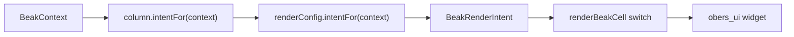

# Rendering per surface

You declare a field once, and the column Beak generates from it shows up in four
places: a table cell, a form input, a detail row, and a filter control. After
this page you can predict which obers_ui widget any column produces on any
surface, and steer that choice with a `BeakRenderConfig`.

## Four surfaces, one column

Every place a column can appear is one value of `BeakContext`. The renderer asks
a column "what are you here?" and passes one of these four answers.

```dart title="packages/beak_core/lib/src/context/beak_context.dart"
enum BeakContext {
  /// A cell inside a resource list/table.
  table,

  /// An editable input inside a create/edit form.
  form,

  /// A read-only entry inside a record detail view.
  detail,

  /// A filter control inside a table's filter bar.
  filter,
}
```

That is the whole point of Beak's columns. One `const BeakColumn`, generated from
one annotated field, feeds all four surfaces, so a change to a field's rules or
label lands everywhere at once. This page is about the other half of that
promise: the same column can *look* different on each surface without you writing
four widgets.

!!! note "The filter surface is opt-in"
    A column reaches the filter bar when you write `@Column(filterable: true)`.
    A resource that declares no filters of its own gets one control per
    filterable column of a kind that has one: an enum becomes a select, a
    boolean a switch, a string a contains-search, a date a range. A filterable
    column of any other kind is skipped rather than guessed at, so declare that
    one on the resource. See
    [Tables and filters](../panel/tables-and-filters.md).

## Intents, not widgets

`beak_core` never imports Flutter. A column cannot name an obers_ui widget,
because obers_ui lives one package away. Instead a column declares a
`BeakRenderIntent`: an ORM- and UI-neutral hint about *what* should be drawn (a
badge, a thumbnail, a relative date), and `beak_frontend` maps each intent to
the matching widget.

```dart title="packages/beak_core/lib/src/context/beak_render_intent.dart"
enum BeakRenderIntent {
  text,
  number,
  currency,
  badge,
  image,
  thumbnail,
  boolean,
  date,
  relativeDate,
  relationLink,
  relationBadges,
  richText,
  color,
  json,
  custom,
}
```

(Each value carries a doc comment in source; the list above is trimmed.) The
split keeps the seam clean: the backend and the pure-Dart core speak intents,
and only the Flutter package knows what an intent looks like.

## The pivot: BeakRenderConfig

A column's four intents live on one small object. `BeakRenderConfig` holds one
`BeakRenderIntent` per `BeakContext`, and answers `intentFor` for whichever
surface is asking.

```dart title="packages/beak_core/lib/src/columns/beak_render_config.dart"
const BeakRenderConfig({
  required this.table,
  required this.form,
  required this.detail,
  required this.filter,
});

/// Creates a config that renders with the same [intent] in every context.
const BeakRenderConfig.uniform(BeakRenderIntent intent)
  : this(table: intent, form: intent, detail: intent, filter: intent);

/// The intent this config resolves to for [context].
BeakRenderIntent intentFor(BeakContext context) => switch (context) {
  BeakContext.table => table,
  BeakContext.form => form,
  BeakContext.detail => detail,
  BeakContext.filter => filter,
};
```

Most columns render the same way everywhere and use `.uniform`. The interesting
ones differ by surface. A date/time column is the clearest example: it shows a
humanized "3 days ago" in the table and detail, but a real date picker in the
form and the filter, because you cannot pick "3 days ago".

```dart title="packages/beak_core/lib/src/columns/beak_date_time_column.dart"
@override
BeakRenderConfig get renderConfig => BeakRenderConfig(
  table: _displayIntent,
  form: BeakRenderIntent.date,
  detail: _displayIntent,
  filter: BeakRenderIntent.date,
);
```

Every leaf column implements `renderConfig`, and `BeakColumn` exposes a shortcut
so callers never reach through it by hand.

```dart title="packages/beak_core/lib/src/columns/beak_column.dart"
/// The per-context render configuration of this column.
BeakRenderConfig get renderConfig;

/// Returns the rendering hint this column resolves to in [context] (the
/// frontend maps each [BeakRenderIntent] to an obers_ui widget). A
/// convenience shortcut for `renderConfig.intentFor(context)`.
BeakRenderIntent intentFor(BeakContext context) =>
    renderConfig.intentFor(context);
```

## From intent to widget: renderBeakCell

On the read surfaces (the table cell and the detail row), one function turns an
intent into a widget: `renderBeakCell`. It reads the column's value out of a
`BeakRecord`, resolves the intent for the current context, and switches to the
matching obers_ui widget.

```dart title="packages/beak_frontend/lib/src/table/column_cell_renderer.dart"
Widget renderBeakCell(
  BuildContext context, {
  required BeakColumn column,
  required BeakRecord record,
  BeakContext renderContext = BeakContext.table,
  BeakRenderIntent? intentOverride,
  VoidCallback? onOpenRelation,
  DateTime Function()? now,
}) {
  final BeakValue? value = record[column.key];
  final Object? raw = value?.raw;
  if (raw == null) {
    return const OiLabel.caption('—');
  }
  return switch (intentOverride ?? column.intentFor(renderContext)) {
    BeakRenderIntent.text => OiLabel.body(raw.toString(), maxLines: 1),
    BeakRenderIntent.badge => _enumBadge(column, raw),
    BeakRenderIntent.relativeDate => OiLabel.body(
      _relativeText(raw, (now ?? DateTime.now)()),
      maxLines: 1,
    ),
    BeakRenderIntent.thumbnail => _image(column, raw, sizeInPixels: 40),
    BeakRenderIntent.image => _image(column, raw, sizeInPixels: 160),
    // ... one arm per BeakRenderIntent
    BeakRenderIntent.custom => _custom(context, column, record),
  };
}
```

The switch is exhaustive over `BeakRenderIntent`, so a new intent is a compile
error until this renderer handles it. Three details are worth knowing:

- **A `null` value renders a muted dash placeholder**, never a crash and never
  an empty cell you cannot tell apart from a real one.
- **`intentOverride` substitutes the column's own intent.** Relationship fields
  use it, because relation intents (`relationLink`, `relationBadges`) live on the
  relationship, not the column.
- **`custom` is the escape hatch.** A `BeakCustomColumn` carries a tag; you
  register a builder for that tag at startup, and an unregistered tag renders a
  visible placeholder instead of failing.

!!! note "What just happened"
    - A surface asks a column for an intent: `column.intentFor(context)`.
    - The column delegates to its `BeakRenderConfig.intentFor(context)`.
    - `renderBeakCell` switches on the resolved `BeakRenderIntent` and returns
      an obers_ui widget.
    - `beak_core` never named a widget; `beak_frontend` never invented a rule.



The form and filter surfaces resolve the same way (they read `renderConfig.form`
and `renderConfig.filter`), but they have their own mappers, because a form needs
an editable input and a filter needs a comparison control. `renderBeakCell` is
specifically the read-only path shared by the table and the detail view.

## Relationships render instead of their keys

One cell in a list table is not drawn from a column at all. A belongs-to
relationship owns a foreign key, and the key renders as the uuid it stores,
which tells a reader nothing. So the table swaps them: where the foreign-key
column would go, it draws the related record's display value, read from the
record eager-loaded with the page.

```dart title="packages/beak_frontend/lib/src/table/beak_data_table.dart"
cellBuilder: (context, record, rowIndex) {
  final BeakRecord? related = _relatedOf(relation, record);
  if (related == null) {
    return const OiLabel.body('');
  }
  final String label = relation.displayLabelOf(related);
  if (onOpenRelation == null) {
    return OiLabel.body(label, maxLines: 1);
  }
  return GestureDetector(
    onTap: () => onOpenRelation?.call(relation, related),
    child: OiLabel.link(label, maxLines: 1),
  );
},
```

`displayLabelOf` reads the relationship's `displayColumnKey`, which came from the
`@Display()` field on the other schema class. Nothing was loaded per row: the
related records rode in with the page. The show page follows the same rule, its
derived layout dropping every foreign-key column and giving each to-many
relationship a tab. See [Relationships](../models/relationships.md).

## Visibility is a separate axis

Do not confuse *whether* a column appears on a surface with *how* it renders
there. Those are two independent settings.

- `visibleOn` (a `Set<BeakContext>`) controls which surfaces show the column at
  all. It defaults to table, form, and detail, but not filter.
- `renderConfig` controls what the column looks like on the surfaces where it is
  visible.

You set the first one on the field:

```dart title="examples/store/lib/models/product.dart"
/// The swatch shown beside the name.
@Column(visibleOn: {BeakContext.form, BeakContext.detail})
late final BeakHexColor? swatch;
```

and it lands on the generated column, where every surface reads it:

```dart title="packages/beak_core/lib/src/columns/beak_column.dart"
/// The surfaces this column appears on. Defaults to table, form, and
/// detail (but not filter); narrow it to hide a field from a surface — e.g.
/// `{BeakContext.detail}` for a read-only primary key.
final Set<BeakContext> visibleOn;
```

The read-only primary key in that comment is one Beak generates for you, already
scoped to `{BeakContext.detail}`, so it never reaches a form. A humanized
timestamp stays visible in the table and detail while rendering as a picker
anywhere it can be edited. One declaration, four surfaces, two dials.

## Continue reading

- [Column basics](../models/column-basics.md) the shared shape of every column,
  including `visibleOn` and the render config.
- [Column types](../models/column-types.md) each built-in column and the intents
  it resolves to per surface.
- [The one-definition promise](the-one-definition-promise.md) why one column
  drives the whole panel.
- [Custom columns](../extending/custom-columns.md) the `custom` intent and the
  tag-keyed renderer registry.
- [Detail views and dual-mode blocks](../panel/detail-and-dual-mode.md) where
  `renderBeakCell` draws the detail surface.
