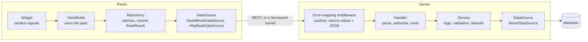

# The four layers

A request in Beak passes through the same few layers on both sides. On the server it is `Handler -> Service -> DataSource`. In the panel it is `Widget -> ViewModel -> Repository -> DataSource`. This page names what each layer may and may not do, says where errors are caught, and lists the seams where you swap a transport.

There is no `UseCase` layer, on either side. If you feel one is missing, the code you have in mind belongs in a `Service` on the server or in the `ViewModel` and `Repository` in the panel. Four layers on the panel side, three on the server, none between. The title counts the panel's.

## The idea in one picture



The two flows rhyme on purpose. Learn one and you know where code belongs in the other.

## How it works

### The server: Handler, Service, DataSource

`beakApiRouter` mounts one router per registered model under `/api/{table}`, and every route ends in the same three layers. No endpoint is hand-written.

The Handler parses the request, asks the policy, calls the service and encodes the result. It holds no business logic.

```dart title="packages/beak_backend/lib/src/endpoints/crud_handlers.dart"
--8<-- "packages/beak_backend/lib/src/endpoints/crud_handlers.dart:query"
```

The Service owns the logic: validation, defaults (a minted uuid for a string key, `created_at` and `updated_at` stamps), relation gating. It throws typed exceptions and never touches a Shelf type. Graph writes have their own service, `BeakGraphCommitService`.

```dart title="packages/beak_backend/lib/src/service/beak_resource_service.dart"
--8<-- "packages/beak_backend/lib/src/service/beak_resource_service.dart:serviceQuery"
```

The DataSource does raw I/O and lets exceptions propagate. It is an interface from `beak_core`, and `WormDataSource` implements it over the worm ORM. Because the service depends on the interface, worm types never leave `beak_backend`.

```dart title="packages/beak_core/lib/src/data/beak_data_source.dart"
--8<-- "packages/beak_core/lib/src/data/beak_data_source.dart:BeakDataSource"
```

Around all three sits the catch boundary. `beakErrorMappingMiddleware` is the only code on the server that turns an exception into a response. A `BeakException` becomes its status and a JSON body, and anything else becomes an opaque 500 that reports to `onUnexpectedError` and tells the client nothing:

```dart title="packages/beak_backend/lib/src/server/middleware/error_mapping_middleware.dart"
--8<-- "packages/beak_backend/lib/src/server/middleware/error_mapping_middleware.dart:beakErrorMappingMiddleware"
```

The status mapping is a `switch` over a sealed family, so a new exception type doesn't compile until it has a status:

```dart title="packages/beak_backend/lib/src/server/middleware/error_mapping_middleware.dart"
--8<-- "packages/beak_backend/lib/src/server/middleware/error_mapping_middleware.dart:exceptionStatus"
```

The middleware sits in a fixed stack: request log, CORS, JSON, error mapping, auth, your own middleware, then the router. Auth and your own middleware sit inside the error mapping, so anything they throw becomes JSON too.

### The panel: Widget, ViewModel, Repository, DataSource

The Widget is a `HookWidget`. It reads `ReadonlySignal`s, forwards user intent and holds no data. `BeakDataTable` asks its view model to refresh and watches the page signal:

```dart title="packages/beak_frontend/lib/src/table/beak_data_table.dart"
--8<-- "packages/beak_frontend/lib/src/table/beak_data_table.dart:viewModelLifecycle"
```

```dart title="packages/beak_frontend/lib/src/table/beak_data_table.dart"
--8<-- "packages/beak_frontend/lib/src/table/beak_data_table.dart:watchPage"
```

The ViewModel owns state as signals and exposes them read-only. It turns intent (a sort, a page change, a search) into a new `BeakQuerySpec`, calls the repository and switches on the result. It never catches a data-source failure itself.

```dart title="packages/beak_frontend/lib/src/state/beak_view_model.dart"
--8<-- "packages/beak_frontend/lib/src/state/beak_view_model.dart:BeakViewModel"
```

```dart title="packages/beak_frontend/lib/src/table/beak_table_view_model.dart"
--8<-- "packages/beak_frontend/lib/src/table/beak_table_view_model.dart:refresh"
```

The Repository is the catch boundary. Each method wraps a data-source call in `beakRun`, so a thrown `BeakException` comes back as a `BeakErr` and success as a `BeakOk`:

```dart title="packages/beak_frontend/lib/src/data/beak_run.dart"
--8<-- "packages/beak_frontend/lib/src/data/beak_run.dart:beakRun"
```

```dart title="packages/beak_frontend/lib/src/data/beak_resource_repository.dart"
--8<-- "packages/beak_frontend/lib/src/data/beak_resource_repository.dart:getOne"
```

Anything that is not a `BeakException` and that no mapper claims is rethrown. A programming error should crash loudly, not turn into a red banner.

The DataSource in the panel is a `ModelBeakDataSource`. It routes each model to its own transport if the model binds one, and to the HTTP source otherwise. The panel registers it once, next to a `BeakClient` and a session store, so widgets and view models never see a URL:

```dart title="packages/beak_frontend/lib/src/di/beak_locator.dart"
--8<-- "packages/beak_frontend/lib/src/di/beak_locator.dart:registerDataLayer"
```

### Where errors are caught

"One catch boundary per side" is the rule, and it has a few honest footnotes. Each catch has one job.

| Where | Catches | Does |
| --- | --- | --- |
| `beakErrorMappingMiddleware` (server) | everything | `BeakException` to status and JSON, the rest to an opaque 500 |
| `BeakGraphCommitService` (server) | `BeakException` inside the transaction | rolls back and answers with an `unapplied` receipt, not an HTTP error |
| `BeakClient` (core) | HTTP error bodies | decodes `code` back into the matching `BeakException` |
| `ModelBeakDataSource` (panel) | host exceptions | maps them with `mapException` into a `BeakException` and rethrows; it doesn't return results |
| `beakRun` in `BeakResourceRepository` (panel) | `BeakException` | returns `BeakErr`; other exceptions go to `mapException` or are rethrown |
| `BeakFormCommitRepository` (panel) | any `Exception` from a commit | returns an `unknown` receipt, because a thrown failure can't prove the server wrote nothing |

Actions go through the same repository: `executeBeakAction` wraps a row, bulk or global action in `BeakResourceRepository.run` and reports a `BeakErr` to the host. [Results and errors](results-and-errors.md) follows a failure across all of these.

### Where a transport plugs in

Every seam is an interface, so you replace one layer and leave the rest alone.

| Seam | Interface | Swap it for |
| --- | --- | --- |
| Panel to server | the `http.Client` under `BeakClient`, via `BeakPanel(httpClient:)` | a Serverpod tunnel (`ServerpodBeakHttpClient`) or a test client |
| Panel data source | `BeakDataSource`, via `BeakPanel(dataSource:)` or `BeakModel.dataSource` per model | a fake in a widget test, or typed RPC (`ServerpodDataSource`) |
| Server data source | `BeakDataSource`, `WormDataSource` by default | your own; graph commits are mounted only over `WormDataSource` |
| Server database | worm's `DatabaseAdapter` | `ServerpodSessionAdapter`, so Beak runs on Serverpod's database |
| Server pipeline | `BeakServer(middleware:, routes:, router:)` | extra endpoints and middleware in front of the generated API |

The Serverpod admin app is the proof that the layers hold. The panel side is the unchanged `HttpBeakDataSource` over a tunnelling `http.Client`, and the server side is the unchanged Shelf pipeline, run in memory inside one endpoint method:

```dart title="packages/beak_serverpod_flutter/lib/src/serverpod_beak_data_source.dart"
--8<-- "packages/beak_serverpod_flutter/lib/src/serverpod_beak_data_source.dart:serverpodBeakDataSource"
```

## Why it is shaped this way

Throw freely below, catch once above. Handlers, services and data sources throw and stay short. The middleware is the only server code that knows about status codes, so error shaping lives in one file. On the panel the repository plays the same role, which is why a `ViewModel` can be read top to bottom without a `try`.

A layer you can replace is a layer with one dependency. The service knows `BeakDataSource`, not worm. The view model knows the repository, not HTTP. That is what lets a Serverpod session, a fake or a custom backend take a layer's place, and it is why `beak_core` has no Flutter and `beak_backend` exposes no worm types.

No fifth layer. A use-case class between view model and repository would hold no state and no I/O, only the sequence a view model already runs. Beak keeps that sequence in the view model, where the signals are.

## What it means for you

- Put validation, defaults and rules that must hold for every caller in a service or on the model, and let them throw a `BeakException`. Don't catch in a handler.
- Put anything a widget needs to show in a `ViewModel` signal, and switch on `BeakOk` and `BeakErr` from the repository. Don't write `try/catch` around a data-source call in a widget.
- Implement `BeakDataSource` for a new backend or test double, and hand it to `BeakPanel(dataSource:)`. Nothing above the interface changes.
- Don't add an endpoint that bypasses the middleware. If you embed `beakApiRouter` in your own Shelf app, wrap it in `beakJsonMiddleware` and `beakErrorMappingMiddleware` so typed exceptions still become JSON.

## Continue reading

- [How data flows](how-data-flows.md) the spec and the save plan these layers pass between them.
- [Results and errors](results-and-errors.md) the `BeakResult` and `BeakException` types both catch boundaries speak.
- [Backend flow](../architecture/backend-flow.md) the server side in contributor detail.
- [Frontend flow](../architecture/frontend-flow.md) the panel side in contributor detail.
- [Custom data sources](../extending/custom-data-sources.md) implementing `BeakDataSource` for your own backend.
