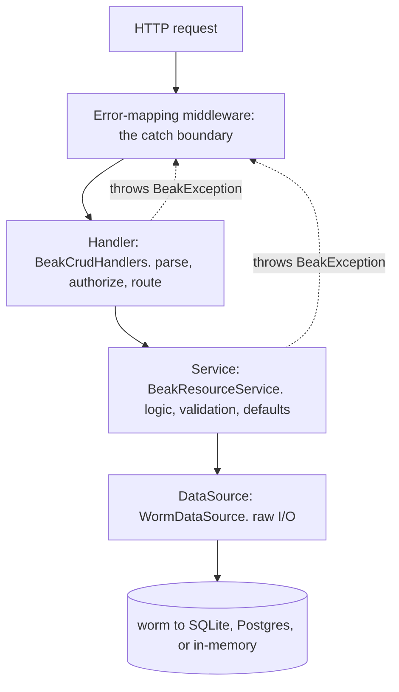
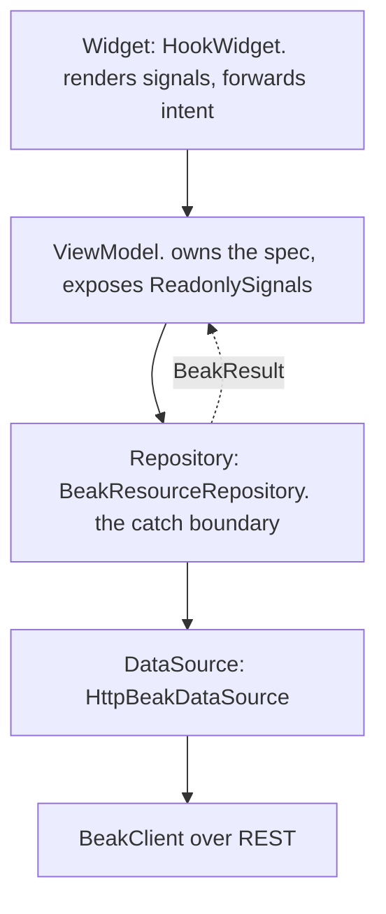

# The four layers

After this page you can name every layer a request passes through, on the
server and in the panel, say what each layer may and may not do, and point at
the one place errors are caught on each side.

Beak has two flows, and they rhyme. A write on the server travels
`Handler -> Service -> DataSource`. A tap in the panel travels
`Widget -> ViewModel -> Repository -> DataSource`. Each flow has a single catch
boundary: on the server it is the error-mapping middleware, in the panel it is
the Repository. Learn the shape once and you know where any new code belongs.

!!! warning "There is no UseCase layer"

    Some architectures slot a UseCase (or Interactor) between the ViewModel and
    the Repository. Beak does not. The ViewModel turns intent into a
    `BeakQuerySpec` and calls the Repository directly. If you find yourself
    reaching for a UseCase, you are looking for the Repository or the
    ViewModel. Four layers, no fifth.

## The backend flow: Handler, Service, DataSource



The whole REST surface is generated from a `BeakModelRegistry`, and the registry
is generated too: `beak prepare` collects every `@Resource` class under
`lib/models/` into `buildBeakRegistry()` in `lib/beak/registry.g.dart`.
`beakApiRouter` mounts one resource router per model under `/api/{table}`, and
every route ends in these same three layers. No endpoint is hand-written and no
model is hand-registered.

### The Handler parses, authorizes, and routes

A handler consults the policy, decodes the request body into a typed spec or
record, calls the service, and encodes the typed result. That is all it does.
No business logic lives here.

```dart title="packages/beak_backend/lib/src/endpoints/crud_handlers.dart"
Future<Response> query(Request request) async {
  _requireView(request);
  final spec = readBeakSpec(
    await readJsonObject(request),
    BeakQuerySpec.fromJson,
  );
  final page = await service.query(spec, scope: _scope(request));
  return _json(200, page.toJson((record) => record.toJson()));
}
```

`_scope` is the policy's row scope for this request's principal: a `BeakFilter?`
the handler reads once and hands down. It is applied in the service, not here,
so a handler that forgot to pass it could not open a hole quietly. See
[Auth and policies](../backend/auth-and-policies.md).

Malformed input is a user error, so the handler raises a
`BeakValidationException` (which the boundary maps to `422`), never a `500`:

```dart title="packages/beak_backend/lib/src/endpoints/crud_handlers.dart"
try {
  return BeakRecord(
    values: {
      for (final MapEntry(:key, :value) in body.entries)
        key: BeakValue.fromJson(value),
    },
  );
} on BeakConfigurationException catch (exception) {
  throw BeakValidationException(
    'Malformed record body: ${exception.message}',
  );
}
```

### The Service holds the logic

The service is the per-model logic layer: validation, create-time defaults
(minted uuid ids, stamped timestamps), and relation-kind gating. It throws
typed `BeakException`s and never touches a Shelf type.

```dart title="packages/beak_backend/lib/src/service/beak_resource_service.dart"
/// Validates and stores [input], minting a uuid primary key (for
/// string-keyed models) and stamping `created_at`/`updated_at` when the
/// model declares them and the caller did not.
Future<BeakRecord> create(BeakRecord input) {
  final prepared = _withCreateDefaults(input);
  validation.validate(model, prepared, isCreate: true);
  return dataSource.create(model.table, prepared);
}
```

When the logic rejects something, the service throws. Here it refuses a spec
aimed at the wrong table:

```dart title="packages/beak_backend/lib/src/service/beak_resource_service.dart"
void _requireSpecTargets(String table, String specKind) {
  if (table != model.table) {
    throw BeakValidationException(
      '$specKind spec targets "$table" but this endpoint serves '
      '"${model.table}".',
    );
  }
}
```

### The DataSource does raw I/O

The service talks to a `BeakDataSource`, an interface from beak_core. On the
server the implementation is `WormDataSource`, which turns the spec into a worm
query and lets any I/O exception propagate up. Because the service depends on
the interface and not the implementation, worm never leaks past
beak_backend. See [The data source seam](../backend/the-data-source-seam.md)
for how the same interface serves the panel over HTTP.

### The catch boundary: error-mapping middleware

Every request runs inside one middleware whose only job is to turn thrown
exceptions into responses. A `BeakException` becomes its typed status and JSON
body; anything else becomes an opaque `500` so internals never reach a client.

```dart title="packages/beak_backend/lib/src/server/middleware/error_mapping_middleware.dart"
Middleware beakErrorMappingMiddleware({
  BeakUnexpectedErrorListener? onUnexpectedError,
}) =>
    (Handler inner) => (Request request) async {
      try {
        return await inner(request);
      } on BeakException catch (exception) {
        return _exceptionResponse(exception, request);
      } catch (error, stackTrace) {
        onUnexpectedError?.call(error, stackTrace);
        return _jsonResponse(500, {
          'code': 'internal',
          'message': 'Internal server error.',
          ..._requestIdEntry(request),
        });
      }
    };
```

The `BeakException` family is sealed, so the status mapping is an exhaustive
switch. Add an exception type and the compiler makes you handle it here:

```dart title="packages/beak_backend/lib/src/server/middleware/error_mapping_middleware.dart"
final int statusCode = switch (exception) {
  BeakValidationException() => 422,
  BeakNotFoundException() => 404,
  BeakAuthenticationException() => 401,
  BeakAuthorizationException() => 403,
  BeakConflictException() => 409,
  BeakConfigurationException() => 500,
  BeakStorageException() => 500,
};
```

!!! note "Why one boundary and not try/catch everywhere"

    Handlers and services throw freely and stay short. The middleware is the
    only code that knows about HTTP status codes, so error shaping lives in
    exactly one file. A `BeakValidationException` thrown three layers down still
    lands as a clean `422` with a `{code, message, fieldErrors, requestId}`
    body.

## The frontend flow: Widget, ViewModel, Repository, DataSource



The panel mirrors the server. Data flows down through four layers, and the
Repository catches on the way back up so failures return as values, not
thrown exceptions.

### The Widget renders signals and forwards intent

Widgets are `HookWidget`s (never `StatefulWidget`). A widget watches a
`ReadonlySignal` and rebuilds when it changes, and it forwards user intent (a
sort, a page change) to its ViewModel. It holds no data and catches no errors.

### The ViewModel owns state and never uses try/catch

A ViewModel owns its `Signal`s, exposes them upward as `ReadonlySignal`s, and
translates intent into `BeakQuerySpec` changes. It calls the Repository and
switches on the result. It never writes `try/catch`.

```dart title="packages/beak_frontend/lib/src/table/table_view_model.dart"
Future<void> refresh() async {
  final int requestId = ++_latestRequestId;
  _loading.value = true;
  _error.value = null;
  final result = await _repository.query(_spec.value);
  if (requestId != _latestRequestId) {
    return;
  }
  switch (result) {
    case BeakOk(:final value):
      _page.value = value;
    case BeakErr(:final error):
      _error.value = error;
  }
  _loading.value = false;
}
```

The base class enforces the discipline: state is created with `ownedSignal`
and exposed as a `ReadonlySignal`, and disposed together.

```dart title="packages/beak_frontend/lib/src/state/beak_view_model.dart"
abstract base class BeakViewModel {
  @protected
  Signal<T> ownedSignal<T>(T value) {
    final owned = signal<T>(value);
    _cleanups.add(owned.dispose);
    return owned;
  }
```

### The Repository is the catch boundary

The Repository wraps each data-source call so a thrown `BeakException` becomes
a `BeakErr` and success becomes a `BeakOk`. By the time a result reaches a
ViewModel, failure is a value it can pattern-match on.

```dart title="packages/beak_frontend/lib/src/data/beak_resource_repository.dart"
/// Runs a query, capturing failures as [BeakErr].
Future<BeakResult<BeakPage<BeakRecord>>> query(BeakQuerySpec spec) =>
    _guard(() => dataSource.query(spec));

Future<BeakResult<T>> _guard<T>(Future<T> Function() run) async {
  try {
    return BeakOk(await run());
  } on BeakException catch (exception) {
    return BeakErr(exception);
  }
}
```

`BeakResult<T>` is the frontend counterpart of the server's error-mapping
middleware: one place that turns exceptions into a shape the layers above can
handle without catching. See [Results and errors](results-and-errors.md) for
the full type.

### The DataSource speaks HTTP

The panel's `BeakDataSource` is `HttpBeakDataSource`, which delegates every
operation to a typed `BeakClient` pointed at `apiBaseUrl`. Widgets and
ViewModels stay transport-blind, and the interface is identical to the
backend's worm-backed one.

```dart title="packages/beak_frontend/lib/src/data/http_beak_data_source.dart"
@override
Future<BeakPage<BeakRecord>> query(BeakQuerySpec spec) =>
    client.query(spec.table, spec);
```

You do not wire that up. `registerBeakDependencies`, which `BeakPanel` calls at
startup, builds the client from the panel config and registers the source
behind the interface:

```dart title="packages/beak_frontend/lib/src/di/beak_locator.dart"
final client = BeakClient(
  baseUrl: config.apiBaseUrl,
  httpClient: httpClient,
  tokenProvider: tokenProvider ?? () => sessions.token,
);
sessions = BeakSessionStore(client);
final source = dataSource ?? HttpBeakDataSource(client);
```

`config.apiBaseUrl` comes from `api.baseUrl` in
[`beak.yaml`](../reference/beak-yaml.md), by way of the generated panel:

```dart title="examples/store/lib/beak/panel.g.dart"
apiBaseUrl: const String.fromEnvironment(
  'BEAK_API_BASE_URL',
  defaultValue: 'http://localhost:8080',
),
```

Because the seam is the same `BeakDataSource` interface, a test passes
`dataSource:` a fake and the ViewModel never notices.

## The two catch boundaries side by side

Each flow catches once. Everything between the boundary and the point of
failure throws freely and stays readable.

| | Backend | Frontend |
| --- | --- | --- |
| Layers | Handler, Service, DataSource | Widget, ViewModel, Repository, DataSource |
| Catch boundary | `beakErrorMappingMiddleware` | `BeakResourceRepository` |
| Failure becomes | HTTP status + JSON body | `BeakResult<T>` (`BeakOk` / `BeakErr`) |
| What throws | Handlers and Services throw `BeakException` | `DataSource` throws; nobody above catches |
| Never catches | Handlers, Services | Widgets, ViewModels |

Both boundaries lean on the same sealed `BeakException` family, so the codes
line up end to end: a `BeakValidationException` in the service becomes a `422`
on the wire, and the client re-hydrates it into a `BeakErr` holding the same
typed exception.

## Continue reading

- [How data flows](how-data-flows.md) the `BeakQuerySpec` these layers pass
  between them, and how it round-trips.
- [Results and errors](results-and-errors.md) the `BeakResult` and
  `BeakException` types both catch boundaries speak.
- [Middleware](../backend/middleware.md) the full server pipeline the
  error-mapping boundary sits in.
- [The data source seam](../backend/the-data-source-seam.md) the interface
  that keeps worm on the server and REST in the panel.
