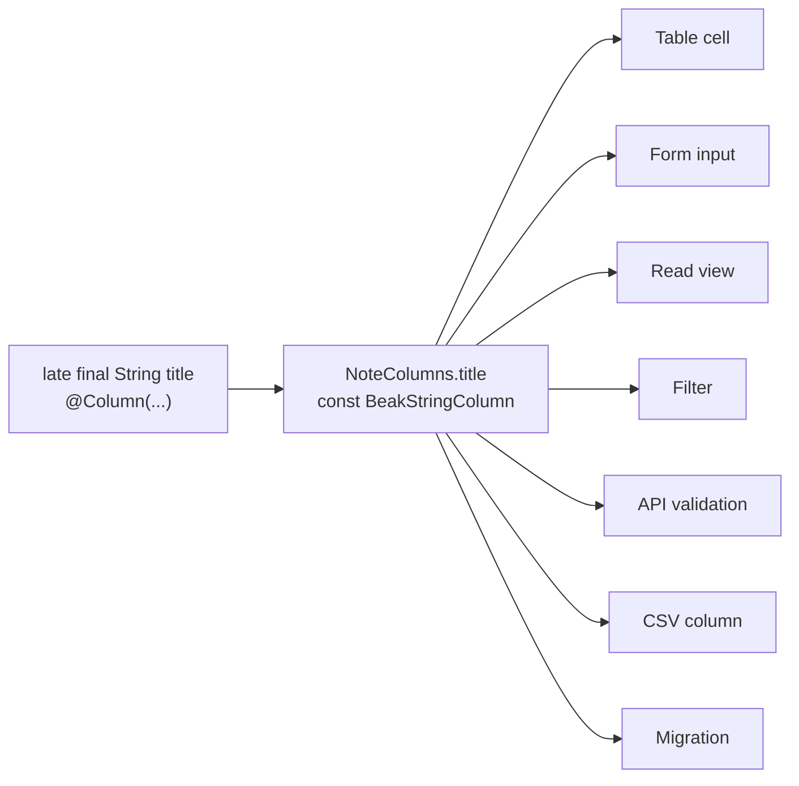

# The one-definition promise

You write a field once. The table cell, the form input, the read view, the filter, the API's validation, the CSV column and the migration all read that one declaration, so there is nothing to keep in sync. This page shows the declaration, who reads it, and the places where the promise stops.

## The idea in one picture



One field, seven mouths. There is a single source of truth, and it is the line you wrote. Change a label or tighten a rule, run `beak prepare`, and every consumer picks it up. Nothing drifts, because nothing was copied.

## How it works

Here is one field of the quickstart's `Note`, and the column `beak prepare` wrote from it.

```dart title="examples/quickstart/lib/resources/notes/models/note.dart"
  @Display()
  @Column(searchable: true, sortable: true, rules: [BeakMaxLength(255)])
  late final String title;
```

```dart title="examples/quickstart/lib/resources/notes/models/note.beak.dart"
  static const BeakStringColumn title = BeakStringColumn(
    key: 'title',
    label: 'Title',
    rules: [BeakRequired(), BeakMaxLength(255)],
    searchable: true,
    sortable: true,
    maxLength: 255,
  );
```

Read the two side by side. `String` picked `BeakStringColumn`. The field name became the key `title` and the label `Title`. The field is not nullable, so `BeakRequired()` went in ahead of your `BeakMaxLength(255)`, and the length also sized the stored column. You wrote the rule once and it landed in three places.

### Who reads the column

Each consumer reads a different property of the same `BeakColumn`.

| Consumer | Reads from the column | Where |
| --- | --- | --- |
| Table cell | `visibleOn` contains `table`, the render intent, `sortable` | `renderBeakCell` in `packages/beak_frontend/lib/src/table/column_cell_renderer.dart` |
| Form input | `visibleOn` contains `form`, the kind, the `rules` | `BeakFormLayout.fromModel` in `packages/beak_frontend/lib/src/form/beak_form_layout.dart` |
| Read view | `visibleOn` contains `detail`, drawn read-only with the detail intent | `beakDefaultShowLayout` in `packages/beak_frontend/lib/src/pages/beak_default_show_layout.dart` |
| Filter | `filterable`; the kind picks the control | `beakDefaultFiltersOf` in `packages/beak_frontend/lib/src/filters/beak_default_filters.dart` |
| API validation | `rules` and nullability | `ValidationService` in `packages/beak_backend/lib/src/service/validation_service.dart` |
| CSV column | `visibleOn` contains `table`, the `label` | `CsvExportService` in `packages/beak_backend/lib/src/export/csv_export_service.dart` |
| Migration | key, kind, nullability, `unique`, `indexed` | `BeakBlueprint.defineColumns` in `packages/beak_backend/lib/src/data/worm/beak_blueprint.dart` |

`sortable` and `searchable` feed the table header and the search box; `searchable` also lands in the generated `NoteModel.search`.

The filter row is worth a second look. A column that says `filterable: true` gets a control without you writing one, and the kind picks it. (A resource that declares filters of its own replaces the implied ones, it doesn't add to them.)

```dart title="packages/beak_frontend/lib/src/filters/beak_default_filters.dart"
--8<-- "packages/beak_frontend/lib/src/filters/beak_default_filters.dart:filterFor"
```

The `switch` has no default arm on purpose. A new column kind has to decide what filtering it means, and structured or binary kinds answer `null`: declare a filter for those on the resource.

### The validation is one class on both sides

The form does not re-implement your rules. `BeakRule` is a sealed family in `beak_core`, and both ends of the wire call the same `validate`.

```dart title="packages/beak_backend/lib/src/service/validation_service.dart"
--8<-- "packages/beak_backend/lib/src/service/validation_service.dart:ValidationService"
```

The panel runs `BeakValidation` before it posts, the server runs it again before it writes, and each rule's own `validate` produces the message. Here is the server's side of an empty title, from the quickstart API:

```console
$ curl -s -XPOST localhost:8080/api/notes -H 'content-type: application/json' \
    -d '{"title":"","pinned":true}'
{"code":"validation","message":"Validation failed for \"notes\".","fieldErrors":{"title":["This field is required."]},"requestId":"1de198bb7169db7f"}
```

"This field is required." is the string `BeakRequired` returns, and it is what the form shows under the input. Two consumers, one sentence.

### The migration reads the model

`beak prepare` writes the migration a new resource needs, once. It doesn't spell the columns out. It hands the model to `BeakBlueprint`, which derives the DDL from the same column list the panel renders.

```dart title="examples/quickstart/lib/migrations/create_notes_table.dart"
    await schema.create('notes', (table) {
      BeakBlueprint.defineColumns(table, const NoteModel());
      BeakBlueprint.defineForeignKeys(table, const NoteModel());
    });
```

So `BeakRequired` becomes `NOT NULL`, `unique: true` becomes a unique index, `indexed: true` a plain one, and every belongs-to foreign key gets an index without being asked. Fresh databases can't disagree with the model.

### Contexts and intents

`beak_core` can't import Flutter, so a column never names an obers_ui widget. It carries a `BeakRenderIntent` per `BeakContext` (a badge, a relative date, a thumbnail), and `renderBeakCell` in the frontend maps each intent to a widget.

```dart title="packages/beak_core/lib/src/context/beak_context.dart"
--8<-- "packages/beak_core/lib/src/context/beak_context.dart:BeakContext"
```

A date column with `format: BeakDateFormat.relative` draws "3 days ago" in the table and a date picker in the form, without you writing two widgets. `visibleOn` decides which contexts include the column at all, and this is where the promise has fine print (see below).

### One edit, end to end

Add a field to the schema class:

```diff
   @Column(filterable: true)
   late final bool pinned;
+
+  /// Who owns it.
+  @Column(searchable: true)
+  late final String? owner;
```

Then regenerate:

```console
$ beak prepare
  generated  1 of 8 files
  agents     up to date · docs Beak 0.9.0, .dart_tool/beak/docs/ai-index.md
```

One file changed, `note.beak.dart`. It now has `NoteColumns.owner`, `NoteModel.owner`, a typed `NoteRecord.owner`, and `'owner'` in the columns `NoteModel.search` looks through. The table, form, read view and API validation already know the field. The field is nullable, so no `BeakRequired` and no `NOT NULL`.

The database is the one place that doesn't follow on its own. A migration is written once and is yours from then on, so an existing database needs `beak make:migration AddOwnerToNotes --from-drift`, which compares the schema classes with the database and fills the migration in, and then `beak migrate`.

## Why it is shaped this way

The schema class is the only thing both sides can import. It is pure Dart, so the server, the panel and the migration tool all read the same file. Anything that needs Flutter (a screen, a widget, a layout) lives elsewhere, and that is why refinements are separate from the definition.

Refinements stay in screens and don't become server rules. A `BeakInput` in a form layout can carry its own `label`, `validate`, `validators`, `visibleIf` and `enabledIf`. Those shape one workflow and run in the panel only. Rules every caller must obey belong on the model: `rules:` on the column, `validationRules` for cross-field and cross-record checks, `behavior` for derived values. [Where authority lives](where-authority-lives.md) has the full split.

`visibleOn` is presentation. It decides what the panel draws, and the API doesn't read it. The quickstart's `body` column is hidden in the table, and `id` is marked `detail` only, yet a query returns both:

```console
$ curl -s -XPOST localhost:8080/api/notes/query -H 'content-type: application/json' \
    -d '{"table":"notes","pagination":{"page":1,"perPage":1}}'
{"items":[{"values":{"id":"b37d3182-...","title":"Buy seed","body":null,"pinned":true,
"created_at":{"type":"dateTime","value":"2026-09-29T04:32:09.933Z"},"updated_at":{...}},
"relations":{}}],"total":2,"page":1,"perPage":1}
```

What a caller may see is a policy question, not a `visibleOn` one.

One context does less than its name suggests. `BeakContext.filter` is a render context, the intent a column draws with inside a filter, and nothing reads `visibleOn` for it: the filter bar comes from `filterable`. The generated read view lists the columns marked `detail`, so a column that is only `detail` (`created_at` in the scaffold) is on the default show page and a form-only column such as a password is not. The same context picks the columns of the related-record tabs there, five at most, and `BeakFieldBlock` draws with the detail intent. A resource with its own `BeakFormScreen` for the read role shares one layout between reading and editing, so the form columns decide what that page shows.

The definition covers one model at a time. A rule that spans records (a unique pair, a total over child rows, a state machine) has a home on the model too, in `validationRules` and `behavior`, but it is still yours to write. Beak generates the plumbing, not the business rule.

## What it means for you

| Do | Don't |
| --- | --- |
| Put types, nullability, `rules:` and `filterable`/`searchable`/`sortable` on the schema field | Repeat a rule in a `BeakInput` and expect the server to enforce it |
| Run `beak prepare` after every schema edit | Edit `*.beak.dart`; the next run overwrites it |
| Write a migration for an existing database with `--from-drift` | Expect a schema edit to alter a table that already exists |
| Use `visibleOn` to shape the panel | Use `visibleOn` to keep a value from a caller |
| Override a label or layout per screen when a workflow needs it | Fork the column to get a second label |

## Continue reading

- [Fields](../models/fields.md) the column kinds and the options `@Column` takes.
- [Validation](../models/validation.md) column rules, record rules and where each one runs.
- [Generated code](../models/generated-code.md) everything `beak prepare` writes next to a schema class.
- [Migrations](../backend/migrations.md) writing and applying the table changes a schema edit implies.
