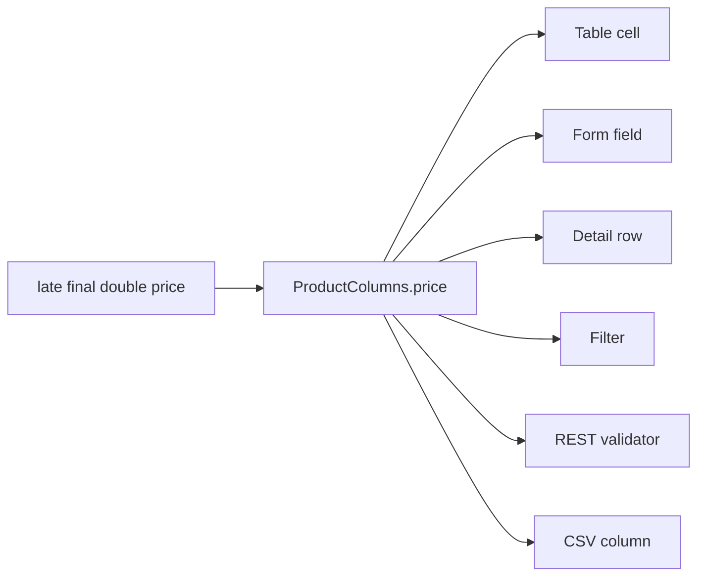

# The one-definition promise

After this page you will know exactly what happens when you write one line of a
schema class, and why you never have to write it a second time. You declare a
field; `beak prepare` writes a typed `const BeakColumn`; that column feeds six
mouths: the table cell, the form field, the detail row, the filter, the REST
validator, and the CSV export column. The same declaration also produces the
database migration and the code that registers the resource.

## One declaration

Here is the price of a coffee bag, as it appears in the store's product schema.
One field: a name, a Dart type, and the configuration the type cannot carry.

```dart title="examples/store/lib/models/product.dart"
/// Sale price in euros.
@Column(prefix: '€', sortable: true, filterable: true, rules: [BeakMin(0)])
late final double price;
```

`beak prepare` reads that and writes the column beside it, in
`product.beak.dart`:

```dart title="examples/store/lib/models/product.beak.dart"
/// Sale price in euros.
static const BeakDecimalColumn price = BeakDecimalColumn(
  key: 'price',
  label: 'Price',
  rules: [BeakRequired(), BeakMin(0)],
  prefix: '€',
  sortable: true,
  filterable: true,
);
```

Read the two side by side and you can see what the generator did. `double`
picked `BeakDecimalColumn`. The field name became the key `price` and the label
`Price`. And because `double price` is not nullable, a `BeakRequired()` rule was
added ahead of your `BeakMin(0)`.

You did not write an HTML input, a table header, a JSON validator, a CSV header,
a filter dropdown, or a `CREATE TABLE` line. You described the field, and the
rest of Beak now knows how to treat it.

!!! note "Nullability is the required-ness dial"
    `late final double price` is required. `late final BeakText? summary` is
    optional. That one fact drives the form validator, the API's validation and
    the column's `NOT NULL` together, so there is no way for the three to
    disagree. See [Defining a resource](../models/defining-models.md).

## The six mouths

Every property on the generated column is read by a different consumer, on both
sides of the wire:

| Mouth | Package | What it reads from `price` |
| ------ | ------- | -------------------------- |
| Table cell | `beak_frontend` | The decimal render intent plus `prefix: '€'` for the figure, `label: 'Price'` for the header, `sortable: true` for the sort arrows. |
| Form field | `beak_frontend` | A numeric input bridged to `obers_ui_autoforms`, with `BeakRequired()` and `BeakMin(0)` mirrored as client validators. |
| Detail row | `beak_frontend` | The read-only value under its `label`. |
| Filter | `beak_frontend` | A filter control, because `filterable: true`. The chosen operator and operand travel as a typed `BeakValue`. |
| REST validator | `beak_backend` | The same `rules`, re-run server-side by `ValidationService` on every write, producing the same messages the client showed. |
| CSV column | `beak_backend` | A column in the export, headed by `label`, via `CsvExportService`. |



The point of the diagram is the single arrow tail. There is one source of truth,
and it is the field you wrote. Rename the label, tighten a rule, add a `suffix`,
run `beak prepare`, and every consumer updates. Nothing drifts, because nothing
was ever copied.

!!! note "Client and server run the *same* rules"
    `BeakRequired()` and `BeakMin(0)` are `beak_core` types. The panel runs them
    before it posts, and the server runs the identical instances before it
    writes. A user sees the same error the API would return, and the API never
    trusts the client to have checked. See [Validation rules](../models/validation-rules.md).

## What else the declaration writes

The six surfaces are the visible half. The same field also decides two things
that used to be separate files you kept in sync by hand.

### The migration reads the model

`beak prepare` writes the migration a new resource needs, once. It does not
spell the columns out: it hands the model to `BeakBlueprint`, which derives the
DDL from the same column list the panel renders.

```dart title="examples/store/lib/migrations/create_products_table.dart"
@override
Future<void> upSchema(Schema schema) async {
  // Read from the model, so the table and the resource cannot drift:
  // adding a column to the schema class changes the DDL with no second
  // edit here.
  await schema.create('products', (table) {
    BeakBlueprint.defineColumns(table, const ProductModel());
    BeakBlueprint.defineForeignKeys(table, const ProductModel());
  });
}
```

So `price` becomes a `decimal` column, `BeakRequired()` makes it `NOT NULL`,
`@Column(unique: true)` on `sku` becomes a unique index, `@Column(indexed: true)`
on `name` becomes a plain one, and every belongs-to foreign key is indexed
without being asked. One declaration, one schema.

The migration is written once and is then yours: Beak never rewrites a migration
it has written. Changing a table later is an explicit `schema.alter`. See
[Migrations](../backend/migrations.md).

### The wiring registers itself

A file under `lib/models/` is a resource. There is no list to append to.
`beak prepare` collects what it found into `registry.g.dart`:

```dart title="examples/store/lib/beak/registry.g.dart"
/// Every model discovered under `lib/models/`, in path order.
const List<BeakModel> beakModels = <BeakModel>[
  CategoryModel(),
  OrderModel(),
  OrderItemModel(),
  ProductModel(),
  RoastProfileModel(),
  TagModel(),
  UserModel(),
];

/// A registry populated with every model in [beakModels].
BeakModelRegistry buildBeakRegistry() {
  final registry = BeakModelRegistry();
  for (final model in beakModels) {
    registry.register(model);
  }
  return registry;
}
```

The server reads that registry to generate its REST surface, and `panel.g.dart`
reads the same models to build the sidebar, the list page, the show page and the
form. Adding a resource is adding a file.

## Which surfaces a column appears on

A column does not have to feed all six mouths. `visibleOn` is a
`Set<BeakContext>` that decides which surfaces show it. The default is table,
form, and detail; narrow it when a field belongs to only some of them.

```dart title="examples/store/lib/models/product.dart"
/// The short description shown in listings.
@Column(visibleOn: {BeakContext.form, BeakContext.detail})
late final BeakText? summary;
```

The two columns that most want narrowing are the two you never declare. Beak
adds the primary key to every resource, and a belongs-to relationship brings its
own foreign key. Both arrive in the part file already scoped to the surface they
make sense on:

```dart title="examples/store/lib/models/product.beak.dart"
/// Primary key.
static const BeakStringColumn id = BeakStringColumn(
  key: 'id',
  label: 'Id',
  visibleOn: {BeakContext.detail},
);
```

```dart title="examples/store/lib/models/product.beak.dart"
/// Foreign key backing [category].
static const BeakStringColumn categoryId = BeakStringColumn(
  key: 'category_id',
  label: 'Category',
  visibleOn: {BeakContext.form},
);
```

The id shows on the detail view and nowhere else: no one edits it in a form, and
it would clutter the table. The foreign key only makes sense as a form input,
because the list page shows the related category's name instead of the uuid the
key stores.

`visibleOn` gates the visual surfaces (cell, form field, detail row). The
validator and the CSV exporter still know about the column regardless, because
they work from the model's full column list, not from what happens to be on
screen.

## Richer columns, same promise

The promise holds for the interesting column kinds too. An enum field carries
its own values and the badge colors it renders with, so the table cell, the form
dropdown, and the filter all agree on the allowed set:

```dart title="examples/store/lib/models/product.dart"
/// Lifecycle state, rendered as a coloured badge.
@Column(filterable: true)
@Badges({
  ProductStatus.draft: BeakColor.muted,
  ProductStatus.published: BeakColor.success,
  ProductStatus.archived: BeakColor.warning,
})
late final ProductStatus status;
```

The generated column is typed over your enum, and its `values` come from the
enum itself:

```dart title="examples/store/lib/models/product.beak.dart"
/// Lifecycle state, rendered as a coloured badge.
static const BeakEnumColumn<ProductStatus> status =
    BeakEnumColumn<ProductStatus>(
      key: 'status',
      label: 'Status',
      rules: [BeakRequired()],
      filterable: true,
      badgeColors: {
        ProductStatus.draft: BeakColor.muted,
        ProductStatus.published: BeakColor.success,
        ProductStatus.archived: BeakColor.warning,
      },
      values: ProductStatus.values,
    );
```

The table renders a colored badge, the form offers exactly `draft`, `published`,
and `archived`, and the filter offers those same three options. You declared the
lifecycle once, as a Dart enum, and every surface inherited it.

## Wiring it up

The whole contract between your schema class and the rest of Beak is one ordered
list, and the generated model is what hands it over:

```dart title="examples/store/lib/models/category.beak.dart"
@override
List<BeakColumn> get columns => CategoryColumns.values;
```

The backend generates the CRUD API from that list while the panel generates the
table, form, and detail pages from the same list. That is the whole of it: one
file in `lib/models/`, a whole resource out.

## Continue reading

- [The type-safety promise](the-type-safety-promise.md) why none of this uses strings or `dynamic`.
- [Rendering per surface](rendering-per-surface.md) how one column becomes six different widgets.
- [Defining a resource](../models/defining-models.md) the schema class in full, field by field.
- [Generated code](../models/generated-code.md) everything `beak prepare` writes, and where.
- [The generated API](../backend/the-generated-api.md) the endpoints the same definition produces.
