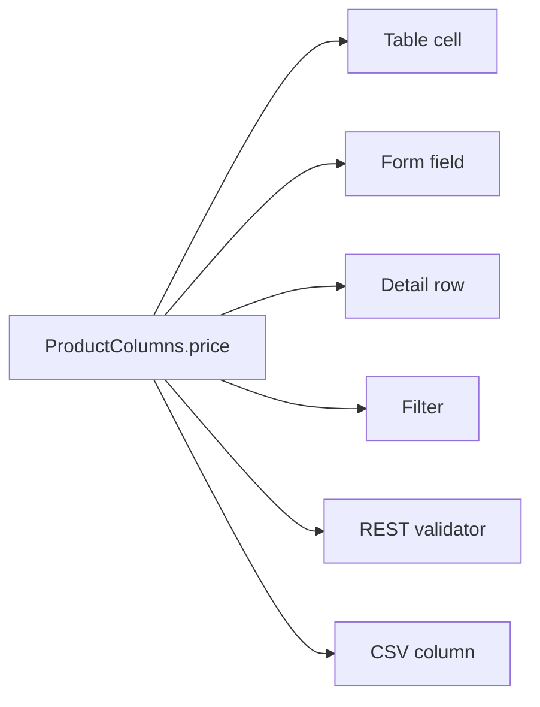

# The one-definition promise

After this page you will know exactly what happens when you write one line of
column config, and why you never have to write it a second time. A `BeakColumn`
is declared once and feeds six mouths: the table cell, the form field, the detail
row, the filter, the REST validator, and the CSV export column.

## One declaration

Here is a real column from the coffee roastery's product model. It is a `const`,
it is typed (`BeakDecimalColumn`), and it is the only place the notion of "price"
is spelled out anywhere in the app.

```dart
/// Sale price in euros.
static const price = BeakDecimalColumn(
  key: 'price',
  label: 'Price',
  prefix: '€',
  sortable: true,
  filterable: true,
  rules: [BeakRequired(), BeakMin(0)],
);
```

That is it. You did not write an HTML input, a table header, a JSON validator, a
CSV header, or a filter dropdown. You described the field, and six different parts
of Beak now know how to treat it.

## The six mouths

Every property on that column is read by a different consumer, on both sides of
the wire:

| Mouth | Package | What it reads from `price` |
| ------ | ------- | -------------------------- |
| Table cell | `beak_frontend` | The decimal render intent plus `prefix: '€'` for the figure, `label: 'Price'` for the header, `sortable: true` for the sort arrows. |
| Form field | `beak_frontend` | A numeric input bridged to `obers_ui_autoforms`, with `BeakRequired()` and `BeakMin(0)` mirrored as client validators. |
| Detail row | `beak_frontend` | The read-only value under its `label`. |
| Filter | `beak_frontend` | A filter control, because `filterable: true`. The chosen operator and operand travel as a typed `BeakValue`. |
| REST validator | `beak_backend` | The same `rules`, re-run server-side by `ValidationService` on every write, producing the same messages the client showed. |
| CSV column | `beak_backend` | A column in the export, headed by `label`, via `CsvExportService`. |



The point of the diagram is the single arrow tail. There is one source of truth.
Rename the label, tighten a rule, add a `suffix`, and every consumer updates on
the next build. Nothing drifts, because nothing was ever copied.

!!! note "Client and server run the *same* rules"
    `BeakRequired()` and `BeakMin(0)` are `beak_core` types. The panel runs them
    before it posts, and the server runs the identical instances before it
    writes. A user sees the same error the API would return, and the API never
    trusts the client to have checked. See [Validation rules](../models/validation-rules.md).

## Which surfaces a column appears on

A column does not have to feed all six mouths. `visibleOn` is a
`Set<BeakContext>` that decides which surfaces show it. The default is table,
form, and detail; narrow it when a field belongs to only some of them.

```dart
/// Primary key.
static const id = BeakStringColumn(
  key: 'id',
  label: 'Id',
  visibleOn: {BeakContext.detail},
);
```

The id shows on the detail view and nowhere else: no one edits it in a form, and
it would clutter the table. The reverse case is the foreign key, which only makes
sense as a form input:

```dart
/// Foreign key owned by the `category` belongs-to relationship.
static const categoryId = BeakStringColumn(
  key: 'category_id',
  label: 'Category',
  visibleOn: {BeakContext.form},
);
```

`visibleOn` gates the visual surfaces (cell, form field, detail row). The
validator and the CSV exporter still know about the column regardless, because
they work from the model's full column list, not from what happens to be on
screen.

## Richer columns, same promise

The promise holds for the interesting column kinds too. An enum column carries
its own values and the badge colors it renders with, so the table cell, the form
dropdown, and the filter all agree on the allowed set:

```dart
/// Lifecycle state, rendered as a colored badge.
static const status = BeakEnumColumn<ProductStatus>(
  key: 'status',
  label: 'Status',
  values: ProductStatus.values,
  defaultValue: ProductStatus.draft,
  filterable: true,
  badgeColors: {
    ProductStatus.draft: BeakColor.muted,
    ProductStatus.published: BeakColor.success,
    ProductStatus.archived: BeakColor.warning,
  },
);
```

The table renders a colored badge, the form offers exactly `draft`, `published`,
and `archived`, and the filter offers those same three options. You declared the
lifecycle once, as a Dart enum, and every surface inherited it.

## Wiring it up

The model gathers its columns into one ordered list, and that is the entire
contract the rest of Beak consumes:

```dart
@override
List<BeakColumn> get columns => ProductColumns.values;
```

Register the model (see [The model registry](../models/the-registry.md)) and the
backend generates the CRUD API from that list while the panel generates the
table, form, and detail pages from the same list. One definition in, a whole
resource out.

## Continue reading

- [The type-safety promise](the-type-safety-promise.md) why none of this uses strings or `dynamic`.
- [Rendering per surface](rendering-per-surface.md) how one column becomes six different widgets.
- [Column types](../models/column-types.md) every built-in column and its options.
- [The generated API](../backend/the-generated-api.md) the endpoints the same definition produces.
