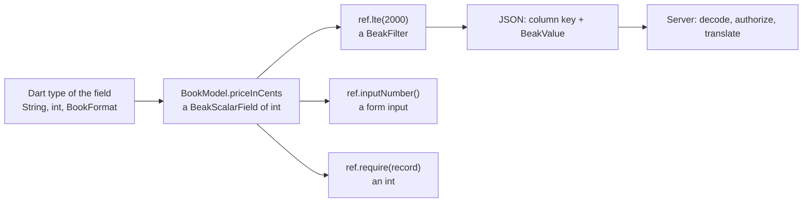

# The type-safety promise

You never write a string field reference, and you never touch `dynamic`. The Dart type of a schema field flows into every query, form input, table column and record read, and the compiler checks each step. Strings still exist on the wire and in a few configuration corners. This page lists every one of them.

## The idea in one picture



Strings appear only at the wire node and after it. You never type them, because the reference produces them.

## How it works

### A field type becomes a reference

You declare `late final String title;`. `beak prepare` writes a typed reference for it, and the model exposes that reference as a static.

```dart title="examples/quickstart/lib/resources/notes/models/note.beak.dart"
  BeakScalarField<String> get title => BeakScalarField<String>(
    model: _model,
    column: NoteColumns.title,
    path: _path,
    isRequired: true,
  );
```

```dart title="examples/quickstart/lib/resources/notes/models/note.beak.dart"
  /// Typed reference to [title] in this model.
  static final title = fields.title;
```

`NoteModel.title` is a `BeakScalarField<String>`. It carries the value type `T`, the root model, a path of relationships (empty for a field of the model itself) and whether the schema requires it.

```dart title="packages/beak_core/lib/src/model/beak_field_ref.dart"
class BeakScalarField<T extends Object> extends BeakFieldRef<T> {
  const BeakScalarField({
    required super.model,
    required this.column,
    super.path,
    super.isRequired,
  });
```

A relationship gets a reference too. `BookModel.author` is a to-one reference, and `BookModel.author.name` is the author's `name` field reached through it. The path keeps both ends, so a filter on `BookModel.author.name` knows it starts at a book and goes through `author`.

### The type limits what you can say

Everything that takes a reference inherits its `T`. This snippet is illustrative and does not compile; the class and field names are the bookshop example's real ones.

```dart
final cheap = BookModel.priceInCents.lte(2000);          // fine
final wrongValue = BookModel.priceInCents.eq('2000');    // String for an int
final wrongOp = BookModel.stock.contains('3');           // text match on a number
final typo = BookModel.titel;                            // no such field
```

The analyzer reports the last three, each at the line you wrote (file and position trimmed here):

```console
$ dart analyze
  error - The argument type 'String' can't be assigned to the parameter type 'int?'.  - argument_type_not_assignable
  error - The method 'contains' isn't defined for the type 'BeakScalarField'.  - undefined_method
  error - The getter 'titel' isn't defined for the type 'BookModel'.  - undefined_getter
```

The predicates hang off the value type, which is why `contains` only exists on text and `lte` only on numbers. Dates, exact decimals and other `Comparable` types get their own ordered comparisons.

```dart title="packages/beak_core/lib/src/model/beak_field_ref.dart"
--8<-- "packages/beak_core/lib/src/model/beak_field_ref.dart:BeakNumericFieldPredicates"
```

```dart title="packages/beak_core/lib/src/model/beak_field_ref.dart"
--8<-- "packages/beak_core/lib/src/model/beak_field_ref.dart:BeakTextFieldPredicates"
```

The same references configure the UI. In the bookshop resource, `BookModel.title.textFilter()`, `BookModel.title.inputText()` and `BookModel.priceInCents.numberRangeFilter()` are extension methods on typed fields, so a text input can't be attached to a number.

Some mistakes need the running program. A field reached through a relationship can be filtered but not sorted, and that is checked when the spec is built, not when it compiles:

```console
BeakConfigurationException(configuration): Field "author.name" is reached through a relationship; only a field of books itself can be used here.
```

### Reading a row keeps the declared type

A record is a bag of `BeakValue`s keyed by column. In your code you rarely see the bag. `beak prepare` also writes an extension type per resource, so a read comes back as the type you declared.

```dart title="examples/quickstart/lib/resources/notes/models/note.beak.dart"
  String get title => NoteColumns.title.require(record);
  String? get body => NoteColumns.body.readFrom(record);
  bool get pinned => NoteColumns.pinned.require(record);
```

`title` is a `String` because the schema field isn't nullable, `body` is a `String?` because it is. `record.asNote.title` needs no cast and no null check the schema didn't ask for. A required value that is missing from a record throws a `BeakRecordShapeException` that names the column, instead of yielding `null` three layers away. The form has the mirror image: `draft.asNote.title` is a `String?`, because a draft can be incomplete.

### Values cross the wire as BeakValue

A filter operand, a stored cell and a form value all travel as a `BeakValue`, a sealed family with one variant per JSON shape. The constructor `BeakValue.of` picks the variant and refuses anything it can't represent:

```dart title="packages/beak_core/lib/src/query/beak_value.dart"
--8<-- "packages/beak_core/lib/src/query/beak_value.dart:of"
```

The default arm throws a `BeakConfigurationException`. A value of an unexpected type is a loud, named failure and never a quiet `null`.

This is the body the panel posts for `NoteModel.pinned.eq(true)` ordered by title, ten per page. The strings are there, generated from the reference:

```json
{
  "table": "notes",
  "filter": { "type": "field", "column": "pinned", "operator": "eq", "value": true },
  "sorts": [{ "column": "title", "descending": false }],
  "search": null,
  "relations": [],
  "pagination": { "page": 1, "perPage": 10 },
  "withTrashed": false
}
```

A `DateTime` is the one value that isn't a bare JSON primitive: it travels as `{"type": "dateTime", "value": "<ISO-8601>"}`, so the other side rebuilds a timestamp and not a string that looks like one.

### Sealed families close the set

The vocabulary that carries meaning is sealed, so a `switch` over it must be exhaustive. Adding a variant is a compile error in every place that hasn't decided what to do with it.

| Family | What the closed set gives you |
| --- | --- |
| `BeakColumn` | `beakDefaultFiltersOf` has no default arm: a new column kind must say what filtering it means |
| `BeakValue` | one codec for the wire; an unknown shape can't slip through |
| `BeakRule` | the form maps every rule to a client validator, exhaustively |
| `BeakFilter` | the server's translator walks the tree without a fallback |
| `BeakException` | the error-mapping middleware maps each one to a status |
| `BeakResult` | a caller has to handle `BeakOk` and `BeakErr` |
| `BeakBlock` | the block host renders each block type, or the build fails |
| `BeakAccess` | access rules compose from a fixed set of building blocks |

Two families are open on purpose, and they are the honest exceptions to the table: `BeakRecordRule` (you write your own cross-field rules) and `BeakFormNode` (the form host ignores a node type it doesn't know, where the block host would not compile). [The block system](the-block-system.md) explains the second.

### Where a string still exists

Every string below is a storage name, a wire key or an escape hatch. None of them is a field reference you type in application code.

| Where | What it is | Why it stays |
| --- | --- | --- |
| `@Resource(table:)`, `@Column(columnName:)`, `@BelongsTo(foreignKey:)` | the database name of a table, column or key | an annotation can't refer to the field it sits on; `beak prepare` reads it once |
| `@Custom(tag)` | a tag the client's cell-renderer registry is keyed by | the renderer is registered in Flutter code, the schema is pure Dart |
| `beak.yaml` `resources:` | table names as YAML keys | it is a config file |
| the JSON wire | `BeakQuerySpec.table`, filter and sort column keys, `fieldErrors` keys, `Map<String, Object?>` in every `toJson` and `fromJson` | JSON has no types; the strings come from references, and the containers never leave the transport code |
| `BeakModelAction.name` | the command's identity on the wire | your code holds the `BeakModelAction` object and never writes the name |
| `BeakRecord['title']` | the core-level lookup by key | it is what generated readers are built on |
| a hand-written `BeakModel` | `BeakStringColumn(key: 'title')` | an adapter for a table Beak doesn't generate has to name its columns once |
| `BeakClient` | table names in `query('products', spec)` | the documented raw REST client |
| `BeakRule.validate(Object? value)`, `BeakScalarField<Object>` | an erased type | generic code (a form over any column) can't know `T`; a rule ignores a value of a type it doesn't apply to |
| `BeakWidgetBlock`, `BeakFormWidget`, `BeakCustomColumn` | your own Flutter code | escape hatches; the type guarantees stop at their edge |

The rest is checkable. At the time of writing, this prints nothing:

```console
$ grep -rnw dynamic packages/beak_core/lib packages/beak_backend/lib packages/beak_frontend/lib | grep -v ':[0-9]*: *///'
```

There is no `dynamic` in the code of the three runtime packages, only in doc comments that say so. A search for the `as` keyword finds English inside string literals ("Save as draft"), import aliases and no cast.

## Why it is shaped this way

A rename should break the build, not the panel. With string references, as in most query builders, `where('price', ...)` compiles, ships, and fails when the server answers. The real server does catch it, after a round trip: an unknown sort column comes back as `{"code":"validation","message":"Unknown field \"nope\"."}` with a 422. With a generated reference the same mistake is a red line in the editor. The price is a generated part file next to every schema class and a `beak prepare` after each edit.

Generics carry the type, and the cost is verbose signatures. `BeakScalarField<int>` reads worse than a string. What you get is completion that offers only the operations that make sense, and refactors that follow the field.

The wire is untyped on purpose. JSON can't carry a Dart type, so Beak keeps the untyped part small and sealed: `BeakValue` for values, `BeakFilter` for predicates, `BeakQuerySpec` for the whole read. Decoding is strict and throws a `BeakConfigurationException` on a malformed body.

## What it means for you

| Do | Never |
| --- | --- |
| Reference fields as `Model.field` (`BookModel.priceInCents`) | Write a column key as a string in a filter, sort, input or action |
| Read records with `record.asBook.title` | Read `record['title']` in application code, or cast a value |
| Hold a `BeakModelAction` object and pass it around | Compare or pass an action name |
| Keep a raw table or column string inside one adapter or hand-written model | Spread strings through screens and services |
| Use `Object?` only inside a generic helper that truly can't know `T` | Reach for `dynamic` or `Map<String, dynamic>` as a domain or API type |
| Run `beak prepare` after a schema edit, then fix the compile errors it exposes | Silence an analyzer error with a cast |

If an API you are about to add would force a caller to write a field name as a string, design it to take the reference instead.

## Continue reading

- [Generated code](../models/generated-code.md) every type `beak prepare` writes next to a schema class.
- [Queries](../reference/queries.md) the query spec, its copy-builders and the typed predicates.
- [Custom data sources](../extending/custom-data-sources.md) implementing the typed boundary for your own backend.
- [How data flows](how-data-flows.md) the spec and the save plan, end to end.
