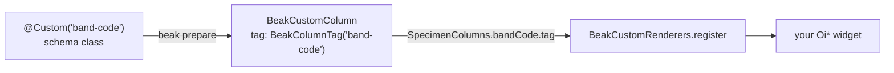

# Custom columns

After this page you can render a cell that no built-in column covers (a leg band, a sparkline, a stock bar) and you know what such a column does not do.

Twelve of Beak's thirteen column kinds follow from a field's Dart type: a `String` field becomes a string column, an enum field an enum column, a `BeakImageRef` an image column. The thirteenth, `BeakCustomColumn`, is the one you name yourself, because Beak cannot guess what a leg band looks like. `@Custom` carries a tag instead of a type, and the panel draws the cell with a builder you register under that tag.

## At a glance

A custom column is two edits, one on each side of the wire. The schema class declares the field, the panel registers the widget builder.

```dart title="examples/showcase/lib/resources/specimens/models/specimen.dart"
--8<-- "examples/showcase/lib/resources/specimens/models/specimen.dart:SpecimenBandCode"
```

```dart title="examples/showcase/lib/widgets/band_code_cell.dart"
--8<-- "examples/showcase/lib/widgets/band_code_cell.dart:registerAviaryRenderers"
```

`SpecimenColumns.bandCode.tag` is the tag the generator wrote from `@Custom('band-code')`. You spell the string once, in the schema class, and everything else reads it from the generated column.

| You write | Where | What Beak does with it |
| --- | --- | --- |
| `@Custom('tag')` on an `Object?` field | The schema class | `beak prepare` emits a `BeakCustomColumn` with that tag, a `text` column in the migration, and a typed field reference. |
| `@Column(...)` beside it (optional) | The schema class | Sets `label`, `visibleOn`, `sortable` and the other options every column shares. |
| `BeakCustomRenderers.register(tag, builder)` | Startup code of the panel | Table cells and detail fields call your builder for that column. |

## When to reach for it

A custom column is for values whose display is bespoke. It is not for values that are merely unusual.

| The value is | Use instead | Because |
| --- | --- | --- |
| An enum shown as a coloured pill | `@Badges` on the enum field | The enum column already draws badges. |
| Money or a percentage | A `BeakDecimal` field with a `BeakSemantic` | Exact arithmetic and formatting come with the type. |
| A picture | A `BeakImageRef` field | Upload rules, transforms and thumbnails come with it. |
| A 30-day trend, a stock bar, a status the panel has no widget for | `@Custom` | No typed column draws it. |

## The two halves

The schema class stays free of Flutter, because `bin/serve.dart` compiles it too. The builder lives on the panel side, where `Oi*` widgets are allowed. A `BeakColumnTag` is the value that links the two.



`beak prepare` writes the column into the `.beak.dart` part beside the schema class:

```dart title="examples/showcase/lib/resources/specimens/models/specimen.beak.dart"
  /// The leg band, drawn by a renderer the app registers (custom column).
  static const BeakCustomColumn bandCode = BeakCustomColumn(
    key: 'band_code',
    label: 'Band Code',
    tag: BeakColumnTag('band-code'),
  );
```

`BeakColumnTag` is a value-equal wrapper around a string, so two tags with the same text are the same tag. The generated column also gives you `SpecimenModel.bandCode`, a `BeakScalarField<Object>`, for queries and seeders.

### Declare the field

Declare it as `Object?`. The generator does not check the type (any field carrying `@Custom` becomes a custom column), but `Object?` is what `readFrom` returns and what the API stores, so anything narrower promises a guarantee nobody enforces.

A `@Column` beside `@Custom` is optional and sets the options every column shares. This block is illustrative (it is not a repository file), and `beak prepare` accepts it as written, carrying the label and `visibleOn` into the generated column:

```dart
@Custom('stock_bar')
@Column(label: 'Stock', visibleOn: {BeakContext.table})
late final Object? stockLevel;
```

## Register the renderer

A renderer is a `BeakCustomCellBuilder`: a function from the build context, the column and the whole record to a widget.

```dart title="packages/beak_frontend/lib/src/table/column_cell_renderer.dart"
--8<-- "packages/beak_frontend/lib/src/table/column_cell_renderer.dart:BeakCustomCellBuilder"
```

The showcase's builder draws the band code as a badge, and a caption when the value is null:

```dart title="examples/showcase/lib/widgets/band_code_cell.dart"
--8<-- "examples/showcase/lib/widgets/band_code_cell.dart:bandCodeCell"
```

Read the value with `record[column.key]?.raw`, or through the generated column (`SpecimenColumns.bandCode.readFrom(record)`). Because the builder receives the whole `BeakRecord`, it can read sibling columns (tint the badge by a status field) and, when the query loaded any, the record's `relations`.

### Where the registration goes

`BeakCustomRenderers` is a static registry, so register before the first table builds. Which file that is depends on how the panel boots. [Two ways to boot a panel](../start-here/generated-or-authored.md) explains the choice, and this page assumes both.

=== "Authored panel"

    The showcase calls its registration function first thing in `main()`, in the `lib/main.dart` you own:

    ```dart title="examples/showcase/lib/main.dart"
    --8<-- "examples/showcase/lib/main.dart:main"
    ```

=== "Generated panel"

    `lib/main.dart` is generated, so the hook is `lib/panel.dart`. `beak eject panel` writes the starter, and the generated `buildBeakPanel()` passes the panel configuration through its `beakPanel` function once, at startup:

    ```console
    $ beak eject panel
      created lib/panel.dart

      run `beak prepare` to wire it up
    ```

    Register there and hand the defaults back untouched:

    ```dart title="lib/panel.dart"
    import 'package:beak/panel.dart';
    import 'package:beak/ui.dart';
    import 'package:flutter/widgets.dart';

    import 'resources/notes/models/note.dart';

    BeakPanelConfig beakPanel(BeakPanelConfig defaults) {
      BeakCustomRenderers.register(NoteColumns.stockLevel.tag, stockBarCell);
      return defaults;
    }

    Widget stockBarCell(
      BuildContext context,
      BeakColumn column,
      BeakRecord record,
    ) => switch (NoteColumns.stockLevel.readFrom(record)) {
      final int stock when stock > 0 => OiBadge.soft(
        label: '$stock in stock',
        color: OiBadgeColor.success,
      ),
      _ => const OiBadge.soft(label: 'Sold out', color: OiBadgeColor.error),
    };
    ```

    This file is not in the repository. It compiles against a fresh `beak create` project with one `@Custom` field named `stockLevel` added to `Note`.

## Rules and limits

| Rule | Enforced where | What it means |
| --- | --- | --- |
| Custom columns are display-only in forms | Client: the form controller and the input mapper both skip a `BeakCustomColumn` | No input is generated. Values arrive through the API or a seeder. |
| No filter control | Client: `filterFor` returns null for it | The filter bar derives nothing. `filterable: true` has no effect. |
| `searchable: true` breaks search | Server: the search filter throws | Typing a search term raises a `BeakConfigurationException` saying the column "does not support automatic search". Leave `searchable` off. |
| Cannot be a summary group | Server: `WormDataSource` | A summary grouped by a custom column throws `Summary groups must be scalar columns.` |
| No validation of the payload | Server: the type check returns null for the kind | Nothing checks the shape of the value. Add a `BeakRule` or a record rule if the shape matters. |
| Stored as `text` | Migration: `BeakBlueprint.defineColumns` | A `BeakCustomColumn` and a `BeakTextColumn` get the same DDL. |
| A missing builder draws `Unavailable` | Client | The cell shows a caption ("Nicht verfügbar" in a German locale) instead of crashing. If a whole column says it, the tag was never registered. |
| The registry is process-wide | Client | Tests must call `BeakCustomRenderers.reset()` or one test's builders leak into the next. |
| No Material | You | Return `Oi*` widgets. Beak's Material guard reads Beak's own source and cannot see inside your closure. |

`beak_serverpod_generator` uses the same hatch for `List` and `Set` fields of a Serverpod entity: it emits a custom column tagged `serverpod.collection`. Beak registers no renderer for that tag, so register one, or the column reads `Unavailable`.

## Verify it

Test the builder in the same place Beak tests its own: pump a cell with a registered tag, and one without.

```dart title="packages/beak_frontend/test/src/table/column_cell_renderer_test.dart"
--8<-- "packages/beak_frontend/test/src/table/column_cell_renderer_test.dart:customCellTests"
```

Reset the registry after every test:

```dart
tearDown(BeakCustomRenderers.reset);
```

Run Beak's own copy of these tests from the package directory:

```console
$ cd packages/beak_frontend
$ flutter test test/src/table/column_cell_renderer_test.dart --plain-name custom
00:00 +0: custom cells delegate to the registered builder
00:00 +1: an unregistered custom tag renders a visible placeholder
00:00 +2: custom cells can render eager relations without a scalar value
00:00 +3: All tests passed!
```

The showcase pumps its whole panel with the renderer registered in `setUp`, in `examples/showcase/test/aviary_pages_test.dart`.

## Reference

| Symbol | Library | Role |
| --- | --- | --- |
| `Custom` | `package:beak/schema.dart` | The annotation. One positional `String tag`. |
| `BeakCustomColumn` | `package:beak/beak.dart` | The generated column. `key`, `label` and `tag` are required. `visibleOn`, `sortable`, `searchable`, `filterable`, `indexed`, `unique`, `rules`, `semantic` and `defaultValue` are the options every column has. |
| `BeakColumnTag` | `package:beak/beak.dart` | Value-equal identifier, `const BeakColumnTag(String value)`. |
| `BeakRenderIntent.custom` | `package:beak/beak.dart` | The one render intent Beak does not draw itself. Every surface resolves a custom column to it. |
| `BeakCustomCellBuilder` | `package:beak/panel.dart` | `Widget Function(BuildContext context, BeakColumn column, BeakRecord record)`. |
| `BeakCustomRenderers` | `package:beak/panel.dart` | `register(tag, builder)` replaces any earlier builder. `builderFor(tag)` returns it or null. `reset()` clears all. |

Sources: `packages/beak_core/lib/src/columns/beak_custom_column.dart`, `packages/beak_core/lib/src/schema/beak_schema_annotations.dart`, `packages/beak_frontend/lib/src/table/column_cell_renderer.dart`.

## Continue reading

- [Fields](../models/fields.md) the typed column kinds to try before reaching for a custom one.
- [Annotations](../reference/annotations.md) every annotation a schema class can carry.
- [Custom blocks and widgets](custom-blocks-and-widgets.md) the same escape hatch one level up, for whole subtrees and form content.
- [Two ways to boot a panel](../start-here/generated-or-authored.md) where startup code lives in each.
