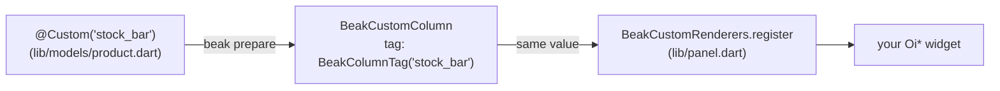

# Custom columns

After this page you can render a cell that no built-in column covers (a
sparkline, a bespoke status pill, a tiny inline chart) by putting `@Custom` on a
field of your schema class and registering a builder for its tag in the panel.

Twelve of Beak's [thirteen column types](../models/column-types.md) are picked
by a field's Dart type: `String`, `int`, `DateTime`, an enum, a `BeakImageRef`.
The thirteenth is the escape hatch. `@Custom` names a tag instead of a type, and
hands the drawing to a builder you write.

## When to reach for it

Reach for a custom column when the *display* of a value is bespoke, not when the
value is unusual. A price is a `double` with `@Column(prefix: '€')`; a status is
an enum with `@Badges`. But a 30-day trend drawn as a sparkline, or a stock
level drawn as a bar rather than a number, has no typed column, and that is what
this is for.

Two things to know before you start:

- **It is display-only.** Auto-forms skip custom columns, and no filter control
  is derived for one, so the column never becomes an editable form field. Keep
  the writable value in a normal typed field and use the custom column purely to
  render.
- **It renders wherever it is visible.** The same registered builder backs the
  column in the table and in the detail view. One registration, both surfaces.

## The two halves

A custom column is split across the wire, and that split is the point. The
*schema class* declares the field, in a file that never imports Flutter. The
*panel* registers the widget builder. A `BeakColumnTag` is the value that links
them.



### The field

`@Custom` takes the tag, as a string. Apply it to an `Object?` field, and add a
`@Column` beside it for anything the field shares with every other column
(`label`, `visibleOn`, and the rest).

```dart title="examples/store/lib/models/product.dart"
  /// The stock indicator, drawn by the panel's registered renderer.
  @Custom('stock_bar')
  @Column(visibleOn: {BeakContext.table})
  late final Object? stockLevel;
```

`beak prepare` turns that into a `BeakCustomColumn` constant in the part file
beside your model, named after the field:

```dart title="examples/store/lib/models/product.beak.dart"
  /// The stock indicator, drawn by the panel's registered renderer.
  static const BeakCustomColumn stockLevel = BeakCustomColumn(
    key: 'stock_level',
    label: 'Stock Level',
    visibleOn: {BeakContext.table},
    tag: BeakColumnTag('stock_bar'),
  );
```

!!! note "What just happened"
    - The column resolves to `BeakRenderIntent.custom` on every surface. That is
      the one render intent Beak does not draw itself.
    - It is a real column, so it appears in `ProductColumns`, it can be named in
      a detail or form layout, and the generated migration gives it a `text`
      column in the table. Store something in it, or leave it null and read the
      siblings instead.
    - Nothing about it is stringly-typed on your side: you write the tag once in
      the annotation, and reference the column as `ProductColumns.stockLevel`.

### The tag

`BeakColumnTag` is an opaque, value-equal identifier. The annotation's string
becomes one; you write the same value again when you register the builder.

```dart title="packages/beak_core/lib/src/columns/beak_custom_column.dart"
@immutable
final class BeakColumnTag {
  /// Creates a tag identified by [value].
  const BeakColumnTag(this.value);

  /// Unique identity of the custom renderer.
  final String value;
}
```

## The custom render intent

Every column resolves to a `BeakRenderIntent`, an ORM- and UI-neutral hint for
*what* to draw. The panel maps each intent to an `obers_ui` widget. There is
exactly one intent Beak leaves for you:

```dart title="packages/beak_core/lib/src/context/beak_render_intent.dart"
  /// A user-provided custom renderer (the escape hatch).
  custom,
```

When the cell renderer meets `BeakRenderIntent.custom`, it looks up your builder
by tag and calls it. A missing builder is a visible placeholder, never a crash:

```dart title="packages/beak_frontend/lib/src/table/column_cell_renderer.dart"
Widget _custom(BuildContext context, BeakColumn column, BeakRecord record) {
  if (column case BeakCustomColumn(:final tag)) {
    final builder = BeakCustomRenderers.builderFor(tag);
    if (builder != null) {
      return builder(context, column, record);
    }
    return OiLabel.caption('No renderer for "${tag.value}"');
  }
  return const OiLabel.caption('Unsupported custom cell');
}
```

If you ever see `No renderer for "stock_bar"` in a cell, the schema shipped a
tag the panel never registered. That is the message telling you which half is
missing.

## Registering the renderer

A renderer is a `BeakCustomCellBuilder`: a function from the build context, the
column, and the record to a widget.

```dart title="packages/beak_frontend/lib/src/table/column_cell_renderer.dart"
typedef BeakCustomCellBuilder =
    Widget Function(BuildContext context, BeakColumn column, BeakRecord record);
```

Register it against the tag on the static `BeakCustomRenderers` registry:

```dart title="packages/beak_frontend/lib/src/table/column_cell_renderer.dart"
  /// Registers [builder] for [tag], replacing any previous one.
  static void register(BeakColumnTag tag, BeakCustomCellBuilder builder) {
    _buildersByTag[tag] = builder;
  }
```

Registration has to happen once, before the panel builds a table.
`lib/panel.dart` is the file for it: the generated `buildBeakPanel()` calls your
`beakPanel` function as its last step, once, at startup. Run `beak eject panel`
to get the starter, then register there and return the defaults untouched:

```dart
import 'package:beak/panel.dart';
import 'package:beak/ui.dart';

import 'models/product.dart';

/// The last word on this panel's configuration.
BeakPanelConfig beakPanel(BeakPanelConfig defaults) {
  BeakCustomRenderers.register(const BeakColumnTag('stock_bar'), (
    context,
    column,
    record,
  ) {
    final int stock = ProductColumns.stock.readFrom(record) ?? 0;
    return OiBadge.soft(
      label: '$stock in stock',
      color: stock == 0 ? OiBadgeColor.error : OiBadgeColor.success,
    );
  });
  return defaults;
}
```

Read the record's value through the column constant. `readFrom` gives you the
typed value (`Object?` for a custom column, a real `int?` for the
`ProductColumns.stock` beside it), and `record[column.key]` gives you the raw
`BeakValue?` when you want it. Because the builder receives the whole
`BeakRecord`, a cell can read sibling columns: draw the bar, tint it by the
status field next to it.

!!! warning "Stay in obers_ui"
    Whatever your builder returns renders straight into the panel. Return `Oi*`
    widgets from `package:beak/ui.dart`, never `package:flutter/material.dart`.
    Beak's Material guard checks Beak's own source; it cannot see inside your
    closure, so the no-Material rule here is yours to keep.

!!! tip "Test isolation"
    `BeakCustomRenderers` is a process-wide registry.
    `BeakCustomRenderers.reset()` clears every registered builder, which is what
    you call in a widget test's `setUp`/`tearDown` so one test's renderers do
    not leak into the next.

## Reference: the annotations

`@Custom` carries one thing, the tag. Everything else comes from the `@Column`
beside it.

| Annotation | Parameter | Type | Notes |
| --- | --- | --- | --- |
| `@Custom` | `tag` | `String` | Becomes the `BeakColumnTag` the renderer is registered under. |
| `@Column` | `columnName` | `String?` | Storage column name; defaults to the snake-cased field name. |
| `@Column` | `label` | `String?` | Header and detail-row label; defaults to the title-cased field name. |
| `@Column` | `visibleOn` | `Set<BeakContext>?` | Surfaces the column shows on; defaults to table, form and detail. |
| `@Column` | `sortable` / `searchable` / `filterable` | `bool` | Shared column flags. Filtering derives no control for a custom column. |
| `@Column` | `rules` | `List<BeakRule>` | Shared validation rules. |

The generated `BeakCustomColumn` takes the same options plus `tag`, so a
hand-written `BeakModel` can declare one directly. See
[Escape hatches](../models/escape-hatches.md) for when that is the right move.

## Continue reading

- [Column types](../models/column-types.md) the twelve typed columns to try before reaching for a custom one.
- [Annotations](../reference/annotations.md) every annotation a schema class can carry, in full.
- [Rendering per surface](../concepts/rendering-per-surface.md) how a column becomes a render intent and then a widget.
- [Custom blocks and widgets](custom-blocks-and-widgets.md) the same escape-hatch idea, one level up, for whole subtrees.
