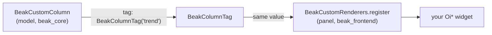

# Custom columns

After this page you can render a cell that no built-in column covers (a
sparkline, a bespoke status pill, a tiny inline chart) by declaring a
`BeakCustomColumn` on your model and registering a builder for it in the panel.

The [thirteen built-in column types](../models/column-types.md) cover most of
what a cell ever needs to show: text, numbers, currency, badges, thumbnails,
dates, colors, JSON. When none of them fits, `BeakCustomColumn` is the escape
hatch. It carries an opaque value and hands the drawing to a builder you write.

## When to reach for it

Reach for a custom column when the *display* of a value is bespoke, not when the
value is unusual. A price is a `BeakDecimalColumn`; a status is a
`BeakEnumColumn` with badge colors. But a 30-day trend drawn as a sparkline, or
a health indicator that is a ring rather than a badge, has no typed column, and
that is what this is for.

Two things to know before you start:

- **It is display-only.** Auto-forms skip custom columns, so the column never
  becomes an editable form field. Keep the writable value in a normal typed
  column and use the custom column purely to render.
- **It renders wherever it is visible.** The same registered builder backs the
  column in the table and in the detail view. One registration, both surfaces.

## The two halves

A custom column is split across the wire, and that split is the point. The
*model* declares the column in `beak_core`, with no Flutter in sight. The
*panel* registers the widget builder in `beak_frontend`. A `BeakColumnTag` is
the value that links them.



### The tag

`BeakColumnTag` is an opaque, value-equal identifier. Declare it once, use the
same value on both sides.

```dart title="packages/beak_core/lib/src/columns/beak_custom_column.dart"
@immutable
final class BeakColumnTag {
  /// Creates a tag identified by [value].
  const BeakColumnTag(this.value);

  /// Unique identity of the custom renderer.
  final String value;
}
```

### The column

`BeakCustomColumn` is a leaf in the sealed `BeakColumn` union like any other, so
it takes the same shared options (`key`, `label`, `visibleOn`, `rules`). Its one
extra field is the `tag`.

```dart title="packages/beak_core/lib/src/columns/beak_custom_column.dart"
final class BeakCustomColumn extends BeakColumn {
  /// Creates a custom column rendered by the builder registered under [tag].
  const BeakCustomColumn({
    required super.key,
    required super.label,
    required this.tag,
    super.visibleOn,
    super.sortable,
    super.searchable,
    super.filterable,
    super.rules,
  });

  /// Identifies the registered custom renderer.
  final BeakColumnTag tag;

  @override
  BeakRenderConfig get renderConfig =>
      const BeakRenderConfig.uniform(BeakRenderIntent.custom);

  /// Custom columns carry opaque values; the registered builder decides.
  @override
  Type get valueType => Object;
}
```

Declaring one on a model reads like any other column constant:

```dart
static const badge = BeakCustomColumn(
  key: 'badge',
  label: 'Badge',
  tag: BeakColumnTag('badge'),
);
```

!!! note "What just happened"
    - The column resolves to `BeakRenderIntent.custom` on every surface. That is
      the one render intent Beak does not draw itself.
    - `valueType` is `Object`. Beak does not know or care what the value is; your
      builder reads it and decides.
    - Because it is a real `BeakColumn`, it still lives in a model's `columns`
      list and appears in the table and detail wherever `visibleOn` allows.

## The custom render intent

Every column resolves to a `BeakRenderIntent`, an ORM- and UI-neutral hint for
*what* to draw. `beak_frontend` maps each intent to an `obers_ui` widget. There
is exactly one intent Beak leaves for you:

```dart title="packages/beak_core/lib/src/context/beak_render_intent.dart"
  /// A user-provided custom renderer (the escape hatch).
  custom,
```

When the cell renderer meets `BeakRenderIntent.custom`, it looks up your builder
by tag and calls it. A missing builder is a visible placeholder, never a crash:

```dart title="packages/beak_frontend/lib/src/table/column_cell_renderer.dart"
Widget _custom(BuildContext context, BeakColumn column, BeakRecord record) {
  if (column case BeakCustomColumn(:final tag)) {
    final builder = BeakCustomRenderers.builderFor(tag);
    if (builder != null) {
      return builder(context, column, record);
    }
    return OiLabel.caption('No renderer for "${tag.value}"');
  }
  return const OiLabel.caption('Unsupported custom cell');
}
```

If you ever see `No renderer for "trend"` in a cell, the model shipped a tag the
panel never registered. That is the message telling you which half is missing.

## Registering the renderer

A renderer is a `BeakCustomCellBuilder`: a function from the build context, the
column, and the record to a widget.

```dart title="packages/beak_frontend/lib/src/table/column_cell_renderer.dart"
typedef BeakCustomCellBuilder =
    Widget Function(BuildContext context, BeakColumn column, BeakRecord record);
```

Register it against the tag on the static `BeakCustomRenderers` registry, once,
at panel startup (before you build the `BeakPanel`):

```dart title="packages/beak_frontend/lib/src/table/column_cell_renderer.dart"
  /// Registers [builder] for [tag], replacing any previous one.
  static void register(BeakColumnTag tag, BeakCustomCellBuilder builder) {
    _buildersByTag[tag] = builder;
  }
```

A concrete registration, with an `obers_ui` widget as the payload:

```dart
void main() {
  BeakCustomRenderers.register(
    const BeakColumnTag('trend'),
    (context, column, record) => const OiLabel.body('custom!'),
  );
  runApp(const SuperdashboardApp());
}
```

Read the record's value with `record[column.key]`, which returns a typed
`BeakValue?`. Your builder decides how to turn it into pixels. Because the
builder receives the whole `BeakRecord`, a cell can also read sibling columns
(draw the trend, tint it by the status field next to it).

!!! warning "Stay in obers_ui"
    Whatever your builder returns renders straight into the panel. Return `Oi*`
    widgets from `obers_ui`, never `package:flutter/material.dart`. Beak's
    Material guard checks Beak's own source; it cannot see inside your closure,
    so the no-Material rule here is yours to keep.

!!! tip "Test isolation"
    `BeakCustomRenderers` is a process-wide registry.
    `BeakCustomRenderers.reset()` clears every registered builder, which is what
    you call in a widget test's `setUp`/`tearDown` so one test's renderers do
    not leak into the next.

## Reference: BeakCustomColumn

| Parameter | Type | Notes |
| --- | --- | --- |
| `key` | `String` | The column key; also the record key its value is read from. |
| `label` | `String` | Header and detail-row label. |
| `tag` | `BeakColumnTag` | Links to the renderer registered on the panel. |
| `visibleOn` | `Set<BeakContext>` | Surfaces the column shows on (defaults to table, form, detail). |
| `sortable` / `searchable` / `filterable` | `bool` | Shared column flags. |
| `rules` | `List<BeakRule>` | Shared validation rules. |

## Continue reading

- [Column types](../models/column-types.md) the thirteen built-in columns to try before reaching for a custom one.
- [Rendering per surface](../concepts/rendering-per-surface.md) how a column becomes a render intent and then a widget.
- [Custom blocks and widgets](custom-blocks-and-widgets.md) the same escape-hatch idea, one level up, for whole subtrees.
