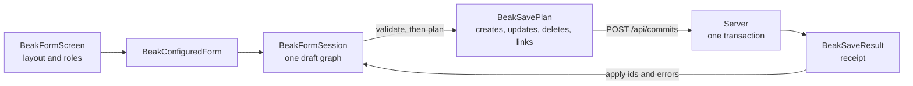

# Forms and records

A Beak form is a tree of typed placements over one local draft. You describe the tree once, Beak loads the record, validates as people type, and sends every change of one save as a single request. This section covers the tree, the inputs in it, the pages around it, and what happens when a save goes wrong.

## How a form runs

The same runtime serves a create page, an edit page, a read page, a wizard and a dialog. What differs is the layout you hand it.

Four words carry most of the design:

| Word | What it is | Class |
| --- | --- | --- |
| Session | The form's runtime. It loads the record, owns the draft, validates and saves | `BeakFormSession` |
| Draft | The local copy of the record and everything staged around it: edited values, related rows, new records picked or created inline, staged uploads | `BeakDraftRecord` |
| Save plan | Plain data listing every create, update, delete, attach and detach the save needs, with what depends on what | `BeakSavePlan` |
| Receipt | The server's answer for each operation: applied, unapplied (a definite refusal) or unknown (the response was lost) | `BeakSaveResult` |

Nothing reaches the server while a form is open. Choosing a customer, adding a row or picking a file changes the draft. Save builds the plan and sends it, the server applies it in one transaction on the default data sources, and the receipt says which operations applied. The client keeps the save id so a lost response can be looked up instead of sent again. [Graph commits](../architecture/graph-commits.md) covers the protocol, and [How data flows](../concepts/how-data-flows.md) places it among the four layers.

You rarely touch these classes. A `BeakFormScreen` in a resource's `screens:` list is the whole surface for most forms, and a resource without one gets a form generated from its model.

## Which page to read

| You want to... | Read | For that |
| --- | --- | --- |
| Write one form that serves create, edit and read | [Form screens](form-screens.md) | Roles, the layout tree, shared sections, rules only the form knows |
| Choose the right input for a field | [Inputs](inputs.md) | Text, numbers, money, dates, choices, tags, objects |
| Pick, create or edit related records inside a form | [Related records in forms](related-records.md) | Comboboxes, search, cards, codes, table editors, catalogs, staging |
| Split a form into validated steps | [Multi-step forms](multi-step-forms.md) | `BeakWizardScreen`, navigation, review steps |
| Add summaries, metrics, progress and timelines around a form | [Workflow presentations](workflow-presentations.md) | Record templates, totals, capacity, inline commands |
| Show a record page, read-only or editable in place | [Detail views](detail-views.md) | The generated page, the read role, record blocks |
| Let people resume, review and recover | [Drafts, review and conflicts](drafts-and-review.md) | Local drafts, interrupted saves, stale versions |
| Attach files and ordered pictures | [Uploads and galleries](uploads-and-galleries.md) | Staging, storage rules, galleries |
| Load rows from CSV or change many records at once | [Imports and bulk edits](imports-and-bulk-edits.md) | Preview, per-row saves, recovery |
| Print a record | [Printable record documents](record-documents.md) | Typed sections and related-row tables as HTML |

## Two examples to read alongside

The pages quote two apps that come with the repository. `examples/clean_beak_config` is the shop: tabbed forms, an order wizard built from shared sections, owned table editors, a gallery, drafts and a CSV import. It uses exact money and keeps its forms small. `examples/foodio-adminpanel` is the high-fidelity app: a five-step order wizard with a summary aside, a catalog editor, a detail page with metrics and a timeline, and a printable delivery note.

If you only read one of them, read the shop's `lib/resources/orders/screens/order_form_wizard_screen.dart`. It is about two hundred lines and shows the lot.

## Continue reading

- [Form screens](form-screens.md) the first page to read, and the one the rest builds on.
- [Screens and form layouts](../reference/screens-and-layouts.md) every screen, container and presentation node with its parameters.
- [Input builders](../reference/input-builders.md) every `input*` builder, `tableForm` and `galleryForm`.
- [Model behavior](../models/behavior.md) the rules, defaults and commands that the server re-runs on every save.
