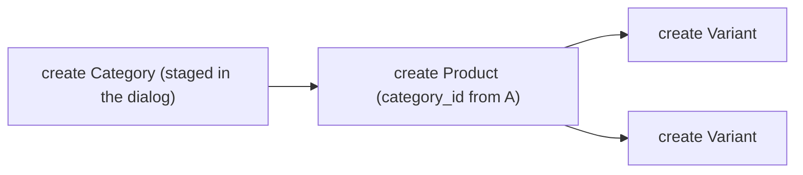

# Related records in forms

After this page you can put a customer picker, a voucher field, a table of order lines and a product catalog into one form, and you know what reaches the server when someone presses Save.

Every builder here works on a relationship field and follows one rule: nothing is written while the form is open. Picks, new records, edited rows and removals are staged in the draft. Save sends them as one graph, and Cancel forgets them.

## At a glance

| The relationship is | Write | You get |
| --- | --- | --- |
| To-one, few options | `inputCombobox()` | A searchable dropdown |
| To-one, people or things you search for | `inputSearch(template: ...)` | A search field with result rows |
| To-one, a handful of rich options | `inputCards(template: ...)` | Selectable cards |
| To-one, identified by a unique code | `inputCode(codeField: ...)` | A code field with Apply and Remove |
| To-many, rows the record owns | `tableForm(children: [...])` | An editable table of related rows |
| To-many, ordered images | `galleryForm(...)` | A gallery, see [Uploads and galleries](uploads-and-galleries.md) |
| To-many, picked from a big list | `tableForm(catalog: BeakRelationCatalog(...))` | A searchable catalog that adds rows |

Signatures and every parameter are in [Input builders](../reference/input-builders.md#relationship-builders).

## Choosing one record

The four pickers differ in the control only. Binding, validation and eligibility are the same, so you can swap one for another without touching the model. Foodio's first wizard step uses two of them:

```dart title="examples/foodio-adminpanel/lib/resources/orders/forms/steps/order_customer_step.dart"
--8<-- "examples/foodio-adminpanel/lib/resources/orders/forms/steps/order_customer_step.dart:customerAndProfileStep"
```

- Search fits a list nobody scrolls. `searchSources` names typed paths on the related model, and a path can cross a relationship: `CustomerModel.profiles.search(DeliveryProfileModel.organization.name)` finds a customer by the company of one of their profiles. The default is the model's display column plus the searchable fields of the template.
- Cards fit a short list where each option has something to say. The `options` callback builds the query from the draft, so this step shows only the selected customer's profiles.
- `template` is a `BeakRecordTemplate`: the title, subtitle, badges and avatar drawn for each option and for the selected value. Every field it reads is loaded together with the options, so a template costs no extra requests. [Workflow presentations](workflow-presentations.md) covers templates in detail.
- `exclusive: false` together with `createForm` and `createLabel` adds a way to create a missing option in place, see below.

A combobox needs no template. The shop's customer form uses the plainest form, `UserModel.company.inputCombobox()`, and gets the related model's display column.

### Eligible options come from the model

The model decides once which profiles an order may use, and the picker and the API both obey it:

```dart title="examples/clean_beak_config/lib/resources/orders/models/order.dart"
--8<-- "examples/clean_beak_config/lib/resources/orders/models/order.dart:OrderValidationRules"
```

`BeakExists` with a `BeakFieldMatch` restricts `profileId` to profiles whose `userId` equals the order's `customerId`. In the form, the profile combobox lists only those profiles, and stays disabled with the hint "Select Customer first." until a customer is chosen (an input with its own `description` shows that text instead). On the server, the same rule rejects a save that pairs a customer with someone else's profile. The wizard needs no matching code at all.

Use the `options` callback when the restriction is about the current screen rather than the model. The product form limits a specification row to the definitions of the product's category, reading the parent record's draft:

```dart title="examples/clean_beak_config/lib/resources/products/screens/product_form.dart"
--8<-- "examples/clean_beak_config/lib/resources/products/screens/product_form.dart:productAttributesTable"
```

`state.parent` is the reader of the record that owns the row. An `options` query must target the related table, and it is recomputed when the draft fields it reads change.

### Recommended options and disabled options

Cards can mark a recommendation with `defaultOption` (a related record on the draft) or `defaultOptionMatch` (a predicate), and `selectDefaultOption: true` selects the match while nothing is chosen. A choice made by hand always wins. `disabledReason` returns the reason an option cannot be picked, and validation enforces it again, including for a value set from code:

```dart title="examples/foodio-adminpanel/lib/resources/orders/forms/steps/order_delivery_step.dart"
--8<-- "examples/foodio-adminpanel/lib/resources/orders/forms/steps/order_delivery_step.dart:deliverySlotCards"
```

Slots that are full read "This delivery slot is full" and cannot be selected. That is a presentation rule. A capacity limit that must hold belongs in the model's rules, where the server enforces it too.

### An exact code

`inputCode` is for a voucher, a reference or any value people type in full. The field checks the code with an exact match on `codeField`, which must be a string field directly on the related model.

```dart title="examples/foodio-adminpanel/lib/resources/orders/forms/steps/order_payment_step.dart"
--8<-- "examples/foodio-adminpanel/lib/resources/orders/forms/steps/order_payment_step.dart:voucherCodeInput"
```

Apply looks the code up, and only stages the relationship. An unknown code reads "No available record matches this code."; two matches read "This code matches more than one record." The lookup keeps the model's eligibility rules, dependent filters and access policy. `normalizeCode` canonicalizes what was typed, and `selectionSummary` shows a calculation from the owner draft next to the applied code, here the discount.

## Create without leaving

A picker with `exclusive: false` and a `createForm` offers to create the missing record in a dialog. The shop's product form does it for categories:

```dart title="examples/clean_beak_config/lib/resources/products/screens/product_form.dart"
--8<-- "examples/clean_beak_config/lib/resources/products/screens/product_form.dart:productCategoryPicker"
```

The dialog does not save anything. It stages a new category in the draft and selects it. Cancel throws the dialog's work away. When the product is saved, the plan contains both records: the category is created first, and the product's `category_id` is filled with the id the server assigns.



Staged records can depend on each other. A new profile can point at a customer that is also new, all in one unsaved form. The customer is created once and both foreign keys resolve to it. Replacing the customer after that makes the dependent profile invalid, and the form asks for a compatible one instead of saving an orphan.

## Rows the record owns

`tableForm` edits a to-many relationship inside its parent. Each entry of `children` is a column of the row, and the same placements you use everywhere else work in it. The shop's order lines:

```dart title="examples/clean_beak_config/lib/resources/orders/screens/order_form_wizard_screen.dart"
--8<-- "examples/clean_beak_config/lib/resources/orders/screens/order_form_wizard_screen.dart:orderItemsTableForm"
```

- `advancedForm` holds the inputs that do not fit a compact row. It opens in a dialog whose Cancel restores the row as it was. `advancedPresentation: BeakAdvancedPresentation.inline` expands it inside the row instead.
- `minRows: 1` blocks Save until the order has a line, with the message "Add at least 1 row."
- `summary` computes a value over the current, non-removed rows and shows it next to the table.
- `removeBehavior` decides what removing a saved row means.

| `removeBehavior` | Removing a saved row |
| --- | --- |
| `detach` (default) | Removes it from the collection and keeps the record. For a to-many it clears the child's foreign key (refused when that column is required), for a many-to-many it deletes the pivot row |
| `deleteOwned` | Deletes the record. Only valid for an owned has-many |

Removing a row that was never saved discards it without an operation. Rows are validated with their own rules, and a row that fails keeps the form from saving.

`allowAdding`, `allowEdit` and `allowRemove` restrict what the table may do. `readOnly: true` shows the collection without an owner. A field can have one editable placement in a form, so a review step repeats an order's lines as a second, read-only `tableForm`. Foodio does it in the wizard's review and again on the detail page.

### The add button somewhere else

`BeakRelationAdd` places the add action away from the table, for example in a page header or under a summary. It opens the same row dialog as the table's own button, and it needs the table in the same form. Set the table's `showAddAction: false` to keep only one.

```dart title="examples/foodio-adminpanel/lib/resources/orders/details/order_customer_section.dart"
--8<-- "examples/foodio-adminpanel/lib/resources/orders/details/order_customer_section.dart:addDishAction"
```

## A catalog for big option lists

Picking rows one by one from a combobox does not scale to a menu with two hundred dishes. `BeakRelationCatalog` turns a bounded option query into a searchable list that stages one owned row per chosen record. It is an argument of `tableForm`, and it writes nothing: choosing an option creates an unsaved row and sets the row's `selection` relationship.

Foodio's dish catalog groups variants under their dish, shows price and quantity controls, and bounds and pages the list:

```dart title="examples/foodio-adminpanel/lib/resources/orders/forms/order_items_table.dart"
--8<-- "examples/foodio-adminpanel/lib/resources/orders/forms/order_items_table.dart:orderCatalogRows"
```

`tabs` and `filters` narrow it. Tabs are mutually exclusive categories, and the first is selected at the start. Filters are independent facets combined with the tab and the search:

```dart title="examples/foodio-adminpanel/lib/resources/orders/forms/order_items_table.dart"
--8<-- "examples/foodio-adminpanel/lib/resources/orders/forms/order_items_table.dart:orderCatalogFilters"
```

The first tab computes its scope from the draft (`filterBuilder`), so it lists the dishes on the selected profile's menu plan for the delivery day, and the last facet filters locally (`matches`, which needs `maxOptions`). The model's eligibility and the base `options` query stay authoritative: a filter can only narrow. Rows already staged survive paging, searching and filtering.

`presentation` is `cards` (rich descriptions), `rows` (compact, with variant, price and quantity controls) or `checkboxes` (a small list where each check stages or removes a row). Foodio also uses the checkbox form for a dish's extras.

## What Save sends

When the form is valid, the session walks the draft and builds a plan of operations: a create for each new record, an update for each changed one, a delete or detach for each removed row, an attach for each new many-to-many link. Each operation names what it depends on, so parents are created before their children. One `POST /api/commits` carries the plan, and the receipt says which operations applied. [Graph commits](../architecture/graph-commits.md) explains the protocol.

Only the relations a visible, editable placement owns are included. A table hidden by `visibleIf` contributes nothing.

## Rules and limits

| Rule | Behavior |
| --- | --- |
| Options query | `options` must query the related table, and `searchSources` must start at the related model. Otherwise a `BeakConfigurationException` |
| `inputCode` | `codeField` is required and must be a string field of the related model with no path |
| Required relations | A non-nullable relationship, or `BeakRequired` in `validate`, makes the picker required and not clearable |
| Disabled options | `disabledReason` is enforced at validation. It is a form rule. State a limit that must hold in the model too |
| One editable owner | Placing the same field twice as an editable input throws `Duplicate editable field`. Repeat a collection with `readOnly: true` |
| `deleteOwned` | Valid for an owned has-many only. A misconfigured relation is caught when a saved row is removed, not when the form is built |
| Row changes from code | `addRow` and `relationTable` need a `tableForm` for that relationship in the layout. Without one they fail with a bare `StateError` |
| Catalog presentation | `checkboxes` needs a finite `maxOptions`, no `quantity` and no `groupBy`. `pageSize` needs `maxOptions`. These are asserts, so they fail in debug builds |
| Catalog scope | `selection` must belong to the row model, and a `matches` facet needs `maxOptions` |
| Unknown save | While a save is running or its result is unknown, adding a row throws and other edits are ignored. Resolve the save first, see [Drafts, review and conflicts](drafts-and-review.md) |
| Not a live view | Staged rows are local. A change the panel itself makes to a related table refreshes the pickers and rechecks selected records, and reloads a clean form. A form with staged edits is never overwritten, and other users' changes are not shown until it reloads |

## Verify it

The staging rules, dependent creations and catalogs have package tests, and Foodio has a presentation test for the catalog:

```bash
cd packages/beak_frontend
flutter test test/src/form/shared_staged_reference_test.dart test/src/form/catalog_refresh_test.dart
```

```bash
cd examples/clean_beak_config
flutter test test/order_form_test.dart
```

```bash
cd examples/foodio-adminpanel
flutter test test/catalog_presentation_test.dart
```

Each ends with `All tests passed!`. To see it, run the shop, open Orders, create one and pick a customer: the profile field stays empty and disabled until you do.

## Reference

| Symbol | Where it is documented |
| --- | --- |
| `inputCombobox`, `inputSearch`, `inputCards`, `inputCode`, `BeakRelationInput` | [Input builders](../reference/input-builders.md#relationship-builders) |
| `tableForm`, `BeakRelationTable`, `BeakRemoveBehavior`, `BeakAdvancedPresentation` | [Input builders](../reference/input-builders.md#collection-builders) |
| `BeakRelationCatalog`, `BeakCatalogFilter`, `BeakRelationAdd` | [Input builders](../reference/input-builders.md#beakrelationcatalog) |
| `BeakExists`, `BeakFieldMatch` | [Validation rules](../reference/validation-rules.md) |
| `BeakOptionQuery` (`Model.options(...)`) | `packages/beak_core/lib/src/model/beak_field_ref.dart` |

## Continue reading

- [Uploads and galleries](uploads-and-galleries.md) the image collection variant of an owned table.
- [Workflow presentations](workflow-presentations.md) record templates, summaries and the rest of the wizard chrome.
- [Multi-step forms](multi-step-forms.md) staging across steps.
- [Relationships](../models/relationships.md) how to declare the fields these builders sit on.
