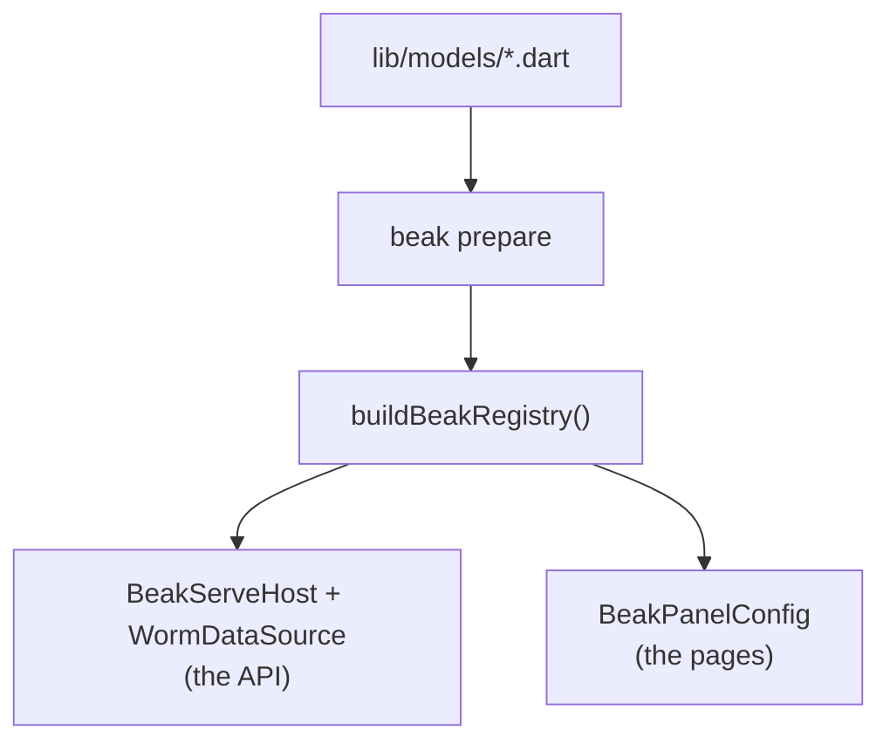

# The model registry

After this page you can build a `BeakModelRegistry`, register your models into
it, look one up by table name, and understand why a single registry is the seam
between "define once" and "drives everything".

A model on its own is inert. The registry is the index that turns a pile of
model constants into something the backend and the panel can serve. It maps
each table name to exactly one model, and both sides of Beak ask it the same
question: "what is the model for this table?"

## What the registry is

`BeakModelRegistry` is a small, ordered map from table name to `BeakModel`. You
build one, register your models, and hand it out.

```dart title="packages/beak_core/lib/src/model/beak_model_registry.dart"
final class BeakModelRegistry {
  /// Creates an empty registry.
  BeakModelRegistry();

  final Map<String, BeakModel> _modelsByTable = {};
```

It has four members, and that is the whole surface.

| Member | Signature | Does |
| --- | --- | --- |
| Register | `void register(BeakModel model)` | indexes `model` under `model.table` |
| Lookup | `BeakModel? byTable(String table)` | the model for `table`, or `null` |
| Strict lookup | `BeakModel byTableOrThrow(String table)` | the model, or throws if missing |
| All | `List<BeakModel> get all` | every model, in registration order |

### register

`register` files a model under its own `table` string. One table maps to exactly
one model, so registering a second model for a table already taken throws a
`BeakConfigurationException` rather than silently overwriting.

```dart title="packages/beak_core/lib/src/model/beak_model_registry.dart"
void register(BeakModel model) {
  if (_modelsByTable.containsKey(model.table)) {
    throw BeakConfigurationException(
      'A model for table "${model.table}" is already registered.',
    );
  }
  _modelsByTable[model.table] = model;
}
```

### byTable and byTableOrThrow

Two lookups, for two situations. `byTable` returns `null` when nothing is
registered, for when a miss is an ordinary outcome you handle. `byTableOrThrow`
throws a `BeakConfigurationException` instead, for request-handling boundaries
where an unknown table means the app was set up wrong, not that a user asked for
something reasonable.

```dart title="packages/beak_core/lib/src/model/beak_model_registry.dart"
BeakModel byTableOrThrow(String table) {
  final model = byTable(table);
  if (model == null) {
    throw BeakConfigurationException(
      'No model registered for table "$table".',
    );
  }
  return model;
}
```

### all

`all` returns every registered model in the order you registered them. That
order matters: it becomes the default order of resources in the panel's
navigation. Register in the order you want the sidebar to read.

## The one Beak builds

You do not write this. `beak prepare` collects every model it discovered into
`lib/beak/registry.g.dart`:

```dart title="examples/store/lib/beak/registry.g.dart"
/// Every model discovered under `lib/models/`, in path order.
const List<BeakModel> beakModels = <BeakModel>[
  CategoryModel(),
  OrderModel(),
  OrderItemModel(),
  ProductModel(),
  RoastProfileModel(),
  TagModel(),
  UserModel(),
];

/// A registry populated with every model in [beakModels].
BeakModelRegistry buildBeakRegistry() {
  final registry = BeakModelRegistry();
  for (final model in beakModels) {
    registry.register(model);
  }
  return registry;
}
```

Adding a resource means adding a file. There is no list to keep in step, which
is the list that used to be wrong.

## Who gets the registry

The registry is the seam between defining a resource once and having it drive
everything. The generated server host hands it to the data source and the
server:

```dart title="examples/store/lib/beak/server.g.dart"
BeakServeHost beakHost({Map<String, String>? environment}) => BeakServeHost(
  environment: environment,
  registry: buildBeakRegistry(),
  migrations: const [/* ... */],
  seeders: const [StoreSeeder()],
  configure: server.beakServer,
);
```

The panel derives its own registry from the resources on its config, so both
ends resolve `categories` to the same model. That is what keeps "the model for
`categories`" meaning one thing across the whole app.

A test builds one directly, which is the other reason it is a plain function:

```dart title="examples/store/test/widget_test.dart"
final registry = buildBeakRegistry();
final source = InMemoryBeakDataSource(registry: registry)
  ..seed(const ProductModel(), [/* ... */]);
```



## Continue reading

- [Defining models](defining-models.md) the `BeakModel` you register.
- [Relationships](relationships.md) how `relatedTable` names resolve through the
  registry.
- [Running the server](../backend/running-the-server.md) where the backend takes
  the registry.
- [Resources](../panel/resources.md) how the panel turns models into pages.
