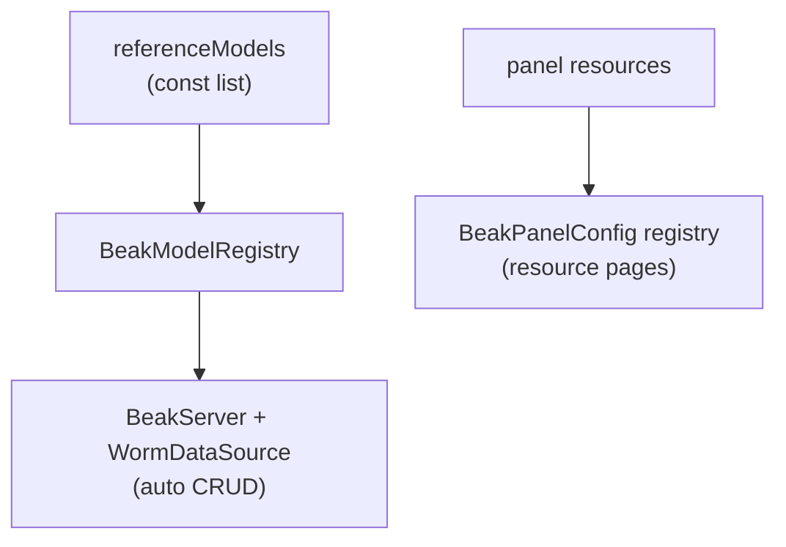

# The model registry

After this page you can build a `BeakModelRegistry`, register your models into
it, look one up by table name, and understand why a single registry is the seam
between "define once" and "drives everything".

A model on its own is inert. The registry is the index that turns a pile of
model constants into something the backend and the panel can serve. It maps
each table name to exactly one model, and both sides of Beak ask it the same
question: "what is the model for this table?"

## What the registry is

`BeakModelRegistry` is a small, ordered map from table name to `BeakModel`. You
build one, register your models, and hand it out.

```dart title="packages/beak_core/lib/src/model/beak_model_registry.dart"
final class BeakModelRegistry {
  /// Creates an empty registry.
  BeakModelRegistry();

  final Map<String, BeakModel> _modelsByTable = {};
```

It has four members, and that is the whole surface.

| Member | Signature | Does |
| --- | --- | --- |
| Register | `void register(BeakModel model)` | indexes `model` under `model.table` |
| Lookup | `BeakModel? byTable(String table)` | the model for `table`, or `null` |
| Strict lookup | `BeakModel byTableOrThrow(String table)` | the model, or throws if missing |
| All | `List<BeakModel> get all` | every model, in registration order |

### register

`register` files a model under its own `table` string. One table maps to exactly
one model, so registering a second model for a table already taken throws a
`BeakConfigurationException` rather than silently overwriting.

```dart title="packages/beak_core/lib/src/model/beak_model_registry.dart"
void register(BeakModel model) {
  if (_modelsByTable.containsKey(model.table)) {
    throw BeakConfigurationException(
      'A model for table "${model.table}" is already registered.',
    );
  }
  _modelsByTable[model.table] = model;
}
```

### byTable and byTableOrThrow

Two lookups, for two situations. `byTable` returns `null` when nothing is
registered, for when a miss is an ordinary outcome you handle. `byTableOrThrow`
throws a `BeakConfigurationException` instead, for request-handling boundaries
where an unknown table means the app was set up wrong, not that a user asked for
something reasonable.

```dart title="packages/beak_core/lib/src/model/beak_model_registry.dart"
BeakModel byTableOrThrow(String table) {
  final model = byTable(table);
  if (model == null) {
    throw BeakConfigurationException(
      'No model registered for table "$table".',
    );
  }
  return model;
}
```

### all

`all` returns every registered model in the order you registered them. That
order matters: it becomes the default order of resources in the panel's
navigation. Register in the order you want the sidebar to read.

## Building one from a model list

You rarely call `register` in a long chain by hand. The reference app keeps its
models in one `const` list and builds the registry from it in a loop, so the
list is the single source of truth for the catalog's shape.

```dart title="apps/reference_admin_models/lib/reference_admin_models.dart"
const List<BeakModel> referenceModels = [
  ProductModel(),
  CategoryModel(),
  TagModel(),
  UserModel(),
  OrderModel(),
  OrderItemModel(),
];

BeakModelRegistry buildReferenceRegistry() {
  final registry = BeakModelRegistry();
  for (final model in referenceModels) {
    registry.register(model);
  }
  return registry;
}
```

!!! note "What just happened"
    - `referenceModels` is declared in the shared `reference_admin_models`
      package, so the server and the Flutter app import the exact same list.
    - `buildReferenceRegistry` is the one function both sides call. Change the
      list and both the API and the panel pick it up. No second place to edit.

## Who gets the registry

The registry is the seam between defining models once and having them drive
everything. The backend wraps it in a data source; a `WormDataSource` reads it to
know which tables to serve, and the `BeakServer` takes it directly.

```dart title="apps/reference_admin_models/lib/reference_admin_models.dart"
final registry = buildReferenceRegistry();
final server = BeakServer(
  config: config,
  registry: registry,
  dataSource: WormDataSource(registry, adapter: adapter),
);
```

On the panel side you do not usually build a registry yourself. You list your
models as `BeakResource`s on the panel config, and the panel derives its own
registry from them. Same models, same table keys, so the two ends resolve
relations to the same tables. The registry is what keeps "the model for
`categories`" meaning one thing across the whole app.



## Continue reading

- [Defining models](defining-models.md) the `BeakModel` you register.
- [Relationships](relationships.md) how `relatedTable` names resolve through the
  registry.
- [Running the server](../backend/running-the-server.md) where the backend takes
  the registry.
- [Resources](../panel/resources.md) how the panel turns models into pages.
