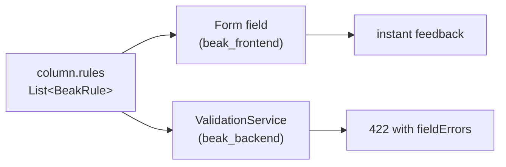

# Validation rules

After this page you can attach any of Beak's eleven built-in rules to a column,
know exactly what each one checks, and trust that the check runs the same way in
the Flutter form and in the Shelf request handler.

A rule is plain data you list on a column. You never wire it up. Because the
column is the single definition that feeds every surface, the rules ride along:
the form field validates against them for instant feedback, and the backend
runs the identical list before it writes a row. One list, both ends of the wire.

## Attaching rules to a column

Every column carries a `rules` list. Add the rules you want, in the order you
want them checked.

```dart title="apps/reference_admin_models/lib/src/product.dart"
/// Display name.
static const name = BeakStringColumn(
  key: 'name',
  label: 'Name',
  searchable: true,
  sortable: true,
  rules: [BeakRequired(), BeakMaxLength(255)],
);

/// Sale price in euros.
static const price = BeakDecimalColumn(
  key: 'price',
  label: 'Price',
  prefix: '€',
  sortable: true,
  filterable: true,
  rules: [BeakRequired(), BeakMin(0)],
);
```

Rules run in list order and the first one that objects wins: a blank `name`
reports "This field is required." before `BeakMaxLength` ever looks at it.

!!! note "What just happened"
    - `rules` is a `const List<BeakRule>`, so it is baked into the column
      constant with zero runtime setup.
    - The panel reads this same list to validate the `name` and `price` form
      fields; `beak_backend` reads it again to validate the incoming request
      body. You wrote it once.

## The rule contract

Every rule is a `BeakRule`. The base is sealed, which is what lets both ends of
the wire switch over the family exhaustively.

```dart title="packages/beak_core/lib/src/rules/beak_rule.dart"
@immutable
sealed class BeakRule {
  const BeakRule();

  /// Stable machine-readable identity for serialization to either side of
  /// the wire.
  String get id;

  /// Returns `null` when [value] is valid, else a human-readable message.
  String? validate(Object? value);
}
```

Two facts fall out of that signature and make rules compose cleanly:

- **`null` means valid.** A non-null string is the error message shown to the
  user.
- **A rule that does not apply to the value's type passes.** `BeakMaxLength`
  ignores a number, `BeakMin` ignores a string. Presence is `BeakRequired`'s job
  alone, so you stack rules freely without them fighting over empty values.

```dart title="packages/beak_core/lib/src/rules/beak_rule.dart"
const rule = BeakMaxLength(3);
rule.validate('abcd'); // 'Must be at most 3 characters.'
rule.validate(42);     // null (not a string)
```

## The eleven rules

Signatures are copied verbatim from `packages/beak_core/lib/src/rules/`. The
message column is the exact text a failing value produces.

| Rule | Constructor | Fails when | Message |
| --- | --- | --- | --- |
| Required | `const BeakRequired()` | value is `null`, a blank/whitespace string, or an empty collection | `This field is required.` |
| Minimum | `const BeakMin(num min)` | a number is below `min` | `Must be at least $min.` |
| Maximum | `const BeakMax(num max)` | a number is above `max` | `Must be at most $max.` |
| Min length | `const BeakMinLength(int minLength)` | a string is shorter than `minLength` | `Must be at least $minLength characters.` |
| Max length | `const BeakMaxLength(int maxLength)` | a string is longer than `maxLength` | `Must be at most $maxLength characters.` |
| Pattern | `const BeakPattern(String regex, {String? message})` | a string does not match `regex` | `message`, else `Must match the expected format.` |
| Email | `const BeakEmail()` | a string is not `local@domain.tld` | `Must be a valid email address.` |
| URL | `const BeakUrl()` | a string is not an absolute `http`/`https` URL with a host | `Must be a valid URL.` |
| In list | `const BeakInList<T>(List<T> allowed)` | a non-null value is not in `allowed` | `Must be one of: ….` |
| Allowed file types | `const BeakAllowedFileTypes(List<BeakFileType> allowedTypes)` | an upload's name/MIME is outside `allowedTypes` | `File type must be one of: ….` |
| Max file size | `const BeakMaxFileSize(int maxSizeInBytes)` | an upload exceeds `maxSizeInBytes` | `File must be at most $maxSizeInBytes bytes.` |

### Presence and text length

`BeakRequired` treats a whitespace-only string as empty, but keeps `false` and
`0` as real, present values.

```dart title="apps/reference_admin_models/lib/src/user.dart"
static const name = BeakStringColumn(
  key: 'name',
  label: 'Name',
  searchable: true,
  sortable: true,
  rules: [BeakRequired(), BeakMaxLength(120)],
);
```

`BeakMinLength` and `BeakMaxLength` cap character counts. `BeakMinLength` does
not imply presence: the empty string fails it like any short string, so pair it
with `BeakRequired` when you also need the field filled in.

### Numeric bounds

`BeakMin` and `BeakMax` are inclusive and only bite numbers. The products model
floors price and stock at zero.

```dart title="apps/reference_admin_models/lib/src/product.dart"
static const stock = BeakIntColumn(
  key: 'stock',
  label: 'Stock',
  min: 0,
  sortable: true,
  rules: [BeakMin(0)],
);
```

### Format: pattern, email, URL

`BeakEmail` and `BeakUrl` are the two common formats built in. `BeakPattern`
covers everything else. Its `regex` is unanchored, so add `^` and `$` yourself
to match the whole value, and pass `message` for a domain-specific error.

```dart title="packages/beak_core/lib/src/rules/beak_pattern.dart"
static const slug = BeakStringColumn(
  key: 'slug',
  label: 'Slug',
  rules: [
    BeakPattern(
      r'^[a-z0-9-]+$',
      message: 'Use lowercase letters, digits and hyphens only.',
    ),
  ],
);
```

The users model uses `BeakEmail` directly on the login field:

```dart title="apps/reference_admin_models/lib/src/user.dart"
static const email = BeakStringColumn(
  key: 'email',
  label: 'Email',
  searchable: true,
  sortable: true,
  rules: [BeakRequired(), BeakEmail()],
);
```

### Membership

`BeakInList<T>` keeps a value inside a known set and stays type-safe through its
type parameter. `null` passes (leave presence to `BeakRequired`).

```dart title="packages/beak_core/lib/src/rules/beak_in_list.dart"
static const size = BeakStringColumn(
  key: 'size',
  label: 'Size',
  rules: [BeakInList<String>(['S', 'M', 'L'])],
);
```

!!! tip "Prefer an enum column for fixed sets"
    When the whole set of values is known at compile time, reach for a
    [`BeakEnumColumn`](column-types.md) instead of a string plus `BeakInList`.
    The enum column gives you typed values, badge colors, and a real dropdown
    for free. Keep `BeakInList` for sets that are strings by nature.

### File rules

`BeakAllowedFileTypes` and `BeakMaxFileSize` gate uploads. You rarely write them
by hand: an image or file column takes `allowedTypes` and `maxSizeInBytes`
arguments and Beak applies the matching rules for you (see
[Files and storage columns](files-and-storage-columns.md)). They exist as
standalone rules for the same reason the others do: so the check is one value
that travels to both sides.

```dart title="packages/beak_core/lib/src/rules/beak_allowed_file_types.dart"
const rule = BeakAllowedFileTypes([BeakFileType.jpeg, BeakFileType.png]);
rule.validate('photo.PNG');       // null (extension matches)
rule.validate('image/jpeg');      // null (MIME matches)
rule.validate('notes.pdf');       // 'File type must be one of: jpg, png.'
```

## The client and server mirror

The reason to define rules on the column rather than in a form widget is that
there is only one place to define them, and both ends read it.



The panel runs the list as the user types, so a bad value is caught before the
request leaves the browser. The server runs the identical list in
`beak_backend`'s validation step before any write. A request that slips past a
stale client (or comes from `curl`) still hits the same wall and comes back as a
`BeakValidationException` carrying per-field messages. The form never lies to
you, because the form and the server read the same list.

## Continue reading

- [Column basics](column-basics.md) the shared options every column carries,
  including `rules`.
- [Column types](column-types.md) the leaf columns you attach rules to.
- [Files and storage columns](files-and-storage-columns.md) how `allowedTypes`
  and `maxSizeInBytes` become file rules.
- [Validation rules reference](../reference/validation-rules.md) the exhaustive
  member-by-member table.
- [Forms](../panel/forms.md) where the rules show up as live form validation.
