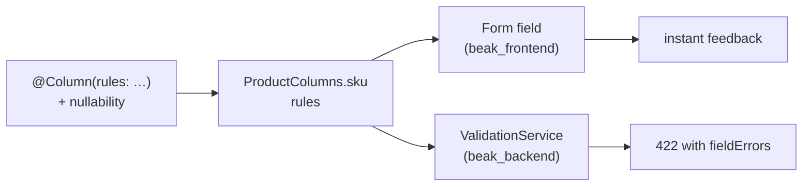

# Validation rules

After this page you can attach any of Beak's eleven built-in rules to a field,
know exactly what each one checks, and trust that the check runs the same way in
the Flutter form and in the Shelf request handler.

A rule is plain data you list on `@Column`. You never wire it up. Because the
field is the single definition that feeds every surface, the rules ride along:
the form field validates against them for instant feedback, and the API runs the
identical list before it writes a row. One list, both ends of the wire.

## Attaching rules to a field

`@Column(rules: [...])` takes the rules you want, in the order you want them
checked.

```dart title="examples/store/lib/models/order_item.dart"
/// How many units were bought.
@Column(min: 1, rules: [BeakMin(1)])
late final int quantity;

/// What one unit cost, in euros.
@Column(prefix: '€', rules: [BeakMin(0)])
late final double unitPrice;
```

Rules run in list order and the first one that objects wins.

!!! note "What just happened"
    - `rules` is a `const List<BeakRule>`, baked into the generated column
      constant with no runtime setup.
    - The panel reads that list to validate the `quantity` and `unitPrice` form
      fields; `beak_backend` reads it again to validate the incoming request
      body. You wrote it once.
    - `min: 1` bounds the form's stepper. `BeakMin(1)` is what rejects a `0` that
      arrives anyway. The first is a convenience, the second is the rule.

## Required is the type, not a rule

You never write `BeakRequired()`. A non-nullable field is required and a nullable
one is not, and `beak prepare` puts the rule in front of the list for you:

```dart title="examples/store/lib/models/product.dart"
/// The stock-keeping unit, unique across the catalog.
@Column(
  label: 'SKU',
  searchable: true,
  unique: true,
  rules: [BeakMaxLength(40)],
)
late final String sku;
```

```dart title="examples/store/lib/models/product.beak.dart"
/// The stock-keeping unit, unique across the catalog.
static const BeakStringColumn sku = BeakStringColumn(
  key: 'sku',
  label: 'SKU',
  rules: [BeakRequired(), BeakMaxLength(40)],
  searchable: true,
  unique: true,
);
```

The same nullability decides the migration's `NOT NULL`, so a blank `sku`
reports "This field is required." in the form, comes back `422` from the API, and
would be refused by the database if it ever got that far. Three answers, one
decision.

## The rule contract

Every rule is a `BeakRule`. The base is sealed, which is what lets both ends of
the wire switch over the family exhaustively.

```dart title="packages/beak_core/lib/src/rules/beak_rule.dart"
@immutable
sealed class BeakRule {
  const BeakRule();

  /// Stable machine-readable identity for serialization to either side of
  /// the wire.
  String get id;

  /// Returns `null` when [value] is valid, else a human-readable message.
  String? validate(Object? value);
}
```

Two facts fall out of that signature and make rules compose cleanly:

- **`null` means valid.** A non-null string is the error message shown to the
  user.
- **A rule that does not apply to the value's type passes.** `BeakMaxLength`
  ignores a number, `BeakMin` ignores a string. Presence is `BeakRequired`'s job
  alone, so you stack rules freely without them fighting over empty values.

```dart title="packages/beak_core/lib/src/rules/beak_rule.dart"
const rule = BeakMaxLength(3);
rule.validate('abcd'); // 'Must be at most 3 characters.'
rule.validate(42);     // null (not a string)
```

## The eleven rules

Signatures are copied verbatim from `packages/beak_core/lib/src/rules/`. The
message column is the exact text a failing value produces.

| Rule | Constructor | Fails when | Message |
| --- | --- | --- | --- |
| Required | `const BeakRequired()` | value is `null`, a blank/whitespace string, or an empty collection | `This field is required.` |
| Minimum | `const BeakMin(num min)` | a number is below `min` | `Must be at least $min.` |
| Maximum | `const BeakMax(num max)` | a number is above `max` | `Must be at most $max.` |
| Min length | `const BeakMinLength(int minLength)` | a string is shorter than `minLength` | `Must be at least $minLength characters.` |
| Max length | `const BeakMaxLength(int maxLength)` | a string is longer than `maxLength` | `Must be at most $maxLength characters.` |
| Pattern | `const BeakPattern(String regex, {String? message})` | a string does not match `regex` | `message`, else `Must match the expected format.` |
| Email | `const BeakEmail()` | a string is not `local@domain.tld` | `Must be a valid email address.` |
| URL | `const BeakUrl()` | a string is not an absolute `http`/`https` URL with a host | `Must be a valid URL.` |
| In list | `const BeakInList<T>(List<T> allowed)` | a non-null value is not in `allowed` | `Must be one of: ….` |
| Allowed file types | `const BeakAllowedFileTypes(List<BeakFileType> allowedTypes)` | an upload's name/MIME is outside `allowedTypes` | `File type must be one of: ….` |
| Max file size | `const BeakMaxFileSize(int maxSizeInBytes)` | an upload exceeds `maxSizeInBytes` | `File must be at most $maxSizeInBytes bytes.` |

`BeakRequired` is the one you do not write; the other ten you list yourself.

### Text length

`BeakMinLength` and `BeakMaxLength` cap character counts. `BeakMinLength` does
not imply presence: the empty string fails it like any short string, so make the
field non-nullable when you also need it filled in.

```dart title="examples/store/lib/models/category.dart"
/// What the category is called.
@Display()
@Column(searchable: true, sortable: true, rules: [BeakMaxLength(120)])
late final String name;
```

`@Column(maxLength: 120)` and `rules: [BeakMaxLength(120)]` are different jobs.
The first stops the form input accepting a 121st character; the second rejects
the value wherever it came from, including a `curl` that never saw the form.
Reach for the rule, and add `maxLength` when you also want the input to stop
typing.

### Numeric bounds

`BeakMin` and `BeakMax` are inclusive and only bite numbers. The store floors
price at zero and gives the stepper the same floor.

```dart title="examples/store/lib/models/product.dart"
/// Sale price in euros.
@Column(prefix: '€', sortable: true, filterable: true, rules: [BeakMin(0)])
late final double price;

/// Units in stock.
@Column(suffix: ' pcs', min: 0, sortable: true)
late final int stock;
```

### Format: pattern, email, URL

`BeakEmail` and `BeakUrl` are the two common formats built in. The store's user
puts `BeakEmail` on the login field:

```dart title="examples/store/lib/models/user.dart"
/// Login email, unique across the store.
@Column(searchable: true, sortable: true, unique: true, rules: [BeakEmail()])
late final String email;
```

`BeakPattern` covers everything else. Its `regex` is unanchored, so add `^` and
`$` yourself to match the whole value, and pass `message` for a domain-specific
error.

```dart title="packages/beak_core/lib/src/rules/beak_pattern.dart"
static const slug = BeakStringColumn(
  key: 'slug',
  label: 'Slug',
  rules: [
    BeakPattern(
      r'^[a-z0-9-]+$',
      message: 'Use lowercase letters, digits and hyphens only.',
    ),
  ],
);
```

### Membership

`BeakInList<T>` keeps a value inside a known set and stays type-safe through its
type parameter. `null` passes, since presence is decided by the field's
nullability.

```dart title="packages/beak_core/lib/src/rules/beak_in_list.dart"
static const size = BeakStringColumn(
  key: 'size',
  label: 'Size',
  rules: [BeakInList<String>(['S', 'M', 'L'])],
);
```

!!! tip "Prefer an enum field for fixed sets"
    When the whole set of values is known at compile time, declare a Dart enum
    and use it as the field's type instead of a string plus `BeakInList`. The
    [enum column](column-types.md#beakenumcolumnt) gives you typed values, badge
    colours and a real dropdown for free. Keep `BeakInList` for sets that are
    strings by nature.

### File rules

`BeakAllowedFileTypes` and `BeakMaxFileSize` gate uploads. You do not write them:
`@Image` and `@FileField` take `allowedTypes` and `maxSizeInBytes`, and Beak
applies the matching rules (see
[Files and storage columns](files-and-storage-columns.md)). They exist as
standalone rules for the same reason the others do, so the check is one value
that travels to both sides.

```dart title="packages/beak_core/lib/src/rules/beak_allowed_file_types.dart"
const rule = BeakAllowedFileTypes([BeakFileType.jpeg, BeakFileType.png]);
rule.validate('photo.PNG');       // null (extension matches)
rule.validate('image/jpeg');      // null (MIME matches)
rule.validate('notes.pdf');       // 'File type must be one of: jpg, png.'
```

## The client and server mirror

The reason to declare rules on the field rather than in a form widget is that
there is only one place to declare them, and both ends read it.



The panel runs the list as the user types, so a bad value is caught before the
request leaves the browser. The server runs the identical list before any write.
A request that slips past a stale client (or comes from `curl`) hits the same
wall and comes back as a `BeakValidationException` carrying per-field messages.
The form never lies to you, because the form and the server read the same list.

## Continue reading

- [Column basics](column-basics.md) the shared `@Column` options, `rules`
  included.
- [Column types](column-types.md) the field types you attach rules to.
- [Files and storage columns](files-and-storage-columns.md) how `allowedTypes`
  and `maxSizeInBytes` become file rules.
- [Validation rules reference](../reference/validation-rules.md) the exhaustive
  member-by-member table.
- [Forms](../panel/forms.md) where the rules show up as live form validation.
