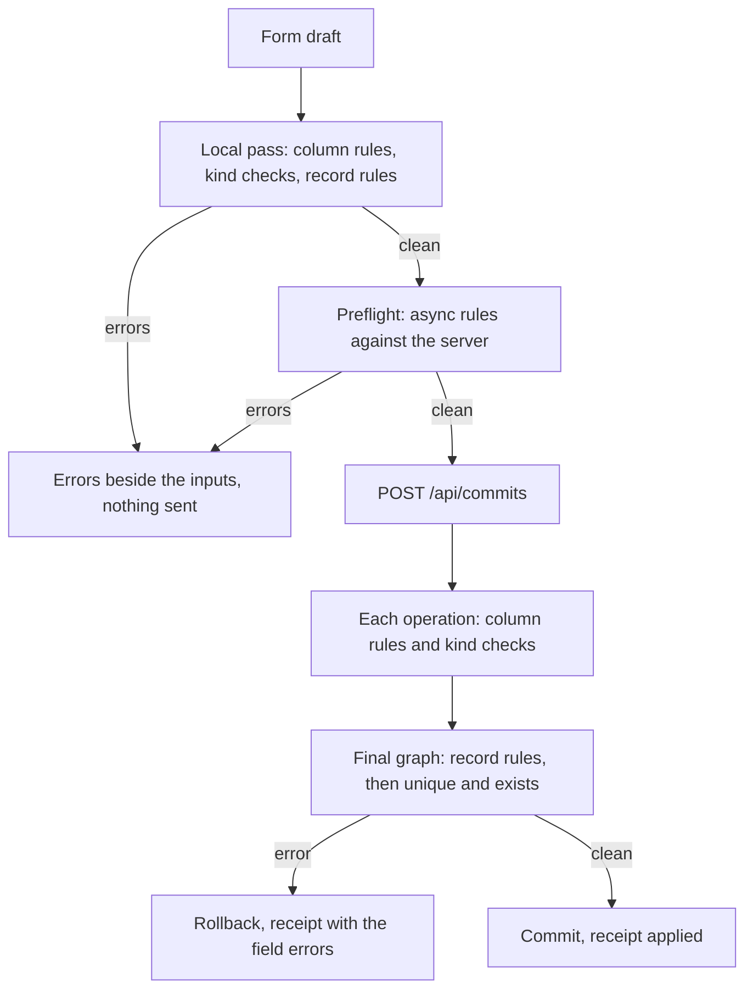

# Validation

A form can refuse a value, but the browser is not the boundary: anyone with `curl` walks around it. So Beak keeps rules on the schema, runs the same Dart in the form and on the server, and lets the server have the last word. After this page you can tell which of three layers a constraint belongs in, where it runs, and what the caller gets back when it fails.

## At a glance

Three layers, all declared on the schema class. You never write a rule twice, and you never write a field name as a string.

| You want | Write | Layer |
| --- | --- | --- |
| A field that must have a value | A non-nullable Dart type | Column |
| Length, range, format or a fixed set of values | `rules: [BeakMaxLength(120)]`, `BeakMin(0)`, `BeakEmail()`, `BeakPattern(...)`, `BeakInList([...])` in `@Column` | Column |
| An end after a start, or two fields that agree | `BeakAfterField`, `BeakBeforeField`, `BeakSameAs` | Record |
| A field required only when another one is set | `BeakRequiredIf(field, when: BeakWhen.present(other))` | Record |
| At least one child row, no repeated child value, a bounded total | `BeakCount`, `BeakDistinct`, `BeakSum` | Record |
| A value nobody else uses, optionally per parent | `unique: true` or `BeakUnique(field, scope: [...])` | Async |
| A chosen record that exists and is eligible | `BeakExists(field, target, where:, matching:)` | Async |
| A check that needs domain code | `throw field.invalid(message)` in a graph preparer | Server only |
| Feedback for one screen | `validate:` or `validators:` on the input | Client only |

Column and record rules are plain Dart in `beak_core`. The panel and the server call the same function, so the message you see in the form is the message the API sends. Async rules need the database, so the form asks the server through a preflight and the server asks again on save. The form is a courtesy, the server is the door.

## Nullability is the first rule

You do not write `BeakRequired`. A non-nullable field is required, a nullable one is not, and `beak prepare` puts `BeakRequired()` in front of whatever rules you declared.

```dart title="examples/quickstart/lib/resources/notes/models/note.dart"
  @Display()
  @Column(searchable: true, sortable: true, rules: [BeakMaxLength(255)])
  late final String title;
```

```dart title="examples/quickstart/lib/resources/notes/models/note.beak.dart"
  static const BeakStringColumn title = BeakStringColumn(
    key: 'title',
    label: 'Title',
    rules: [BeakRequired(), BeakMaxLength(255)],
    searchable: true,
    sortable: true,
    maxLength: 255,
  );
```

Two things happened to that one rule. `BeakMaxLength(255)` validates the input, and it also became the column's stored length and the form's typing cap (`maxLength: 255`). `BeakMin` and `BeakMax` on an `int` bound the stepper the same way. There is no `maxLength:` parameter on `@Column` any more, and `beak prepare` names the rule to write when it finds one.

A `List` or `BeakJsonObject` field gets `BeakRequired(allowEmpty: true)`: an empty list is a value, `null` is not.

Some checks need no rule at all. A semantic carries its own: `email`, `url`, `phone`, `slug`, `uuid`, a valid calendar date, an exact decimal that fits. The shop's fulfillment policy declares `slug` on its `code` (quoted below) and `email`, `phone` and `url` on its contact fields. Both `slug` and `email` show up in the error output further down.

```dart title="examples/clean_beak_config/lib/resources/fulfillment/models/fulfillment_policy.dart"
  @Display()
  @Column(searchable: true, rules: [BeakMaxLength(120)])
  late final String name;

  /// Stable unique URL-safe identifier.
  @Column(semantic: BeakSemantic.slug(), unique: true, searchable: true)
  late final String code;
```

## Record rules

A column rule sees one value. A record rule sees the whole candidate: the stored record, the submitted values on top of it, and any staged child rows. It reports its error on the field you name, so the message lands on the right input. Declare them once as a static getter on the schema class, and every form and API write of the model applies them.

```dart
--8<-- "examples/clean_beak_config/lib/resources/fulfillment/models/fulfillment_policy.dart:FulfillmentRules"
```

`BeakAfterField(promotionEndsAt, promotionStartsAt, inclusive: true)` puts its message on the first field. `BeakRequiredIf` takes a `BeakWhen`, a typed condition you can negate with `.not` or combine with `BeakWhen.all` and `BeakWhen.any`. A misspelled field is a compile error, because every reference is a generated `Model.field`.

Rules can also read child rows through a relationship. The order needs at least one item, and the chosen delivery profile has to belong to the chosen customer:

```dart
--8<-- "examples/clean_beak_config/lib/resources/orders/models/order.dart:OrderValidationRules"
```

`BeakFieldMatch(target:, source:)` is one dependent equality: the `userId` of the selected profile connection must equal the `customerId` of the order. The picker in the form uses the same declaration, so you cannot select a wrong profile in the first place (more on that under [Async rules](#async-rules)).

There is a cost to reading related rows. Beak can only judge `BeakCount(OrderModel.items, min: 1)` once the items exist, so it checks the rule at the end of a graph commit, on the final state, and it closes the direct write routes of the models involved. They answer `422` with `This resource must be saved through a graph commit.` Reads stay open, and the panel saves through commits anyway.

`BeakRecordRule` is an abstract class, not a sealed one, so an application can write its own. Most never need to: the full list of rules, with constructors and exact messages, is in [Validation rules](../reference/validation-rules.md).

## Async rules

Uniqueness and existence need the database. Locally these rules report nothing; the server evaluates them through the same row policy as an ordinary read, and the form preflights them.

```dart
--8<-- "examples/clean_beak_config/lib/resources/products/models/product_variant.dart:ProductVariantValidationRules"
```

`BeakUnique(combinationKey, scope: [productId])` means a product sells a given attribute combination once, while two products may share it. `BeakDistinct` is a record rule and needs no database: it looks at the staged child rows before anything is stored. `unique: true` on a column is the shorthand for an unscoped `BeakUnique`, and every belongs-to foreign key gets an existence check without being asked.

`BeakExists` can carry a `where:` filter and any number of `matching:` pairs. Foodio allows only active payment methods, and only the customer's own:

```dart
--8<-- "examples/foodio-adminpanel/lib/models/order.dart:FoodioOrderRules"
```

The relationship picker reads these rules. It adds the `where:` filter and each `matching:` pair to its option query, so the list only offers eligible rows, and it asks for the missing prerequisite ("Select Customer first.") before it lets you open. A pick that no longer fits, because a dependency changed after it, is reported as `Selection is no longer available.` The server then runs the same rule as the backstop.

### The database has the last word

Two admins create the same SKU within a few milliseconds. Both preflights pass, both writes start, the second one hits the unique index. So the preflight is advice, and the index is the rule. The migration that `beak prepare` writes creates that index for `unique: true` and for every `BeakUnique` (one column, or the field plus its scope). `WormDataSource` turns the violation into a `BeakConflictException`, which is a `409` with `A value that must be unique is already in use.`

There is one catch you should know about. `beak make:migration --from-drift` compares tables, columns and pivot tables, not indexes. If you add `unique: true` or a `BeakUnique` to a table that already exists, write the index yourself. The shop did exactly that when it introduced variant combinations:

```dart title="examples/clean_beak_config/lib/migrations/add_variant_combinations.dart"
    await schema.alter(const ProductVariantModel().table, (table) {
      BeakBlueprint.defineColumn(table, ProductVariantColumns.combinationKey);
      table.unique([
        ProductVariantColumns.productId.key,
        ProductVariantColumns.combinationKey.key,
      ]);
    });
```

## Where each rule runs

One save of a form goes through these stages. A local failure stops it before anything is sent.



| | Form | Direct `POST` or `PATCH` | Graph commit |
| --- | --- | --- | --- |
| Column rules and kind checks | Before anything is sent | Yes, submitted fields only on an update | Per operation, as it is applied |
| `BeakRequired` on an omitted field | Yes | Checked on a create | Checked on a create |
| Record rules | On the draft, for fields that have an input | On the stored record with the submitted values on top | After the last write, on the final graph, inside the transaction |
| Async rules | Debounced preflight (350 ms) and again on save | After the synchronous pass | After the last write |

The direct route works in two passes: column and record rules first, async rules second. A body with both kinds of error shows the first kind, and the second appears once you fix it. A graph commit also validates every record whose rules read the ones you touched, so deleting the last item of an order re-checks the order and `BeakCount(OrderModel.items, min: 1)` still holds.

## What an error looks like

Errors are keyed by column key, the snake case name on the wire, not the Dart name. This request breaks three rules on the shop's fulfillment policy: a slug with a space, a malformed email, and a promotion that ends before it starts. The record rule is the third one.

```bash
curl -s -i -X POST localhost:8080/api/fulfillment_policies \
  -H 'content-type: application/json' \
  -d '{"name":"Weekend","code":"Weekend Express","currency":"EUR","delivery_fee":490,
       "insurance_rate":0.025,"attachment_limit":1024,"handling_time":86400000000,"speed":"express",
       "promotion_starts_at":{"type":"dateTime","value":"2026-05-01T00:00:00.000Z"},
       "promotion_ends_at":{"type":"dateTime","value":"2026-04-01T00:00:00.000Z"},
       "support_email":"not-an-email"}'
```

```text
HTTP/1.1 422 Status 422
{"code":"validation","message":"Validation failed for \"fulfillment_policies\".","fieldErrors":{"code":["Use lowercase letters, numbers and single hyphens."],"support_email":["Must be a valid email address."],"promotion_ends_at":["Must be on or after Promotion Starts At."]},"requestId":"8fb1dfb47a987538"}
```

A direct write answers `422` with the messages in `fieldErrors`. The same rejection inside a graph commit answers `200`, because the HTTP status describes the request and the receipt describes the save. This is a new order with a valid customer and profile and no items:

```json
{
  "saveId": "probe-1790677269065606",
  "mode": "atomic",
  "outcomes": [
    {
      "id": "order:create",
      "status": "unapplied",
      "error": {
        "code": "validation",
        "message": "Validation failed for \"orders\".",
        "fieldErrors": { "items": ["Add at least 1 items."] }
      },
      "reason": "rejected"
    }
  ]
}
```

Nothing was written, and the receipt says so. If you call the API by hand, look at both the status and the outcomes. [Graph commits](../architecture/graph-commits.md) covers the receipt in full.

The form does the sorting for you. Each error lands on the input with that key, the child rows keep their own errors, and a rule on a collection (`items` above) lands on the table editor. The preflight route, `POST /api/{table}/validate`, returns the async part of the same answer without writing anything, and answers `200` whether it found errors or not:

```text
{"fieldErrors":{"code":["This value is already in use."]}}
```

## Checks that belong to one screen

A rule on the schema holds for every caller. Some checks hold only for one screen, and belong there. The shop's order wizard refuses a delivery date in the past, but only while creating, because the model deliberately lets historical orders be edited:

```dart
--8<-- "examples/clean_beak_config/lib/resources/orders/screens/order_form_wizard_screen.dart:orderDeliveryDateValidator"
```

`validate:` takes a list of column rules, and `validators:` takes callbacks that receive the value and the live draft, synchronous or asynchronous. Both run in the form only. The server never sees them, so anything that must hold for the API too goes on the schema. The wizard adds its own timing: going to the next step validates the current one, jumping ahead validates every step before the target and stops at the first that fails, and finishing validates the whole graph. Errors in later steps stay hidden until you get there.

When a rule needs domain code, such as a total computed from the catalog, the graph preparer throws a typed error instead. `field.invalid(message)` builds a `BeakValidationException` keyed by that field, so the form highlights it without the preparer spelling a column key:

```dart title="examples/clean_beak_config/lib/domain/shop_graph_preparer.dart"
Never _invalid(BeakFieldRef<Object> field, String message) =>
    throw field.invalid(message);
```

For a belongs-to field, the error is keyed by the foreign key column (`profile_id`). See [Transactional business rules](../backend/graph-business-rules.md) for where preparers run.

## Rules and limits

- The server is the authority. The form mirrors column, record and async rules so you get feedback early, and nothing in the form is sent as a rule.
- A field with no input on the current form cannot show its error. The form drops record-rule errors for keys it has no placement for; the server returns them on save.
- The form skips inputs the principal cannot write and inputs that [model behavior](behavior.md) has locked, and validates the rest.
- `BeakCount`, `BeakDistinct`, `BeakSum` and the async rules take no `message:`; their wording is fixed, including `Add at least 1 items.` `BeakRequiredIf`, `BeakSameAs`, `BeakBeforeField`, `BeakAfterField`, `BeakPattern` and `BeakFutureDate` do.
- In a graph commit a unique index fires while the row is written, before the async pass runs. A duplicate then comes back as `code: conflict`, `A value that must be unique is already in use.`, with empty `fieldErrors`. The form's preflight normally names the field first, so you meet the bare conflict on a race, or from a caller that skips the preflight.
- A rule that reads related rows makes the model graph-only for writes, and needs a Worm-backed server. A server on another data source refuses to boot with `Shared relationship validation requires an atomic graph data source.`
- Rules cannot read the principal. Who may do something is a policy, see [Auth and policies](../backend/auth-and-policies.md).
- Messages are English strings in `beak_core`.

## Verify it

Check the layers without a server first. This scratch script validates a fulfillment policy in-process, with the same function the API calls (illustrative, not a file in the repo):

```dart
final errors = const BeakValidation().validate(
  const FulfillmentPolicyModel(),
  const FulfillmentPolicyModel().record([
    FulfillmentPolicyModel.name.to('Weekend'),
    FulfillmentPolicyModel.code.to('Weekend Express'),
    FulfillmentPolicyModel.supportEmail.to('not-an-email'),
    FulfillmentPolicyModel.promotionStartsAt.to(DateTime.utc(2026, 5)),
    FulfillmentPolicyModel.promotionEndsAt.to(DateTime.utc(2026, 4)),
  ]),
);
errors.forEach((field, messages) => print('$field: $messages'));
```

```text
code: [Use lowercase letters, numbers and single hyphens.]
support_email: [Must be a valid email address.]
promotion_ends_at: [Must be on or after Promotion Starts At.]
```

Then run the `curl` call above against a running server (`beak dev` serves the API, the shop listens on port 8080) and compare. The three messages match, because both sides call the same code. To see the async layer, create a policy with a valid body twice: the second call answers `422`, and its `fieldErrors` is `{"code":["This value is already in use."]}`.

## Reference

| Symbol | What it is | Details |
| --- | --- | --- |
| `BeakRule` | Sealed base of the twelve column rules; `validate(value)` returns `null` or the message | [Validation rules](../reference/validation-rules.md#column-rules) |
| `BeakRecordRule` | Abstract base of record rules; `fields`, `validate(record)`, `relationLoads` | [Validation rules](../reference/validation-rules.md#record-rules) |
| `BeakAsyncRecordRule` | Sealed base of `BeakUnique` and `BeakExists` | [Validation rules](../reference/validation-rules.md#async-rules) |
| `BeakWhen` | Typed condition for `BeakRequiredIf`: `equals`, `present`, `all`, `any`, `not` | [Validation rules](../reference/validation-rules.md#conditions) |
| `BeakValidation` | Runs column, kind and record rules on a candidate record | [Validation rules](../reference/validation-rules.md#entry-points) |
| `BeakAsyncValidation` | Runs uniqueness and existence against a query | [Validation rules](../reference/validation-rules.md#entry-points) |
| `BeakValidationException` | The `422`: `message` and `fieldErrors` | [Exceptions](../reference/exceptions.md) |
| `POST /api/{table}/validate` | Preflight route, `200` with the field errors | [REST API](../reference/rest-api.md) |

## Continue reading

- [Model behavior](behavior.md) covers what rules cannot say: values that follow other values, locked states and named commands.
- [Relationships](relationships.md) shows how ownership and `BeakExists` shape the pickers and nested editors.
- [Multi-step forms](../forms/multi-step-forms.md) covers wizard steps and the validation each one runs.
- [Transactional business rules](../backend/graph-business-rules.md) covers the server preparer that throws `field.invalid`.
