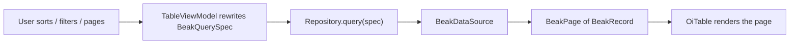

# Tables and filters

After this page you understand how the generated list renders a model as a table,
how every sort, filter, and page change turns into a server-side query, and how to
add a typed filter bar that never touches a string field name.

## The generated table

`BeakDataTable` is the list view. It draws a model's table-context columns as an
`OiTable` with server-side sort, filter, and pagination through a `BeakQuerySpec`,
per-row and bulk actions, optimistic delete with undo, and inline edit. There is
no per-resource table code: the list page builds one for you from the resource.

```dart title="packages/beak_frontend/lib/src/table/beak_data_table.dart"
const BeakDataTable({
  required this.model,
  required this.dataSource,
  this.actions = const [],
  this.bulkActions = const [],
  this.onRowTap,
  this.initialSpec,
  this.baseFilter,
  this.controller,
  this.enableDelete = true,
  super.key,
});
```

Every cell is drawn by the same renderer the detail view uses, keyed on the
column's table-context render intent, so a badge, a date, a thumbnail, or a custom
cell looks identical in the table and on the show page. One column definition,
two surfaces that agree.

| Constructor field | Type | Default | What it does |
| --- | --- | --- | --- |
| `model` | `BeakModel` | required | The model this table lists. |
| `dataSource` | `BeakDataSource` | required | The source queries and mutations run against. |
| `actions` | `List<BeakTableAction>` | `[]` | Per-row actions, each invoked with the row's primary key. |
| `bulkActions` | `List<BeakTableAction>` | `[]` | Actions over the selected rows. |
| `onRowTap` | `void Function(BeakRecord)?` | `null` | Invoked with the tapped record (usually navigates to its show route). |
| `initialSpec` | `BeakQuerySpec?` | `null` | The spec the first fetch runs (default: unfiltered first page). |
| `baseFilter` | `BeakFilter?` | `null` | A persistent predicate that in-table column filters AND-merge with. |
| `enableDelete` | `bool` | `true` | Whether the built-in optimistic delete row action renders. |

## Everything is a query spec

The table owns no ad-hoc state. Behind it a view model holds one `BeakQuerySpec`,
and every interaction rewrites that spec and refetches through the repository (the
catch boundary). Sorting replaces the spec's `sorts`; changing a column filter
rewrites its `filter`; paging rewrites its `pagination`. The spec is the single
description of "what the table is showing", and it is the same serializable object
the backend receives.



Two properties matter in practice. Fetches resolve **latest-wins**: a response
belonging to a superseded request never overwrites newer state, so fast clicking
never shows stale rows. And a failed fetch renders a retryable error state instead
of throwing into the widget tree.

The spec's builders (`withFilter`, `orderBy`, `paginate`, `searching`,
`withRelation`) only ever append, which keeps them composable. Table interactions
need to *replace* a part instead, so the view model rebuilds the spec directly.
The full query contract lives on [How data flows](../concepts/how-data-flows.md).

## Typed filters

A filter is declared once per resource. `BeakFilterDef` is a sealed family, so the
bar switches over its variants exhaustively and no `Map<String, dynamic>` ever
appears. Each variant binds to a `BeakColumn` and fixes both how it renders and
which `BeakOperator` it contributes.

```dart title="packages/beak_frontend/lib/src/filters/beak_filter_widget.dart"
sealed class BeakFilterDef {
  /// Creates a filter over [column] labelled [label].
  const BeakFilterDef({required this.column, required this.label});

  /// The column the filter constrains.
  final BeakColumn column;

  /// The control label.
  final String label;
}
```

| Filter | Control | Operator | Contributes a predicate when |
| --- | --- | --- | --- |
| `BeakSelectFilter` | `OiSelect` (enum options) | `eq` | a value is selected (clearing removes it). |
| `BeakBoolFilter` | `OiSwitch` | `eq` `true` | enabled (disabled contributes nothing, not `false`). |
| `BeakTextFilter` | text input | `contains` | the trimmed value is non-empty. |
| `BeakDateRangeFilter` | `OiDateRangePickerField` | `between` | a start/end range is picked (clearing removes it). |

`BeakSelectFilter` needs an enum column: its options come straight from the
column's `values`, labelled through `labelFor`. Point it at a non-enum column and
the bar renders a caption telling you so, rather than failing silently.

List the filters on the resource and the list page grows a filter bar:

```dart title="examples/superdashboard/lib/panel/resources.dart"
BeakResource(
  model: OrderModel(),
  icon: BeakIconToken(OiIcons.shoppingCart),
  section: 'Store',
  detail: orderLayout,
  formLayout: orderLayout,
  filters: [
    BeakSelectFilter(column: OrderColumns.status, label: 'Status'),
    BeakSelectFilter(column: OrderColumns.source, label: 'Source'),
  ],
),
```

The tutorial store shows the boolean and text variants:

```dart
BeakResource(
  model: UserModel(),
  icon: BeakIconToken(OiIcons.users),
  filters: [
    BeakBoolFilter(column: UserColumns.active, label: 'Active only'),
  ],
),
```

## The filter bar AND-merges

Two things can constrain the table at once: the filter bar above it and any
column filters inside the `OiTable` header. Beak keeps them from clobbering each
other by treating the filter bar's predicate as a **base filter** and AND-merging
in-table column filters with it, rather than replacing it.

```dart title="packages/beak_frontend/lib/src/table/table_view_model.dart"
/// AND-merges the table's own [filter] with the persistent base filter
/// so the filter bar and the column filters never clobber each other.
BeakFilter _withBase(BeakFilter filter) => switch (_baseFilter) {
  null => filter,
  final BeakFilter base => BeakAndFilter([base, filter]),
};
```

The filter bar itself does the same internally: each active control contributes
one typed `BeakFilter`, and the bar ANDs them together with `BeakFilter.allOf`,
reporting `null` when nothing is active. So a select on Status plus a text filter
on Name plus an in-table column filter all combine into one predicate the backend
resolves in a single query. Filters narrow; they never fight.

!!! note "What just happened"
    - A `BeakFilterDef` bound to a column produced a specific control and a
      specific operator, chosen exhaustively by the sealed switch.
    - Every active filter became a typed `BeakFieldFilter`, AND-ed with the
      others and with any in-table column filter.
    - The combined predicate rewrote the `BeakQuerySpec`, and the table refetched
      one server-side page.

## Continue reading

- [View modes](view-modes.md) show the same records as a calendar or a board.
- [Actions](actions.md) the row, bulk, and page actions the table hosts.
- [Column types](../models/column-types.md) what each column contributes as a
  table cell and whether it is sortable, searchable, or filterable.
- [The generated API](../backend/the-generated-api.md) the server endpoint the
  spec is posted to.
