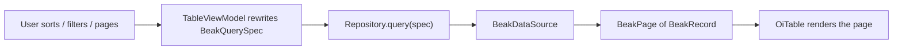

# Tables and filters

After this page you understand how the generated list renders a model as a table,
how every sort, filter, and page change turns into a server-side query, and why
most resources get a working filter bar without a filter list anywhere.

## The generated table

`BeakDataTable` is the list view. It draws a model's table-context columns as an
`OiTable` with server-side sort, filter, and pagination through a `BeakQuerySpec`,
per-row and bulk actions, optimistic delete with undo, and inline edit. There is
no per-resource table code: the list page builds one for you from the resource.

```dart title="packages/beak_frontend/lib/src/table/beak_data_table.dart"
const BeakDataTable({
  required this.model,
  required this.dataSource,
  this.columns,
  this.actions = const [],
  this.bulkActions = const [],
  this.onRowTap,
  this.onOpenRelation,
  this.initialSpec,
  this.baseFilter,
  this.controller,
  this.enableDelete = true,
  super.key,
});
```

Every cell is drawn by the same renderer the detail view uses, keyed on the
column's table-context render intent, so a badge, a date, a thumbnail, or a custom
cell looks identical in the table and on the show page. One column definition,
two surfaces that agree.

| Constructor field | Type | Default | What it does |
| --- | --- | --- | --- |
| `model` | `BeakModel` | required | The model this table lists. |
| `dataSource` | `BeakDataSource` | required | The source queries and mutations run against. |
| `columns` | `List<BeakColumn>?` | `null` | The columns to render, in order; defaults to the model's table-context columns. |
| `actions` | `List<BeakTableAction>` | `[]` | Per-row actions, each invoked with the row's primary key. |
| `bulkActions` | `List<BeakTableAction>` | `[]` | Actions over the selected rows. |
| `onRowTap` | `void Function(BeakRecord)?` | `null` | Invoked with the tapped record (usually navigates to its show route). |
| `onOpenRelation` | `void Function(BeakRelationship, BeakRecord)?` | `null` | Invoked with the record on the far side of a to-one relationship. When null the relationship renders as plain text instead of a link. |
| `initialSpec` | `BeakQuerySpec?` | `null` | The spec the first fetch runs (default: unfiltered first page). |
| `baseFilter` | `BeakFilter?` | `null` | A persistent predicate that in-table column filters AND-merge with. |
| `controller` | `OiTableController?` | `null` | Test seam for driving selection and pagination programmatically. |
| `enableDelete` | `bool` | `true` | Whether the built-in optimistic delete row action renders. |

You rarely construct one. The resource's list page builds it: the resource's
`recordActions` become row actions beside the built-in view and edit, its
`bulkActions` become the selection actions, a row tap navigates to the show page,
and the filter bar's current predicate arrives as `baseFilter`.

## Everything is a query spec

The table owns no ad-hoc state. Behind it a view model holds one `BeakQuerySpec`,
and every interaction rewrites that spec and refetches through the repository (the
catch boundary). Sorting replaces the spec's `sorts`; changing a column filter
rewrites its `filter`; paging rewrites its `pagination`. The spec is the single
description of "what the table is showing", and it is the same serializable object
the backend receives.



Two properties matter in practice. Fetches resolve **latest-wins**: a response
belonging to a superseded request never overwrites newer state, so fast clicking
never shows stale rows. And a failed fetch renders a retryable error state instead
of throwing into the widget tree.

The spec's builders (`withFilter`, `orderBy`, `paginate`, `searching`,
`withRelation`) only ever append, which keeps them composable. Table interactions
need to *replace* a part instead, so the view model rebuilds the spec directly.
The full query contract lives on [How data flows](../concepts/how-data-flows.md).

## Typed filters

A filter is a `BeakFilterDef`, a sealed family, so the bar switches over its
variants exhaustively and no `Map<String, dynamic>` ever appears. Each variant
binds to a `BeakColumn` and fixes both how it renders and which `BeakOperator` it
contributes.

```dart title="packages/beak_frontend/lib/src/filters/beak_filter_widget.dart"
sealed class BeakFilterDef {
  /// Creates a filter over [column] labelled [label].
  const BeakFilterDef({required this.column, required this.label});

  /// The column the filter constrains.
  final BeakColumn column;

  /// The control label.
  final String label;
}
```

| Filter | Control | Operator | Contributes a predicate when |
| --- | --- | --- | --- |
| `BeakSelectFilter` | `OiSelect` (enum options) | `eq` | a value is selected (clearing removes it). |
| `BeakBoolFilter` | `OiSwitch` | `eq` `true` | enabled (disabled contributes nothing, not `false`). |
| `BeakTextFilter` | text input | `contains` | the trimmed value is non-empty. |
| `BeakDateRangeFilter` | `OiDateRangePickerField` | `between` | a start/end range is picked (clearing removes it). |

`BeakSelectFilter` needs an enum column: its options come straight from the
column's `values`, labelled through `labelFor`. Point it at a non-enum column and
the bar renders a caption telling you so, rather than failing silently.

### The filter bar you did not declare

Most resources declare no filters. `@Column(filterable: true)` on the schema class
already states the intent, and the list page reads `effectiveFilters`, which falls
back to the controls the model implies:

```dart title="packages/beak_frontend/lib/src/panel/beak_panel_config.dart"
/// The filter bar the list page renders: [filters] when declared, and
/// otherwise the controls [model]'s `filterable` columns imply.
///
/// Deriving them here rather than in the generator keeps `panel.g.dart`
/// unchanged and gives hand-written panels the same defaults.
List<BeakFilterDef> get effectiveFilters =>
    filters.isNotEmpty ? filters : beakDefaultFiltersOf(model);
```

The mapping from column kind to control is one exhaustive switch, so a new column
kind has to decide what filtering it means instead of silently defaulting to none:

```dart title="packages/beak_frontend/lib/src/filters/beak_default_filters.dart"
BeakFilterDef? _filterFor(BeakColumn column) => switch (column) {
  BeakEnumColumn() => BeakSelectFilter(column: column, label: column.label),
  BeakBoolColumn() => BeakBoolFilter(column: column, label: column.label),
  BeakStringColumn() ||
  BeakTextColumn() => BeakTextFilter(column: column, label: column.label),
  BeakDateTimeColumn() => BeakDateRangeFilter(
    column: column,
    label: column.label,
  ),
  // No control fits these: a number wants a range input the filter family
  // does not have yet, and the rest are not values a person filters by.
  BeakIntColumn() ||
  BeakDecimalColumn() ||
  BeakRichTextColumn() ||
  BeakJsonColumn() ||
  BeakColorColumn() ||
  BeakCustomColumn() ||
  BeakUploadColumn() => null,
};
```

| Column kind | Derived control |
| --- | --- |
| `BeakEnumColumn` | `BeakSelectFilter` |
| `BeakBoolColumn` | `BeakBoolFilter` |
| `BeakStringColumn`, `BeakTextColumn` | `BeakTextFilter` |
| `BeakDateTimeColumn` | `BeakDateRangeFilter` |
| everything else | none; declare it yourself if you need one |

So marking two columns filterable on the store's user schema is the whole filter
bar for `/users`:

```dart title="examples/store/lib/models/user.dart"
  /// What the account is allowed to see. Row policy reads this.
  @Column(filterable: true)
  late final UserRole role;

  /// Whether the account may sign in.
  @Column(filterable: true)
  late final bool active;
```

The store has no `lib/resources/users.dart` at all. A Role select and an Active
switch appear above the list because the schema said `filterable`, and the labels
come from the columns.

!!! note "A filterable number is skipped, not guessed at"
    `BeakIntColumn` and `BeakDecimalColumn` derive nothing, because a number wants
    a range input the filter family does not have yet. Marking one `filterable`
    is not an error. The flag still turns on that column's in-table filter in the
    `OiTable` header. It contributes no control to the bar above it.

### Declaring them yourself

Declare `filters` and they replace the derived list entirely, in your order, with
your labels. That happens in `lib/resources/<table>.dart`, the one file per
resource where a person's decisions live:

```dart title="examples/superdashboard/lib/resources/orders.dart"
BeakResource beakResource(BeakResource generated) => generated.copyWith(
  detail: orderLayout,
  formLayout: orderLayout,
  filters: [
    const BeakSelectFilter(column: OrderColumns.status, label: 'Status'),
    const BeakSelectFilter(column: OrderColumns.source, label: 'Source'),
  ],
  viewModes: [
    const BeakTableView(),
    const BeakKanbanView(
      groupField: OrderColumns.status,
      titleField: OrderColumns.reference,
      subtitleField: OrderColumns.total,
      sortField: OrderColumns.placedAt,
      sortDescending: true,
    ),
  ],
);
```

Reach for this when the derived bar is wrong: a label that should read something
else, an order that puts the common filter first, or a bar control over a column
you did not mark `filterable` (a declared filter does not need the flag).
`beak eject resource orders` writes the starter. See [Resources](resources.md).

## The filter bar AND-merges

Two things can constrain the table at once: the filter bar above it and any
column filters inside the `OiTable` header. Beak keeps them from clobbering each
other by treating the filter bar's predicate as a **base filter** and AND-merging
in-table column filters with it, rather than replacing it.

```dart title="packages/beak_frontend/lib/src/table/table_view_model.dart"
/// AND-merges the table's own [filter] with the persistent base filter
/// so the filter bar and the column filters never clobber each other.
BeakFilter _withBase(BeakFilter filter) => switch (_baseFilter) {
  null => filter,
  final BeakFilter base => BeakAndFilter([base, filter]),
};
```

The filter bar itself does the same internally: each active control contributes
one typed `BeakFilter`, and the bar ANDs them together with `BeakFilter.allOf`,
reporting `null` when nothing is active. So a select on Status plus a text filter
on Name plus an in-table column filter all combine into one predicate the backend
resolves in a single query. Filters narrow; they never fight.

!!! note "What just happened"
    - A column marked `filterable: true` produced a `BeakFilterDef` of the kind
      its type calls for, without a filter list anywhere.
    - Each active control became a typed `BeakFieldFilter`, AND-ed with the
      others and with any in-table column filter.
    - The combined predicate rewrote the `BeakQuerySpec`, and the table refetched
      one server-side page.

## Continue reading

- [View modes](view-modes.md) show the same records as a calendar or a board.
- [Actions](actions.md) the row, bulk, and page actions the table hosts.
- [Column types](../models/column-types.md) what each column contributes as a
  table cell and whether it is sortable, searchable, or filterable.
- [Resources](resources.md) where a declared filter list goes, and what else
  `lib/resources/<table>.dart` can change.
- [The generated API](../backend/the-generated-api.md) the server endpoint the
  spec is posted to.
