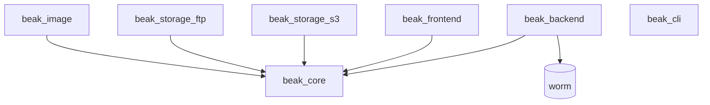

# Packages

After this page you can point to the package that owns any Beak type, decide which
ones a given app depends on, and jump to each package's generated API reference.

Beak ships as seven small packages that layer on a pure-Dart core, plus the
vendored [worm](#the-vendored-worm-orm) ORM the backend uses under the hood. You
rarely install all of them: a shared models package pulls `beak_core`, a server
adds `beak_backend` (and any storage drivers it needs), and a Flutter panel adds
`beak_frontend`. The rest are opt-in.

## The seven Beak packages

| Package | What it is | You install it when | API |
| --- | --- | --- | --- |
| `beak_core` | Pure Dart. Typed columns, rules, relationships, the serializable `BeakQuerySpec` wire contract, the storage abstraction, the `BeakDataSource` seam, and the raw `BeakClient`. The shared vocabulary every other package speaks. | Always. It is a transitive dependency of everything, and a direct one in the models package where you declare columns and models. | [beak_core](https://simonerich.github.io/beak/api/beak_core/) |
| `beak_backend` | The Shelf server. Generated CRUD, query, batch, relations, and aggregate endpoints, plus uploads, auth, search, and CSV export, from a `BeakModelRegistry`. The only package that imports worm. | In your server app. It turns a registry into a REST surface and runs it. See [The backend](../backend/index.md). | [beak_backend](https://simonerich.github.io/beak/api/beak_backend/) |
| `beak_frontend` | The Flutter admin panel. `BeakPanel` plus generated tables, forms, detail views, actions, filters, and dashboards, all built on obers_ui (no Material). | In your Flutter panel app. Hand `BeakPanel` a `BeakPanelConfig` and it stands up the whole UI. See [The panel](../panel/index.md). | [beak_frontend](https://simonerich.github.io/beak/api/beak_frontend/) |
| `beak_cli` | The scaffolding tool. `beak make:resource` and friends emit a worm model, its migration, and the Beak columns and model; `beak doctor` checks the dev setup. Pure Dart, depends only on `args`. | As a dev tool, to scaffold convention-following code. See the [CLI commands reference](cli-commands.md). | [beak_cli](https://simonerich.github.io/beak/api/beak_cli/) |
| `beak_storage_s3` | An S3/MinIO [storage driver](../models/files-and-storage-columns.md) for the storage abstraction. Register it once and any `BeakS3Config` resolves to it. Server-side. | On the server, when uploaded files live in S3 or MinIO. | [beak_storage_s3](https://simonerich.github.io/beak/api/beak_storage_s3/) |
| `beak_storage_ftp` | An FTP storage driver. Same registry pattern; files are served from a configured public base URL because FTP has no expiring links. Server-side. | On the server, when uploaded files live on an FTP host. | [beak_storage_ftp](https://simonerich.github.io/beak/api/beak_storage_ftp/) |
| `beak_image` | The image transform runner. `beak_core` defines the image column and its `BeakImageTransform` steps but ships no pixel codec; `beak_image` executes them with `package:image` (resize, re-encode, thumbnails). | On the server, when you want real image processing behind image columns. | [beak_image](https://simonerich.github.io/beak/api/beak_image/) |

!!! note "Server-only versus panel-only"
    `beak_backend`, the two storage drivers, and `beak_image` are pure server-side
    Dart. `beak_frontend` is Flutter. `beak_core` and `beak_cli` are plain Dart
    with no Flutter or server dependency, which is why the panel and the server
    can both depend on `beak_core` without dragging one into the other.

## How they depend on each other

Everything points at `beak_core`, and nothing points back. The two sides of the
stack, server and panel, never depend on each other; they meet only at the
`BeakQuerySpec` and REST contract that `beak_core` defines.



`beak_cli` stands apart: it generates source files and depends on no Beak package
at all, only `args`.

## The vendored worm ORM

worm is the Dart ORM Beak's default storage runs on. It is not published under the
`beak_*` name; it is vendored under `packages/worm` (with driver packages like
`worm_postgres` and `worm_sqlite` alongside) and imported only by `beak_backend`.
That containment is deliberate: worm types never leak past the backend, which is
what lets `beak_core` stay source-agnostic and a future non-worm data source drop
in without touching core.

You add worm as a direct dependency of your **server** app, because app authors
touch it in exactly two places:

- [Migrations](../backend/migrations.md), which `extend Migration` and register in `bin/worm.dart`.
- [Seeders and factories](../backend/seeding.md), which insert demo and test data.

Everything else about worm, the query building and record mapping, happens inside
`WormDataSource` and you never see it.

## Versioning

All seven packages share one pre-1.0 version line (`0.0.x`) and move together.
Each barrel exports its own version constant so you can assert against it at
runtime:

```dart title="packages/beak_core/lib/beak_core.dart"
const String beakCoreVersion = '0.0.1';
```

The matching constants are `beakBackendVersion`, `beakFrontendVersion`,
`beakStorageS3Version`, `beakStorageFtpVersion`, and `beakImageVersion`.

!!! note "Browsing the API reference"
    Every public symbol in these packages carries dartdoc. The generated
    reference is published per package under the site's `/api/` path (linked in
    the table above), so `BeakColumn`, `BeakServer`, `BeakPanelConfig`, and the
    rest each have a full page with their members and examples.

## Continue reading

- [Project structure](../start-here/project-structure.md) how these packages map onto the folders in a Beak repo.
- [The package graph](../architecture/package-graph.md) the same dependencies, read as an architecture.
- [Installation](../start-here/installation.md) the pubspec entries that pull each package in.
