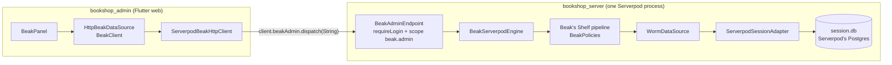

# How the admin app works

After this page you can follow one click in the panel through Serverpod to a row in Postgres, and name the package that does each hop. The admin app has more moving parts than a bridge, and they are all small.

## The idea in one picture



Everything left of the arrow is Beak's stock panel and HTTP client. Everything right of it is Beak's stock API, which does not know it is inside Serverpod. The two ends are joined by one string in and one string out.

## How it works

### The panel side

The panel is a normal `BeakPanel`. Its data source is Beak's `HttpBeakDataSource`, and the HTTP client under it is swapped for one that sends every request through a Serverpod call instead of a socket.

```dart title="packages/beak_serverpod_flutter/lib/src/serverpod_beak_data_source.dart"
--8<-- "packages/beak_serverpod_flutter/lib/src/serverpod_beak_data_source.dart:serverpodBeakDataSource"
```

The client sends no bearer token. The Serverpod client authenticates the `dispatch` call itself (JWT with refresh, in the example), and the URL's host is a placeholder: only the path and the query travel.

### The envelope

A Beak request becomes one JSON string, envelope version 1: `v`, `method`, `path`, `query`, `headers`, `body`. The answer is another string: `status`, `headers`, `body`. `BeakWireRequest` and `BeakWireResponse` live in `beak_serverpod` (pure Dart), so panel and server share the same two classes. Only four request headers survive the trip.

```dart title="packages/beak_serverpod/lib/src/wire.dart"
--8<-- "packages/beak_serverpod/lib/src/wire.dart:beakWireRequestHeaders"
```

No `authorization`, no `cookie`, no `x-forwarded-*`. Identity never comes from the envelope; the server takes it from the Serverpod session alone.

### The gate and the endpoint

The endpoint is one method. The gate is a mixin that overrides two getters, so Serverpod enforces sign-in and the scope before the method body runs. The scope has a name of its own:

```dart title="packages/beak_serverpod_server/lib/src/beak_admin_gate.dart"
--8<-- "packages/beak_serverpod_server/lib/src/beak_admin_gate.dart:BeakScopes"
```

```dart title="packages/beak_serverpod_server/lib/src/beak_admin_gate.dart"
--8<-- "packages/beak_serverpod_server/lib/src/beak_admin_gate.dart:BeakAdminGate"
```

```dart title="examples/serverpod/bookshop_server/lib/src/beak/beak_admin_endpoint.dart"
--8<-- "examples/serverpod/bookshop_server/lib/src/beak/beak_admin_endpoint.dart:BeakAdminEndpoint"
```

The gate is getter-only on purpose. Serverpod's analyzer never turns mixin members into RPCs, so `serverpod generate` still produces exactly one connector, `dispatch`, while the getters gate every call at runtime. Your app's own admins, who hold `Scope.admin`, do not get the panel by accident.

### The engine

`BeakServerpodEngine` builds Beak's stock Shelf pipeline once per process and runs each envelope through it in memory. It is a top-level value, created once and shared by every request:

```dart title="examples/serverpod/bookshop_server/lib/src/beak/bookshop_beak_engine.dart"
--8<-- "examples/serverpod/bookshop_server/lib/src/beak/bookshop_beak_engine.dart:bookshopBeak"
```

`policy:` is required. There is no allow-all default. Per request, `dispatch` does this:

1. Decodes the envelope. A malformed one is a 400 (including a method that is not an HTTP method name), and an unsupported version says which version the server speaks.
2. Turns the path into an internal URL, or refuses with a 404. Only `/api/**` passes, and never `/api/auth/**`, because Serverpod owns sign-in. Percent-encoded dots, empty segments and separators are refused rather than resolved.
3. Reads `session.authenticated`. No session is a 401, and a session without the `beak.admin` scope is a 403 (the gate normally answers both first, and the engine repeats them, so an endpoint that forgot `BeakAdminGate` does not open the tunnel to every signed-in user). The principal resolver then turns the user into a `BeakPrincipal`: by default the user id, with every scope name as a role.
4. Runs the pipeline inside `BeakServerpod.runInSession`, so every statement Beak issues uses this request's session.
5. Logs `beak <method> /<path> -> <status>` to `session.log`, and unexpected errors as errors.

```dart title="packages/beak_serverpod_server/lib/src/beak_tunnel_path.dart"
--8<-- "packages/beak_serverpod_server/lib/src/beak_tunnel_path.dart:apiOnly"
```

The principal reaches Beak's auth middleware through a request-context value of a private type. Only this library can construct one, so no header can forge an identity:

```dart title="packages/beak_serverpod_server/lib/src/beak_serverpod_engine.dart"
--8<-- "packages/beak_serverpod_server/lib/src/beak_serverpod_engine.dart:TrustedGuard"
```

### The policy

The policy is Beak's `BeakPolicies`. A model with no rule is closed, so holding `beak.admin` opens the tunnel and grants nothing. `BeakAccess.role` takes a scope name because the default resolver turns scope names into roles.

```dart title="examples/serverpod/bookshop_server/lib/src/beak/bookshop_policy.dart"
--8<-- "examples/serverpod/bookshop_server/lib/src/beak/bookshop_policy.dart:bookshopPolicy"
```

Nobody deletes: there is no `delete:` access on either rule, and a rule that is not written is a rule that is closed.

### The database

`WormDataSource` compiles Beak's queries to Postgres SQL, and `ServerpodSessionAdapter` runs them through `session.db.unsafeQuery` and `unsafeExecute` with positional parameters. It reads the session from a zone value, once per statement, so one adapter instance serves every request:

```dart title="packages/beak_serverpod_server/lib/src/beak_serverpod.dart"
--8<-- "packages/beak_serverpod_server/lib/src/beak_serverpod.dart:currentSession"
```

A graph commit opens a Serverpod transaction. A nested transaction is a savepoint, never flattened, so an inner failure rolls back only the inner work. Serverpod's database errors become worm exceptions, so a unique violation reads as a unique violation whether it happens mid-transaction or at `COMMIT`. Each statement carries a timeout, 30 seconds by default (`statementTimeoutInSeconds` on the engine).

```dart title="packages/beak_serverpod_server/lib/src/serverpod_session_adapter.dart"
--8<-- "packages/beak_serverpod_server/lib/src/serverpod_session_adapter.dart:transaction"
```

The adapter cannot create or change tables. `executeSchema` and `introspectSchema` throw `UnsupportedOperationException` with a pointer to `serverpod create-migration`.

### The receipts table

A form save is a graph commit, and a graph commit keeps a receipt so a retry is safe. Beak normally creates that table itself with a migration. Here Serverpod's migrations own it, so the server carries a model file, copied verbatim from Beak, and the engine maps Beak's receipt columns onto it.

```yaml title="examples/serverpod/bookshop_server/lib/src/beak/models/beak_commit_receipt.spy.yaml"
--8<-- "examples/serverpod/bookshop_server/lib/src/beak/models/beak_commit_receipt.spy.yaml"
```

The model is `serverOnly: true`, so it is not in the generated client. It is not in Beak's registry either, so `POST /api/beak_commit_receipt/query` answers 404, like any table Beak was not told about.

### The server-only column

`book.supplierCostInCents` is declared `scope=serverOnly` in `book.spy.yaml`, and the Beak `Book` class does not declare it. Serverpod keeps it out of the client.

Beak's data source selects, returns and stores in receipts only the columns its models declare, so a `SELECT *` never happens.

A test proves it against a real database: the value is in the row, and it is in no list, single read, batch, patch, graph-commit reply, header, CSV export or receipt. Sending the column in a create, an update or a commit is refused (422, or an incomplete receipt).

## Why it is shaped this way

One endpoint instead of one per table, because Beak's API is a REST surface: query, read, create, patch, delete, batch, summary, export, commits and more, per table. A string-in, string-out method carries all of it, so there is nothing to write per table and no second protocol to keep in step. The price is that Serverpod's generated client sees an opaque string, and every panel call is a Serverpod call with Serverpod's body cap (`maxRequestSize`, 512 KiB in the template's config).

The adapter rides the request's session instead of opening a connection. That gives Beak Serverpod's pool, its logging and its transactions, and leaves nothing extra to deploy. The price is that the panel shares the pool with your app: an expensive export competes with your real traffic.

The mirror classes are written by hand. Nothing generates a Beak schema class from a `.spy.yaml` file yet. The example keeps the two honest with a test that fails when a Beak column is not a physical column, when the supplier cost gets modelled, or when the `BookFormat` enums differ. It compares names, not types or nullability.

## What it means for you

- You never write a Beak migration and never give Beak a database URL. Serverpod migrates, Beak reads and writes.
- You never write an endpoint per table. You write one gated endpoint, once, and a policy that names every model and operation it allows.
- You do write, per table, a schema class that mirrors the `.spy.yaml` model, and you leave out every column the admin must not see.
- Deleting, unlisted models and unlisted operations are closed until the policy opens them.

## Continue reading

- [Setting up the admin app](setup.md): build this, file by file.
- [Limits and next steps](limits-and-next-steps.md): what the proof does not cover.
- [Graph commits](../../architecture/graph-commits.md): what happens inside a form save.
