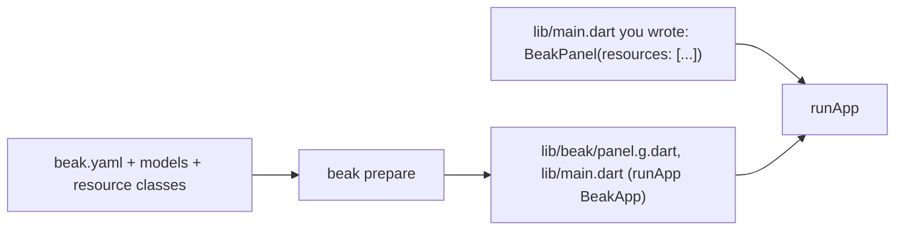

# Two ways to boot a panel

A Beak project starts its panel one of two ways: `beak prepare` writes the entrypoint from `beak.yaml`, or you write `lib/main.dart` yourself. This page explains both, what each leaves to `beak.yaml`, and the single command that moves you from the first to the second.

## The idea in one picture



Both end in `runApp` with a `BeakPanel`. What differs is who writes the list of resources: `beak prepare` on every run (generated), or you, once (authored). The API side does not care. `bin/serve.dart` and `bin/migrate.dart` come from `beak prepare` in both.

## How it works

### Generated

`beak create` gives you this by default. `lib/main.dart` is one line and git-ignored, because `beak prepare` rewrites it:

```dart title="examples/quickstart/lib/main.dart"
--8<-- "examples/quickstart/lib/main.dart"
```

`BeakApp` lives in `lib/beak/app.g.dart` and wraps `buildBeakPanel()` from `lib/beak/panel.g.dart`. That function is assembled from:

- `beak.yaml`: the title, the API origin, the sidebar behaviour, and per table the icon, label, section and `hidden`,
- every model under `lib/`, each getting a default resource (table, form and detail page derived from the model),
- every public `BeakResource` subclass under `lib/`, which replaces the default of the model whose table it reports,
- every top-level `BeakScreen` under `lib/screens/`, which becomes a custom page,
- the override files `lib/panel.dart`, `lib/theme.dart` and `lib/auth.dart`, when they exist (`beak eject panel|theme|auth` writes the starter).

Adding a model or a resource class needs no other edit. `beak prepare`, or `beak dev`, picks it up.

### Authored

You own `lib/main.dart`. `beak prepare` recognises that by the first line: a file that does not start with `// GENERATED BY` is never rewritten, and it is committed (the scaffold's `.gitignore` stops ignoring it). The shop is authored:

```dart title="examples/clean_beak_config/lib/main.dart"
--8<-- "examples/clean_beak_config/lib/main.dart:shopMain"
```

The list is the panel. A resource is in the sidebar when it is in `resources: [...]`, and not otherwise, so hiding one means leaving it out. Theme, locale, formatting, pages, navigation and auth are `BeakPanel` arguments, or a whole `BeakPanelConfig` passed as `config:` (`BeakPanel` takes `config:` or the individual arguments, never both; `dataSource:` works with either).

`beak create acme_admin --authored` starts a project this way. A test can pump the same panel against an in-memory data source, because the scaffold's `buildPanel({BeakDataSource? dataSource})` passes it through.

### The switch

```console
$ beak eject main
  created lib/main.dart
  updated .gitignore

  lib/main.dart is yours now: `beak prepare` leaves it alone.
  It lists every resource the generated panel showed, with
  the beak.yaml presentation written in. Add each resource
  class you write to its `resources: [...]`.
```

`beak eject main` writes the file `beak prepare` would have generated, in the same resource order and with the same icons, sections and titles, so nothing on screen changes. It removes `/lib/main.dart` from `.gitignore`. When the project has a `lib/panel.dart` override or non-default sidebar settings in `beak.yaml`, it writes `BeakPanel(config: BeakPanelConfig(...))` instead, passing the override through. It warns about each resource class whose model it cannot tell from the source, so you can delete the duplicate default it would otherwise list next to it.

A second `beak eject main` prints `lib/main.dart is already yours; pass --force to write it again from what the generated panel would show` and writes nothing. `--force` does exactly that: it replaces your file, edits included. In a project whose `beak.yaml` sets `panel.entrypoint`, `beak eject main` refuses (exit `1`), because `lib/main.dart` there is your app's own. Going back to generated is manual: delete `lib/main.dart`, put `/lib/main.dart` back into `.gitignore`, run `beak prepare`.

### What beak.yaml controls in each

`beak.yaml` is read by the CLI at generate time, never by the running panel. In a generated project it is live: edit it, run `beak prepare`, the panel changes. In an authored project the panel keys are copied into your file once, by `beak eject main`, `beak create --authored` or `beak init`, and editing them afterwards changes nothing.

| Key | Generated | Authored |
| --- | --- | --- |
| `name`, `api`, `theme.sidebar` | Rebuilt into `panel.g.dart` on every `prepare`. | Copied into `BeakPanel(title:, apiBaseUrl:)` once. |
| `resources.<table>` (icon, label, section, hidden) | The default resource of each model without a resource class. | Written into the resource list once. Edit the `BeakResource` in your file. |
| `server.port`, `server.host` | `lib/beak/server.g.dart`. | Same file. The backend does not depend on the panel bootstrap. |
| `panel.entrypoint` | Not used. | Names the file that boots the panel, when your app keeps its own `lib/main.dart`. |
| `agents.*` | Read by every command that writes agent files. | Same. |

Two checks still run on an authored project: `beak.yaml` must parse, and every `resources.<table>` key must name a discovered table. The full key list is in [beak.yaml](../reference/beak-yaml.md).

### What beak prepare does in each

| | Generated | Authored |
| --- | --- | --- |
| `<schema>.beak.dart` parts, `lib/beak/registry.g.dart` | Written. | Written. |
| `lib/beak/server.g.dart`, `bin/serve.dart`, `bin/migrate.dart` | Written. | Written. |
| Create-table migrations for tables without one | Written once. | Written once. |
| `lib/main.dart` | Rewritten every run. | Never touched. |
| `lib/beak/panel.g.dart`, `lib/beak/app.g.dart` | Written, and used. | Not written or checked, and deleted if a generated entrypoint left them, unless a file of yours imports one. |
| Resource classes | Found under `lib/`, used automatically. | Found, but you list them in `resources: [...]`. `beak doctor` warns for each one your `main.dart` leaves out. |
| `beak make:resource` | Writes the files. | Also prints the line to add to `resources: [...]`. |

If your app is a Flutter app that already has a `lib/main.dart`, `beak init` sets `panel.entrypoint` in `beak.yaml` instead. `beak prepare` then writes everything except `lib/main.dart` (and the panel wiring your entrypoint does not import), `beak dev` prints `flutter run -d chrome -t lib/admin_main.dart`, and `doctor` walks the panel from that file. [An existing Flutter app](paths/existing-flutter-app.md) is the whole path.

## Why it is shaped this way

A generated entrypoint has a short shelf life for anything past a prototype. It cannot hold code, so it grows override files (`lib/theme.dart`, `lib/auth.dart`, `lib/panel.dart`) and each one is a place to look. An authored entrypoint is one file you read top to bottom, that a coding agent can edit, and that the compiler checks.

The generated one still earns its keep in the first hour. You have a model and no opinions yet, `beak.yaml` can be five lines, and there is nothing to keep in step: add a class and the sidebar has it. Beak supports both because the switch should happen when you have opinions, not before.

The switch is one command and it is lossless on purpose. Ejecting is not a rewrite; the first authored `main.dart` renders exactly what the generated one did, so the first edit is a diff. What you give up is the automatic part: a new resource class no longer appears until you list it, and `beak doctor` is the safety net for that.

## What it means for you

| If you are | Use | Because |
| --- | --- | --- |
| Trying Beak out, or building a first internal tool | Generated | One line of `main.dart`, no list to maintain. |
| Setting a theme, formatting, pages, navigation or auth | Authored, by `beak eject main` | These are arguments of `BeakPanel`, in your file and checked by the compiler. |
| Adding the panel to a Flutter app you already have | `panel.entrypoint`, from `beak init` | Your `lib/main.dart` stays yours. |
| Working with a coding agent | Authored | The agent edits one visible list instead of inferring what `prepare` generates. |

The tutorial teaches the authored form and the [Quickstart](quickstart.md) the generated one. Each page says which it assumes. Screens, resources and forms are the same code in both; only the file that lists them differs.

## Continue reading

- [Project structure](project-structure.md): the file layout of both, folder by folder.
- [beak.yaml](../reference/beak-yaml.md): every key and which bootstrap reads it.
- [Generated files and symbols](../reference/generated-files.md): every file `beak prepare` writes and when.
- [An existing Flutter app](paths/existing-flutter-app.md): `beak init` and `panel.entrypoint`.
