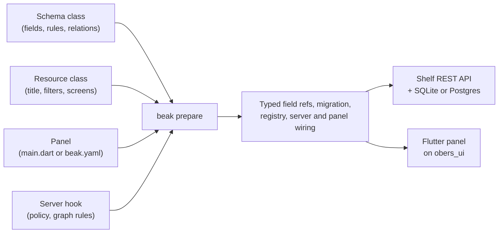

# What is Beak?

Beak builds the admin panel that almost every Dart or Flutter app grows sooner or later: the tables, forms and detail pages over your data, and the REST API and migrations underneath them. You write four small things. Beak writes the rest, and everything it writes is Dart you can read.

Flutter's mascot is a bird, birds have beaks, and a dashboard is where the app gets picked apart record by record. Its ORM sibling is `worm`, because the bird has to eat something.

## The idea in one picture



The four boxes on the left are the only files whose content is your decision. The shop example (`examples/clean_beak_config`) shows each of them at full size, and this page uses its smallest resource, categories, to show the shape.

## How it works

### 1. The schema class

A field is a Dart field. Its type picks the column, its nullability decides whether it is required, and annotations add the rest:

```dart title="examples/clean_beak_config/lib/resources/categories/models/category.dart"
--8<-- "examples/clean_beak_config/lib/resources/categories/models/category.dart"
```

From this class, `beak prepare` generates typed field references (`CategoryModel.name`), the model, both sides of every relationship, a typed record view and the create-table migration. That is the whole database definition. Nobody writes a column name.

### 2. The resource class

The schema says what the data is. The resource says how the panel presents it: title, sidebar group, search, filters and which screens the resource has.

```dart title="examples/clean_beak_config/lib/resources/categories/category_resource.dart"
--8<-- "examples/clean_beak_config/lib/resources/categories/category_resource.dart:CategoryResource"
```

Every argument is optional except the model. Leave `screens` out and Beak derives the table, the form and the detail page from the schema.

### 3. The panel

One widget lists the resources and holds the app-wide choices (theme, formatting, extra pages). In an authored project it is `lib/main.dart`; in a generated one it comes from `beak.yaml`. [Two ways to boot a panel](generated-or-authored.md) explains both.

```dart title="examples/clean_beak_config/lib/main.dart"
--8<-- "examples/clean_beak_config/lib/main.dart:shopMain"
```

### 4. The server hook

The generated server already serves every model. `lib/server.dart` is where you change it: a policy, sessions, middleware, and the rules that must hold across several records at once.

```dart title="examples/clean_beak_config/lib/server.dart"
--8<-- "examples/clean_beak_config/lib/server.dart:shopServer"
```

It is optional. A project with no `lib/server.dart` gets the defaults, which is exactly what the quickstart runs.

### What Beak writes

| Written by `beak prepare` | Holds |
| --- | --- |
| `<schema>.beak.dart` next to each schema class | Columns, relations, typed field references, the model, a typed record view |
| `lib/migrations/create_<table>_table.dart` | The table, once; yours from then on |
| `lib/beak/registry.g.dart`, `panel.g.dart`, `app.g.dart`, `server.g.dart` | The model registry and the wiring of panel and server |
| `bin/serve.dart`, `bin/migrate.dart` | The entrypoints that serve the API and run migrations |

You never edit those, and [Generated files and symbols](../reference/generated-files.md) lists every one.

### What runs

The API is a Shelf server over the worm ORM. It exposes one set of routes per model (query, create, update, delete, export) and a graph-commit route that saves a whole form, related records included, in one transaction. The panel is a Flutter app built on obers_ui, with no Material anywhere in it. The two halves talk over REST, and each half sits behind an interface (`BeakDataSource`), so a different backend can replace the default. [The four layers](../concepts/the-four-layers.md) and the [Architecture](../architecture/index.md) section go inside.

## Why it is shaped this way

An admin resource is three things that drift: a table, a REST surface over it and a set of screens over that surface. Written by hand, a rule lands in the API and not in the form, or a column is renamed in the table and not in the export. Beak has one declaration and reads it from every side, so there is nothing to keep in step. [The one-definition promise](../concepts/the-one-definition-promise.md) shows the seven places a single field ends up.

The declaration is Dart, not YAML or a UI builder, for two reasons. The compiler checks it: a field reference is a generated symbol, so a typo is a missing name and not a blank column at runtime. And it lives in your repository, next to your other code, where your reviews, your tests and your coding agents already work. Beak's promise is that you never write a string field reference and never touch `dynamic`.

## What it means for you

You write a schema class per table and run three commands. The rest of your time goes to the parts that differ from the default: a form laid out in steps, a business rule that spans records, a custom page. Those have named extension points (screens, blocks, `preparePlan`, custom widgets), and nothing stops you from dropping to plain Flutter for a screen.

### What Beak is not

- Not an app framework. It builds the admin side. Your customer-facing UI is yours, in whatever you like. [An existing Flutter app](paths/existing-flutter-app.md) shows the two living in one repository.
- Not a no-code tool. Everything is Dart. If nobody on the team writes Dart, Beak is the wrong tool.
- Not a backend-as-a-service. The API runs in your process on your database. For a backend you already have, see [An existing backend](paths/existing-backend.md).
- Not mature. It is pre-1.0, version `0.9.0` is not tagged yet, and the API is not frozen. [Upgrading](upgrading.md) lists what changed in this release, and the [changelog](https://github.com/SimonErich/beak/blob/main/CHANGELOG.md) carries a known-issues list. [Why Beak?](why-beak.md) has the longer version of when it fits.

## Continue reading

- [Why Beak?](why-beak.md): when it fits, when a hand-built admin is cheaper, and how it compares.
- [Installation](installation.md): get the `beak` command and create a project.
- [The one-definition promise](../concepts/the-one-definition-promise.md): what a single field drives.
- [Declarative resources](../concepts/declarative-resources.md): schemas, resources and screens as configuration.
