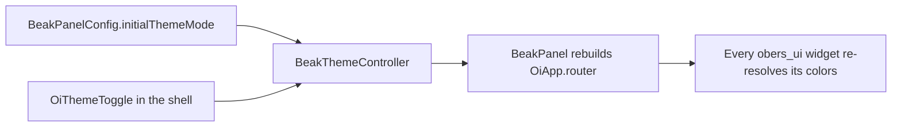

# Theming basics

After this page you can give a Beak panel its own light and dark theme, choose
which mode it starts in, and understand how the top-bar toggle flips between them
without a rebuild of the router.

A Beak panel is themed by three fields on `BeakPanelConfig` and one small
controller in the panel's DI container. That is the whole surface. Everything
else (badge colors, type, spacing) flows out of the `OiThemeData` those fields
carry.

## The three config fields

`BeakPanelConfig` exposes the theme through three properties, quoted here from
the config source:

```dart title="packages/beak_frontend/lib/src/panel/beak_panel_config.dart"
/// The light theme (defaults to `OiThemeData.light()`).
final OiThemeData? theme;

/// The dark theme (defaults to `OiThemeData.dark()`).
final OiThemeData? darkTheme;

/// The theme mode the panel starts in; toggled live from the shell.
final OiThemeMode initialThemeMode;
```

Leave `theme` and `darkTheme` null and Beak uses obers_ui's stock light and dark
themes. `initialThemeMode` decides which one the panel shows on first paint. It
is an `OiThemeMode`, one of three values:

```dart title="obers_ui/lib/src/foundation/oi_app.dart"
enum OiThemeMode {
  /// Always use the light theme.
  light,

  /// Always use the dark theme.
  dark,

  /// Follow the system's brightness setting.
  system,
}
```

The default is `system`, which follows the operating system's brightness. The
superdashboard demo pins itself to light instead:

```dart title="apps/beak_superdashboard/lib/panel/config.dart"
BeakPanelConfig buildSuperdashboardConfig({
  String apiBaseUrl = 'http://localhost:8180',
}) => BeakPanelConfig(
  title: 'Beak Superdashboard',
  apiBaseUrl: apiBaseUrl,
  initialThemeMode: OiThemeMode.light,
  resources: buildResources(),
  // ...
);
```

!!! note "What just happened"
    The panel boots in light mode. Because `theme` and `darkTheme` were not set,
    it renders obers_ui's `OiThemeData.light()` now and switches to
    `OiThemeData.dark()` when the mode changes. The `apiBaseUrl` points at the
    superdashboard server on port 8180. The tutorial store on port 8080 is a
    separate app.

## Bringing your own theme

`OiThemeData` is obers_ui's master theme container. It has three factory
constructors you will reach for, all quoted from obers_ui:

```dart title="obers_ui/lib/src/foundation/theme/oi_theme_data.dart"
/// Creates the standard light theme.
factory OiThemeData.light({
  String? fontFamily,
  String? monoFontFamily,
  OiRadiusPreference radiusPreference = OiRadiusPreference.medium,
  OiComponentThemes? components,
  OiPerformanceConfig? performanceConfig,
  OiBreakpointScale? breakpoints,
}) { /* ... */ }

/// Creates a theme derived from a brand color.
factory OiThemeData.fromBrand({
  required Color color,
  Brightness brightness = Brightness.light,
  String? fontFamily,
  String? monoFontFamily,
  OiRadiusPreference radiusPreference = OiRadiusPreference.medium,
  OiComponentThemes? components,
  OiPerformanceConfig? performanceConfig,
  OiBreakpointScale? breakpoints,
}) { /* ... */ }
```

`OiThemeData.fromBrand` is the shortcut for a branded panel: pass one `Color`
and obers_ui derives the primary swatch and the semantic colors around it. Hand
a light and a dark variant to the config:

```dart
BeakPanelConfig(
  title: 'Acme Admin',
  apiBaseUrl: 'http://localhost:8080',
  resources: buildResources(),
  theme: OiThemeData.fromBrand(color: Color(0xFF663399)),
  darkTheme: OiThemeData.fromBrand(
    color: Color(0xFF663399),
    brightness: Brightness.dark,
  ),
);
```

`Color` and `Brightness` are core Flutter types, allowed under the no-Material
rule. Everything downstream (buttons, cards, table rows, badge colors) picks up
the brand swatch, because they all read from the same theme.

## The live toggle

The panel does not only pick a theme at startup. The shell's top bar carries a
toggle, and flipping it changes the mode for the running app. The plumbing is a
single small controller in the DI container:

```dart title="packages/beak_frontend/lib/src/panel/beak_theme_controller.dart"
/// Holds the panel's active [OiThemeMode] and notifies when it changes.
final class BeakThemeController extends ValueNotifier<OiThemeMode> {
  /// Creates a controller starting in the given mode (default: system).
  BeakThemeController([super.initialMode = OiThemeMode.system]);
}
```

The root `BeakPanel` listens to it and rebuilds `OiApp.router` with the new mode.
Notice the theme fallbacks here: this is where the null `theme` / `darkTheme`
turn into obers_ui's stock themes.

```dart title="packages/beak_frontend/lib/src/panel/beak_panel.dart"
final themeController = beakLocator<BeakThemeController>();
return ValueListenableBuilder<OiThemeMode>(
  valueListenable: themeController,
  builder: (context, themeMode, _) => OiApp.router(
    routerConfig: router,
    title: config.title,
    theme: config.theme ?? OiThemeData.light(),
    darkTheme: config.darkTheme ?? OiThemeData.dark(),
    themeMode: themeMode,
    debugShowCheckedModeBanner: false,
  ),
);
```

The top bar renders an `OiThemeToggle` that writes straight back to the
controller. go_router keeps the shell mounted across navigations, so the toggle
listens to the controller directly rather than waiting for a route change:

```dart title="packages/beak_frontend/lib/src/panel/beak_router.dart"
ValueListenableBuilder<OiThemeMode>(
  valueListenable: themeController,
  builder: (context, mode, _) => OiThemeToggle(
    currentMode: mode,
    onModeChange: (next) => themeController.value = next,
  ),
),
```

Put together, the flow is short:



!!! tip "You rarely touch the controller yourself"
    App authors set `initialThemeMode` and, optionally, `theme` / `darkTheme`.
    Beak registers the `BeakThemeController` and wires the toggle for you. Reach
    for the controller directly only if you are building a custom screen that
    wants to read or set the mode.

## Continue reading

- [Colors and tokens](colors-and-tokens.md) the semantic colors your theme resolves.
- [The shell](the-shell.md) the sidebar and framing the theme paints.
- [Configuration options](../reference/configuration-options.md) every `BeakPanelConfig` field in one table.
