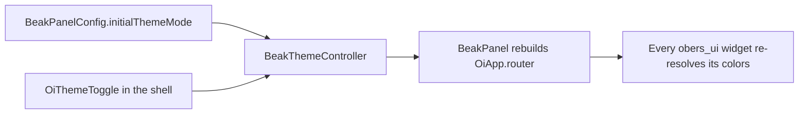

# Theming basics

After this page you can give a Beak panel its own light and dark theme, choose
which mode it starts in, and understand how the top-bar toggle flips between them
without a rebuild of the router.

A new project has no theme file at all: Beak uses obers_ui's stock light and dark
themes. When you want your own, you write one file.

```bash
beak eject theme
```

That writes `lib/theme.dart`, pre-filled with the defaults, and the next
`beak prepare` wires it into the generated panel config. Everything else (badge
colors, type, spacing) flows out of the `OiThemeData` those two functions return.

## The file you own

`beak eject theme` writes exactly this. It compiles and changes nothing, so your
first edit is a diff against a working default rather than a blank page:

```dart title="packages/beak_cli/lib/src/commands/eject_command.dart"
import 'package:beak/ui.dart';

/// The theme the panel uses in light mode.
OiThemeData beakLightTheme() => OiThemeData.light();

/// The theme the panel uses in dark mode.
OiThemeData beakDarkTheme() => OiThemeData.dark();
```

The contract is the file name and the two function names. Nothing registers
them: `beak prepare` finds `lib/theme.dart` and emits the wiring into
`lib/beak/panel.g.dart`:

```dart
theme: theme.beakLightTheme(),
darkTheme: theme.beakDarkTheme(),
```

Delete the file and the stock themes come back.

## The three config fields

Underneath, `lib/theme.dart` fills two of three properties on `BeakPanelConfig`.
You rarely touch them yourself, but they are what the panel actually reads:

```dart title="packages/beak_frontend/lib/src/panel/beak_panel_config.dart"
/// The light theme (defaults to `OiThemeData.light()`).
final OiThemeData? theme;

/// The dark theme (defaults to `OiThemeData.dark()`).
final OiThemeData? darkTheme;

/// The theme mode the panel starts in; toggled live from the shell.
final OiThemeMode initialThemeMode;
```

Leave `theme` and `darkTheme` null and Beak uses obers_ui's stock light and dark
themes. `initialThemeMode` decides which one the panel shows on first paint. It
is `OiThemeMode`, obers_ui's own enum, one of three values:

```dart
enum OiThemeMode {
  /// Always use the light theme.
  light,

  /// Always use the dark theme.
  dark,

  /// Follow the system's brightness setting.
  system,
}
```

The default is `system`, which follows the operating system's brightness.
`initialThemeMode` is not something `beak.yaml` or `lib/theme.dart` sets, so the
place for it is `lib/panel.dart`, the hook that sees the finished config. The
superdashboard demo pins itself to light there:

```dart title="examples/superdashboard/lib/panel.dart"
BeakPanelConfig beakPanel(BeakPanelConfig defaults) => defaults.copyWith(
  initialThemeMode: OiThemeMode.light,
  // ... the notification source, the app screens, auth and maintenance.
);
```

!!! note "What just happened"
    - `defaults` is everything `beak.yaml`, `lib/models/` and `lib/screens/`
      produced, including the themes from `lib/theme.dart`. `copyWith` changes
      one field and leaves the rest generated.
    - The panel boots in light mode. Because that project has no
      `lib/theme.dart`, it renders obers_ui's `OiThemeData.light()` now and
      switches to `OiThemeData.dark()` when the user flips the toggle.
    - `beak eject panel` writes the starter for this file. It returns `defaults`
      unchanged until you edit it.

## Bringing your own theme

`OiThemeData` is obers_ui's master theme container. It has three factory
constructors you will reach for, all declared in obers_ui:

```dart
/// Creates the standard light theme.
factory OiThemeData.light({
  String? fontFamily,
  String? monoFontFamily,
  OiRadiusPreference radiusPreference = OiRadiusPreference.medium,
  OiComponentThemes? components,
  OiPerformanceConfig? performanceConfig,
  OiBreakpointScale? breakpoints,
});

/// Creates the standard dark theme (the same parameters).
factory OiThemeData.dark({
  String? fontFamily,
  String? monoFontFamily,
  OiRadiusPreference radiusPreference = OiRadiusPreference.medium,
  OiComponentThemes? components,
  OiPerformanceConfig? performanceConfig,
  OiBreakpointScale? breakpoints,
});

/// Creates a theme derived from a brand color.
factory OiThemeData.fromBrand({
  required Color color,
  Brightness brightness = Brightness.light,
  String? fontFamily,
  String? monoFontFamily,
  OiRadiusPreference radiusPreference = OiRadiusPreference.medium,
  OiComponentThemes? components,
  OiPerformanceConfig? performanceConfig,
  OiBreakpointScale? breakpoints,
});
```

`OiThemeData.fromBrand` is the shortcut for a branded panel: pass one `Color`
and obers_ui derives the primary swatch and the semantic colors around it.
Return a light and a dark variant from `lib/theme.dart`:

```dart
import 'package:beak/ui.dart';

/// The brand purple every surface derives from.
const Color _brand = Color(0xFF663399);

/// The theme the panel uses in light mode.
OiThemeData beakLightTheme() => OiThemeData.fromBrand(color: _brand);

/// The theme the panel uses in dark mode.
OiThemeData beakDarkTheme() =>
    OiThemeData.fromBrand(color: _brand, brightness: Brightness.dark);
```

`package:beak/ui.dart` is the library that re-exports obers_ui, and it is the
only import this file needs. `Color` and `Brightness` are core Flutter types,
allowed under the no-Material rule. Everything downstream (buttons, cards, table
rows, badge colors) picks up the brand swatch, because they all read from the
same theme.

Run `beak prepare` after creating the file. It regenerates
`lib/beak/panel.g.dart` with the two calls wired in.

## The live toggle

The panel does not only pick a theme at startup. The shell's top bar carries a
toggle, and flipping it changes the mode for the running app. The plumbing is a
single small controller in the DI container:

```dart title="packages/beak_frontend/lib/src/panel/beak_theme_controller.dart"
/// Holds the panel's active [OiThemeMode] and notifies when it changes.
final class BeakThemeController extends ValueNotifier<OiThemeMode> {
  /// Creates a controller starting in the given mode (default: system).
  BeakThemeController([super.initialMode = OiThemeMode.system]);
}
```

The root `BeakPanel` listens to it and rebuilds `OiApp.router` with the new mode.
Notice the theme fallbacks here: this is where a project with no
`lib/theme.dart` gets obers_ui's stock themes.

```dart title="packages/beak_frontend/lib/src/panel/beak_panel.dart"
final themeController = beakLocator<BeakThemeController>();
return ValueListenableBuilder<OiThemeMode>(
  valueListenable: themeController,
  builder: (context, themeMode, _) => OiApp.router(
    routerConfig: router,
    title: config.title,
    theme: config.theme ?? OiThemeData.light(),
    darkTheme: config.darkTheme ?? OiThemeData.dark(),
    themeMode: themeMode,
    debugShowCheckedModeBanner: false,
  ),
);
```

The top bar renders an `OiThemeToggle` that writes straight back to the
controller. go_router keeps the shell mounted across navigations, so the toggle
listens to the controller directly rather than waiting for a route change:

```dart title="packages/beak_frontend/lib/src/panel/beak_router.dart"
ValueListenableBuilder<OiThemeMode>(
  valueListenable: themeController,
  builder: (context, mode, _) => OiThemeToggle(
    currentMode: mode,
    onModeChange: (next) => themeController.value = next,
  ),
),
```

Put together, the flow is short:



!!! tip "You rarely touch the controller yourself"
    App authors write `lib/theme.dart` and, optionally, set `initialThemeMode`
    in `lib/panel.dart`. Beak registers the `BeakThemeController` and wires the
    toggle for you. Reach for the controller directly only if you are building a
    custom screen that wants to read or set the mode.

## Where each theming decision lives

| Decision | Where |
| --- | --- |
| The light and dark `OiThemeData` | `lib/theme.dart` (`beak eject theme`) |
| The mode the panel boots in | `initialThemeMode` in `lib/panel.dart` |
| Sidebar collapse behaviour | `theme.sidebar` in `beak.yaml` |
| A resource's icon, label or section | `resources.<table>` in `beak.yaml` |
| Everything else | generated into `lib/beak/panel.g.dart`, never edited |

## Continue reading

- [Colors and tokens](colors-and-tokens.md) the semantic colors your theme resolves.
- [The shell](the-shell.md) the sidebar and framing the theme paints.
- [Project structure](../start-here/project-structure.md) every optional override file and what it takes over.
- [Configuration options](../reference/configuration-options.md) every `BeakPanelConfig` field in one table.
