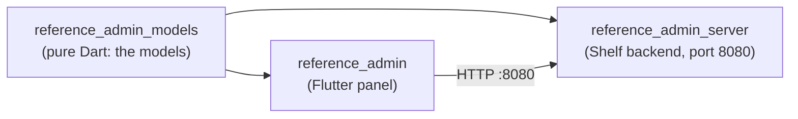

# Tutorial: First Flight

By the end of these ten chapters you will have built the reference admin: a
working admin panel for a small coffee roastery, grown from an empty workspace.
Models defined once, a backend generated from them, and a Flutter panel that
lists, filters, edits, and charts every resource. This is the real
`apps/reference_admin*` app in the Beak repo, revealed one concept at a time, so
every snippet you copy is code that compiles and ships.

The bird has to leave the nest sometime. This is that flight, taken in short
hops.

!!! note "This tutorial builds the demo inside the Beak monorepo"
    It predates `beak create` and walks the layout the reference admin uses —
    a models package, a server package and a panel package — because that is
    what the repository ships and what the feature pages refer to. Every
    concept transfers, but a project of your own is one package, not three:
    start from the [Quickstart](../start-here/quickstart.md) if you want the
    shortest path, and read this for the ideas underneath.

## What you build

Picture the finished panel. A navigation rail down the left lists six resources:
Products, Categories, Tags, Users, Orders, and Order items. The home page is a
dashboard: stat tiles for the product count, the customer count, and the catalog
value in euros, above a bar chart of stock per product.

Click **Products** and a data table opens, searchable and sortable, with a status
filter and a name filter across the top. Each product shows a euro price, a
colored status badge, and a thumbnail. A **Create** button opens a form whose
fields, and whose validation, come straight from the column definitions the
server also enforces. Save it and the row appears in the table. Click a row to
read it in a detail view; click **Edit** and the same layout becomes a form
again. A **Duplicate** row action clones a product in one click.

Around all of that: a login screen, a light and dark theme toggle, a
notification bell, and a command bar on <kbd>Ctrl</kbd>/<kbd>Cmd</kbd>+<kbd>K</kbd>.
None of it is hand-written page code. All of it comes from configuration over the
models you define.

## How the three packages fit

The reference admin is three packages, and the split is the whole point: you
define each model once, and both the server and the panel read that one
definition.



- **`reference_admin_models`** is pure Dart. It holds the `BeakModel` classes:
  columns, rules, and relationships. It depends only on `beak_core`.
- **`reference_admin_server`** wraps those models with `beak_backend` into a
  generated REST API. It persists to Postgres and stores uploads in MinIO through
  the `worm` ORM, and listens on port **8080**. You never write an endpoint.
- **`reference_admin`** is the Flutter app. It reads the same models with
  `beak_frontend` and renders the panel on `obers_ui`, talking to the server over
  HTTP at `apiBaseUrl: 'http://localhost:8080'`.

One `BeakColumn`, declared once in the models package, feeds six mouths: the
table cell, the form field, the detail row, the filter, the REST validator, and
the CSV export column. That is the promise the rest of this tutorial cashes in.

## The finished project tree

By Chapter 10 the reference trio looks like this. You will touch a handful of
files; Beak generates the rest of the behavior at runtime.

```text
Flutters/
  beak/
    packages/                       # beak_core, beak_backend, beak_frontend, worm, ...
    apps/
      reference_admin_models/       # the models, defined once
        lib/
          reference_admin_models.dart   # referenceModels + buildReferenceRegistry
          src/
            category.dart
            tag.dart
            product.dart
            user.dart
            order.dart
            order_item.dart
      reference_admin_server/       # the generated Shelf backend, port 8080
        bin/
          reference_admin_server.dart   # boots the server
          worm.dart                     # migrate / db:seed CLI
        lib/src/
          server_builder.dart
          migrations/reference_migrations.dart
          seeders/reference_seeder.dart
      reference_admin/              # the Flutter panel
        lib/main.dart                   # buildReferencePanelConfig + BeakPanel
```

## What you learn, in the order you use it

Each chapter adds exactly what the store needs next, then stops.

| Chapter | You add | Concept it teaches |
| --- | --- | --- |
| [1. Hatch the project](01-hatch-the-project.md) | The workspace and services | The three-package layout, Melos, Docker |
| [2. Your first model and migration](02-first-model-and-migration.md) | `CategoryModel` and its table | Models, typed columns, migrations, the registry |
| [3. The panel comes alive](03-the-panel-comes-alive.md) | A generated backend and panel | `BeakPanelConfig`, resources, auto CRUD |
| [4. Relationships and rich columns](04-relationships-and-rich-columns.md) | Tags and Products | Enum, decimal, image columns, belongsTo, belongsToMany |
| [5. Seeding a flock of data](05-seeding-a-flock-of-data.md) | Sample rows | Seeders and factory data |
| [6. Filters, actions, and view modes](06-filters-actions-and-view-modes.md) | Filters, a row action, a board | Filtering, custom actions, view modes |
| [7. A custom dashboard](07-a-custom-dashboard.md) | Stats and charts | Dashboard config and custom screens |
| [8. Forms, wizards, and dual-mode detail](08-forms-wizards-and-dual-mode-detail.md) | Sectioned forms and a wizard | Form layout, steps, dual-mode blocks |
| [9. Auth, theming, and polish](09-auth-theming-and-polish.md) | Login, theming, the command bar | Auth, theming, notifications, maintenance |
| [10. Wrap-up and where to fly next](10-wrap-up.md) | The recap | Where each concept lives in the docs |

## Prerequisites

You need the same toolchain any Beak workspace needs. Chapter 1 walks through
each step; this is the shopping list.

| Tool | Version | Why |
| --- | --- | --- |
| Dart SDK | `^3.11` | Every package targets it. |
| Flutter | stable, `3.41` or newer | The panel and its widget tests. |
| Docker + Compose | any recent release | Postgres and MinIO for the backend and uploads. |
| Melos | `6.3.3`, pinned | Bootstraps and gates the workspace. |
| Git | any | To clone Beak and its sibling obers_ui checkout. |

One thing worth flagging now: Beak's UI is `obers_ui`, and the demo apps depend on
it by a relative path that sits **next to** the `beak` repo, not inside it.
Chapter 1 clones it as a sibling. If you have run the
[Installation](../start-here/installation.md) page already, you are ready to
start.

## Continue reading

- [1. Hatch the project](01-hatch-the-project.md) set up the workspace and start
  Postgres and MinIO.
- [Installation](../start-here/installation.md) the same setup as a standalone
  reference, with the full port map.
- [Project structure](../start-here/project-structure.md) how the monorepo and
  the two demo apps are laid out.
